> [!bookinfo|noicon]+ **刀语**
> 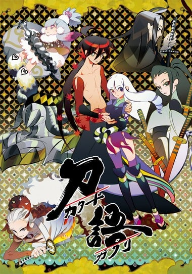
>
| 日文名 | 刀語 |
|:------: |:------------------------------------------: |
| 类型 | 小说改 |
| 新番 | 2010 年 1 月 |
| 集数 | 共12话 |
| 官网 | [http://www.katanagatari.com/](https://http://www.katanagatari.com/) |
| 制作 | WHITE FOX |
| 导演 | 元永慶太郎 |
| 脚本 | 上江洲誠,待田堂子,長津晴子 |
| 评分 | 7.6|
| 制片人 | 岩佐岳 |

> [!abstract]+ **简介**
> 在地图上没有记载的无人岛・不承岛，岛上生活着不使用刀的剑术・虚刀流第七代当家鑢七花与其姐姐鑢七实。
幼年时随父亲漂流到此岛上，生活至今已经20年了。
在父亲去世后，本以为在这个世上已经没有人记得他们了。某日，一位自称咎的奇策士突然来到岛上拜访。
她是为了收集传说中的锻刀师・四季崎记纪终其一生冶炼的十二套变刀体，而来求助于虚刀流的当家七花。
但是，在他们的交谈中突然遭到了袭击！袭击者是真庭忍军十二头领中的真庭蝙蝠。七花愤怒地追着蝙蝠而去……。
在世外桃源之地长大、对外界一无所知的剑士鑢七花的旅途开始了。在前方等待他的究竟会是地狱般的决战抑或是命悬一线的……恋爱泥潭！？

> [!tip]+ **章节列表**
>- [ ] 第1话：绝刀·刨 (2010-01-25)
>- [ ] 第2话：斩刀·钝 (2010-02-08)
>- [ ] 第3话：千刀·铩 (2010-03-08)
>- [ ] 第4话：薄刀·针 (2010-04-16)
>- [ ] 第5话：贼刀·铠 (2010-05-21)
>- [ ] 第6话：双刀·锤 (2010-06-04)
>- [ ] 第7话：恶刀·鐚 (2010-07-09)
>- [ ] 第8话：微刀·钗 (2010-08-13)
>- [ ] 第9话：王刀·锯 (2010-09-10)
>- [ ] 第10话：诚刀·铨 (2010-10-15)
>- [ ] 第11话：毒刀·镀 (2010-11-12)
>- [ ] 第12话：炎刀·铳 (2010-12-10)

> [!tip]+ **主要角色**
> 
| 角色 | CV | 简介| 角色图片 |
|:----:|:---:|:---:|:--------:|
| 鑢七花 | くまいもとこ | 本作の主人公。虚刀流七代目当主。島育ちのため世間知らずで、考えることが苦手な面倒くさがりだが、常識に囚われない発想が敵を倒す糸口を発見することもある。かなりの長身で、鋼のように鍛えられた肉体を持つ。動きやすいということで上半身裸でいることが多いが、豪寒的な寒さには弱い。虚刀流の血統のせいで刀剣を扱う才能が全く無く、刀を振りかぶれば後ろに落とし、振り下ろせば前に零す。物語の後半で心王一鞘流の初めての門下生として汽口慚愧から刀剣を学び基礎的な知識を身に付けるが、刀の扱いが苦手なのは変わっておらず刀を多少振れる程度にしか至っていない。言われて一番傷つく言葉は「花が無い」。面倒がりな性格で、口癖はとがめに禁止される前まで「面倒だ」だった。その後とがめに強引に勧められ済し崩し的に決定した「ただしその頃には、あんたは八つ裂きになっているだろうけどな」が決め台詞。とがめに付けられたあだ名は「しちりん」。ちなみに酒は飲めない（苦い水と認識した）。将棋も分からない。 人間としてではなく、一本の刀となるよう育てられたため、対峙する相手に全く拘りを持たない。とがめと行動を共にするようになってからは、最低限とがめの望みを可能な限り叶える方針を採るようにはなったものの、人間社会の細かい事情は全く理解出来ないままであった。戦闘に於いては勝敗以外の配慮は出来ず、実力差から言えばわざわざ殺すまでもない相手の命をも奪おうとしていた。よく言えば無垢で善悪に頓着が無く、悪く言えば人間性に乏しく残酷だったものの、刀集めの旅に出てから、人間らしい感情や感性が育っていく。とがめの刀として付き添いつつ「愛している」などと度々口にしていたが、物語中盤以降は他の男のことを褒めるとがめに嫉妬心から意地悪をするなど、次第に彼女への好意が本物になって行き、最後には彼女にはっきりと好意を自覚しそれを伝えるまでに至った。とがめの刀になりたいが為に、七実と戦う直前まで実は七実の方が強いということを黙っていた。 元々、どちらかと言えば思慮深い性格であり、乏しいながらも知識の及ぶ範囲内では物語序盤から細かい配慮を見せている。戦闘では冷静に相手を観察して作戦を考えるタイプであり、後述の「ちぇりお」問題では父・六枝がよく「チェスト」の掛け声を使っていたので事実を知っていたのにも関わらず、とがめに何らかの事情があって言っているに違いないと考え、敢えて指摘しなかった。凍空こなゆきの体を乗っ取った真庭狂犬との戦いの際には「狂犬が乗っ取った相手ごと殺せ」というとがめの命令に反して、狂犬の刺青が彼女の本体だという仮説を立てて刺青のみを攻撃し、こなゆきを殺さずに狂犬を倒した。汽口慚愧との戦いでは「まぐれ勝ち」を狙うとがめの奇策が自分が刀を扱えない事を前提とした策である事を見抜いて、慚愧に刀の手解きを受けてしまった事に焦った。 12話では、とがめを殺された事で旅に出る前の性分に戻ったような言動を取った上で、自らの死に場所を求め、血に染まって赤くなった彼女の服を着て腰に彼女の遺髪を提げ、尾張城を襲撃。最後は否定姫の計略に乗せられた形で「とがめの人生を滅茶苦茶にした」と将軍を殺害した。物語が終わった後は地図を作りながら全国を巡り、その後の消息は不明とされている。 24歳。身長六尺八寸。体重二十貫。趣味は「無趣味」。父親に似て、長い髪の女性が好み。 | 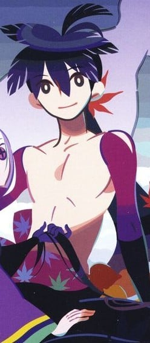 |
| 鑢七実 | 中原麻衣 | 七花の姉。特異体質のため極度に病弱で、死人のような印象の女性。極度の方向音痴。「人間一人に到底収まりきれぬ」と表現されるほどの驚異的な強さをもち、相手の技を一度観ただけで体得、二度見れば万全に自らのものとすることができるという「見稽古」という技がある。この能力により、教わっていないにも関わらず、父六枝と七花の稽古を見ることにより虚刀流の全ての技を身に着けている。だが他者の能力を習得するのは強すぎる自分の力を抑え、その強さに耐えられない体を持たせるためであり、見稽古をせずとも日本最強であることには変わりがない。また常人ならば何度も死んでいるはずの病にかかり続けているため、死なない程度の毒は全くものともしない。唯一の欠点は体力がなさ過ぎることであり、継戦能力はない。 外見は穏やかでひ弱そう、口調はおどけたところもあるが丁寧。しかし性格は冷酷で、自らを傷つけたり人を殺すことに感情はなく、邪魔な者を「草」と呼び、人として見ていない。策謀にも長け、忍びの気配すら容易く察知する。 七花ととがめが旅に出た後も不承島に残っていたが、その後、真庭忍軍虫組の襲撃を機に完成形変体刀に興味を示し独自に刀集めを始め、死霊山を壊滅して入手した悪刀「鐚」の所有者となり、七花達を待つために四国の御剣寺をほぼ壊滅させ乗っ取る。その後、七花と戦いの果てに息絶える。弟の爪をかじる癖をやめさせる為に彼の爪を全て剥がす等、一般的にみるなら歪んだ形ではあるものの弟である七花のことを大切に思っており、時には七花に殺されたいと思っていた。四国ではとがめに対する嫉妬とも思える言動をとっている。(どっちの影響かは不明だが)ネーミングセンスは弟と大差無く、自身を襲った真庭忍軍虫組のことを弟と同様の理由で「まにわに」と呼んでいた。 27歳。身長四尺九寸。体重七貫六斤。趣味は「草むしり」。 | 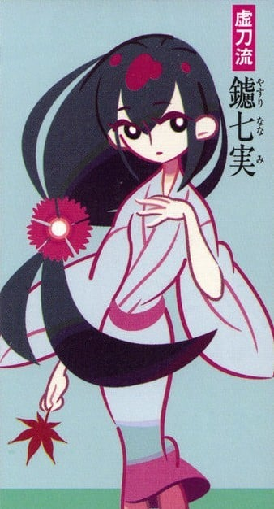 |
| 錆白兵 | 緑川光 | 堕剣士。周防の巌流島で七花と決闘する。真庭忍軍に裏切られた後、とがめに依頼されて「刀集め」にでた“日本最強の剣士”。最初に入手した薄刀「針」に魅入られて裏切った。「拙者にときめいてもらうでござる!」が口癖。女と見まごうような総髪の美青年。空に浮かぶ太陽ですら真っ二つにできるという触れ込みで、その名に恥じぬ強力で多彩な剣技を持つ。果たし状を渡すなど、古風な男である。 全存在を剣にのみ懸け、それ以外は眼にも入らず、恐怖も戦慄も躊躇もない男。 20歳。身長五尺三寸。体重十一貫五斤。趣味は「剣法」。 アニメ版では、七花との決闘の描写に関して第3話における次回予告で登場しているが、第4話では七花ととがめの会話に出てくる程度で錆白兵は一切登場していない。そして原作同様、鑢七実と真庭蟷螂率いる虫組との戦いがメインに語られている。最期に七花に「鑢は四季崎の忘れ形見で、錆は四季崎の失敗作」「虚刀流は四季崎のケットウ」という謎めいた言葉を残しており、それが虚刀流と全刀流の正体に関する伏線となっている。 | 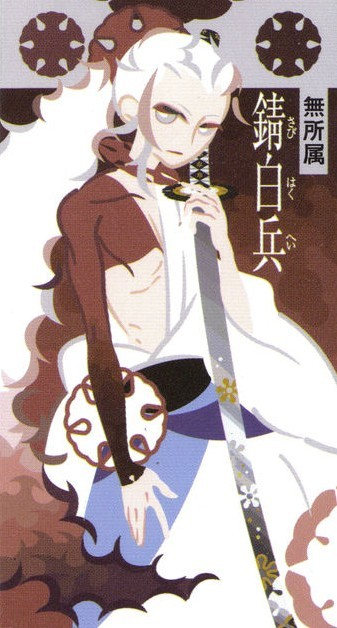 |
| 宇練銀閣 | 宮本充 | 因幡国下酷城城主。居合い抜きの達人で、目にも留まらぬ速さの抜刀術「零閃（ぜろせん）」の使い手。射程内の敵なら一刀両断だが、射程以外の頭上や真上に対して無防備なのが致命的な弱点。先祖から斬刀「鈍」を継いでいる。環境変化で全土が砂漠と化した因幡国の最後の住人。いつも寝てばかりいるが、実際には立て付けを悪くした襖を開ける音で目を覚ますほど眠りが浅い。 32歳。身長五尺四寸二分。体重十四貫二斤。趣味は「睡眠」。 散り際の一言は「これでやっと……ぐっすり、眠れる」。 | 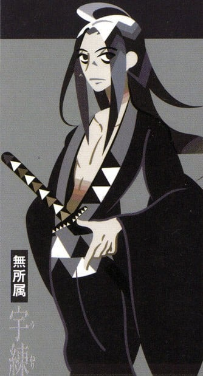 |
| とがめ | 田村ゆかり | 物語の発端である「刀集め」の提案者。策士ならぬ奇策士を自称する、尾張幕府家鳴将軍家直轄預奉所軍所総監督。役職相応の鋭い観察眼と発想を持ち、自称どおりの奇策によって七花の戦いを支える。普段は尊大な態度を取っているが、勘違いを指摘されると過剰に照れてパニックを起こし、子供じみた言動になるなど、落差の激しい性格をしている。鎖骨が性感帯。目は赤っぽい色をしているが、驚いた時や策を弄する際などに時折、左目に黒い十字紋が浮かび、色が紫色に変わる。派手な格好を好み、七花にはいつも大量の着物を運ばせ、彼女の住居である奇策屋敷は質実剛健な気風の尾張城下町に似つかわしくない奇抜な外見をしている。服に関しては敦賀迷彩から「元は高貴な出自で、昔の事を忘れられない、忘れたくないのだろう」と推察されている。奇策屋敷は外見こそ奇抜で豪華だが中は至って普通の武家屋敷であり、完成形変体刀集めに先立ち決意の為に家財を全て処分している。 真の名は容赦姫（ようしゃひめ）で、20年前幕府に謀反を企てた飛騨鷹比等の娘である。幼い頃に一族を殺された時の激しい憎悪で白髪となっている。髪は長かったが、第七話で七実の手刀で切られおかっぱ頭になる。 「障子紙の如く弱い」「戦闘力はうさぎ以下」などと表現され（自称もしている）、役職につくにあたって非武装を心に誓ったため攻撃力はまったく無いが、もともと運動神経も悪い。口も頭も回るが、校倉必とのやりとりから、七花からは交渉能力にも疑問を持たれている。口癖は「ちぇりお」。薩摩の示現流の掛け声である「ちぇすと」をどこかで聞き間違えたもので、第五話で真庭鳳凰により間違いを指摘され、恥ずかしさのあまり大いに取り乱したものの、そのまま押し通すことにした。ちなみに、死にかけるたびに「もし私が死んだら、私の代わりに「ちぇりお」を広めてくれ」と七花に懇願している。 最初は自らの父を殺した鑢六枝の息子である七花のことも憎んでおり、旅が終われば殺害するはずであった。しかし、旅の開始から半年後に蝦夷・踊山のこなゆきの住居に宿泊した際に七花から「自分の正体を知っている」と聞かされた事で感情的には殺したくないと思うようになっていた。 出羽で人鳥に会った後、自らの地図作りの技量を鼻にかけ、刀集めを終えたら地図作りの旅に出て金儲けをしよう、と七花を誘ったが、11本の刀を集めて尾張に帰還した際に、城が遠くに見える場所で否定姫の命を受けた右衛門左衛門に炎刀・銃で致命傷を負わされる。この時、わざと急所を外されて撃たれており、最期に七花に「自分の気持ちさえ駒だった」と言った上で、「言葉は嘘でも、気持ちは嘘ではない」と言い、「これまでの何もかも忘れて好きなように生きよ」と自分の死を以って七花との契約を解除する旨を言い、「何の救いもない、死んで当然の女だけれど、それでも私はそなたに惚れてよいか？」と言って事切れた。 実は、四季崎記紀の歴史改竄による歪みから生まれた、四季崎の歴史に対する最大のイレギュラー。 年齢不詳（七花よりは年上である模様）。身長四尺八寸。体重八貫三斤。趣味は「悪巧み」。 | 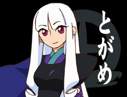 |
| 鑢六枝 | 大川透 | 七花・七実の父親。虚刀流六代目当主で、とがめの父である飛騨鷹比等を討ったことで、大乱の英雄と呼ばれていた。妻のみぎりを殺した疑いをかけられて不承島に子供たちと共に流刑に処され、その地で19年間虚刀流の跡取りとして七花を鍛えていたが、娘・七実の天才性に恐怖を抱き殺害を試みるも、息子である七花によって阻まれ、逆に命を落とすこととなった。 | 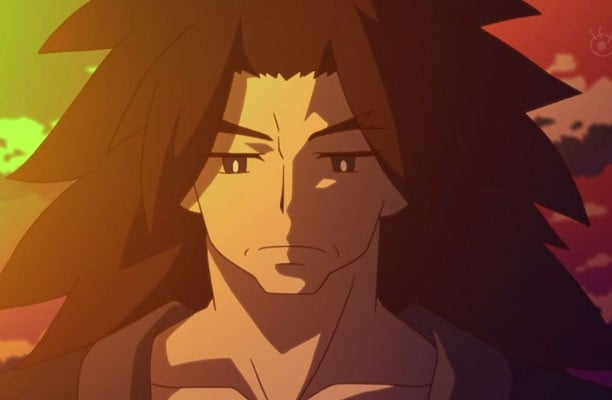 |
| 鑢みぎり | 篠原恵美 | 七花と七実の母親。六枝が仕えていた戦国六大名の一つ、徹尾家ゆかりの女。何者かにより殺され、それが七花たちが不承島に流される原因となった。七花は当時まだ幼く、母の顔は覚えていない。 | 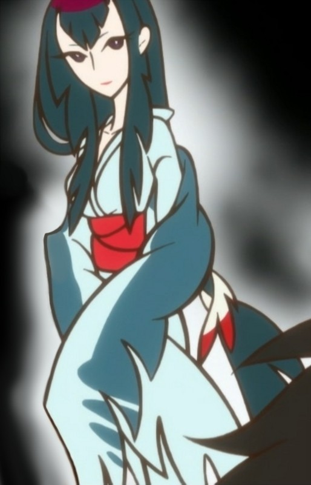 |
| 否定姫 | 戸松遥 | 尾張幕府直轄内部監察所総監督。とがめの天敵で、彼女のことは名前ではなく「あの不愉快な女」としか呼ばない。本名不詳で、とがめ同様素性も公には不明。自分も含めて誰彼かまわず、彼女自身が「自分が否定姫である事以外の全てを否定する」と言う程ありとあらゆることをただ否定するのでこう呼ばれ、住居も「否定屋敷」と呼ばれる。背が高く、青い目に金髪という日本人には有り得ない外見を持つ。右衛門左衛門との共同所有という形で炎刀「銃」を所有しており、他の完成形変体刀のそれぞれの特性、能力についてもある程度知っている。変体刀について詳しいのは四季崎記紀の末孫であるため（右衛門左衛門に対して語った時は、例によって否定している）。とがめの過去は、彼女が彼我木輪廻に会いに行った跡を右衛門左衛門につけさせるまで知らなかった。 とがめの正体を知った後、本心では殺したくないと思いながらも、職務と自らの野望のために彼女を右衛門左衛門に殺させ、結果的に彼女の手柄を横取りし、将軍に謁見する。目論見どおり七花が尾張城に討ち入った際には「彼は私ではなく奇策師の配下で、彼女は任務中に死亡した」と言った上で、「これも将軍の天下泰平のため」と七花を完成形変体刀を持たせた御側人十一人衆と戦わせる。なお、将軍の前で七花にとがめの事をどう思っていたか問われた時には「嫌いじゃなく、なくもなかったわ」と答えている。 彼女の野望は将軍家を無くす事。四季崎一族は国を守る為に将軍家が成立しないよう策を練ったが、予知とは別の家が将軍家になってしまった事で目論みが外れたのが事の発端である。但し、彼女自身は一族の悲願を達成したい反面、「記紀の思惑通り行かないのも見てみたい」とも語っていた。結局、将軍・匡綱を殺しても歴史の改竄は行われずに彼女の野望は失敗し、反逆者として追われる身になり尾張を出奔。髪を切って右衛門左衛門の「不忍」の仮面を被り、地図製作の旅に出た七花が「付いて来るな」と言ったのを無視して無理矢理彼に付いて行った。 年齢不詳。身長五尺五寸。体重十三貫。趣味は「悪巧み」。 | 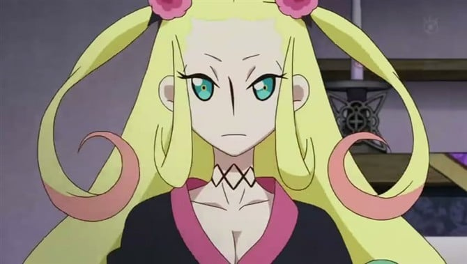 |
| 左右田右衛門左衛門 | 小山力也 | 否定姫の腹心。尾張幕府直轄内部監察所総監督補佐。元忍者。「不及（およばず）」「不答（こたえず）」「不得禁（きんじえず）」「不外（はずれず）」など、会話の際には、相手の言動に対して「不」の付く否定形の言葉を放つ。 百七十年前、真庭忍軍に里を滅ぼされた「相生忍軍」の最後の一人。上下とも時代にそぐわない洋装で靴を履き、否定姫の命令で顔の上半分は「不忍」と大きく縦書きした面で隠している。便宜上剣士を自称するが刀や剣術への執着はなく、大小二本の刀を腰に差しているがどちらも変体刀ではない普通の刀。真庭鳳凰は親友であったが、忍法と人格(及び顔面の上半分)を奪われた関係でもある。それ以来しばらく「精神的に死んだ」状態だったが、否定姫に自分の「死」を否定された事がきっかけで忠誠を誓った。感情を露わにすることはめったになく、否定姫に強い忠誠心を持ち、任務には非常に忠実。しかし、否定姫が日和号を嘲笑した際に窘めるなど、意外とロマンチストである。なお、現在の名前は部下となった時に否定姫から授かったもの。 年齢不詳。身長六尺一寸。体重十五貫。趣味は「掃除（天井裏の）」。 | 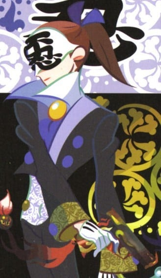 |
| 敦賀迷彩 | 湯屋敦子 | 出雲国三途神社の長。帯刀せずに相手の刀を利用して攻撃を仕掛ける奪刀術千刀流の使い手。出雲を守護していた護神三連隊の、二番隊隊長で千刀流を教えていた剣道場の道場主の一人娘だった。大乱で戦災孤児となり、千刀「鎩」が頭目に受け継がれている山賊衆に参入したが、三途神社を襲って先代の敦賀迷彩を殺した際に「自分の代わりに神社を守れ」と言われた事がきっかけで山賊を抜け、敦賀迷彩の名と立場を継いだ。黒巫女の治療に刀の毒を用いていた。傷ついた迷い人を受け入れ癒す度量と人格の持ち主。とがめに「鎩」の原型となった最初の1振りを探させ、それが成功した後に七花と刀を賭けて試合をする、という取り引きをした。とがめからそうと思わしき刀を差し出された時には「お前がそうと言うならそうなのであろう」と言った。七花と語り合い理解するものもあったが、刀を譲ることと戦わないことはできず、最後は七花との勝負に負け絶命したことで、とがめは心を深く痛めた。これを期にとがめは約束として今後の七花との対戦相手を無闇に殺さぬよう七花と向き合う事となる。その後迷彩亡き後、2人の弟子が神社の長として後を引き継いだ。七花との最期の打ち合いの際には、「千刀流十二代目当主」と名乗っていた。 本名不明。年齢不詳。身長五尺八寸。体重十三貫一斤。趣味は「飲酒」。 | 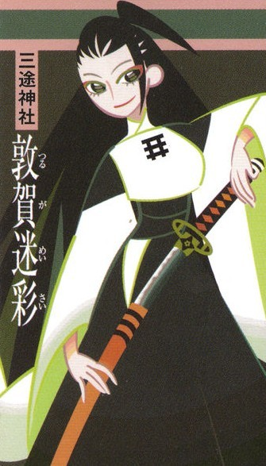 |
| 汽口慚愧 | 伊藤静 | 棋士の聖地、出羽の将棋村に道場を構える心王一鞘流の十二代目当主。直毛で長い黒髪の女性。王刀「鋸」の性質ゆえに変体刀の毒気に当てられず、門下生のいない道場を守る、これまでの変体刀の所持者とは違う“真人間”。が、逆に“真人間”過ぎて人間味が薄く、それが門下生を離れさせたのではないかととがめは考察している。とがめに、剣ではなく将棋を取れば間違いなくとがめ以上の腕前になったであろうと評された、文武両道の人物。道場を継ぐまでは将棋三昧の日々をしていて刀の修行は殆どしていなかったが、道場を継げる者が彼女しかいなかった為やむなく継ぐ事となり、当初は嫌々だったのが王刀・鋸を手にしたとたんその事を受け入れてしまった、という経緯がある。心王一鞘流の当主は本来は血筋によらない（現当主が例外的）。 とがめとの将棋対決にとがめが勝ったら七花との対決を受け入れる、と約束した。しかし、将棋対決の後で七花が防具を付けず刀を持たずに対決しようとした事を「見くびられた」「七花側が不利」と断じて防具を着けての木刀での試合を無理強いし、七花はこれに負けた。その為、王刀「鋸」を懸けて対等に戦えるように心王一鞘流の初めての門下生として約10日間ほど七花を迎え入れ、慚愧から刀剣を学ぶ修行の日々が暫く続いた。七花にとって刀剣術を教えてもらった師匠とも言える人物でもある。一方とがめは、道場に来る度に見た見間違いにより慚愧と七花が恋仲になったと誤解した挙句、七花に対して攻撃的に接する嫉妬やヤキモチの日々が暫く続いた。それ以来七花を意識し始め遂にとがめは自身の思いをファーストキスで表し七花に思いをぶつけた（奇策のために七花に修行で身に付いた事を忘れさせるためでもある）。 その後、慚愧と七花との剣道による決戦で、とがめ自身が審判であることを利用した、将棋の棋譜を囁くという横槍による心理戦(もちろん反則技)によってついつい将棋のことを考えてしまい、あっけなく敗れ去った（語り手曰く「地味に決着がついた」）。その後、改めて慚愧は防具着用、七花は防具無しの普段の姿で対決し、威力を6割ほどに落とした飛花落葉に敗れ、その強さを認めて自分の非礼を詫びた。その際、刀を持つと弱くなる虚刀流の血筋を「（普通とは逆なので）呪われているようだ。」と評した。 24歳。身長五尺八寸三分。体重十二貫。趣味は「素振り」。 | 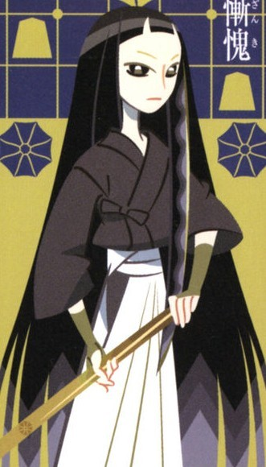 |
| 凍空こなゆき | 日高里菜 | 蝦夷の壱級災害指定地域、踊山に住む凍空一族の最後の生き残り。一人称は「うちっち」で、語尾に「っち」を付ける事が多い。腕と脚の凍傷と低体温症で倒れた七花を前に慌てるとがめを発見し、二人を住居に運んだ。凍空一族は出雲のダイダラボッチを祖とし、一族特有の怪力で、この世で最も重い刀、双刀「鎚」を持ち運びできる(現在では)唯一の人物。元々村長の長男が双刀「鎚」の所有者だったが、こなゆきが1人で散歩に出ている間に鑢七実の策略により雪崩が起こり村が全滅した。それ以来洞窟に住処を変えて兎などを狩りながら暮らしてきた。その寂しさから、山を訪れた七花ととがめに「所有者としての『資格』がなければ刀は渡せない」と嘘をついて足止めした（とがめにはバレていた）が、根は善良な少女。凍空一族は狩りに基本的には鈍器を使用していた為、とがめに訊ねられて村長の家の跡を掘り起こすまでこなゆきは「鎚」の存在を知らず、刀を見たことがほとんど無かった。それまでの変体刀所有者と違い剣術や武術の心得は全くなく、怪力自体も同年代の凍空一族と比べても一族最弱。半ば遊びとして勝負するが、素人故に七花は動きが全く読めず、左腕を骨折して敗北する。七花が唯一勝てなかった人物である。 真庭狂犬に肉体を乗っ取られるが七花に救われ、双刀「鎚」を尾張に運ぶ。その後、三途神社の護衛となり、その天真爛漫さで黒巫女の心を癒すのにも一役買っているらしい。 11歳。身長四尺二寸。体重八貫三斤。趣味は「散歩」。 | 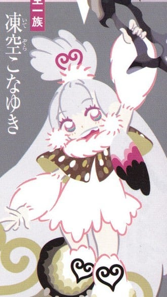 |