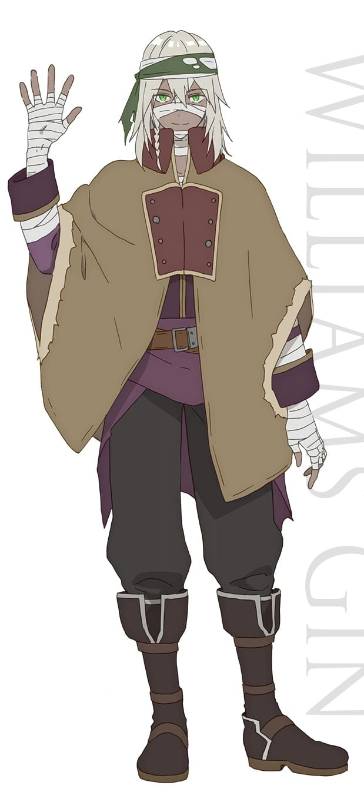
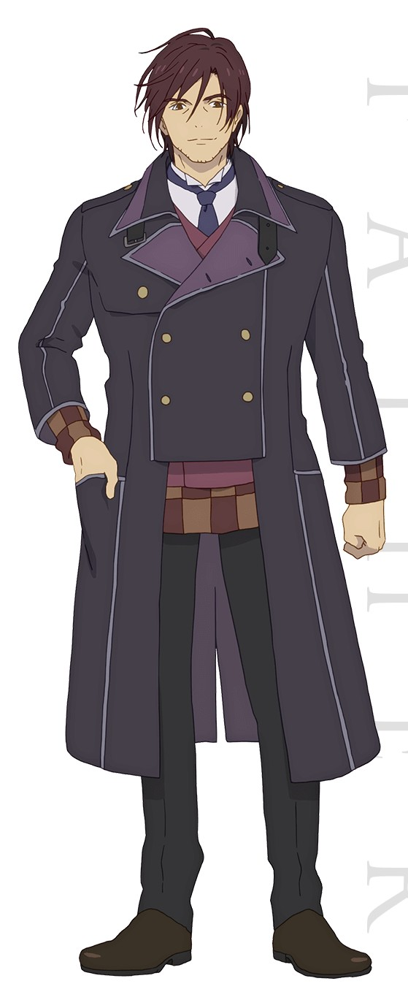
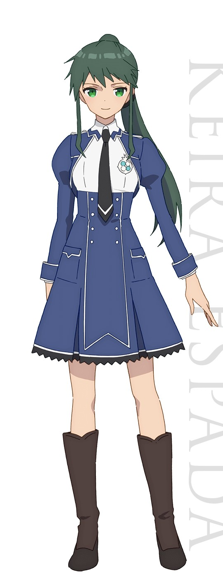

> [!bookinfo|noicon]+ **刺客守则**
> 
>
| 日文名 | アサシンズプライド |
|:------: |:------------------------------------------: |
| 类型 | 小说改 |
| 新番 | 2019 年 10 月 |
| 集数 | 共12话 |
| 官网 | [https://assassinspride-anime.com/](https://https://assassinspride-anime.com/) |
| 制作 | EMTスクエアード |
| 导演 | 相浦和也 |
| 脚本 | 三重野瞳、福田裕子、清水恵、伊神貴世、待田堂子、朱白あおい,清水恵,三重野瞳,待田堂子,朱白あおい,伊神貴世,福田裕子 |
| 评分 | 5|
| 制片人 | 柴田渉；补：内田哲夫,柴田渉,内田哲夫 |

> [!abstract]+ **简介**
> 拥有名为玛那这一能力的贵族，肩负着保护人类这一使命。就读于能力者育成学校的贵族，却没有一点玛那的特殊少女梅莉达·安杰尔。为了发掘她的才能，库法·梵皮尔被派来担任她的家庭教师。
他同时也肩负“倘若确认她没有才能，就暗杀掉”的任务——。在这个能力即是一切的社会，面对坚持着没有任何成果的努力的梅莉达，库法是否会对她下达残酷的处决……
“要不要试着把生命托付给我？”并非以刺客或单纯的教师身份，而是赌上暗杀教师的骄傲，向世界展现少女的价值！

> [!tip]+ **章节列表**
>- [ ] 第1话：暗杀者的慈悲 (2019-10-10)
>- [ ] 第2话：少女的世界改变之时 (2019-10-17)
>- [ ] 第3话：在临界点的彼方 (2019-10-24)
>- [ ] 第4话：聚集在锁城，少女与少女 (2019-10-31)
>- [ ] 第5话：黄金公主与，白银公主 (2019-11-07)
>- [ ] 第6话：灰色的魔女 (2019-11-14)
>- [ ] 第7话：上下无所依 (2019-11-21)
>- [ ] 第8话：某骸骨的遗言 (2019-11-28)
>- [ ] 第9话：悠久的契约 (2019-12-05)
>- [ ] 第10话：迷宫图书馆 (2019-12-12)
>- [ ] 第11话：死神的死者们 (2019-12-19)
>- [ ] 第12话：暗杀教师的矜持 (2019-12-26)

> [!tip]+ **主要角色**
> 
| 角色 | CV | 简介| 角色图片 |
|:----:|:---:|:---:|:--------:|
| クーファ＝ヴァンピール | 小野友樹 | 17岁。隶属“白夜骑兵团”的玛那能力者。位阶为[武士]。虽被派为担任梅莉达家庭教师兼暗杀者，却违背任务培育梅莉达。 |  |
| メリダ＝アンジェル | 楠木ともり | 13岁。虽然出生于三大公爵家圣骑士家，却不具备玛那能力的少女。被怀疑并非安杰尔家的亲生女儿。虽然被轻蔑为“无能才女”，也没有灰心丧气，是勇敢且坚强的努力之人。移植了库法·梵皮尔的玛那，位阶为[武士]。 |  |
| エリーゼ＝アンジェル | 石川由依 | 13岁。梅莉达的堂姐妹，位阶为圣骑士的玛那能力者。实力为学年中最顶尖的而自豪。面无表情且沉默寡言。 |  |
| ロゼッティ＝プリケット | 薮内満里奈 | 16岁。隶属精锐部队“圣都亲卫队”的菁英，位阶为[舞巫女]。现为爱丽丝的家庭教师。 |  |
| ネルヴァ＝マルティーリョ | 佐倉綾音 | 梅莉达的同学，位阶为[斗士]的能力者。会欺负梅莉达。 |  |
| ウィリアム・ジン | 鈴木達央 | 隶属于蓝坎斯洛普的恐怖集团“黎明戏兵团”的尸人鬼青年。能够使用阿尼玛异能，自由的操作绷带战斗。 |  |
| オヤジ | 森川智之 | “白夜骑兵团”的团长。命令部下库法成为梅莉达的家庭教师。 |  |
| ミュール＝ラ・モール | 内田真礼 | 三大公爵家之一魔骑士的千金。与梅莉达等人同年纪，却散发成熟的神秘氛围。 |  |
| サラシャ=シクザール | 和氣あず未 | 三大公爵家之一龙骑士的千金，与缪尔是同校的朋友。个性文静且懦弱。 |  |
| ブラック＝マディア | 徳井青空 | 白夜骑兵团专职变装潜入的人员。在黑色兜帽的遮掩与只用黑色笔记和同僚沟通的模样下，是个身材娇小的少女。 虽然只是劣化模仿其他七个基本位阶的“小丑”的玛那能力者，但透过长时间的修行能完美的将其他位阶的技能与武器操控自如，甚至达到了与本尊相当或超越的程度，也是全弗兰德尔最强的小丑。同时也擅长变装，不管对方的性别与年龄外貌为何都能变成对方的模样。 奉上司的命令，潜入圣弗立戴斯威德女子学院担任教师调查库法在任务过程中隐藏的事实。 |  |
| シェンファ＝ツヴィトーク | 瀬戸麻沙美 | 上届的月光女神，在这次的月光女神争霸战中，为梅莉达的搭档。 位阶:剑士 |  |
| キーラ＝エスパーダ | 安野希世乃 | 圣德特立修的学生，在月光女神争霸战中，在四位候选人中(梅莉达/爱丽丝/莎拉夏/琪拉)获得月光女神的称号，素有(王子)的称号。 |  |