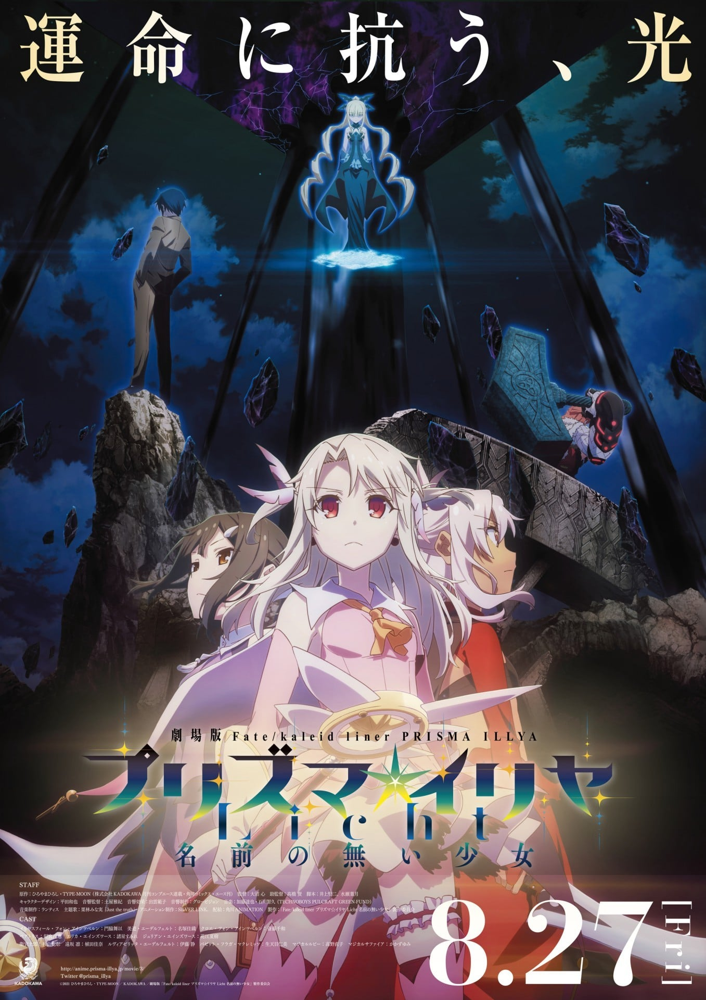
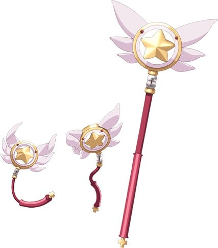

> [!bookinfo|noicon]+ **剧场版 Fate/kaleid liner 魔法少女☆伊莉雅 Licht 无名的少女**
> 
>
| 日文名 | 劇場版 Fate/kaleid liner プリズマ☆イリヤ Licht 名前の無い少女 |
|:------: |:------------------------------------------: |
| 类型 | 漫改 |
| 新番 | 2021 年 8 月 |
| 集数 | 共1话 |
| 官网 | [http://anime.prisma-illya.jp/movie/3](https://http://anime.prisma-illya.jp/movie/3) |
| 制作 | SILVER LINK. |
| 导演 | 大沼心 |
| 脚本 | 水瀬葉月,井上堅二 |
| 评分 | 6.5|
| 制片人 | 金子逸人 |

> [!abstract]+ **简介**
> エインズワースとの激闘からひと時の休息。美遊を救出したイリヤたちは、平行世界の衛宮士郎から美遊の過去、この世界で起きた聖杯戦争のことを知らされる。それは美遊の悲しい運命であり、美遊のために兄・士郎が命を賭して歩んだ壮絶な戦いの物語だった。人類の救済のために美遊を犠牲にするエインズワース。美遊のために世界の敵となると決めた士郎。相容れない２つの正義に、すべてを守ると誓うイリヤ。「助けるよ。私はみんなが助かる道を探すって決めたから！」。大切な人たちと笑いあえる明日を作るために――。魔法少女たちの戦いが、再びはじまる……！

> [!tip]+ **章节列表**
>- [ ] 第1话： (2021-08-27)

> [!tip]+ **主要角色**
> 
| 角色 | CV | 简介| 角色图片 |
|:----:|:---:|:---:|:--------:|
| マジカルルビー | 高野直子 | 自称爱和正义的魔法杖。被称之为愉快型魔术礼装，虽然是人工精灵但是性格有小恶魔的倾向，喜好谈论八卦话题跟恶作剧，尤其喜欢捉弄自己的主人。 第二魔法的应用的一级品的魔术礼装。能够使用多元转变，让使用者能够下载平行世界的技能。在变身的同时能够让使用者使用A级的魔术障壁、物理保护、促进治疗、身体能力强化等常备能力。  魔術礼装「カレイドステッキ」の1本。手にしたマスターに魔力を無制限に供給できる一級品である一方、マスターをいじるなど、性格的に難がある。    代表着爱与正义，为世界带来和平与微笑的纯白色愉悦型魔术礼装，魔法少女得以变身的力量源泉。虽然是魔杖，但却具有自我意识，总能在关键的时刻为少女们指引出前进的方向，在困难的时刻对少女们进行激励和鼓舞，可以说是魔法少女们最值得信赖的良师益友。如果你相信的话…… |  |
| 美遊・エーデルフェルト | 名塚佳織 | 全能少女。 学力、体力ともに他の追随を許さないところがあり、クールな性格で他人との関わりをなるべく避ける少女。マジカルサファイヤ、そしてルヴィアと出会ったことで、イリヤと同じく魔法少女になってしまう。 |  |
| マジカルサファイア | かかずゆみ | 红宝石的妹妹，比起姊姊个性较为正经，基本性能与红宝石相同。跟姊姊一样，放弃原持有人露维亚瑟琳塔的控制，而变成由美游所持有。 曾为了收拾红宝石搞出的残局而对她大义灭亲(放出洗脑电波)，而让红宝石整整故障了三天。  マジカルルビーの妹にあたるカレイドステッキ。ルビーと違い、冷静で合理的な性格をしており、本来はマスターに忠実だが、ルヴィアの元を離れてしまう。 |  |
| クロエ・フォン・アインツベルン | 斎藤千和 | 在第二部的时候登场，因处理地脉正常化的仪式出了差错，导致从伊莉雅身上分离出来并实体化的人格。 其真实身分为爱因兹贝伦家在十年前的圣杯战争时所使用的许愿仪，并在伊莉雅婴儿时期被母亲封印的魔力、记忆及知识，经长年累积后实体化的人格（第一部伊莉雅的英灵化就是她）。 皮肤较伊莉雅黝黑，发色也偏银色，服装类似Archer，但比较裸露。性格较伊莉雅来的狡猾活泼，但除了凛、露维亚、美游及伊莉雅的母亲外，没人认得出来她不是伊莉雅，为了方便和伊莉雅区别，而被凛取名叫“小黑”（クロ），而克洛伊·冯·爱因兹贝伦为自己掰出来的名字。 |  |
| 田中 | 福圓美里 | 在平行世界与伊莉雅相遇的少女。一直是体操服的打扮。失去了记忆，连姓名也想不起来。但对此并不在意。 |  |
| ベアトリス・フラワーチャイルド | 釘宮理恵 | エインズワース家に仕えるドールズ。小さな体の見た目に似合わずどう猛な性格で、サディスト。バーサーカーのクラスカードを所有。インストール後には、雷撃を司る宝具“悉く打ち砕く雷神の鎚”（ミョルニル）を操る。 |  |
| エリカ・エインズワース | 諸星すみれ | ダリウスの娘、ジュリアンの妹と称される小学生の少女。 天邪鬼な言動が特徴で、本心とは逆のことをよく口にする。プライドが高く強がることも多いが、すぐに涙ぐむ。 |  |
| ジュリアン・エインズワース | 花江夏樹 | 萨卡利之子，艾莉嘉的哥哥，恩兹华斯的现任当家。外表是一名美少年，身穿穗群原高中的校服。眼神凶恶。 第六次圣杯战争的规则掌控者，可以自由创造与毁灭卡片。 |  |
| 子ギル | 遠藤綾 | 乌鲁克的英雄王。人类最古老的英雄。性格冷酷无情。不听他人的意见，只以自己基准为绝对标准的暴君——的这种性质，并不能适用于这个模样的他。他基本还是名彬彬有礼而谦虚的少年。 喜欢的女性是「犹如盛开于野外的鲜花」类。 |  |
| イリヤスフィール・フォン・アインツベルン (プリズマ☆イリヤ) | 門脇舞以 | 就读于穗群原学园小学部的普通女孩子。银发赤眼，名字很有贵族的风格，常不在家的双亲从事神秘的工作，分明是一般宅邸，却不知为何有两位女仆在，顺便还有一个没有血缘关系的哥哥，但还是一个非常普通的小学五年级女孩子。 | .jpg) |
| 衛宮士郎 (美遊世界) | 杉山紀彰 | 幼少時に巻き込まれた災害で家族を亡くし、ガレキに埋もれていたところを切嗣に助けられた。自分を救い出してくれた切嗣のような「正義の味方」に憧れている。 | .jpg) |
| 遠坂凛 (プリズマ☆イリヤ) | 植田佳奈 | 冬木市に潜在するカード回収のため、ロンドンから派遣された魔術師。マジカルルビーの力を使ってカード回収にあたるはずが、一緒に来日したルヴィアと争っているうちにマジカルルビーに逃げられてしまう。 | .jpg) |