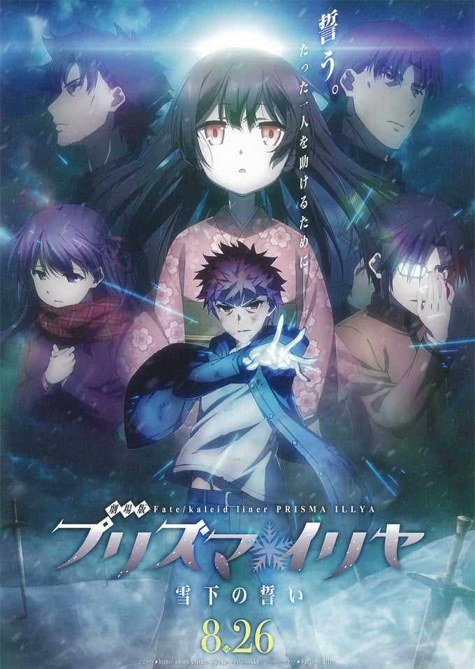
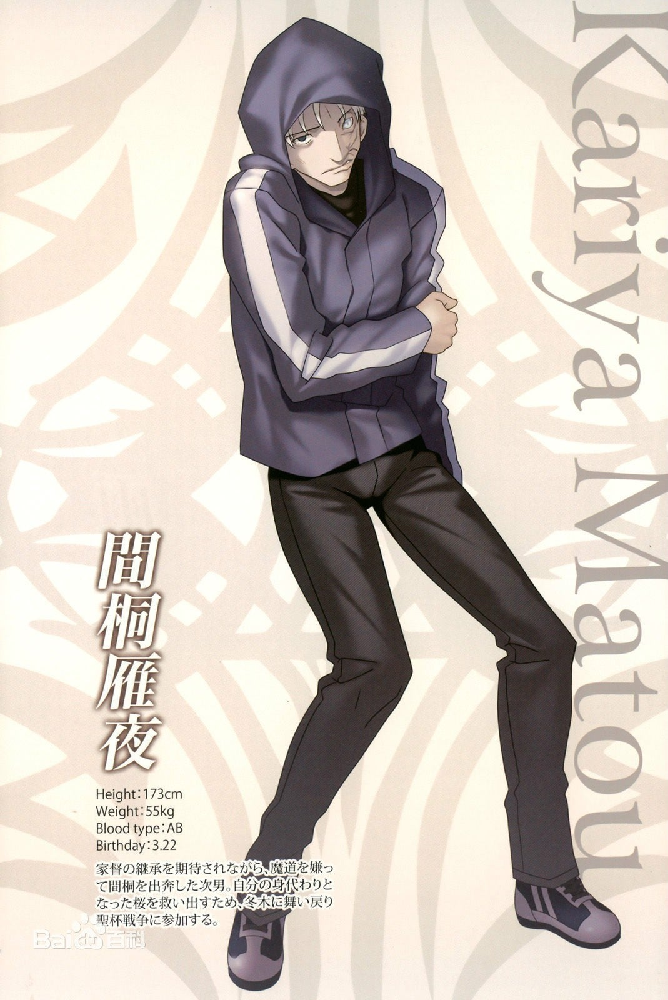
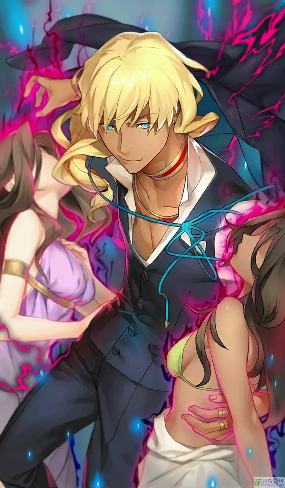
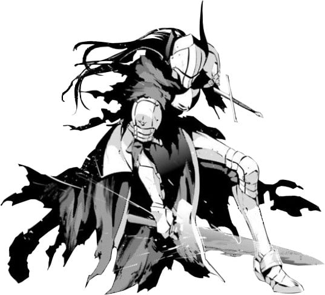

> [!bookinfo|noicon]+ **剧场版 Fate/kaleid liner 魔法少女☆伊莉雅 雪下的誓言**
> 
>
| 日文名 | 劇場版 Fate/kaleid liner プリズマ☆イリヤ 雪下の誓い |
|:------: |:------------------------------------------: |
| 类型 | 漫改 |
| 新番 | 2017 年 8 月 |
| 集数 | 共1话 |
| 官网 | [http://anime.prisma-illya.jp/movie/sekka](https://http://anime.prisma-illya.jp/movie/sekka) |
| 制作 | SILVER LINK. |
| 导演 | 大沼心 |
| 脚本 | 水瀬葉月,井上堅二 |
| 评分 | 7|
| 制片人 |  |

> [!abstract]+ **简介**
> “我想我可以说出来了。我与美游的……至今为止的故事”
世界向着毁灭前进。能够阻止毁灭的步伐的，唯有身为“圣杯”的美游的牺牲而已。要选择世界，还是美游——。面对发起“世界的救济”的爱因兹华斯所提出的这个问题，伊莉雅给出的答案是，“拯救双方”这种单纯的“任性”。
战斗迎来暂时的休止，一行人暂时栖身于美游与士郎成长的家中。在众人团聚的途中，士郎开始讲述自己与美游的过去。
曾经能够无差别地实现任何愿望的神稚儿美游。士郎将无家可归的她带回了自己与切嗣一同生活过的家里。在那之后过了5年。两人如同亲兄妹一般度过着平稳的生活。
但，这样的日常却突然迎来了结束。造访美游老家的两人。在他们的面前，将美游当成“奇迹”地追求的朱利安出现了——。
美游与士郎、爱因兹华斯的因缘，在此揭晓。

> [!tip]+ **章节列表**
>- [ ] 第1话：魔法少女☆伊莉雅 雪下的誓言 (2017-08-26)
>- [ ] 第0话：黑樱的房间
>- [ ] 第1话：Special After Talk

> [!tip]+ **主要角色**
> 
| 角色 | CV | 简介| 角色图片 |
|:----:|:---:|:---:|:--------:|
| ケイネス・エルメロイ・アーチボルト | 山崎たくみ | 肯尼斯是延续了九代的魔术师家系——阿奇博尔德家的家主，是功绩卓越的天才魔术师。他在统率全世界魔术师的魔术协会总部（通称“时钟塔”）担任降灵科的一级讲师，并与降灵科部长的女儿索拉·娜泽莱·索非亚莉订有婚约。 为了增加知名度而参加圣杯战争。原本想用圣遗物召唤出Rider，但是被自己的学生韦伯·维尔维特盗走媒介，只好改用别的媒介。以此媒介所召唤出的就是Lancer。 Servant和Master之间本来就是只有一条因果线的。而将魔力供给和令咒权利分开，由两名召唤者分别掌握的技术，凭借肯尼斯那天才的能力将这个不可能实现的技术实现了。 所以拥有令咒的肯尼斯不提供魔力，而是由其未婚妻索拉提供。因此是两人一起参赛。 “月灵髓液”是他的魔术礼装之一，利用魔术化的水银进行防御、攻击、搜索三项合一的礼装。搜索是放出水银，利用触觉感应周遭的变化搜集情报；攻击是利用水银凝聚成鞭状打击目标，具有比拟刀刃的攻击；防御是把水银变化成薄膜抵挡攻击，由于利用流体力学的原理因此无法防御剧烈变化的攻击。 |  |
| 間桐雁夜 | 新垣樽助 | Berserker的Master，『Fate/stay night』中间桐慎二的叔父。 |  |
| マジカルルビー | 高野直子 | 自称爱和正义的魔法杖。被称之为愉快型魔术礼装，虽然是人工精灵但是性格有小恶魔的倾向，喜好谈论八卦话题跟恶作剧，尤其喜欢捉弄自己的主人。 第二魔法的应用的一级品的魔术礼装。能够使用多元转变，让使用者能够下载平行世界的技能。在变身的同时能够让使用者使用A级的魔术障壁、物理保护、促进治疗、身体能力强化等常备能力。  魔術礼装「カレイドステッキ」の1本。手にしたマスターに魔力を無制限に供給できる一級品である一方、マスターをいじるなど、性格的に難がある。    代表着爱与正义，为世界带来和平与微笑的纯白色愉悦型魔术礼装，魔法少女得以变身的力量源泉。虽然是魔杖，但却具有自我意识，总能在关键的时刻为少女们指引出前进的方向，在困难的时刻对少女们进行激励和鼓舞，可以说是魔法少女们最值得信赖的良师益友。如果你相信的话…… |  |
| 美遊・エーデルフェルト | 名塚佳織 | 全能少女。 学力、体力ともに他の追随を許さないところがあり、クールな性格で他人との関わりをなるべく避ける少女。マジカルサファイヤ、そしてルヴィアと出会ったことで、イリヤと同じく魔法少女になってしまう。 |  |
| マジカルサファイア | 松来未祐 | 红宝石的妹妹，比起姊姊个性较为正经，基本性能与红宝石相同。跟姊姊一样，放弃原持有人露维亚瑟琳塔的控制，而变成由美游所持有。 曾为了收拾红宝石搞出的残局而对她大义灭亲(放出洗脑电波)，而让红宝石整整故障了三天。  マジカルルビーの妹にあたるカレイドステッキ。ルビーと違い、冷静で合理的な性格をしており、本来はマスターに忠実だが、ルヴィアの元を離れてしまう。 |  |
| ダリウス・エインズワース | 小西克幸 | 並行世界の冬木に居を構える魔術師の当主。 外見は中年の男性。普段は朴訥そうなのんびりとしているが、ふとした拍子に狂気じみた表情と言動を見せる。何かと演劇に物事を例える癖がある。聖杯を現出させようとしており、現在は美遊を手中に収めて聖杯の機能を得ようとしている。またクラスカードを作った張本人でもある。その本拠地は深山町のクレーターの中心部に存在する壮麗な城郭で、普段は魔術によって完全に秘匿されている。圧倒的な戦力を有しており、内側の酸素を消費しながら非常に頑丈な氷のドームを生成する「三〇一秒の永久氷宮（アプネイック・ビューティ）」、概念的な干渉で対象を屈服させる「黒玉皇に顔は無し（オーソリテリアン・パーソナリズム）」といった、ギルガメッシュでも未知の宝具を難なく使用する事が出来る。敵対者にその圧倒的な実力でもって屈服させる事も厭わないが、何らかの意図があるのか無暗な虐殺行為などは行っていない。 |  |
| アトラム・ガリアスタ | 福島潤 | 魔术协会的暴发户，参加第五次圣杯战争的御主之一。  第五次圣杯战争中，Caster（美狄亚）的前任 Master，使用残忍的人体炼成结晶，被 Caster 所杀。 |  |
| アンジェリカ・エインズワース | 白石涼子 | エインズワース家に仕えるドールズ。置換魔術の使い手で常に沈着冷静だが、目的のためには残忍にもなれる。アーチャーにして英雄王ギルガメシュのクラスカードを所有し、無限の宝具を武器とする。 |  |
| エリカ・エインズワース | 諸星すみれ | ダリウスの娘、ジュリアンの妹と称される小学生の少女。 天邪鬼な言動が特徴で、本心とは逆のことをよく口にする。プライドが高く強がることも多いが、すぐに涙ぐむ。 |  |
| ジュリアン・エインズワース | 花江夏樹 | 萨卡利之子，艾莉嘉的哥哥，恩兹华斯的现任当家。外表是一名美少年，身穿穗群原高中的校服。眼神凶恶。 第六次圣杯战争的规则掌控者，可以自由创造与毁灭卡片。 |  |
| 朔月陽代子 |  | 朔月美游的母亲。在结界内独自一人将美游抚养到五岁。在艾因兹华斯圣杯战争造成的灾害中遇难。  由于自己一族的宿命，女儿在七岁前是无法自由外出的，而且由于神稚儿的体质，还得有严格的情报限制。但是阳代子太太还是希望美游可以获得俗世的知识，成为一个正常的孩子，可以正常与人交流、正常行动、正常思考。朔月家的母亲代代是如此工作的。将其称之为工作恐怕有些不当，这只是基于母亲对于孩子的爱而已。因此，阳代子对美游展开了超乎常人想象的家庭教育法，毕竟阳代子也是这么被自己的母亲抚养大的。  阳代子本人不仅会舞蹈、插花、茶道这些传统艺能，钢琴、游泳、弓道、合气道也是手到擒来。曾有一段时间还热衷于考资格证，其结果，持有着会计、司法代书人、TOEIC、锅炉工程师、室内设计师、美甲师、河豚调理师等等资格。此外，不是太会用电脑，不过还持有很多没有什么卯月的IT资格证。「今后的时代，果然还是得持有资格证呢，像是一太郎鉴定测试什么的」 |  |
| ザガリー・エインズワース | 星野貴紀 | 《魔法少女伊莉雅》漫画第40话里，士郎打败了戴着面罩的神秘剑士。 在剑士临死前面罩破碎，露出了下面的真容——他竟然就是朱利安的父亲，本应死亡的扎卡利。 死后扎卡利的意识被朱利安置换到人偶中，使用Saber卡片化身剑士对儿子进行协助；得知士郎的目的后，扎卡利留下一句“朱利安就拜托你了”，随后化作人偶面带微笑消失。 |  |