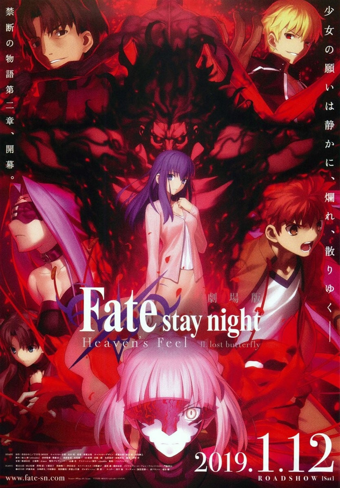
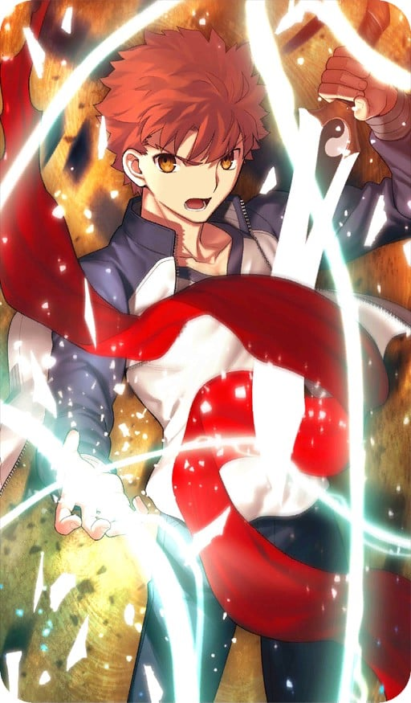
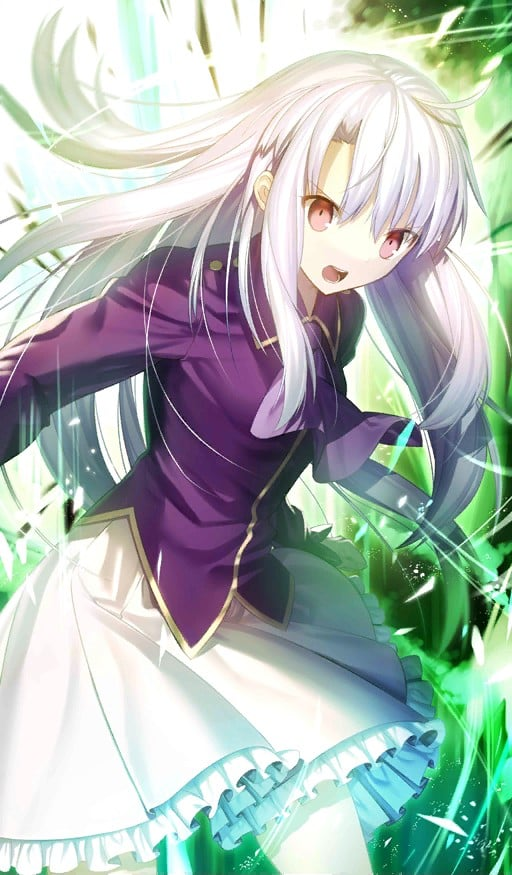
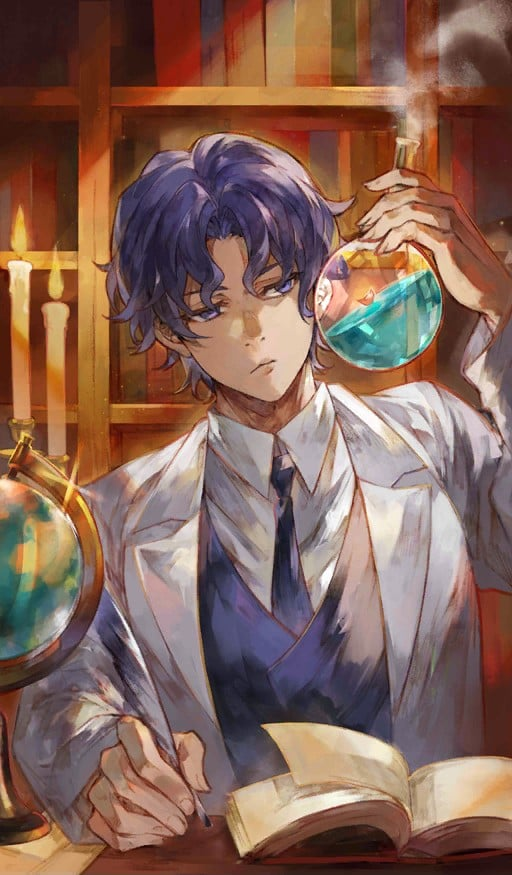
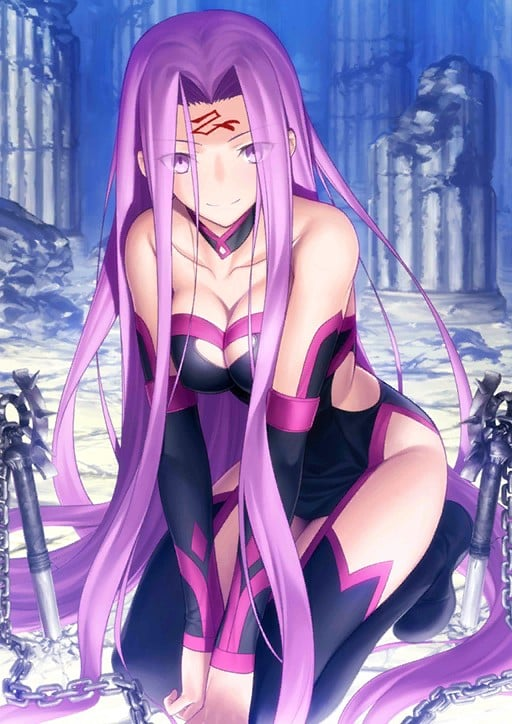

> [!bookinfo|noicon]+ **剧场版 Fate/stay night [Heaven's Feel] II.lost butterfly**
> 
>
| 日文名 | 劇場版 Fate/stay night [Heaven's Feel] II.lost butterfly |
|:------: |:------------------------------------------: |
| 类型 | 游戏改 |
| 新番 | 2019 年 8 月 |
| 集数 | 共1话 |
| 官网 | [http://www.fate-sn.com/2nd/](https://http://www.fate-sn.com/2nd/) |
| 制作 | ufotable |
| 导演 | 須藤友徳 |
| 脚本 | 桧山彬(ufotable)；脚本制作：ufotable,桧山彬,ufotable |
| 评分 | 7.8|
| 制片人 | 近藤光 |

> [!abstract]+ **简介**
> 俺の戦うべき相手は――まだこの街にいる。少年は選んだ、自分の信念を。そして、少女を守ることを。
魔術師〈マスター〉と英霊〈サーヴァント〉 が願望機「聖杯」をめぐり戦う――「聖杯戦争」。10年ぶりに冬木市で始まった戦争は、「聖杯戦争」の御三家と言われた間桐家の当主・間桐臓硯の参戦により、歪み、捻じれ、拗れる。臓硯はサーヴァントとして真アサシンを召喚。正体不明の影が町を蠢き、次々とマスターとサーヴァントが倒れていった。
マスターとして戦いに加わっていた衛宮士郎もまた傷つき、サーヴァントのセイバーを失ってしまう。だが、士郎は間桐 桜を守るため、戦いから降りようとしなかった。そんな士郎の身を案じる桜だが、彼女もまた、魔術師の宿命に捕らわれていく……。
「約束する。俺は――」
裏切らないと決めた、彼女だけは。少年と少女の切なる願いは、黒い影に塗りつぶされる。

> [!tip]+ **章节列表**
>- [ ] 第2话：Fate/stay night [Heaven’s Feel] II.lost butterfly (2019-01-12)

> [!tip]+ **主要角色**
> 
| 角色 | CV | 简介| 角色图片 |
|:----:|:---:|:---:|:--------:|
| ギルガメッシュ | 関智一 | 号称拥有最强宝具的Servant，将其他所有人都蔑称为“杂种”的傲慢的王者。其真身乃是人类最古老的英灵——英雄王吉尔伽美什。 |  |
| 衛宮士郎 | 杉山紀彰 | 穗群原学园（Homurabara）高中部二年级学生及见习中的魔术师、10年前冬木市（Fuyuki）大火中的少数生还者之一。被身为魔术师的卫宫切嗣所救并收养，受卫宫切嗣的影响，是个英雄迷，并发誓长大之后一定要成为“正义的伙伴”拯救所有受到苦难的人们。所以只要是他人的请求他从不会拒绝。擅长分析物件构造（可以解析眼中所见的任何东西的构造）和修理电器。 虽然是魔术师，不过除了构造把握、强化和投影以外，并不会其他基本的魔术。因为十年前那场大火的关系，在右肩留下一道火烧的伤痕，在礼射时男性要露出右肩，以此原因而退出弓道社。早上为和食派，曾有一段时间教樱作饭，领悟性高的樱很快就学会了。在料理方面不管是日式还是西式都很擅长。在饮食方面对于红茶、日本茶及咖啡一律平等，唯独不喜欢喝梅昆布茶。酒量不好，顶多是撑一下的程度。爱好是修理东西，曾经帮藤村大河的祖父藤村雷画改造摩托车，而从雷画那里拿到大量的零用钱。而加入弓道部的契机，是因为看到体格劣于他人却不服输的性格，雷画推荐他学习弓道。在此之前的相扑似乎也是雷画推荐的。 天生就对剑特别喜好。此外弓术也早已到达了大师的境界，“箭矢呢，是在射出前就已经射中的”，因此他唯一的失误只是因为他本来就没有要让箭矢击中红心。拥有技能：投影魔术的实质与Archer相同，是其心象风景“固有结界—无限剑制”。由于本身的属性是剑，可以投影所有理解范围内的武器（限定为剑，也能投影防具，但通常需要二至三倍的魔力）。因此在UBW线中与英雄王匹敌。（因为本身魔力回路太少，所以透过跟远坂 凛进行性行为建立魔力回路以支撑结界）此外固有结界—无限剑制由于与Archer的心象风景不太相同，因此唱诵的咒文也有一些差别，此外虽然Archer与士郎有相当大的实力差距，但在此线与Archer对战的过程中士郎逐渐吸收了Archer的战斗经验，两人处于势均力敌的状态。 此外，虽然叫做投影，不过一般的投影可以在投影出和原型相似的某种物品后，在加上补强，但是士郎的投影是完全靠自己心中的想像来凭空制造物品，是将内心具现化的技能(同时也是固有结界-无限剑制的基础)。 根据投影的规则，就算完美的投影出宝具，也会比原先的宝具降低一个等级。但是在制剑过程中，会自然了解剑的一切，包含持有过剑的人的剑术武技虽然不到完全拷贝，所以只要投影出来的剑都能够立刻的上手使用，仿佛是自己曾用过的剑一样，但并不是变成真正的武学大师，还是有很大的部份依赖士郎本身学习到的剑术和战斗经验。 在HF线中失去了左手，因而接受了Archer的左手，绮礼曾对两人的肉体契合度异常之高感到惊讶，即使如此，由于Archer的左手拥有远远超越于现在的士郎所拥有的大量魔力回路、战斗经验、投影知识，所以需要以扼杀魔力的圣骸布紧紧封印住，借此骗过身体，若是轻率使用，反而会被手臂侵蚀，唯一的方法便是透过自身的锻炼，在未来成长至足以驾驭左手后，才能够将之自由使用。此外，士郎可使用手臂中所累积的投影知识，在与Rider联手与黑Saber的途中，也曾投影出英灵卫宫曾投影出的结界宝具－炽天覆七重圆环（Lo.Aias），在fate/hollow ataraxia中Archer在最后一日进行决战时，身上便携带当初用来封印左手的圣骸布，该Archer是否为此线中成长并且成功驾驭左手的英灵卫宫这点尚存争议，因HF线最后结局士郎原本的肉体已经崩坏，之后使用的身体是由樱变卖间桐的房子向苍崎橙子购买的人偶（仅有略为提到），其原因可推测为fate/hollow ataraxia是融合本作三线从而发展出类似续篇的关系，极有可能为圣杯所制造的矛盾现象。 士郎的自我治疗能力是来自他体内Excalibur的剑鞘“遗世独立的理想乡（Avalon）”，此宝具必须与Saber建立契约以及她的魔力才能发动，靠近Saber效果更明显。但在游戏中的死亡路线都派不上用场。 此外英雄王的乖离剑・Ea是在“剑”这一武器的概念出现之前所创造出来的，因此士郎无法理解其构造及投影。 |  |
| 間桐桜 | 下屋則子 | 過去のちょっとしたきっかけから、主人公や藤村先生とは家族同然の付き合いを続けている一学年下の後輩。 やや引っ込み思案なおとなしい性格をしているが、時折主人公に対して積極的になる一面も持ち合わせている。 穏やかな日常の象徴で、戦いに巻き込まれる事はないのだが……？ |  |
| エミヤ | 諏訪部順一 | 与凛订定契约·弓兵的英灵。 经常嘲讽他人的现实主义者，不过与凛之间互相有着坚强的羁绊。 喜欢单独行动，明明是Archer却喜欢近身战，拿手的武器是雌雄双刀－干将莫邪，超人的弓技直到Fate/hollow ataraxia才展现。 他本人自称由于召唤时的事故忘了自己的真身为何，拿手的技术是家事全能，凛曾称赞过他泡的红茶非常好喝。 |  |
| イリヤスフィール・フォン・アインツベルン | 門脇舞以 | サーヴァント・バーサーカーのマスターとして聖杯戦争に参加。 銀色の髪と赤い瞳をした謎の少女。雪をイメージさせる容姿とは裏腹に、無邪気で人懐っこい性格をしている。 物語の導入において、何も知らない主人公に接触するが──── |  |
| 間桐慎二 | 神谷浩史 | 间桐家长男，前任家督间桐鹤野的亲生子。个性相当差劲，欺软怕硬，好色、冷血，在男生之中如同公敌般受到敌视，但因外貌和家中有钱等原因受到一些女孩子欢迎。曾经追求过凛，却被其无视。卫宫士郎中学以来的同学，与士郎曾经关系不错，不过在上了高中之后便开始疏远，后来因为性格等原因而在第五次圣杯战争之中成为对手。弓道部副主将，在弓道上有一定实力。很受女同学欢迎，但在学校的男性朋友就只有士郎。对待自己名义上的妹妹间桐樱十分粗暴，曾因殴打樱让其留下伤痕而被士郎揍过。（之后樱也仍然原谅并对士郎说要好好对待哥哥，原因是「因为哥哥只有你一个朋友」）  虽然出生在魔术世家，但到了慎二这代已经完全没有魔术回路，不过仍具备相当魔术知识。因为持有樱以令咒制作的“伪臣之书”，他也成了参加圣杯战争的御主。在三条路线之中，都有他带着Rider袭击无辜平民的情节（Fate和UBW之中是试图吸取全校师生的生命力，而HF线之中则是在公园袭击路人）。 |  |
| 言峰綺礼 | 中田譲治 | 此次的圣杯战争担任监督的神父，也是教会的“代行者（Executer）”，有着言行复杂常人不能理解的地方。曾参加过上次（第四次）的圣杯战争。远坂凛的监护人及师兄，爱吃麻婆豆腐，虽是代行者，本作中并未使用过圣典（于HF线中绮礼曾提到若想与从者对战取得胜利，必须配备代行者专用武器-圣典，关于圣典使用者，可参照月姬中埋葬机关的代行者－希耶尔（Ciel（シエル））。 第四次圣杯战争中利用远坂时臣后将其杀害，最后与卫宫切嗣争夺圣杯。第四次圣杯战争最后被切嗣射杀，但因为圣杯流出的黑色物质无法污染Gilgamesh而逆流回御主身上，填补了他被射穿的心脏使他复活。详细资讯可以参照‘Fate/Zero’。 喜欢看到人死亡和痛苦，十年前的灾难对他来说也只是愉悦。 事实上在第五次圣杯战争中，他是游戏的最大作弊者，控制Lancer和Gilgamesh两个从者，对士郎来说是相当于“绝对恶”的存在。 在三线中战斗方法与相当大的差异，Fate线中利用圣杯中溢出的污染物攻击，HF线中则是利用黑键及其超凡的肉体能力，甚至可与Assassin（真）匹敌。 此外绮礼也会使用中国拳法，但并非精通，本人表示只是模仿拳师拳路的架式，而没有使用上内力，在Fate/Zero中也曾用此种战斗方式。 会使用洗礼咏唱的技能，是圣典中以“神的教诲”来让世界固定化的魔术基础之中最大的对灵魔术，可让徘徊世间的魂魄归于无的神意之钥，绮礼于HF线曾这此技能对付间桐 臓砚。 过去曾有位妻子，是为身怀病痛的女子，绮礼是为了欣赏她的痛苦才选择她。绮礼尝试让自己像一个普通人一样爱她，最后女子临死前绮礼否认自己爱上她，但女子却笑着说绮礼已经爱上自己了。女子自杀后，绮礼只想着既然要死为何不是自己亲手享受她的死亡，但这样的想法等同否认女子死亡的意义。他不希望女子的死亡毫无意义。 虽然对士郎来说是相当于“绝对恶”的存在，但是说到底，言峰绮礼并不是纯粹意义上的“恶”，而是无法感受常人的喜悦心情的“感情异常者”，在这一层面上说与过分崇拜正义到排斥自身存在的卫宫士郎是身为“感情异常者”的同类。 |  |
| 衛宮切嗣 |  | Fate/Zero 中Saber的Master。 被外界称为“魔术师杀手”。觉得魔术与机械一样 ，只是一种达成目标的手段 。 代表爱因兹贝伦一族出战，为了自身坚信的正义可变得冷酷无情，对目标贯彻到底不择手段，能使用“固有时制御”此高等魔术。经常因为自身理想和行动有所出入而气愤。具有火与土的双重属性。 深爱著自己的妻子爱丽丝与自己女儿伊莉雅 。 对于招出Saber感到不满，相比以骑士道自居的骑士，他更喜欢暗中行动的Caster或Assassin。 |  |
| 遠坂凛 | 植田佳奈 | 穂群原学園2年A組に通う女生徒で、魔術師。魔術の名門、遠坂家の後継者。 学園内では非の打ち所のない優等生として男子生徒の人気も上々だが、イジワル大好きないじめっこ、という小悪魔的な本性を持つ。 現代に生きる魔術師として聖杯戦争に参加。素人同然の主人公と衝突する。 |  |
| ヘラクレス |  | 狂战士的英灵。 其身份是海格力斯（Heracles，或译为赫拉克勒斯、赫丘力士），是希腊神话中最伟大的英雄，身高高达253cm。拥有宝具“十二的试练（God Hand）”。 1、将自己的肉体变为顽强的铠甲，无效化全部等级B以下的攻击，无论物理性手段还是魔术。 2、拥有死亡后自动使肉体苏生的效果，而且因为此苏生贮存着11次的份量，所以海格力斯只要不被杀12次就不会消灭。另外，由于依莉雅的魔力庞大，若有时间的话，减少的苏生次数甚至可以回复。 3、除了“苏生”与“使攻击无效”外，宝具“十二试炼”还拥有第3个效果那就是“让受过一次的攻击第二次就不管用”。即使以多么强大的宝具打倒了海格力斯，当他再次苏生后该宝具就被无效化了。 拥有所有从者中最优秀的战斗能力，可惜因为狂化的效果，令他不能使出他最信赖的宝具，射杀百头。 海格力斯是这次爱兹贝伦家犯规召唤来的从者，以牺牲理性的方式换取压倒性的破坏力。 |  |
| メドゥーサ | 浅川悠 | 骑兵的英灵。 因此擅长在特殊地形（如：高空）战斗。 Rider这个职阶同时必需拥有强力宝具才能担任，使用可隐形的锁链刃作为武器。 其身分为希腊神话中的女妖美杜莎（Medusa，又译梅杜莎，即“蛇发女妖”），因而有“妖艳的黑蛇”的称号。 有着驾驭传说中天马的骑乘能力，具有极高的机动性，持有宝具为“他者封印·鲜血神殿（Blood Fort Andromeda）”、“自我封印·暗黑神殿（Breaker Gorgon）”与“骑英之缰绳（Bellerophon）”，也拥有特殊技能石化魔眼（Cybele）。 |  |
| 呪腕のハサン | 稲田徹 | 白骷髅的暗杀者。起源于中东的暗杀教团党首。别名「山中老人」，作为Assassin语源，尼查里派传说中的头目之一。据说山中老人历代共有18人，每位都是修炼成特殊技能的达人。 戴着骷髅的面具，身披黑色的斗篷，拥有如棍棒般的右手，外观诡异。骷髅假面下的面容已被割掉，因此没有脸。自从他继承了「哈桑·萨巴赫」之名后，就舍弃了他过去个人所有的一切。 从人类角度而言并不能称之为好人，但永远忠实于主人的命令，无论主人陷入多么绝望的劣势，他也不会背叛，甚至愿意默默地执行一些强人所难的命令。认为杀戮只是一种任务与义务，从中感受不到任何喜怒哀乐。 |  |