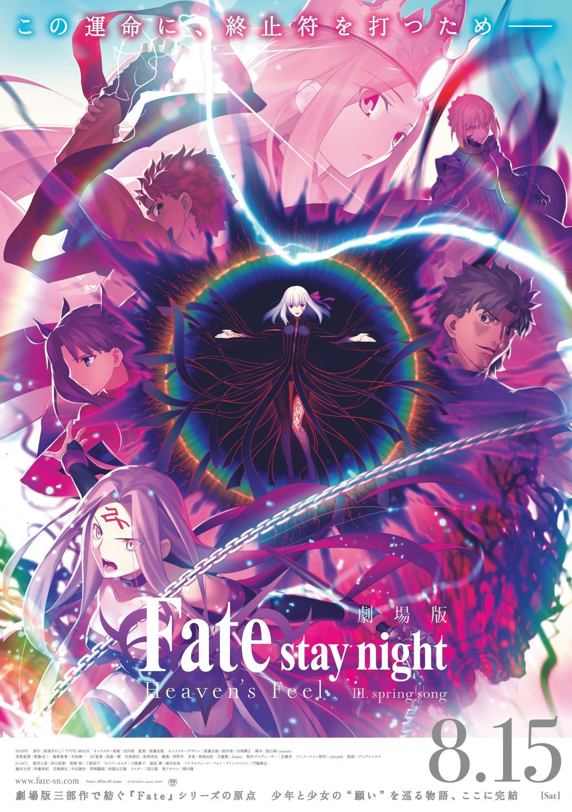
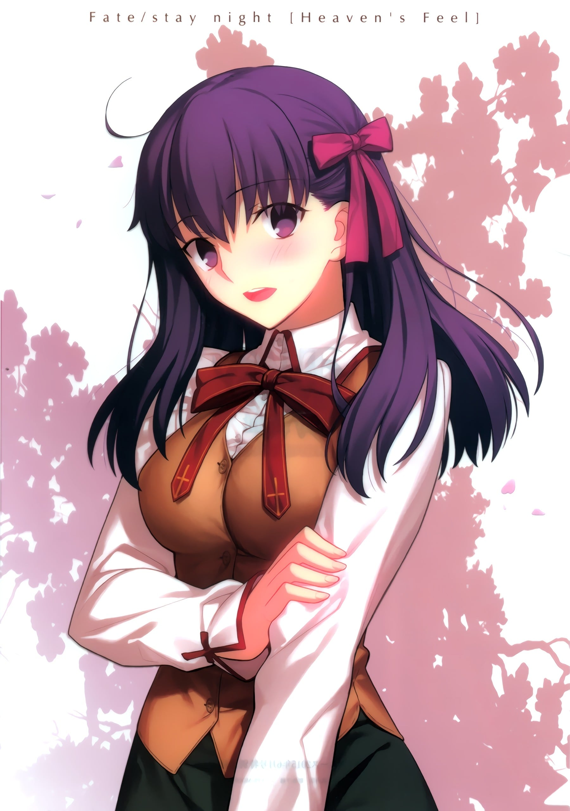
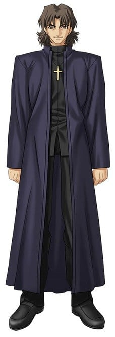
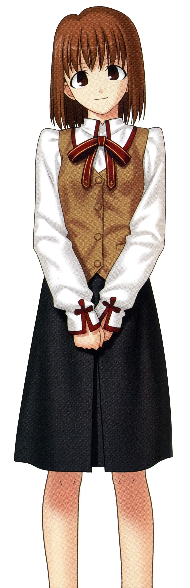
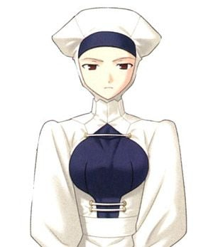
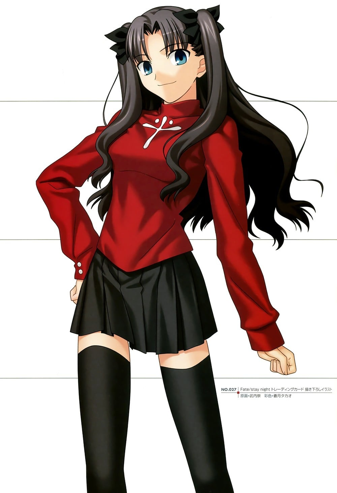

> [!bookinfo|noicon]+ **剧场版 Fate/stay night [Heaven's Feel] III.spring song**
> 
>
| 日文名 | 劇場版 Fate/stay night [Heaven's Feel] III.spring song |
|:------: |:------------------------------------------: |
| 类型 | 游戏改 |
| 新番 | 2020 年 8 月 |
| 集数 | 共1话 |
| 官网 | [http://www.fate-sn.com/](https://http://www.fate-sn.com/) |
| 制作 | ufotable |
| 导演 | 須藤友徳 |
| 脚本 | 桧山彬(ufotable)；脚本制作：ufotable,桧山彬,ufotable |
| 评分 | 7.9|
| 制片人 | 近藤光 |

> [!abstract]+ **简介**
> “因为我决定，要成为樱的正义伙伴。”
少年已无法逃避事实，这是为了拯救少女，也是为了贯彻自己选择的正义。

围绕着能够实现任何愿望的“圣杯”，魔术师（御主）与英灵（从者）所展开的“圣杯战争”经已扭曲。间桐樱与所犯下的罪孽，一同沉溺在无尽黑暗中。而发誓要守护樱的卫宫士郎，为了终结圣杯战争，投身于残酷的战斗中，与远坂凛一起作战。另一方面，知晓战争内幕的伊莉亚丝菲尔．冯．艾因兹贝伦，亦挺身面对自己的命运。

“所以，咬紧牙关吧，樱。”

少年力抗暴风、挑战命运，他的愿望能否传达给少女？
终于迎来结局的“圣杯战争”，最后之战即将揭幕！

> [!tip]+ **章节列表**
>- [ ] 第3话：Fate/stay night [Heaven’s Feel] III.spring song (2020-08-15)

> [!tip]+ **主要角色**
> 
| 角色 | CV | 简介| 角色图片 |
|:----:|:---:|:---:|:--------:|
| 蒼崎橙子 |  | 　　奈须小说《空之境界》中的最高位的人形使，整部《空之境界》的故事导向者。礼园女学院的校友，被魔术协会制定封印的人偶师。个性独特，二十多岁就升到支配者层级，有魔眼，拥有魔术回路二十左右。虽身为魔术师却有接近魔法使的实力。在魔术协会学习期间以追求肉体的原型为目标，结识了同样研究卢文字和人偶制作的柯尼勒斯·阿鲁巴和追求魂之原型的荒耶宗莲，对荒耶有着相当复杂的感情。 　　与《空之境界》的主角两仪式相遇后将其收为名义上的使魔，并偶尔会交一些工作给她。 　　喜欢抽烟，而且似乎还抽得很凶。香烟据说是产自台湾的劣质烟，剧场版里可以看见品牌貌似叫做“烟龙”。是个浪漫主义者，喜欢新的东西，对有兴趣的东西百般折腾。也是一个飚车爱好者，小说中喜欢的车是Mini Maina—1000型的迷你酷派车，剧场版中开的则是阿斯顿·马丁的DB9，并且貌似不止一辆，拥有的哈雷摩托似乎也是复数。　 　　橙子的专长是伦文字（Rune）魔术、人偶制作及各种创作设计。 　　《月姬》中 远野志贵 的眼镜——魔眼杀，就是出自她手。《Fate stay night》「Heaven Feel」True End中，替代卫宫士郎被破坏的人偶也被怀疑由橙子制作。（川添绿注：魔眼杀是苍崎橙子的妹妹苍崎青子交给远野志贵的） 　　能够利用伦文字【如尼文（Rune）】进行火焰的攻击，也会使用自制的各种使魔进行战斗，其使魔的强度据说是可以瞬间吞下一栋公寓的魔兽。使魔通常被装在随身携带的橙色提包或提箱中。自己则身披一件能够防御各种魔术侵袭的茶色大衣。（剧场版改为橙色） 　　同时，在《空之境界》中也曾设计出可令进入者陷入混乱状态的螺旋型建筑——小川公寓。是一个集魔术，创作及设计天赋于一身的多面天才。 　　大概是奈须目前已发表的故事中，最能代表魔术师存在的一个人。 　　讨厌橙色，不太喜欢自己橙子(とうこ)这个名字，不过偏偏身上总是会挂着橙色的装饰品。 |  |
| 衛宮士郎 | 杉山紀彰 | 穗群原学园（Homurabara）高中部二年级学生及见习中的魔术师、10年前冬木市（Fuyuki）大火中的少数生还者之一。被身为魔术师的卫宫切嗣所救并收养，受卫宫切嗣的影响，是个英雄迷，并发誓长大之后一定要成为“正义的伙伴”拯救所有受到苦难的人们。所以只要是他人的请求他从不会拒绝。擅长分析物件构造（可以解析眼中所见的任何东西的构造）和修理电器。 虽然是魔术师，不过除了构造把握、强化和投影以外，并不会其他基本的魔术。因为十年前那场大火的关系，在右肩留下一道火烧的伤痕，在礼射时男性要露出右肩，以此原因而退出弓道社。早上为和食派，曾有一段时间教樱作饭，领悟性高的樱很快就学会了。在料理方面不管是日式还是西式都很擅长。在饮食方面对于红茶、日本茶及咖啡一律平等，唯独不喜欢喝梅昆布茶。酒量不好，顶多是撑一下的程度。爱好是修理东西，曾经帮藤村大河的祖父藤村雷画改造摩托车，而从雷画那里拿到大量的零用钱。而加入弓道部的契机，是因为看到体格劣于他人却不服输的性格，雷画推荐他学习弓道。在此之前的相扑似乎也是雷画推荐的。 天生就对剑特别喜好。此外弓术也早已到达了大师的境界，“箭矢呢，是在射出前就已经射中的”，因此他唯一的失误只是因为他本来就没有要让箭矢击中红心。拥有技能：投影魔术的实质与Archer相同，是其心象风景“固有结界—无限剑制”。由于本身的属性是剑，可以投影所有理解范围内的武器（限定为剑，也能投影防具，但通常需要二至三倍的魔力）。因此在UBW线中与英雄王匹敌。（因为本身魔力回路太少，所以透过跟远坂 凛进行性行为建立魔力回路以支撑结界）此外固有结界—无限剑制由于与Archer的心象风景不太相同，因此唱诵的咒文也有一些差别，此外虽然Archer与士郎有相当大的实力差距，但在此线与Archer对战的过程中士郎逐渐吸收了Archer的战斗经验，两人处于势均力敌的状态。 此外，虽然叫做投影，不过一般的投影可以在投影出和原型相似的某种物品后，在加上补强，但是士郎的投影是完全靠自己心中的想像来凭空制造物品，是将内心具现化的技能(同时也是固有结界-无限剑制的基础)。 根据投影的规则，就算完美的投影出宝具，也会比原先的宝具降低一个等级。但是在制剑过程中，会自然了解剑的一切，包含持有过剑的人的剑术武技虽然不到完全拷贝，所以只要投影出来的剑都能够立刻的上手使用，仿佛是自己曾用过的剑一样，但并不是变成真正的武学大师，还是有很大的部份依赖士郎本身学习到的剑术和战斗经验。 在HF线中失去了左手，因而接受了Archer的左手，绮礼曾对两人的肉体契合度异常之高感到惊讶，即使如此，由于Archer的左手拥有远远超越于现在的士郎所拥有的大量魔力回路、战斗经验、投影知识，所以需要以扼杀魔力的圣骸布紧紧封印住，借此骗过身体，若是轻率使用，反而会被手臂侵蚀，唯一的方法便是透过自身的锻炼，在未来成长至足以驾驭左手后，才能够将之自由使用。此外，士郎可使用手臂中所累积的投影知识，在与Rider联手与黑Saber的途中，也曾投影出英灵卫宫曾投影出的结界宝具－炽天覆七重圆环（Lo.Aias），在fate/hollow ataraxia中Archer在最后一日进行决战时，身上便携带当初用来封印左手的圣骸布，该Archer是否为此线中成长并且成功驾驭左手的英灵卫宫这点尚存争议，因HF线最后结局士郎原本的肉体已经崩坏，之后使用的身体是由樱变卖间桐的房子向苍崎橙子购买的人偶（仅有略为提到），其原因可推测为fate/hollow ataraxia是融合本作三线从而发展出类似续篇的关系，极有可能为圣杯所制造的矛盾现象。 士郎的自我治疗能力是来自他体内Excalibur的剑鞘“遗世独立的理想乡（Avalon）”，此宝具必须与Saber建立契约以及她的魔力才能发动，靠近Saber效果更明显。但在游戏中的死亡路线都派不上用场。 此外英雄王的乖离剑・Ea是在“剑”这一武器的概念出现之前所创造出来的，因此士郎无法理解其构造及投影。 |  |
| 間桐桜 | 下屋則子 | 過去のちょっとしたきっかけから、主人公や藤村先生とは家族同然の付き合いを続けている一学年下の後輩。 やや引っ込み思案なおとなしい性格をしているが、時折主人公に対して積極的になる一面も持ち合わせている。 穏やかな日常の象徴で、戦いに巻き込まれる事はないのだが……？ |  |
| エミヤ | 諏訪部順一 | 与凛订定契约·弓兵的英灵。 经常嘲讽他人的现实主义者，不过与凛之间互相有着坚强的羁绊。 喜欢单独行动，明明是Archer却喜欢近身战，拿手的武器是雌雄双刀－干将莫邪，超人的弓技直到Fate/hollow ataraxia才展现。 他本人自称由于召唤时的事故忘了自己的真身为何，拿手的技术是家事全能，凛曾称赞过他泡的红茶非常好喝。 |  |
| イリヤスフィール・フォン・アインツベルン | 門脇舞以 | サーヴァント・バーサーカーのマスターとして聖杯戦争に参加。 銀色の髪と赤い瞳をした謎の少女。雪をイメージさせる容姿とは裏腹に、無邪気で人懐っこい性格をしている。 物語の導入において、何も知らない主人公に接触するが──── |  |
| 間桐慎二 |  | 间桐家长男，前任家督间桐鹤野的亲生子。个性相当差劲，欺软怕硬，好色、冷血，在男生之中如同公敌般受到敌视，但因外貌和家中有钱等原因受到一些女孩子欢迎。曾经追求过凛，却被其无视。卫宫士郎中学以来的同学，与士郎曾经关系不错，不过在上了高中之后便开始疏远，后来因为性格等原因而在第五次圣杯战争之中成为对手。弓道部副主将，在弓道上有一定实力。很受女同学欢迎，但在学校的男性朋友就只有士郎。对待自己名义上的妹妹间桐樱十分粗暴，曾因殴打樱让其留下伤痕而被士郎揍过。（之后樱也仍然原谅并对士郎说要好好对待哥哥，原因是「因为哥哥只有你一个朋友」）  虽然出生在魔术世家，但到了慎二这代已经完全没有魔术回路，不过仍具备相当魔术知识。因为持有樱以令咒制作的“伪臣之书”，他也成了参加圣杯战争的御主。在三条路线之中，都有他带着Rider袭击无辜平民的情节（Fate和UBW之中是试图吸取全校师生的生命力，而HF线之中则是在公园袭击路人）。 |  |
| 言峰綺礼 | 中田譲治 | 此次的圣杯战争担任监督的神父，也是教会的“代行者（Executer）”，有着言行复杂常人不能理解的地方。曾参加过上次（第四次）的圣杯战争。远坂凛的监护人及师兄，爱吃麻婆豆腐，虽是代行者，本作中并未使用过圣典（于HF线中绮礼曾提到若想与从者对战取得胜利，必须配备代行者专用武器-圣典，关于圣典使用者，可参照月姬中埋葬机关的代行者－希耶尔（Ciel（シエル））。 第四次圣杯战争中利用远坂时臣后将其杀害，最后与卫宫切嗣争夺圣杯。第四次圣杯战争最后被切嗣射杀，但因为圣杯流出的黑色物质无法污染Gilgamesh而逆流回御主身上，填补了他被射穿的心脏使他复活。详细资讯可以参照‘Fate/Zero’。 喜欢看到人死亡和痛苦，十年前的灾难对他来说也只是愉悦。 事实上在第五次圣杯战争中，他是游戏的最大作弊者，控制Lancer和Gilgamesh两个从者，对士郎来说是相当于“绝对恶”的存在。 在三线中战斗方法与相当大的差异，Fate线中利用圣杯中溢出的污染物攻击，HF线中则是利用黑键及其超凡的肉体能力，甚至可与Assassin（真）匹敌。 此外绮礼也会使用中国拳法，但并非精通，本人表示只是模仿拳师拳路的架式，而没有使用上内力，在Fate/Zero中也曾用此种战斗方式。 会使用洗礼咏唱的技能，是圣典中以“神的教诲”来让世界固定化的魔术基础之中最大的对灵魔术，可让徘徊世间的魂魄归于无的神意之钥，绮礼于HF线曾这此技能对付间桐 臓砚。 过去曾有位妻子，是为身怀病痛的女子，绮礼是为了欣赏她的痛苦才选择她。绮礼尝试让自己像一个普通人一样爱她，最后女子临死前绮礼否认自己爱上她，但女子却笑着说绮礼已经爱上自己了。女子自杀后，绮礼只想着既然要死为何不是自己亲手享受她的死亡，但这样的想法等同否认女子死亡的意义。他不希望女子的死亡毫无意义。 虽然对士郎来说是相当于“绝对恶”的存在，但是说到底，言峰绮礼并不是纯粹意义上的“恶”，而是无法感受常人的喜悦心情的“感情异常者”，在这一层面上说与过分崇拜正义到排斥自身存在的卫宫士郎是身为“感情异常者”的同类。 |  |
| 柳洞一成 |  | 与士郎同年级的学生会长，也是士郎的朋友，忠诚老实认真的好青年。身为柳洞家的长子，是柳洞寺的继承人，具有看穿远坂凛的本质的尖锐洞察力，也因此讨厌凛。 |  |
| 蒔寺楓 |  | 穗群原学园2年A班学生，远坂凛、美缀绫子的同班同学。三年级升入3年A班。田径部三人组之一，搞笑役。 田径部的短跑队员，拥有“穗群的黑豹”之外号。俗称Makiji。 在做美味和想阴谋上是优等生的远坂凛的朋友，凛少有的朋友，作为对手般看待着美缀绫子。爱好为收集风铃、很喜欢玻璃工艺品。那个与凛是爱好一致，假日二人就会去古董店巡游。 家里是历史悠久的吴服屋咏鸟庵，因此也非常适应传统文化。 |  |
| 三枝由紀香 |  | 穗群原学园的学生。田径部关系好三人组之一。负责吐槽。 |  |
| セラ | 七緒はるひ |  |  |
| 遠坂凛 | 植田佳奈 | 穂群原学園2年A組に通う女生徒で、魔術師。魔術の名門、遠坂家の後継者。 学園内では非の打ち所のない優等生として男子生徒の人気も上々だが、イジワル大好きないじめっこ、という小悪魔的な本性を持つ。 現代に生きる魔術師として聖杯戦争に参加。素人同然の主人公と衝突する。 |  |