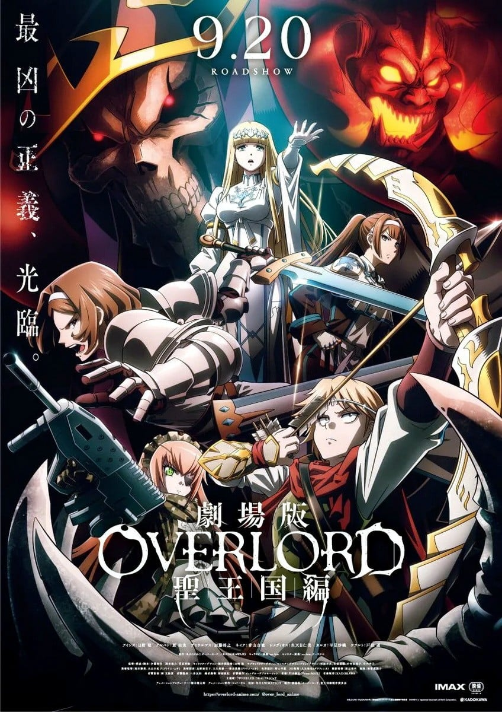
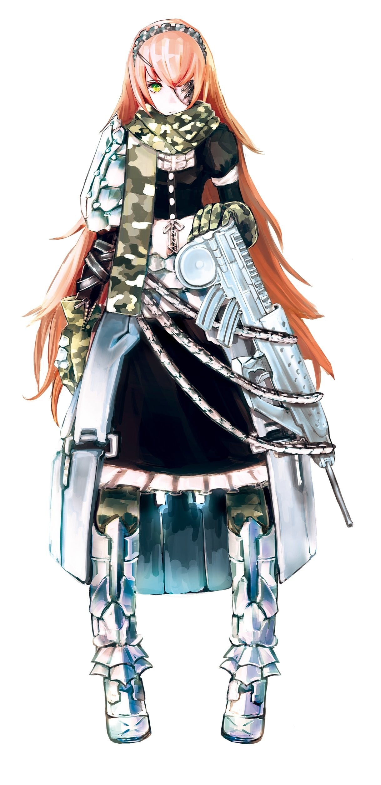
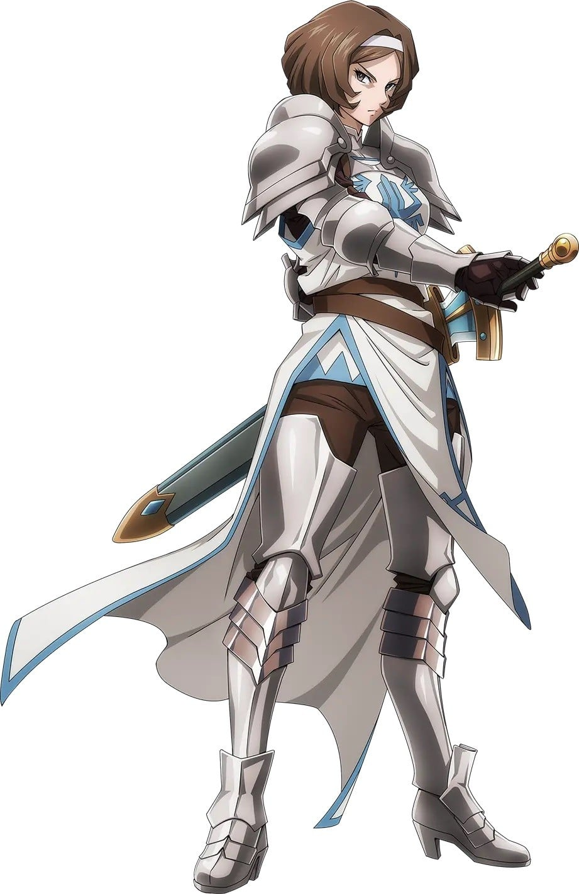

> [!bookinfo|noicon]+ **剧场版 OVERLORD 圣王国篇**
> 
>
| 日文名 | 劇場版 オーバーロード 聖王国編 |
|:------: |:------------------------------------------: |
| 类型 | 小说改 |
| 新番 | 2024 年 9 月 |
| 集数 | 共1话 |
| 官网 | [https://overlord-anime.com/](https://https://overlord-anime.com/) |
| 制作 | MADHOUSE |
| 导演 | 伊藤尚往 |
| 脚本 | 菅原雪絵,伊藤尚往,伊藤尚往；协力：菅原雪絵 |
| 评分 | 5.6|
| 制片人 | 橋本健太郎 |

> [!abstract]+ **简介**
> 丸山くがねの人気ライトノベルを原作とするテレビアニメ「オーバーロード」シリーズの劇場版で、原作でも人気の高い「聖王国編」のエピソードをアニメ化。

聖王女カルカを元首とするローブル聖王国は長大な城壁にその国土を守られてきたが、魔皇ヤルダバオトと亜人連合軍の突然の侵攻により、平和な時代は終わりを迎えた。聖騎士団長レメディオスと神官団長ケラルトの姉妹を中心に戦力を結集して迎え撃つ聖王国だったが、ヤルダバオトとの圧倒的な戦力差になすすべもなく、国家は崩壊の危機に瀕してしまう。レメディオスはヤルダバオトに対抗しうる力を求め、聖騎士団と従者ネイアを伴ってアインズ・ウール・ゴウン魔導国へ向かう。そこは聖王国の人々が忌み嫌う、アンデッドが統べる異形の国家だった。

テレビアニメに続いて伊藤尚往が監督を務め、マッドハウスがアニメーション制作を担当。

> [!tip]+ **章节列表**
>- [ ] 第1话：劇場版 オーバーロード 聖王国編

> [!tip]+ **主要角色**
> 
| 角色 | CV | 简介| 角色图片 |
|:----:|:---:|:---:|:--------:|
| アインズ・ウール・ゴウン | 日野聡 | 职位：至高无上的四十一位至尊 住处：纳萨力克地下大坟墓地下第九层的房间 属性：极恶↔正义值:-500 种族：骷髅魔法师(Skeleton Mage)Lv15 死者大魔法师(Elder Lich)Lv10 死之统治者(オーバーロード overlord)Lv5 职业：死灵法师(ネクロマンサー Necromancer)Lv10 巅峰不死者Lv10 持有：十一个世界级道具 公会武器：安兹乌尔恭之杖 <复活魔杖/wand of resurrection>(蘇生の短杖/ワンド・オブ・リザレクション) 无限背包(インフィニティ・ハヴァサック) 在网路游戏「YGGDRASIL」关闭运营的最后，依旧留在游戏中等待系统强制登出时，意外穿越至异世界的本书的主人公。现实世界当中是一名喜欢电玩的普通青年，在游戏中是一名拥有骷髅外表的最强魔法咏唱者，所属「安兹．乌尔．恭」公会。 元角色名音译为“莫莫伽”。 在第一卷中把自己的名字改为安兹·乌尔·恭，作为纳萨里克的象征及核心。 |  |
| アルベド | 原由実 | 职位：纳萨力克地下大坟墓的守护者总管 王妃(自称) 住处：王座之厅 纳萨力克地下大坟墓地下第九层的一个房间 属性：极恶↔正义值：-500 种族：小恶魔（インプ Imp）Lv10 职业：守护者(ガーディアン)Lv10 黑色护卫Lv5 邪恶骑士Lv10 护卫之主Lv5 持有：一个世界级道具 制作者：タブラ・スマラグディナ 由主角公会成员之一翠玉录所创建的NPC，职务为纳萨力克地下大坟墓的守护者总管 性格原本被设定成“贱人”，但飞鼠在游戏关闭运营的最后时刻抱着“反正是最后了”的心情更改为：爱着飞鼠 是主角的得力助手，在所有守护者中防御力最强。 |  |
| デミウルゴス | 加藤将之 | 职位：纳萨力克地下大坟墓地下第七层守护者 住处：纳萨力克地下大坟墓地下第七层赤热神殿 属性：极恶↔正义值：-500 种族：小恶魔（インプ Imp）Lv10 最高阶恶魔(アーチデヴィル Archdevil)Lv5 职业：混沌(カオス)Lv10 黑暗王子Lv10 变形魔(Shapeshifter)Lv10 制作者：ウルベルト・アレイン・オードル 守护者中的军师，各种特殊能力，有着最精明的头脑，时常向安兹提出建言。对纳萨力克的同伴很温柔，些外则非常残忍无道并以此为乐，跟赛巴斯的关系不太好。 |  |
| シズ・デルタ | 瀬戸麻沙美 | 種族レベル：自動人形（オートマトン）Lv5ほか 職業レベル：ガンナーLv10など ナザリックにおいて戦闘能力を持つ6人のメイド、チーム「プレアデス」の1人。 正式名称は「CZ2128・Δ（シーゼットニイチニハチ・デルタ）」、シズ・デルタは略称。 機械の型番のような名前や銃器の使用に適した職業クラス、何よりその種族からもわかるように無感情なメカ少女と言ったキャラクターメイキングをなされており、表情が動かされることはまずない。 外見的には翠玉の瞳に、もう片目を覆うアイパッチ、ミリタリー風味の飾り付けに赤金のロングヘアーと言ったところで、印象は無機質ではあるがプレアデスの例外なく非常に美しい容姿をしている。 ギミック考案を担当した制作者により、ナザリックのギミックとその解除法の全てを熟知しているとの設定を施されている。 |  |
| ネイア・バラハ | 青山吉能 | 聖騎士団の従者。母親のような聖騎士に憧れているが、剣の才能に乏しくレメディオスからぞんざいな扱いを受けている。一方で、父親からは弓使いとしての優れた才能を受け継ぎ、解放軍では斥候役を任されている。同じく父譲りの目つきの悪さがコンプレックス。 |  |
| レメディオス・カストディオ | 生天目仁美 | 聖王国騎士団の団長で、同国最強の聖騎士。妹のケラルトと共にカルカに絶対的な忠誠を誓い支えている。強きを挫き弱きを助ける正義感をもつ一方で、思い込みが強く融通が利かない。また、亜人やアンデッドに対し強烈な差別的意識を持っている。 |  |
| カルカ・ベサーレス | 早見沙織 | 聖王国の当代の聖王にして史上初の女王。「聖王女」と称される。ローブルの至宝と評されるほどの美貌を誇り、善良かつ慈愛に満ちた人格で国民から支持を得ている。マジックキャスターとしても天賦の才を有し、聖王国の最高戦力の一つに数えられる。 |  |
| ケラルト・カストディオ | 戸松遥 | 聖王国神官団の団長で、同国の最高位神官。レメディオスの妹だが、姉とは打って変わって理知的で落ち着いた性格。カルカを崇め、主に頭脳面から支える参謀的な働きを見せるが、本人もまた高位の魔法を扱うマジックキャスターである。 |  |