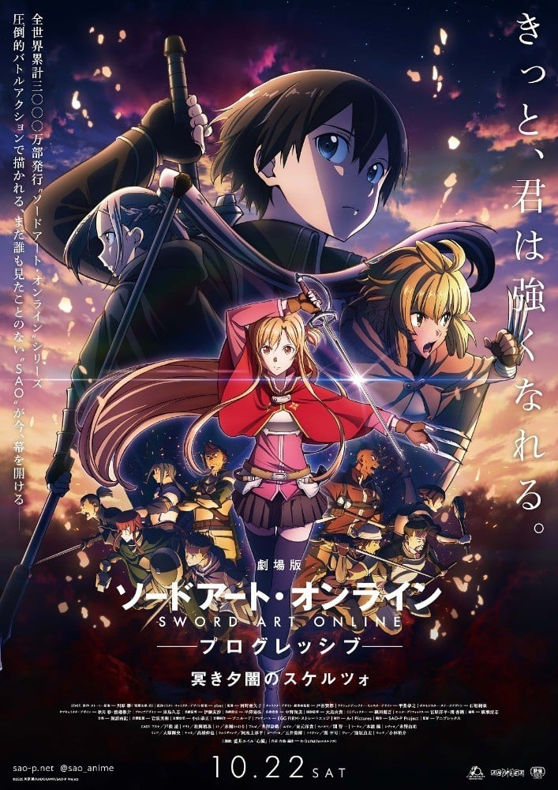
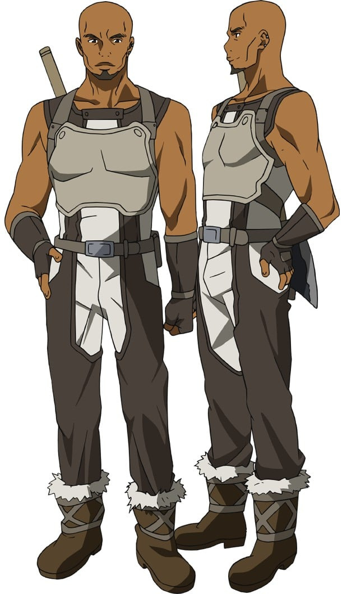
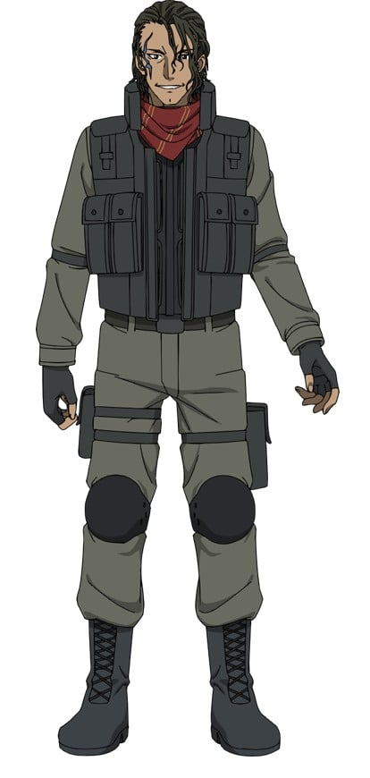
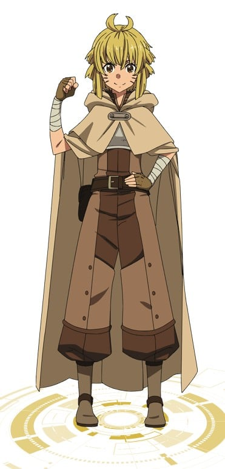
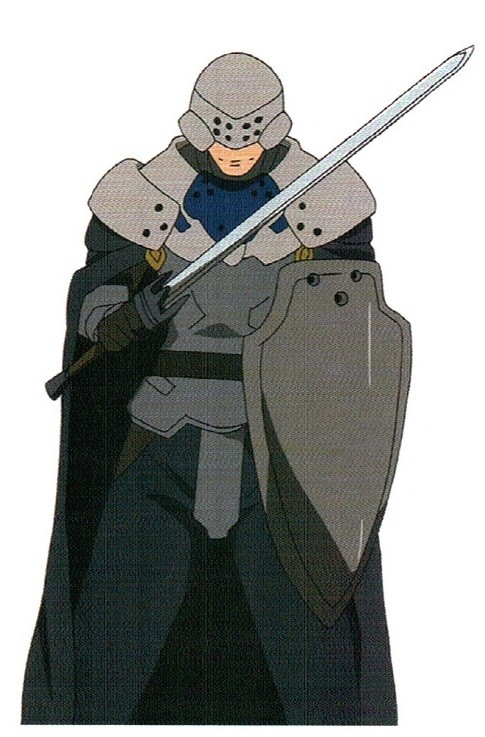
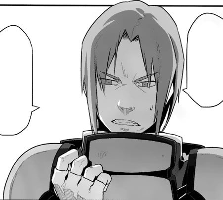
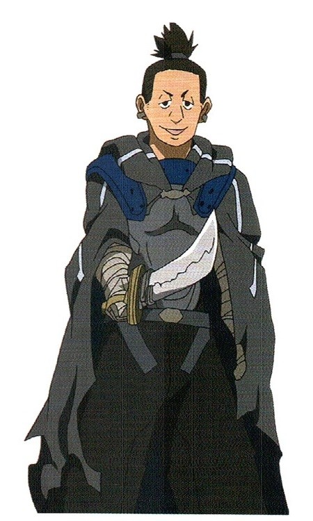

> [!bookinfo|noicon]+ **剧场版 刀剑神域 进击篇 黯淡黄昏的谐谑曲**
> 
>
| 日文名 | 劇場版 ソードアート・オンライン プログレッシブ 冥き夕闇のスケルツォ |
|:------: |:------------------------------------------: |
| 类型 | 小说改 |
| 新番 | 2022 年 10 月 |
| 集数 | 共1话 |
| 官网 | [https://sao-p.net/](https://https://sao-p.net/) |
| 制作 | A-1 Pictures |
| 导演 | 河野亜矢子 |
| 脚本 | 木澤行人 |
| 评分 | 6.4|
| 制片人 | 渋谷晃尚 |

> [!abstract]+ **简介**
> 世界首个VRMMORPG游戏《Sword Art Online》成为了“死亡游戏”。距1万名用户被困在游戏中一事发生，已有一个多月。攻略了钢铁浮游城“艾恩葛朗特”第一层后，亚丝娜继续与桐人搭档，以最顶层为目标继续着旅程。然而，带领玩家攻略游戏的两大精英公会“ALS”（艾恩葛朗特解放队）和“DKB”（龙骑士团）之间爆发了冲突，这背后，有一名神秘人物在暗中行动。在命悬一线的危险战斗中，继“攻略”压力后的另一重“威胁”将桐人和亚丝娜卷入其中。影片根据川原砾同名人气小说改编。

> [!tip]+ **章节列表**
>- [ ] 第1话：劇場版 ソードアート・オンライン プログレッシブ 冥き夕闇のスケルツォ (2022-10-22)

> [!tip]+ **主要角色**
> 
| 角色 | CV | 简介| 角色图片 |
|:----:|:---:|:---:|:--------:|
| キリト / 桐ヶ谷和人 | 松岡禎丞 | 主人公。开始玩SAO时是14岁，2年后的故事本篇是16岁。生日日期为10月7号。     名副其实的重度玩家。拥有超群的反射神经和洞察力，游戏的才能被茅场晶彦评为最强等级。参加过限额1000名的SAO封测，在封测期间就非常投入游戏。因为完全潜行正式版的SAO而被卷入死亡游戏，并以此为开端，牵扯进各种的虚拟世界事件。非常崇拜茅场晶彦，但这份崇拜因为被茅场晶彦关进死亡游戏而混入了憎恨，变成一种很复杂的感情。     出生没多久父母就因车祸去世，和人虽然也受了重伤但保住了性命，之后被桐谷家（母亲妹夫的家庭）收为养子。6岁就会自己组电脑。10岁时就发现自己的电子户口被修改过并发觉自己的身世，令养父母十分惊讶。五官看起来像少女一样纤细，态度却非常冷淡，给人一种“捉摸不定”、“年龄不详”的印象。     有因为自己而让公会伙伴全部死亡的心理创伤[注 1]，害怕拥有伙伴或与人扯上关系，在亚丝娜半强制的组队下才慢慢克服。和亚丝娜心意相通后在系统上“结婚”，买下艾恩葛朗特22层的玩家小屋开始了新婚生活。ALO事件后和亚丝娜重聚，在现实世界也成为情侣。     在SAO事件中共杀死三名玩家，除了克拉帝尔外都被桐人以自欺欺人的方式忘却，成为桐人的另一心理创伤。     因为SAO事件，长期在VRMMORPG的环境下经历生死相关的“实战”，使和人在现实生活中也拥有极强的剑术。配合原本就过人的反射神经和洞察力，连全国中学剑道大赛前八强的直叶也无法在练习战中以技术取胜，仅能靠力量的差异压制大病初愈的和人。而这些剑术同时也让和人在某些非等级制的VRMMORPG中直接就拥有匹敌甚至凌驾顶级玩家的实力。     在SAO世界是以攻略艾恩葛朗特最上层为目标，分类为“攻略组”的独行玩家，只装备一把单手剑的顶级剑士。技能空格有12格，其中单手长剑技能、索敌技能和武器防御技能已完全习得。喜欢装备朴素但匿踪效果高的黑色斗篷，因全身黑的造型被称为“黑色剑士”。拥有全玩家中最高的反应速度而获得独有技能“二刀流”，使用时会同时装备两把单手剑：黑色剑身的“阐释者（Elucidator／エリュシデータ）”[注 2]和白色剑身的“逐闇者（Dark Repulser／ダークリパルサー）”[注 3]。起初因不想惹麻烦而一直隐藏此技能，在被迫曝光后，和希兹克利夫同样被当成拥有异次元强度的最强玩家。     在第75层的头目攻略战中识破了希兹克利夫的真正身分和想法，与其进行双方设定为超低血量的最终对决。虽然失去冷静而战败，但在消失的瞬间超越系统限制，从已被判定死亡的状态下硬发出一次攻击，成功对茅场造成致命伤，最终二人同归于尽，成功攻略游戏。     在妖精之舞篇中，为了找寻仍然被囚禁在虚拟实景的亚丝娜，而以守护精灵剑士的角色完全潜行“ALO”。因使用保有旧SAO存盘的NERvGear登入ALO，造成SAO中的黑衣剑士“桐人”的资料覆盖到守护精灵“桐人”身上[注 4]，在新手状态就拥有极高的技能熟练度和可观的游戏货币。并因为系统错误而出现在使用相同IP的直叶（莉法）附近，在不知道彼此真正身份下结识对方，直到桐人在游戏中提到亚丝娜的名字才被直叶认出。     新生ALO开始营运后，以“剑士桐人的任务已经完成”为由，将自己的数值重置。     在幽灵子弹篇中，受到菊冈委托，完全潜行“GGO”调查“死枪事件”。使用的武器为光剑和一把口径5.7的FN Five-seveN手枪。     在新生ALO中，以自己在SAO中使用二刀流和GGO中砍断子弹的体验，开发出不在游戏系统内的技能：能无延迟左右手交互施放单手剑剑技的“剑技连携”和以剑技抵销某些种类魔法的“魔法破坏”。被莉法形容比在剑道比赛中使用不合规定的轻量竹刀还要过分100倍。     曾被“绝剑”有纪指有一种“在方向上和自己不同，但也不像活在现实世界的人”的感觉。     座右铭是：在不幸中找出幸运、可以利用的事物就尽量利用。     使用二刀流时的招式有“星爆气流斩”（16连击）（Starburst Stream），“日蚀”（27连击）和“双重扇形斩”     在小说第10集中，遭受金本敦的袭击，被注入药物而濒死，虽然捡回一命，但因脑部缺氧过久，造成神经损耗，目前在Soul Translator中进行神经复原，并在Underworld中进行游戏。     在《加速世界》的番外篇中，由于第四世代的完全潜行机器发生错误的量子纠缠，意外进入了该作的世界，以SAO的黑衣剑士“桐人”姿态登场。与该作主角有田春雪的对战虚拟角色“Silver Crow”短暂交手。 |  |
| アスナ / 結城明日奈 | 戸松遥 | 女主角，开始玩SAO时是15岁，2年后的故事本篇是17岁。     父亲是大型电子用品制造商“RECT”的CEO，母亲是某大学中的教授。     在SAO中除了是原本就不多的女性玩家外，更是在反映真实长相的SAO系统下拥有排名前五名美貌的美女玩家。其美貌与能担任最强公会“血盟骑士团”副团长的实力，让她成为几乎无人不晓的名人。为了避免沾上麻烦，血盟骑士团特别派了两名护卫贴身保护，但本人却不太喜欢的样子。武器是细剑“闪烁之光”，能使出连桐人也看不清的高速高准度连击，而拥有“闪光”的称号。因为个人兴趣，料理技能已经完全习得，甚至以神农氏尝百草的方式，成功合成出酱油与美乃滋等数种调味料的味道，不喜欢像蟾蜍的食物。     以前曾陷入被人评为狂剑士的心理不安定状态：一心只想早日脱离SAO而只把攻略游戏摆第一，其他行动全部视为浪费时间，甚至还强制他人也全速攻略。但是遇到“活在”SAO里的桐人后改变想法，回复原本开朗的个性，也喜欢上桐人。积极的追求后并因误会桐人的一句话（我今晚想与你一起）终于和桐人成为情侣，并在系统上“结婚”。     在桐人与希兹克利夫的最终决斗中，超越了系统限制，在麻痹状态下移动身体，舍身帮桐人挡下一击。     在妖精之舞篇因为须乡伸之的阴谋而困在ALO的世界里，被当成妖精王的王妃“蒂塔妮亚”，囚禁在世界树顶的笼子。被桐人从ALO里救出后在现实世界与他重逢并成为了情侣。     新生ALO开始营运后，将自己的种族设定为擅长治疗魔法的水精灵，但因为时常抛下治疗师的工作并持剑冲上前线，而获得了不优雅的“狂暴补师”称号。     在幽灵子弹篇中，与伙伴们观看BoB实况转播时，发现死枪是“微笑棺木”的生还者，从菊冈口中逼问出桐人潜行的医院后，与结衣赶到了正与死枪进行死斗的和人身边。     在圣母圣咏篇中担任主角，虽然受到母亲京子严厉的责备而感受到在SAO事件前后的自己没有改变的无力感，但在与“绝剑”的战斗后被“绝剑”有纪看上，与沉睡骑士公会一起挑战以七人攻略艾恩葛朗特的楼层头目。从有纪身上学到了何谓坚强，鼓起勇气面对自己的母亲，克服了转学和婚约的问题，之后与有纪共同创造回忆，最后在初次见面的地方获赠有纪在这个世界活过的证明，11连击OSS《圣母圣咏》的秘笈，陪有纪走完最后一程。 |  |
| エギル / アンドリュー・ギルバート・ミルズ | 安元洋貴 | 因为本名很长的缘故，所以在现实世界中仍被称为艾基尔。 为非裔美国人，身材壮硕。在现实中也经营一家咖啡厅兼酒吧的店“Dicey Cafe”，为和人等人于现实中的聚会地点。娶有一位漂亮老婆，在艾基尔被困SAO时独立将店撑下去。 在艾恩葛朗特篇中，桐人相熟的商人，巨斧战士，定居于艾恩葛朗特50层都市，“阿尔格特”道具屋的老板，虽是精打细算的商人，但私底下对培育中层玩家贡献许多心力，本身亦有足以匹敌攻略组的实力。 在新生ALO营运后，将账号转移至ALO，种族设定为大地精灵。并受到桐人等人的资助而在游戏内重新开店。 |  |
| PoH / ヴァサゴ・カザルス | 小山剛志 | 生父为韩国人，生母为拉丁美洲人。出生后即被生父抛弃、母亲因为嫁给一个日本贸易公司社长而把他带去日本同住，虽然家境优渥但却是内心贫乏，在得到NERvGear和SAO时觉得自己“得到了救赎”。最喜欢看着同胞之间互相残杀是他创立微笑棺木仅有的一个原因。 在进入SAO之前因染上严重的大麻毒瘾而逃至美国，以获得新身份为条件被格罗金电子公司雇用而成为其专属的战斗人员，取名为“瓦沙克（所罗门七十二柱魔神的第三位魔神）”，因瓦沙克被称为“地狱王子”，译成英文为“Prince of Hell”，便以其缩写“PoH”为SAO中的角色名称。 在SAO中是红色公会“微笑棺木”的发起人，口才伶俐，能流利使用至少三种语言。宣扬着“既然是死亡游戏，那么杀人便是理所当然”的激烈思想，让不少原本只抢夺金钱或道具的犯罪玩家走上疯狂杀人的歧途，可说让红色玩家诞生的罪魁祸首。使用短剑的技术可谓天才级，爱用的武器名为“杀友菜刀”，是能轻易贯穿重装甲的魔剑。当每次决胜时，都会说口头禅“It's showtime”，而赤眼沙萨等干部都爱模仿他这句话。而在攻略组对微笑棺木的讨伐战之后下落不明。但事实上就是故意泄漏微笑棺木本部所在地给攻略组而导致讨伐战的发生的幕后黑手。 |  |
| キバオウ | 関智一 | 曾经参与第1层的头目攻略战的玩家，口音为关西腔。对参加过封测的玩家存有偏见。第一层BOSS攻略战结束后对桐人加以谴责而令他背负上“封弊者”恶名，不过私底下对桐人愿意背负起恶名之事感到钦佩。 因为在第二十五层BOSS攻略战中，其所率领的艾恩葛朗特解放队（ALS）受到重创而从攻略组中退下，因此率领麾下残余成员与辛卡的《MTD》合并成为ALF，为了增加公会收入与增加自身权势而主张强势发展，在2年后成为ALF（军队）的副团长。 对辛卡消极的作风不满，企图控制军队。派遣一支精锐队伍前往第74层攻略头目，意图提高自己的声势。计划失败后在被追究责任前将团长辛卡用回廊水晶困在迷宫深处，最后在辛卡获救后与同派系成员一起被驱逐出ALF。 动画版14集成功登出SAO，为生还者之一。 PS Vita《虚空断章》中以“虚空”的身份再度与桐人相遇。 |  |
| アルゴ / 帆坂朋 | 井澤詩織 | 在艾恩葛朗特里少数担任情报贩子的女性，参加过封测的玩家之一。在封测时找到了学习隐藏技能“体术”的任务并亲自试验，但因没有完成任务而被教导的NPC在脸上留下类似老鼠胡须的标记，从此成为自己身为情报贩子的招牌。能力为敏捷特化型，善用的武器为拳爪。 在正式运营时为了维持形象故意画上一样的胡须，被通称为“鼠之亚尔戈”。号称只要价钱合适，就连关于自身的情报也能卖，唯一绝对不贩卖的情报是“原封测玩家的名单”。 在游戏初期曾免费发行以在封测时期得到的情报为准的“亚尔戈攻略本”来协助新手玩家。与桐人十分友好并经常交换情报，其中圣诞头目的情报就是来自于她。 在游戏《虚空断章》里，为了协助攻略组而跑到76层协助桐人等人。在《失落之歌》中亦有登场，种族设定为猫妖。 |  |
| ミト / 兎沢深澄 | 水瀬いのり | 私立エテルナ女子学院に通うゲーム好きな少女。 学院のクラスメイトで、心を許せる数少ない友人である明日奈を《SAO》の世界に誘う。 |  |
| リーテン | 本渡楓 |  |  |
| シヴァタ | 永野由祐 |  |  |
| リンド | 马正阳 |  |  |
| ヤマタ | 高橋伸也 |  |  |
| ウルフギャング | 阿座上洋平 |  |  |