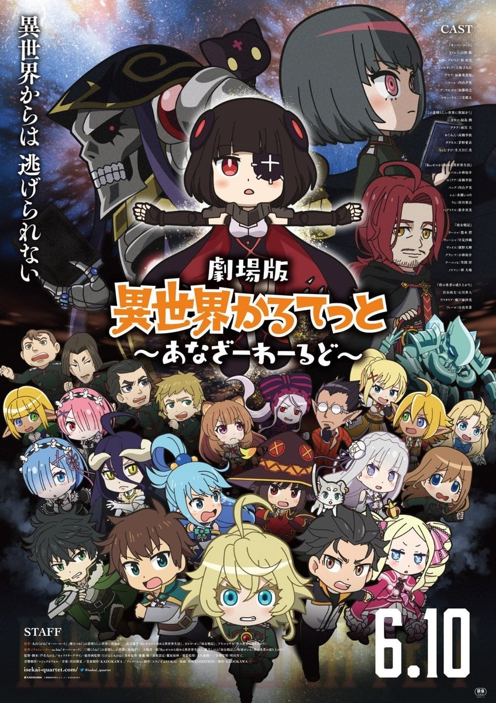
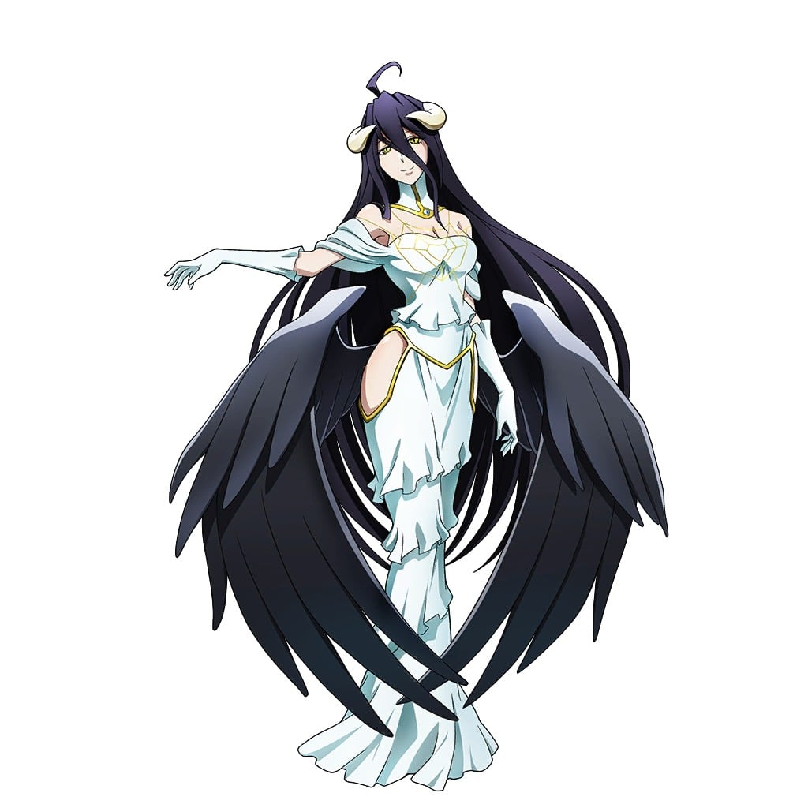
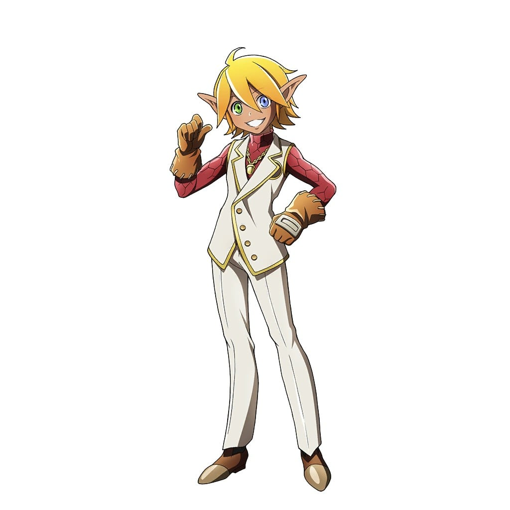

> [!bookinfo|noicon]+ **剧场版 异世界四重奏 ～Another World～**
> 
>
| 日文名 | 劇場版 異世界かるてっと ～あなざーわーるど～ |
|:------: |:------------------------------------------: |
| 类型 | 原创 |
| 新番 | 2022 年 6 月 |
| 集数 | 共1话 |
| 官网 | [http://isekai-quartet.com](https://http://isekai-quartet.com) |
| 制作 | スタジオぷYUKAI |
| 导演 | 芦名みのる |
| 脚本 | 芦名みのる |
| 评分 | 6.6|
| 制片人 |  |

> [!abstract]+ **简介**
> 大人気異世界系作品 『オーバーロード』『この素晴らしい世界に祝福を！』『Re:ゼロから始める異世界生活』『幼女戦記』『盾の勇者の成り上がり』の5作品がぷちキャラアニメになって大暴れ！

TVシリーズ第1期、第2期も大好評を博した『異世界かるてっと』がまさかの映画化！

監督・脚本を芦名みのる、キャラクターデザイン・総作画監督をたけはらみのる、アニメーション制作はスタジオぷYUKAI が担当。

ぷちキャラアニメ界を牽引してきたスタッフ陣が、異世界系ライトノベル5 作品のクロスオーバーアニメーションに挑む！

> [!tip]+ **章节列表**
>- [ ] 第1话： (2022-06-10)

> [!tip]+ **主要角色**
> 
| 角色 | CV | 简介| 角色图片 |
|:----:|:---:|:---:|:--------:|
| アインズ・ウール・ゴウン | 日野聡 | 职位：至高无上的四十一位至尊 住处：纳萨力克地下大坟墓地下第九层的房间 属性：极恶↔正义值:-500 种族：骷髅魔法师(Skeleton Mage)Lv15 死者大魔法师(Elder Lich)Lv10 死之统治者(オーバーロード overlord)Lv5 职业：死灵法师(ネクロマンサー Necromancer)Lv10 巅峰不死者Lv10 持有：十一个世界级道具 公会武器：安兹乌尔恭之杖 <复活魔杖/wand of resurrection>(蘇生の短杖/ワンド・オブ・リザレクション) 无限背包(インフィニティ・ハヴァサック) 在网路游戏「YGGDRASIL」关闭运营的最后，依旧留在游戏中等待系统强制登出时，意外穿越至异世界的本书的主人公。现实世界当中是一名喜欢电玩的普通青年，在游戏中是一名拥有骷髅外表的最强魔法咏唱者，所属「安兹．乌尔．恭」公会。 元角色名音译为“莫莫伽”。 在第一卷中把自己的名字改为安兹·乌尔·恭，作为纳萨里克的象征及核心。 |  |
| アルベド | 原由実 | 职位：纳萨力克地下大坟墓的守护者总管 王妃(自称) 住处：王座之厅 纳萨力克地下大坟墓地下第九层的一个房间 属性：极恶↔正义值：-500 种族：小恶魔（インプ Imp）Lv10 职业：守护者(ガーディアン)Lv10 黑色护卫Lv5 邪恶骑士Lv10 护卫之主Lv5 持有：一个世界级道具 制作者：タブラ・スマラグディナ 由主角公会成员之一翠玉录所创建的NPC，职务为纳萨力克地下大坟墓的守护者总管 性格原本被设定成“贱人”，但飞鼠在游戏关闭运营的最后时刻抱着“反正是最后了”的心情更改为：爱着飞鼠 是主角的得力助手，在所有守护者中防御力最强。 |  |
| シャルティア・ブラッドフォールン | 上坂すみれ | 职位：纳萨力克地下大坟墓地下第一至三层守护者 住处：不明 属性：邪恶~极恶↔正义值：-450 种族：吸血鬼真祖(トゥルー・ヴァンパイア)Lv10 职业：被诅咒的骑士(カースドナイト)Lv5 持有：神器级武器-滴管长枪（能力是生命吸取） 制作者：ペロロンチーノ 守护者之中单挑最强，持有多种特殊能力和生命吸取，异常状态抗性等，令安兹陷入苦战。 |  |
| マーレ・ベロ・フィオーレ | 内山夕実 | 职位：纳萨力克地下大坟墓地下第六层守护者 住处：纳萨力克地下大坟墓地下第六层的大树 属性：中立～恶↔正义值：-100 种族：暗精灵 职业：森林祭司(ドルイド Druid)Lv10 高级森林祭司Lv10 大自然先锋Lv10 灾厄使徒Lv5 森林法师Lv10 制作者：ぶくぶく茶釜 亚乌菈的弟弟（伪娘），守护者中魔法系最强。给人印象胆小怕事，言行吞吞吐吐扭扭捏捏，但其实只是创造主给与的属性，行凶时只有表面的扭捏眼神毫无感情可言。 |  |
| アウラ・ベラ・フィオーラ | 加藤英美里 | 职位：纳萨力克地下大坟墓地下第六层守护者 住处：纳萨力克地下大坟墓地下第六层的大树 属性：中立～恶↔正义值：-100 种族：暗精灵 职业：游击兵Lv5 驯兽师(ビーストテイマー)Lv5 射手Lv5 狙击手Lv5 高级驯兽师Lv10 制作者：ぶくぶく茶釜 马雷的姐姐，假小子性格。拥有多种高级魔兽作为下仆，团战最强的存在。持有广域侦察技能，森林中的王者。 |  |
| デミウルゴス | 加藤将之 | 职位：纳萨力克地下大坟墓地下第七层守护者 住处：纳萨力克地下大坟墓地下第七层赤热神殿 属性：极恶↔正义值：-500 种族：小恶魔（インプ Imp）Lv10 最高阶恶魔(アーチデヴィル Archdevil)Lv5 职业：混沌(カオス)Lv10 黑暗王子Lv10 变形魔(Shapeshifter)Lv10 制作者：ウルベルト・アレイン・オードル 守护者中的军师，各种特殊能力，有着最精明的头脑，时常向安兹提出建言。对纳萨力克的同伴很温柔，些外则非常残忍无道并以此为乐，跟赛巴斯的关系不太好。 |  |
| コキュートス | 三宅健太 | 职位：纳萨力克地下大坟墓第五层守护者 住处：纳萨力克地下大坟墓第五层大白球(Snowball Earth) 属性：中立↔正义值：50 种族：昆虫战士(Insect Fighter)Lv10 虫王(Worm Lord)Lv10 职业：剑圣(ケンセイ)Lv10 阿修罗Lv5 尼福尔海姆骑士Lv5 制作者：武人武御雷 守护者中使用武器最强，武士性格，一根筋的角色。十分憧憬侍奉安兹的后代并陷入联想中。 |  |
| ナツキ・スバル | 小林裕介 | 無知無能にして無力無謀と四拍子欠けた主人公。突如として異世界に召喚され、訳の分からない状況に翻弄される。物怖じしない性質と持ち前の図々しさで、逆境に弱音を吐きつつも過酷な運命に立ち向かっていく。  誕生日は四月一日。誕生花は「カスミソウ」で、花言葉は「清らかな心」です。 |  |
| エミリア | 高橋李依 | 銀髪に紫紺の瞳を持つ美しい少女。お人好しで面倒見の良い性格だが、当人はなぜかそれを素直に認めようとしない。家族同然の猫精霊であるパックをお供に連れており、彼の前でだけ甘えた表情を見せる。 |  |
| パック | 内山夕実 | エミリアと共に行動している精霊。灰色の体毛、まん丸の瞳にピンク色の鼻をした、手のひらに乗るサイズの二足歩行の小猫の姿をしている。 |  |
| ラム | 村川梨衣 | 怪我をしたスバルが運び込まれた屋敷、ロズワール邸で働く双子メイドの姉。傲岸不遜な毒舌担当。炊事洗濯裁縫掃除、全てにおいて妹に劣るステータスの持ち主。 |  |
| レム | 水瀬いのり | 名誉の負傷をしたスバルが担ぎ込まれた屋敷で、雑務全般を一手に担う双子メイドの妹。慇懃無礼な毒舌担当。屋敷の機能が維持されているのは、彼女の有能さが全てといっていい。 |  |