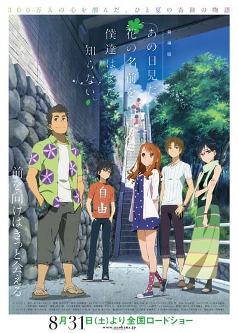
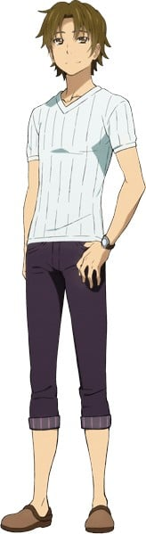
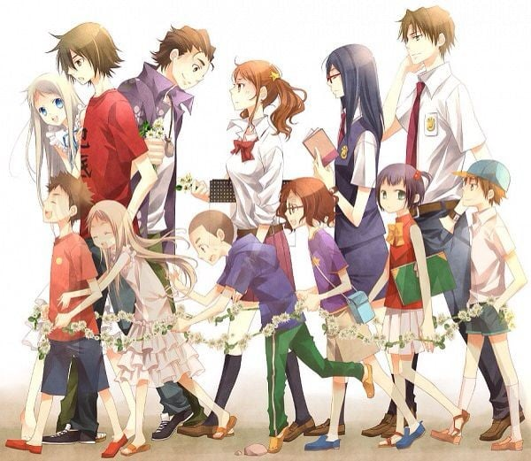

> [!bookinfo|noicon]+ **剧场版 我们仍未知道那天所看见的花的名字。**
> 
>
| 日文名 | 劇場版 あの日見た花の名前を僕達はまだ知らない。 |
|:------: |:------------------------------------------: |
| 类型 | 原创 |
| 新番 | 2013 年 8 月 |
| 集数 | 共1话 |
| 官网 | [http://www.anohana.jp](https://http://www.anohana.jp) |
| 制作 | A-1 Pictures |
| 导演 | 長井龍雪 |
| 脚本 | 岡田麿里 |
| 评分 | 7.1|
| 制片人 |  |

> [!abstract]+ **简介**
> 某天，她突然出现了。

> [!tip]+ **章节列表**
>- [ ] 第1话：剧场版 我们仍未知道那天所看见的花的名字。 (2013-08-31)

> [!tip]+ **主要角色**
> 
| 角色 | CV | 简介| 角色图片 |
|:----:|:---:|:---:|:--------:|
| 本間芽衣子 | 茅野愛衣 | 天真烂漫的吉祥物少女。原“超和平Busters”队员，由于某事故身亡，目前为“幽灵实体化”状态。 |  |
| 宿海仁太 | 入野自由 | 原“超和平Busters”队长，由于某些事情而沉沦为宅，学业也荒废了。 |  |
| 安城鳴子 | 戸松遥 | 看上去很时髦的女高中生。原“超和平Busters”队员，与仁太同班（似乎暗恋仁太）。 |  |
| 松雪集 | 櫻井孝宏 | 原“超和平Busters”队员，似乎暗恋间芽。 |  |
| 鶴見知利子 | 早見沙織 | 原“超和平Busters”队员，优等生，升入重点高中后与三流学校的仁太和鸣子很少往来。 |  |
| 久川鉄道 | 近藤孝行 | 原“超和平Busters”队员，目前的爱好是环球旅行，在日本的时候住在Busters的“秘密基地”。 |  |
| 本間イレーヌ | 緒乃冬華 | 本间芽衣子的母亲。于门牌上的名字是西里尔字母，故有可能是使用西里尔字母的国家出身。在芽衣子死后，只要家里有吃咖喱就会拿一份到佛龛来供奉芽衣子。 |  |
| 宿海塔子 | 大原さやか | 宿海仁太的母亲，在仁太小时因病过世。  擅长做葡萄干蒸糕（蒸面包），时常鼓励昔日超和平Busters的六人。  生病期间超和平Busters也时常来探望她。 |  |
| 超平和バスターズ |  | 由宿海仁太孩童时期组建，成员有本间芽衣子(面码)、安城鸣子(安鸣)、松雪集(雪集)、鹤见知利子(鹤子) 、久川铁道(波波)六人「为了守护世上所有的和平」为目的而组成。集会地点是山上的秘密基地。在芽衣子死后解散。为了恢复昔日友谊而展开此故事。  芽衣子在山丘上走后的每年夏天，超和平Busters剩下的五人会在秘密基地聚会、举行活动，追忆那个如花朵一般的本间芽衣子。 |  |