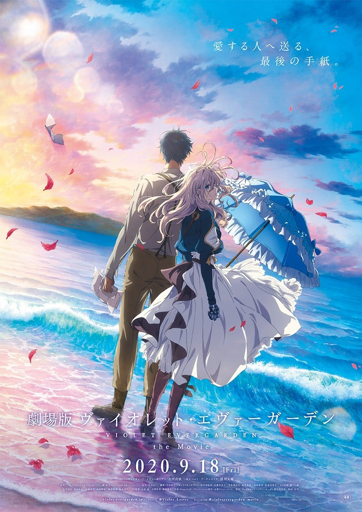
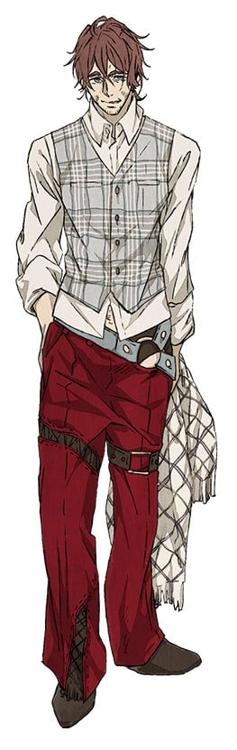
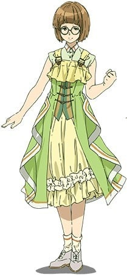
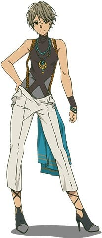
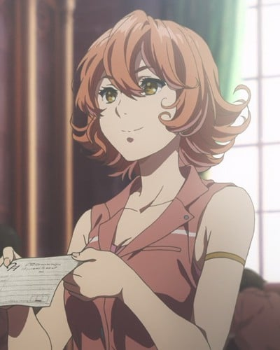

> [!bookinfo|noicon]+ **剧场版 紫罗兰永恒花园**
> 
>
| 日文名 | 劇場版 ヴァイオレット・エヴァーガーデン |
|:------: |:------------------------------------------: |
| 类型 | 小说改 |
| 新番 | 2020 年 9 月 |
| 集数 | 共1话 |
| 官网 | [www.violet-evergarden.jp](https://www.violet-evergarden.jp) |
| 制作 | 京都アニメーション |
| 导演 | 石立太一 |
| 脚本 | 吉田玲子 |
| 评分 | 7.6|
| 制片人 |  |

> [!abstract]+ **简介**
> 从事代笔职业的她，名叫薇尔莉特·伊芙加登。在让人们伤痕累累的战争结束后数年，崭新的时代来临，世界也逐渐恢复平稳，生活也随着新技术的开发而改变，大家都在向前迈进。但是，薇尔莉特每天都在思念“那个人”，她坚信他一定还活着。直到某天，她在邮局的仓库里发现了一封收件人不明的信……

> [!tip]+ **章节列表**
>- [ ] 第1话：剧场版 紫罗兰永恒花园 (2020-09-18)

> [!tip]+ **主要角色**
> 
| 角色 | CV | 简介| 角色图片 |
|:----:|:---:|:---:|:--------:|
| ヴァイオレット・エヴァーガーデン | 石川由依 | 隶属C·H邮政公司的“自动记忆人偶”少女。 与其美貌不相称的是，拥有罕见的战斗力。 幼年时被基尔伯特捡到。有着作为军人的过去。 |  |
| クラウディア・ホッジンズ | 子安武人 | 原是莱丁谢夫特里希国的军人，现任C·H邮政公司的社长。 也作为薇尔莉特的监护人。 爱好打扮，喜欢赌博。 虽然和基尔伯特性格完全不同，两人却是老朋友。 |  |
| ギルベルト・ブーゲンビリア | 浪川大輔 | 莱丁谢夫特里希国陆军军人。 在兄长的要求下，成为薇尔莉特亲人般的存在。 |  |
| ベネディクト・ブルー | 内山昂輝 | CH郵便社に務める配達員（ポストマン）。 ホッジンズとは以前からの知り合いで、雇われ始めてからもぶっきらぼうな態度は変わらない。 |  |
| カトレア・ボードレール | 遠藤綾 | CH郵便社に務める自動手記人形。 指名の絶えない看板ドールで、ホッジンズとは働き始める前から親しい仲だった。 |  |
| エリカ・ブラウン | 茅原実里 | アイリスよりも少し先輩の自動手記人形。 依頼主とのやりとりが苦手で仕事に自信を持てずにいる。 |  |
| アイリス・カナリー | 戸松遥 | CH郵便社に務める新人の自動手記人形。 働く女性に憧れており、仕事で名を上げようと意気込んでいる。 |  |
| ネリネ | 京田尚子 | C·H邮政公司的接待员。 |  |
| ディートフリート・ブーゲンビリア | 木内秀信 |  |  |
| アン・マグノリア |  |  |  |
| クラーラ・マグノリア | 川澄綾子 |  |  |
| デイジー・マグノリア | 諸星すみれ | ヴァイオレットが代筆依頼を受けた際に出会ったアン・マグノリアの孫。アンが亡くなった後、大切に保管された古い手紙を見つけ、自動手記人形――ヴァイオレット・エヴァーガーデンの功績を辿る。 |  |