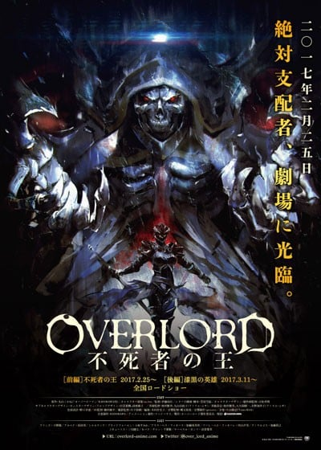

> [!bookinfo|noicon]+ **剧场版总集篇 OVERLORD 不死者之王**
> 
>
| 日文名 | 劇場版総集編 オーバーロード 不死者の王 |
|:------: |:------------------------------------------: |
| 类型 | 小说改 |
| 新番 | 2017 年 2 月 |
| 集数 | 共1话 |
| 官网 |  |
| 制作 | MADHOUSE |
| 导演 | 伊藤尚往 |
| 脚本 | 菅原雪絵 |
| 评分 | 6.4|
| 制片人 |  |

> [!abstract]+ **简介**
> 

> [!tip]+ **章节列表**
>- [ ] 第1话：

> [!tip]+ **主要角色**
> 
| 角色 | CV | 简介| 角色图片 |
|:----:|:---:|:---:|:--------:|
| アインズ・ウール・ゴウン | 日野聡 | 职位：至高无上的四十一位至尊 住处：纳萨力克地下大坟墓地下第九层的房间 属性：极恶↔正义值:-500 种族：骷髅魔法师(Skeleton Mage)Lv15 死者大魔法师(Elder Lich)Lv10 死之统治者(オーバーロード overlord)Lv5 职业：死灵法师(ネクロマンサー Necromancer)Lv10 巅峰不死者Lv10 持有：十一个世界级道具 公会武器：安兹乌尔恭之杖 <复活魔杖/wand of resurrection>(蘇生の短杖/ワンド・オブ・リザレクション) 无限背包(インフィニティ・ハヴァサック) 在网路游戏「YGGDRASIL」关闭运营的最后，依旧留在游戏中等待系统强制登出时，意外穿越至异世界的本书的主人公。现实世界当中是一名喜欢电玩的普通青年，在游戏中是一名拥有骷髅外表的最强魔法咏唱者，所属「安兹．乌尔．恭」公会。 元角色名音译为“莫莫伽”。 在第一卷中把自己的名字改为安兹·乌尔·恭，作为纳萨里克的象征及核心。 |  |
| アルベド | 原由実 | 职位：纳萨力克地下大坟墓的守护者总管 王妃(自称) 住处：王座之厅 纳萨力克地下大坟墓地下第九层的一个房间 属性：极恶↔正义值：-500 种族：小恶魔（インプ Imp）Lv10 职业：守护者(ガーディアン)Lv10 黑色护卫Lv5 邪恶骑士Lv10 护卫之主Lv5 持有：一个世界级道具 制作者：タブラ・スマラグディナ 由主角公会成员之一翠玉录所创建的NPC，职务为纳萨力克地下大坟墓的守护者总管 性格原本被设定成“贱人”，但飞鼠在游戏关闭运营的最后时刻抱着“反正是最后了”的心情更改为：爱着飞鼠 是主角的得力助手，在所有守护者中防御力最强。 |  |