> [!bookinfo|noicon]+ **半田君**
> 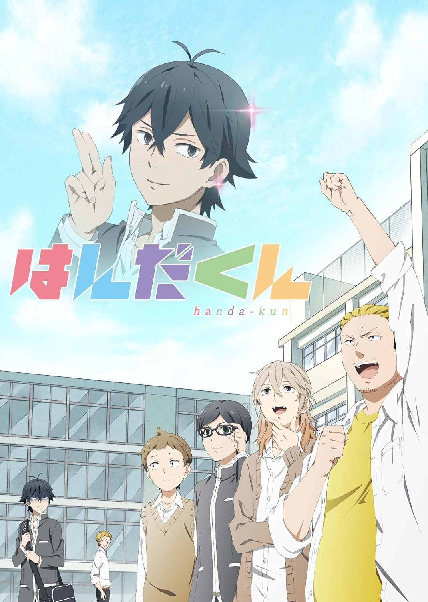
>
| 日文名 | はんだくん |
|:------: |:------------------------------------------: |
| 类型 | 漫改 |
| 新番 | 2016 年 7 月 |
| 集数 | 共12话 |
| 官网 | [http://www.tbs.co.jp/anime/handaanime/](https://http://www.tbs.co.jp/anime/handaanime/) |
| 制作 | diomedéa |
| 导演 | 湖山禎崇 |
| 脚本 | 國澤真理子,平見瞠,横手美智子 |
| 评分 | 6.3|
| 制片人 | 江里口武志、天野翔太,江里口武志,天野翔太 |

> [!abstract]+ **简介**
> 作为知名书法家之子、并以自身之道活跃著的高中生书法家．半田清。
在学校中散发出让人难以接近的气场，
但却又因为他那孤高的魅力，让不少人是为之感到敬佩。
但本人对此却是“我被讨厌了”深信不疑...。

> [!tip]+ **章节列表**
>- [ ] 第1话：半田君与女生的友情 (2016-07-07)
>- [ ] 第2话：半田君与第一集的后续/半田君与班长/半田君与模特 (2016-07-14)
>- [ ] 第3话：半田同学和不来校的学生/半田同学和料理实习/半田同学和挚友 (2016-07-21)
>- [ ] 第4话：半田君和半田君？/半田君和女人的嫉妒/半田君和社交能力 (2016-07-28)
>- [ ] 第5话：半田君和学生会/半田君和失忆 (2016-08-04)
>- [ ] 第6话：半田同学和朋友的朋友/半田同学和飞毛腿东野/半田同学和看手相 (2016-08-11)
>- [ ] 第7话：半田同学和补考/半田同学和图书室 (2016-08-18)
>- [ ] 第8话：半田同学和修学旅行 (2016-08-25)
>- [ ] 第9话：半田同学和青蛙/半田同学和跟踪狂 (2016-09-01)
>- [ ] 第10话：半田同学和平凡/半田同学和美少女 (2016-09-08)
>- [ ] 第11话：半田同学和文化祭准备 (2016-09-15)
>- [ ] 第12话：半田同学和文化祭 (2016-09-22)

> [!tip]+ **主要角色**
> 
| 角色 | CV | 简介| 角色图片 |
|:----:|:---:|:---:|:--------:|
| 半田清舟 | 島﨑信長 | 23歳。清舟は雅号で、本名は「清」（せい）。誕生日は4/15。 書道界の家元の後継ぎ。若き新鋭として名を馳せていたが、入賞作品を書道界の重鎮に酷評されて逆上し、暴力事件を起こす。大事には至らなかったが、父の「頭を冷やして来い」との計らいで単身、五島へ送られる。 プライドが高く、少し気難しい所があるが実は抜けた所が多々あり、面倒見も良い性格。子供の頃「成績は4と5しかとったことがない。」と言っており、習字以外の面でも優秀であることが窺えるが、料理は恐ろしく下手。猫が好きだが、猫アレルギーである。幽霊や虫は苦手。意外と順応力が高い。本人曰く「子供嫌い」だが、子供の扱いは上手い。じゃんけんが弱く、5勝負中5連敗するほどである。植物を育てるのが苦手であり、サボテンすらまともに育て上げたことがない。 学生時代から書道の道に進んでおり、周りからは「孤高の男」としていい意味で噂の中心であったが本人は嫌われていると思っていた。 生まれも育ちも都会のため、島での生活や独特の慣習にしばしば戸惑う生活を送っているが、彼自身も幼少時より書道に専念した生活を送っていたため世間知らずで一部常識に欠ける面があり、逆に島民たちから奇異の目で見られることも多い。 | 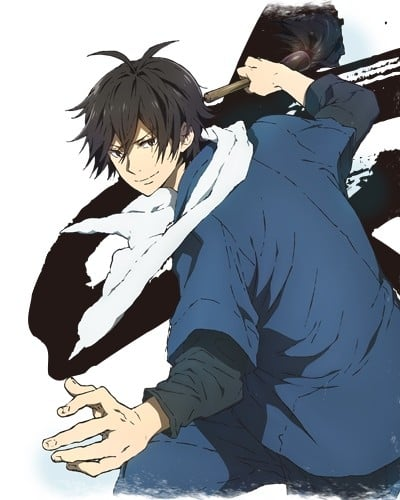 |
| 川藤鷹生 | 興津和幸 | 半田の中学時代からの友人で良き理解者。画商を営む。眼鏡をかけていて、両肩に鷹のタトゥーを入れている。酒に滅法弱い。あっきーを気に入っており、株の相談などを持ちかけている。 | 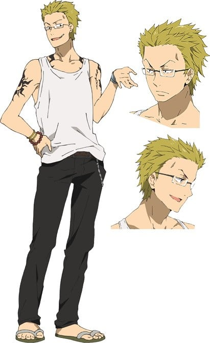 |
| 相沢順一 | 広瀬裕也 | 高校２年生。 学級委員長になることに こだわりを持つ優等生。 | 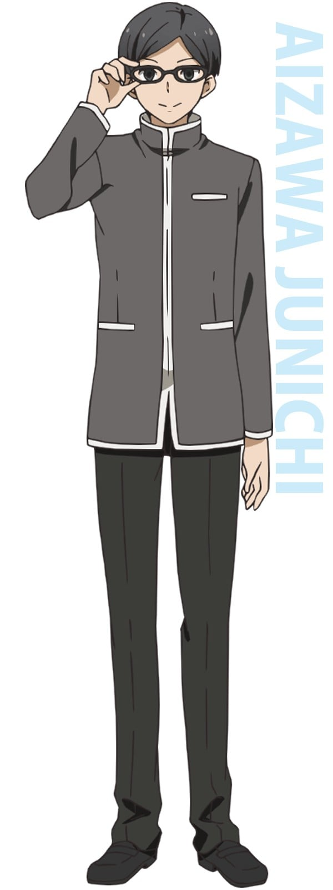 |
| 二階堂礼緒 | 柿原徹也 | 高校2年生。 人気の読者モデルで、 自分はモテると自負している。 | 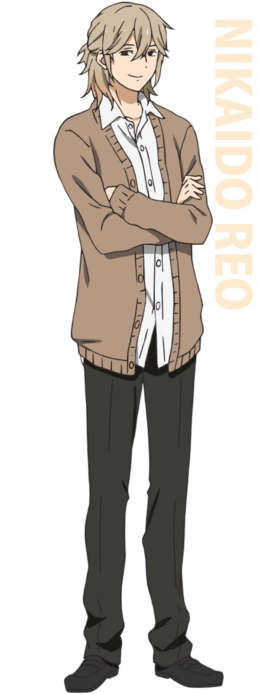 |
| 筒井あかね | 細谷佳正 | 高校2年生。 強面で腕っ節が強く、 不良との諍いも絶えない。 | 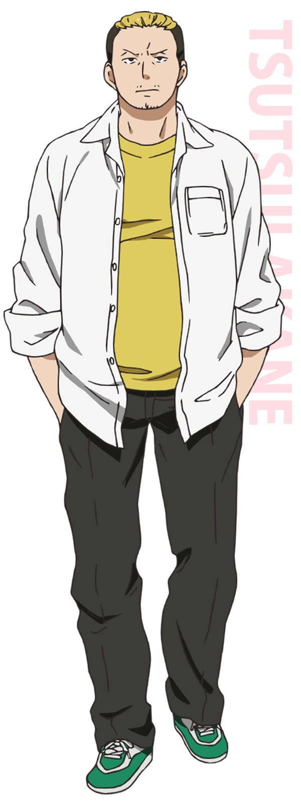 |
| 近藤幸男 | 山下大輝 | 高校2年生。 至って普通の高校生で、 唯一の常識人。 | 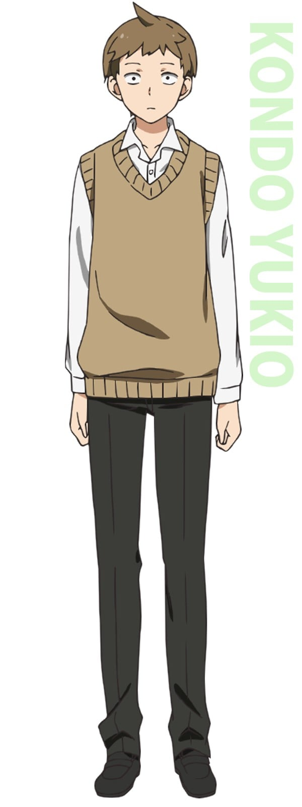 |
| 花田慶 | 白井悠介 | 高校２年生。 半田に強い憧れを持ち、 普段はマスクをしている。 | 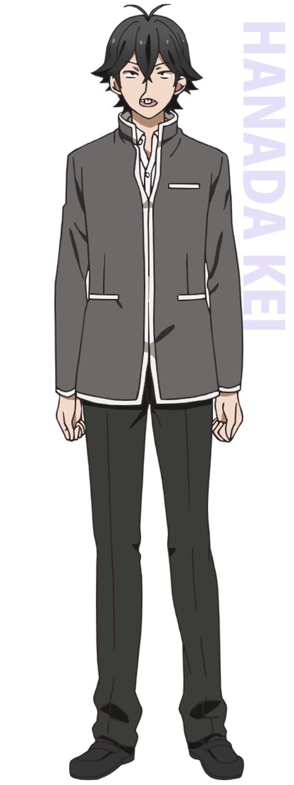 |
| 東野光太郎 | 古川慎 | 高校２年生。 陸上部に所属しており、 なぜか半田に執着している。 | 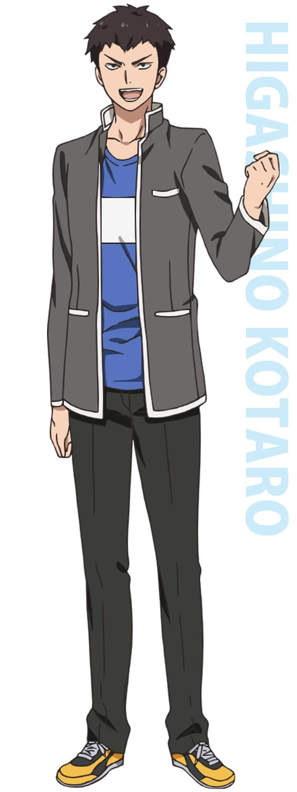 |
| 金城美代子 | 本渡楓 | 高校２年生。 半田の隣の席の女子。 ある出来事が彼女の運命を狂わす。 | 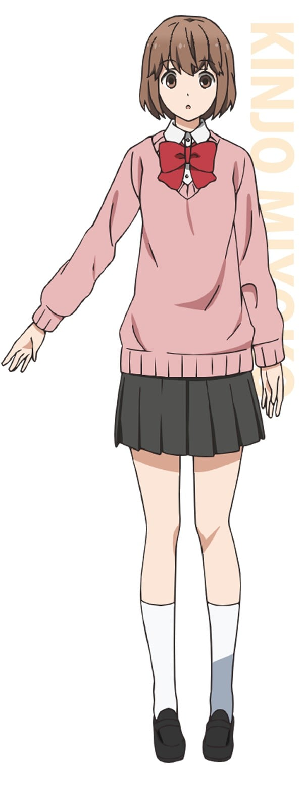 |
| 森麻衣子 | 伊藤美来 | 高校２年生。 自分は可愛いと思っている女の子。 | 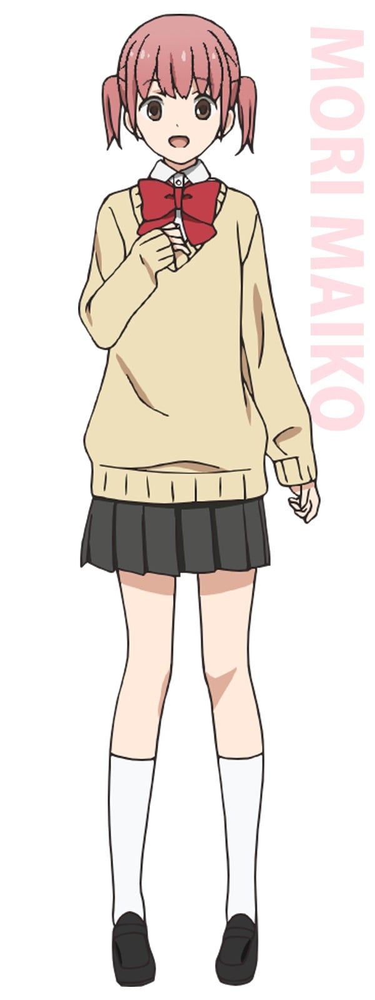 |
| ジュリ | 斉藤貴美子 | 高校２年生。 麻衣子の親友であり、 見た目に似合わず友達思い。 | 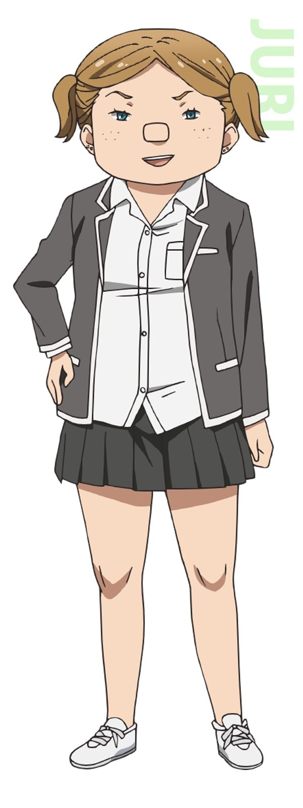 |
| 一宮旭 | 鈴村健一 |  | 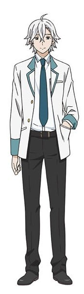 |