> [!bookinfo|noicon]+ **发条精灵战记 天镜的极北之星**
> 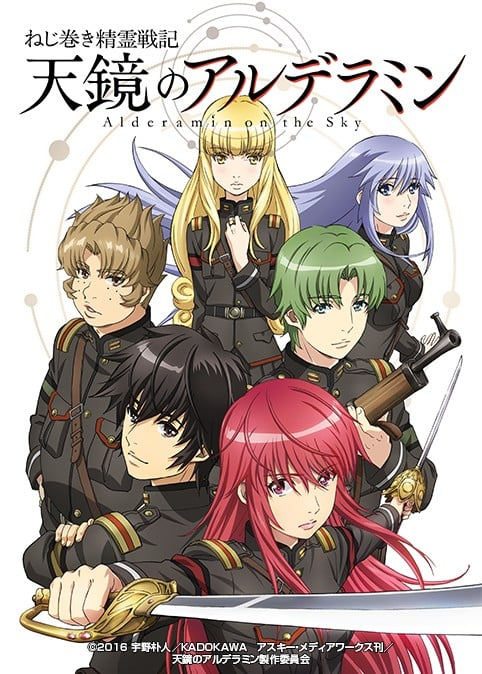
>
| 日文名 | ねじ巻き精霊戦記 天鏡のアルデラミン |
|:------: |:------------------------------------------: |
| 类型 | 小说改 |
| 新番 | 2016 年 7 月 |
| 集数 | 共13话 |
| 官网 | [http://alderamin.net/](https://http://alderamin.net/) |
| 制作 | MADHOUSE |
| 导演 | 市村徹夫 |
| 脚本 | ヤスカワショウゴ,大西信介 |
| 评分 | 6.6|
| 制片人 | 橋本健太郎 |

> [!abstract]+ **简介**
> 这是个精灵与人类结为伙伴共生的世界。
故事背景卡托瓦纳帝国，则是与邻国处于战争状态的大国。
少年伊库塔在外人眼中，一向是个爱睡午觉、游手好闲、性喜渔色的家伙，而这样的“懒惰鬼”正因为某些内情，不情不愿的准备参加高等军官甄试。
在当时，没有任何人预料到这样的他，日后竟摇身一变，成为帝国史上首屈一指的名将！
以身为军人的卓越才能，在战乱四起的世界里努力求生的少年，伊库塔。
本作正是描述他波涛汹涌的至今生涯，一场盛大的奇幻战记即将在此揭幕！

> [!tip]+ **章节列表**
>- [ ] 第1话：暴风雨般的邂逅 (2016-07-08)
>- [ ] 第2话：无可奈何的奖赏 (2016-07-15)
>- [ ] 第3话：高等军官学校的骑士团 (2016-07-22)
>- [ ] 第4话：永灵树的看门狗们 (2016-07-29)
>- [ ] 第5话：二人齐心 (2016-08-05)
>- [ ] 第6话：在神的阶梯之下 (2016-08-12)
>- [ ] 第7话：卡托瓦纳北域动乱 (2016-08-19)
>- [ ] 第8话：终究，会第三次 (2016-08-26)
>- [ ] 第9话：浅薄颜面的去向 (2016-09-02)
>- [ ] 第10话：拉・赛亚・阿尔德拉民 (2016-09-09)
>- [ ] 第11话：常怠VS不眠 (2016-09-16)
>- [ ] 第12话：收割亡灵者 (2016-09-23)
>- [ ] 第13话：在黄昏的帝国 (2016-09-30)

> [!tip]+ **主要角色**
> 
| 角色 | CV | 简介| 角色图片 |
|:----:|:---:|:---:|:--------:|
| イクタ・ソローク | 岡本信彦 | 本书主角，初登场时为17岁，军衔为准尉。第三集晋升中尉。 兴趣是午睡和泡妞，每天总是游手好闲，看起来极为懒惰散漫的少年。 | 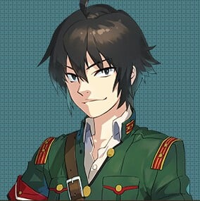 |
| ヤトリシノ・イグセム | 種田梨沙 | 女主角之一，昵称为雅特丽，17岁，军衔为准尉。与伊库塔同在第三集晋升为中尉。 旧军阀名门“伊格塞姆”家的长女，是个文武双全，个性强韧刚直的少女。和伊库塔相反，由于出身的缘故，对皇族有着绝对的忠诚心。 |  |
| トルウェイ・レミオン | 金本涼輔 | 17岁，军衔为准尉。第三集晋升少尉，并于第四集晋升为中尉。 旧军阀名家“雷米翁”家的三子，是个如阳光般爽朗、个性温柔、纯情的美男子，即使是很讨厌美男子的伊库塔也不否认他是个天生少根筋的好人。 | 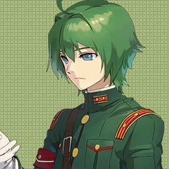 |
| マシュー・テトジリチ | 間島淳司 | 17岁，军衔为准尉。与托尔威和哈洛玛于第三集晋升少尉。 旧军阀家族“泰德基利奇”家的长子。圆滚滚的发福身材与一张圆脸是其特征，然而虽是这样的身材，却没有不擅长运动。有着比旁人还要强一倍的出人头地的欲望。 | 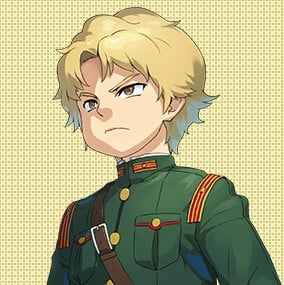 |
| ハローマ・ベッケル | 千菅春香 | 19岁，昵称为哈洛，军衔为准尉。与马修和托尔威于第三集晋升少尉。 出身自佃农家庭，家中人口不少，因此想透过从军来出人头地让家中开销得以缓解。 | 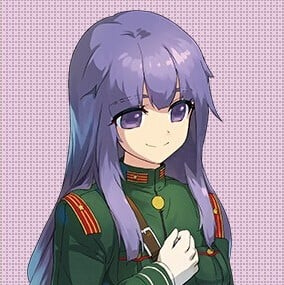 |
| シャミーユ・キトラ・カトヴァンマニニク | 水瀬いのり | 本作的女主角之一，卡托瓦纳帝国的第三公主，12岁。皇族中少有的对帝国腐朽的现况十分清楚的人，并想改革但有心无力。 于高级军官测验时偷偷上船，结果与伊库塔等人同样遭遇船难被救，之后更靠伊库塔的智谋成功回到帝国。然后利用机会让伊库塔一行成为帝国骑士来拉拢为自己的一方。 |  |
| クス | 鈴木絵理 | 伊库塔的光精灵。 | 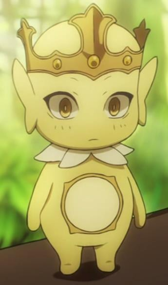 |
| ネジフ・ハルルム | 野瀬育二 |  | 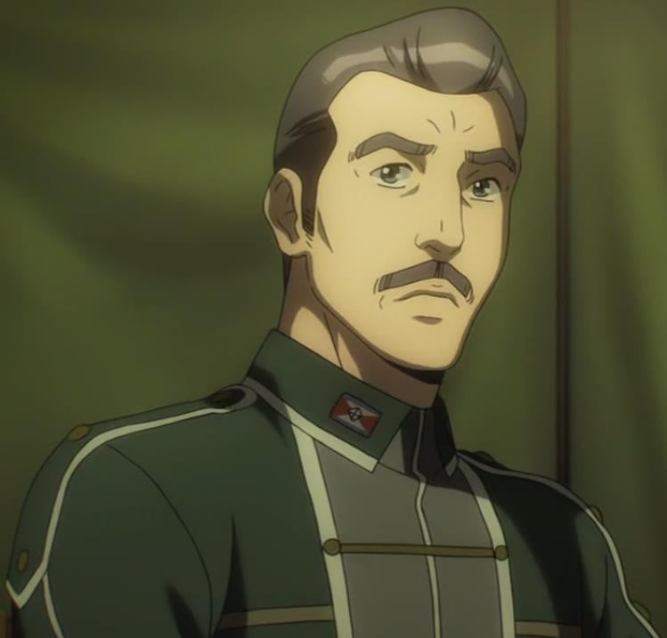 |
| ハザーフ・リカン | 楠見尚己 | 东域镇台司令。卡托瓦纳帝国陆军中将，是个受到部下敬仰的名将。 | 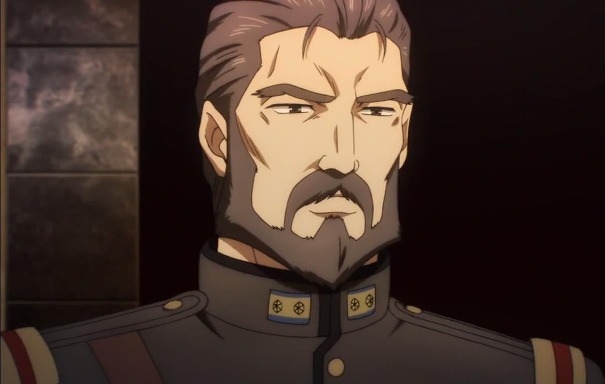 |
| アルシャンクルト・キトラ・カドヴァンマニニク | 田中完 | 卡托瓦纳帝国的皇帝，四十多岁，但沉溺酒色多年，看起来已有六七十岁一样，精神与肉体皆已腐败到极点。 | 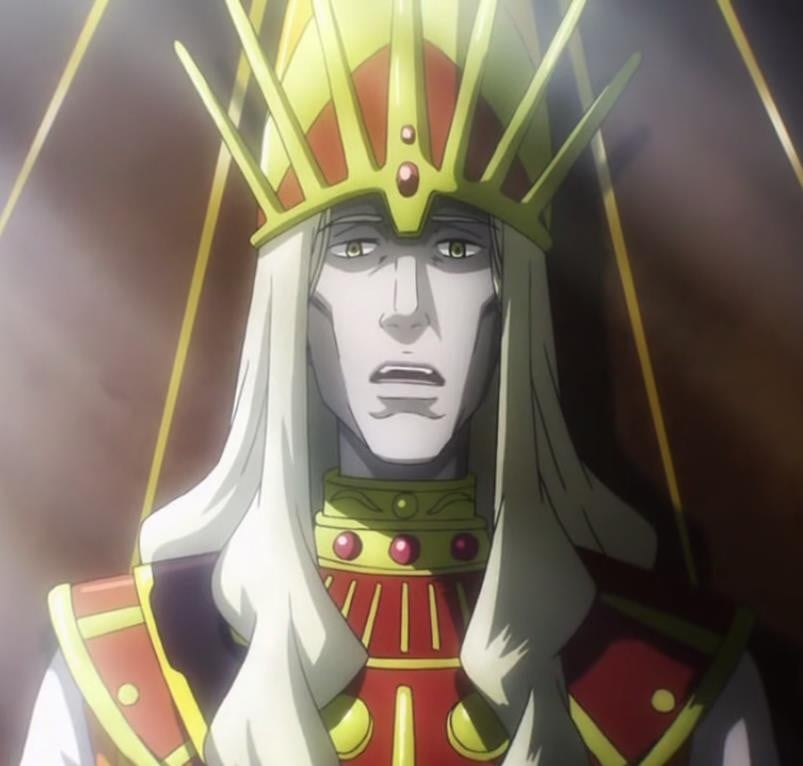 |
| サリハスラグ・レミオン | 子安武人 | 卡托瓦纳帝国陆军上尉，雷米翁家长男。 | 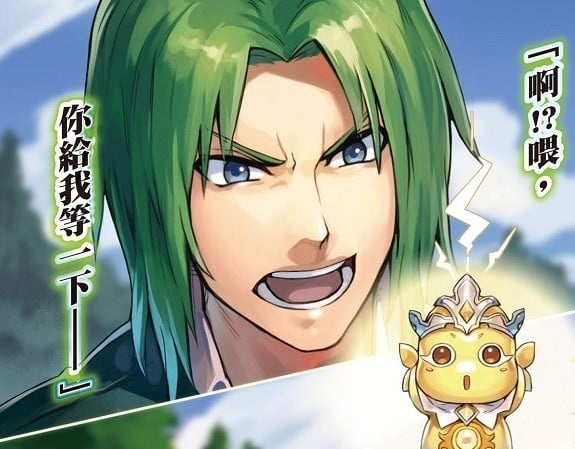 |
| スシュラフ・レミオン | 武内駿輔 | 卡托瓦纳帝国陆军中尉，雷米翁家次男。 留着平头，体格高大壮硕，配有特大口径风枪。 | 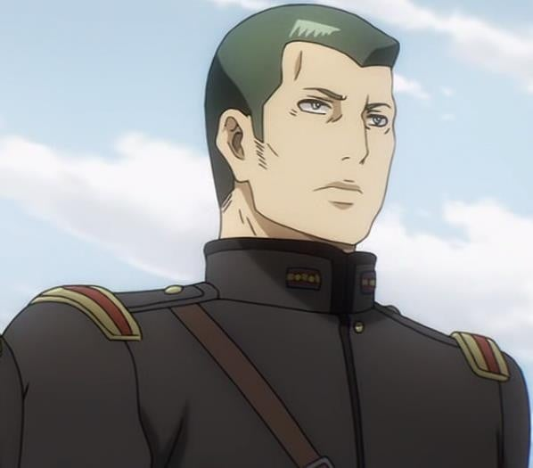 |