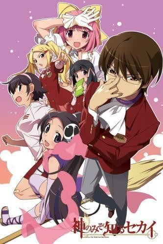
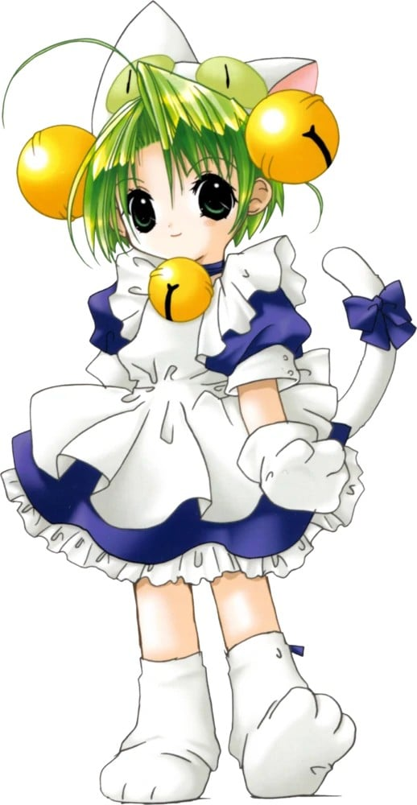
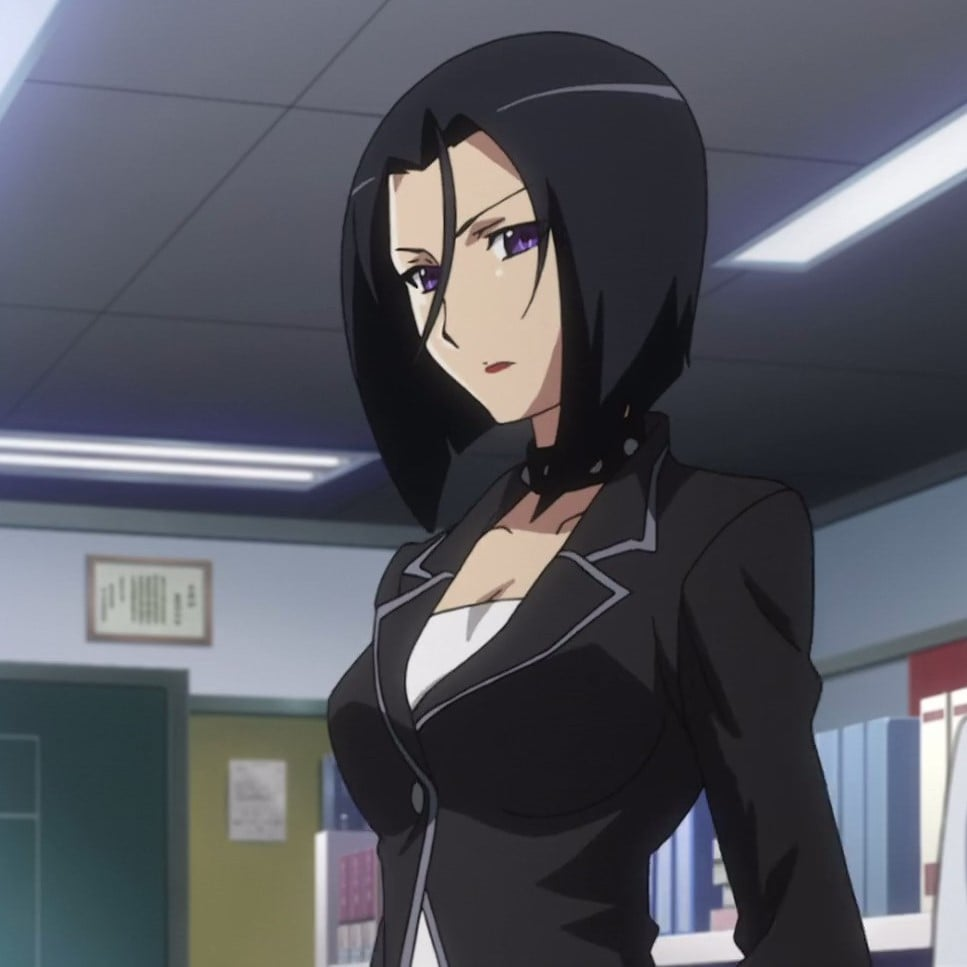
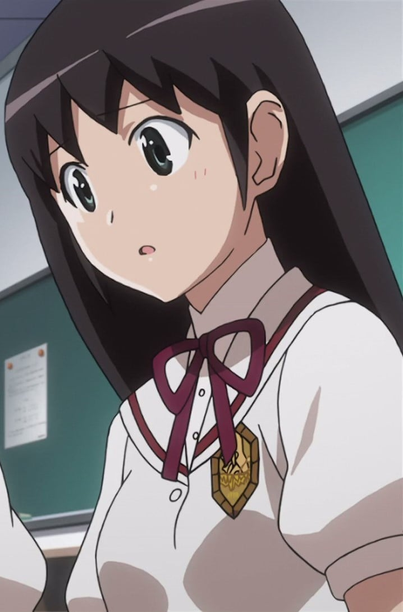

> [!bookinfo|noicon]+ **只有神知道的世界**
> 
>
| 日文名 | 神のみぞ知るセカイ |
|:------: |:------------------------------------------: |
| 类型 | 游戏改 |
| 新番 | 2010 年 10 月 |
| 集数 | 共12话 |
| 官网 | [http://kaminomi.jp](https://http://kaminomi.jp) |
| 制作 | Manglobe |
| 导演 | 高柳滋仁 |
| 脚本 | 髙橋龍也,倉田英之,若木民喜 |
| 评分 | 7.2|
| 制片人 | 工藤博,河内山隆,河内山隆、工藤博 |

> [!abstract]+ **简介**
> 舞岛学园的桂木桂马是个喜欢玩恋爱模拟游戏——也就是Galgame——的高中生。他有着无论怎样的女性（限定Galgame中的二次元可攻略角色）都能攻略的技巧，在游戏界中被称为“攻陷之神”；而他本人也比谁都深爱着这些二次元美少女们。

某日，桂马意外地与恶魔订下契约，眼前出现了一位从遥远的地狱来到这里的恶魔少女艾鲁西。她的目的是拜托桂马帮忙捕获从地狱逃走的“驱魂”。驱魂会躲藏在女性的内心空隙，而填满内心空隙、赶出驱魂的其中一个方法就是“恋爱”。在不履行契约就会身首异处的威胁下，二次元的攻陷之神开始了未曾挑战过的三次元女性攻略之路。

> [!tip]+ **章节列表**
>- [ ] 第1话：FLAG 1.0 世界因爱而转动 (2010-10-06)
>- [ ] 第2话：FLAG 2.0 就连恶魔也是妹妹／FLAG 2.5 BABY YOU ARE A RICH GIRL (2010-10-13)
>- [ ] 第3话：FLAG 3.0 DRIVE MY CAR／FLAG 3.5 派对就是如此 (2010-10-20)
>- [ ] 第4话：FLAG 4.0 当今即是圣战 (2010-10-27)
>- [ ] 第5话：FLAG 5.0 IDOL BOMB!! (2010-11-03)
>- [ ] 第6话：FLAG 6.0 我平凡吗？ (2010-11-10)
>- [ ] 第7话：FLAG 7.0 Shining Star (2010-11-17)
>- [ ] 第8话：FLAG 8.0 Coupling with with with with (2010-11-24)
>- [ ] 第9话：FLAG 9.0 一面高墙的里外 (2010-12-01)
>- [ ] 第10话：FLAG 10.0 我心中的…… (2010-12-08)
>- [ ] 第11话：FLAG 11.0 结束之日 (2010-12-15)
>- [ ] 第12话：FLAG 12.0 神以上，人类未满 (2010-12-22)

> [!tip]+ **主要角色**
> 
| 角色 | CV | 简介| 角色图片 |
|:----:|:---:|:---:|:--------:|
| 桂木桂馬 | 下野紘 | 外号“攻陷之神（落とし神）”的Galgame达人高中生。到目前为止已攻下10000名女角，玩的游戏接近5000部。  只喜欢二次元的女性。上课时都在玩Galgame，但是成绩相当优异。同学都称他为“眼镜宅男（オタメガネ）”。  因为回了大骷髅寄过来的邮件而与恶魔契约，成为帮助捕获“驱魂”的“协力者”。活用Galgame的知识攻下现实的女性。  爱用的游戏机是PFP。  口头禅是“我已经看到结局了”。 |  |
| 青山美生 | 悠木碧 | 社长的女儿。将桂马和其他同学称作「平民」。 1年前父亲死後，公司落入别人手中，现在过著贫穷的生活。一直无法忘记父亲的教诲「不要忘记作为社长女儿的骄傲」。 桂马说「像猫的眼睛、光泽鲜亮的双马尾、身材娇小，典型的傲娇角色。」 攻略过後，改变了想法而开始在面包店打工。 在结篇桂马利用结的身份确认其没有女神寄宿。 |  |
| エリュシア・デ・ルート・イーマ | 伊藤かな恵 | 新恶魔，隶属于地狱的冥界法治省极东支局的“驱魂队”，阶级为三等公务魔。在进入驱魂队之前当了300年的地狱扫除人员，目前是驱魂队的新人。头上戴有骷髅的发饰，这个发饰也是驱魂探测器，身上缠着的羽衣可以变化成各种东西，覆盖自己可以隐藏气息不让他人查觉。总是随身带着一把扫把，因为一旦离开身边会感到不自在。300年的扫除经验让艾鲁西会习惯性的打扫且技术非常完美。有着傻乎乎的性格，既冒失有时候还是个爱哭鬼，令桂马曾对恶魔有很强烈的误解，桂马将她称为“BUG恶魔”。     为了方便和桂马一起行动，假装成桂马父亲的私生女（此事引起桂马母亲的强烈误会，让她想和桂马父亲离婚，由于桂马父亲出差尚未回国，真相至今仍然无法揭开。），和桂马同住在一个屋檐下。并以桂马妹妹的身分转入桂马班上，目前已经相当习惯人间的生活。     非常的敬重桂马，听到别人对桂马的歧视会感到不高兴。起初假扮成桂马的异母妹妹时，被桂马的B.M.W.定义给反对。尽管如此，最后在艾鲁西的各种努力下还是让桂马认同艾鲁西能够成为他的妹妹。会有着上课时传字条给桂马的可爱举动，也可以从字条的内容看出艾鲁西对桂马的感情非常微妙。对于桂马拿自己当练习告白的对象会非常的害羞且不知所措。称呼桂马为“神大人”或“神大人哥哥”。     在刊篇时看到消防车的介绍之后不知为何对其着迷，之后一看到消防车就会陷入狂热状态。 |  |
| 高原歩美 | 竹達彩奈 | 陸上部でハードル走を種目とする明るく活発な女の子。 つねに前に向かって突っ走っている陸上少女だったが、 あることがきっかけで駆け魂にとり憑かれてしまう。 桂馬のことを「オタメガネ」と呼ぶ。 |  |
| 中川かのん | 東山奈央 | 　　舞岛学园高中2年B组的女高中生，16岁的现役新人偶像。桂马在现实世界的第三个攻略对象。 　　因为偶像的工作忙碌而很少去学校，但一旦去上学时就会有很多学生准备相机，相当有人气。 　　其实以前因为个性和外表朴素，所以不引人注目，组建过乐队不过后来解散了，所以一直没有自信。受到驱魂的影响时，心情低沉时身体会变透明。 　　体内有名叫阿波罗的女神。 　　被攻略时第一次认识桂马，记忆被消除后对于自己对桂马有印象感到疑惑(被攻略其间的记忆是她在再次认识桂马前对桂马的所有记忆)，因为当时的记忆确实是消除了，但是在阿波罗出现后，被消除的记忆慢慢苏醒了，记得桂马做过的一切和记得曾与桂马Kiss，对桂马有好感。  关于名字： 　　连载初期名为西原かのん，单行本发行时作者为其更名为中川かのん。由于未给出かのん的汉字写法，故台版取音译“加侬”，而港版则取意译“花音”。 　　另外曾被问及如把名字汉字化会用华音或奏音，作者回答选用奏音。（Twitlog发言纪录） |  |
| 汐宮栞 | 花澤香菜 | 本を愛し、本の世界に生きる図書委員の女の子。 大人しくて控えめ、ヒトと話すのが苦手だけど、 心の中ではとってもおしゃべり？ いつも不思議な本を読んでいる。 |  |
| 飛鳥空 | 櫻井智 | 恋愛シミュレーションゲーム「くれよん」のヒロイン。 バグだらけで作られてしまったゲームの為に、 無限ループする劇中に閉じ込められてしまった不遇な美少女。 |  |
| デ・ジ・キャラット |  | 本名Chocola（法文：意指巧克力），Di Gi Charat星（数码星）的公主，有著腹黑的性格。可以从眼睛发射出“目からビーム”（眼睛射线／眼部火焰炮）。因为怀念母星Di Gi Charat而改名为与母星同名。说话时句尾会加上“Nyo”（喵）。  Di Gi Charat（日语：デ・ジ･キャラット；又译滴骰孖妹（香港无线电视）、铃铛猫娘（香港译名）、叮当小魔女（台湾译名））是Broccoli为其角色精品店所做的角色企画，原作者是小夏钝帆。由于其独特的造型，很快就成为了Broccoli的精品连锁店GAMERS的吉祥物，因大受欢迎亦被多次改编动画、电子游戏等。  デ・ジ・キャラット / ショコラ 声 - 真田アサミ（初代） / 明坂聡美（2代目） 本作の主人公。デ・ジ・キャラット星からやってきた王女様。通称「でじこ」。「フロムゲーマーズ」準備号（平成10年7月発行）で初登場。四コマ漫画「げまげま」に初登場したのは「フロムゲーマーズ」第壱号（平成10年8月発行）。準備号時点では名前がなく、「フロムゲーマーズ」第一号で名前と通称が決定した。 白猫の帽子に尻尾。ライトグリーンの髪で、髪飾りに大きな鈴（王家の印）を左右に1つずつ付ける。 語尾に「にょ」を付けて話す（ドラマCD版では「にゃ」と言っていたこともある）。この語尾について、ファンの間で「最初期の設定では『〜なんよ』であったが、キーボードで打つ際のミスタイプにより『〜なにょ』になり、それが定着した」という噂があったが、制作側はこの噂の存在を認めつつも、ネーム作成の時点ではパソコンが使用されないことを理由として公式に否定している。【注釈——「Di Gi Charat DVD-BOX すぺしゃるパーティー」 Disc10 Chapter1 において、ファンの間に噂があることを認め、またそれを明確に否定している。】 『CDドラマ デ・ジ・キャラットそにょ2』で本名が『ショコラ』だと判明。CDドラマだとデ・ジ・キャラット星から脱出する際に、父から王位継承者の証として『デ・ジ・キャラット』の名を授かっている。地球に降り立った後、ゲーマーズ社長にデ・ジ・キャラットは長いという理由で「でじこ」とあだ名を付けられた。【注釈——「CDドラマそにょ2」の過去の話で「ショコラ」と呼ばれている。ただし地球に降り立ってすぐに（CD「トラック2」の2分45秒進んだ所）ゲマの「待つゲマ～、でじこ～!!」という台詞がある。しかし、その他の過去のシーンでは全て「ショコラ」呼びなので、この段階での「でじこ」という発言は間違いだと考えられる。ちなみに、その後ゲーマーズ社長に「デ・ジ・キャラットは長いから縮めてでじこちゃんに」と言われて、「でじこ!?」と驚いているシーンが存在するので、やはりその前のシーンで「でじこ」呼びしているのは矛盾している。】 地球にやって来た目的は「大女優を目指すため」と「アナローグ星のデ・ジ・キャラット星襲撃から逃げるため」の2つあるが、実は両方ともが公式設定であり、作品によって異なる。 得意技は「目からビーム」で、好きな食べ物はブロッコリー。 外見とは裏腹に生意気、狡猾、そして迂闊な性格が一番の魅力。当初は「巨大化する」という設定があった（原作本等では「公然の裏設定」としてときどき使われる）。『ぱにょぱにょデ・ジ・キャラット』では小悪魔的な性格と打って変わって、好奇心旺盛で人助けに尽力する純粋な善人として描かれている。『デ・ジ・キャラットにょ』ではまねきねこ商店街で暮らす事になっているが、大抵の設定では秋葉原のゲーマーズにて女優を目指しながら働いている。『～ファンタジー』では記憶喪失になった。夏や冬にはコミケに走り、いおりん本を買いあさる。最近では業界に慣れたのか、当人も同人誌を描いていたりする。ワンダフル版アニメ第7話ではムラタクとミナタクをネタにした「やばい同人誌」を描こうとし、ゲマに咎められていた。 初代のでじこ（緑色の瞳）はいくつかのパターンがあってそれぞれについての繋がりの矛盾が言及された事は無いが2代目でじこ（赤い瞳）とは明確に別人であり、初代でじこが既にデ・ジ・キャラット星に帰っていてゲーマーズを統括しているという形だが、2代目は初代からアニブロゲーマーズを任された、という展開となっている。 2代目の正体は（株）ブロッコリーの女神と名乗る少女「ブロッコデス」。初代でじこが帰郷した際、留守を預かっていた。   《panyo panyo》中：思い込みが激しく、人が困っているのを黙って見ていられない性格。でもどこか抜けているので、大体失敗…。信念は｢みんなを幸せにする！｣こと。実はデ・ジ・キャラット星のお姫さま。 |  |
| 桂木麻里 | 柚木涼香 | 桂馬の母親。自宅を兼ねた喫茶店「カフェ・グランパ」を経営している。一児の母とは思えない程スタイルが良い。姑との関係は良好だが、舅との関係は悪い。 現在は非常に朗らかな性格であるが、かつては「峠の雪女」と呼ばれた元暴走族。そのため一度キレるとかつての凶暴な一面を垣間見せることがある。普段は髪をアップに結い眼鏡をかけているが、キレると髪留めと眼鏡をはずす癖がある。 夫は職業柄取材で日本国外へ出張することが多く、ドクロウ入魂の偽手紙のせいでエルシィを夫の隠し子だと信じ切ってしまい夫とは離婚する構えを取っていた。しかしFLAG.118で夫の急病の報（実は桂馬が流した偽情報）を受け出張先へ急遽出立する場面が描かれたり、アニメ第2期FLAG.8.5でも夫への愛情が描かれたりしている。 母を亡くした（ことになっている）エルシィに対して「面倒を見る」と自分や桂馬との同居を認めるなど懐の深い一面を見せている。また、そんなエルシィのことを「エルちゃん」と呼んで実の娘のように可愛がっている一面もある。 |  |
| 若木 | 若木民喜 |  |  |
| 二階堂ゆり | 田中敦子 | 舞島学園高等部的教师 主角所在2年B组的班主任 |  |
| 寺田京 |  | 2年B组学生 |  |