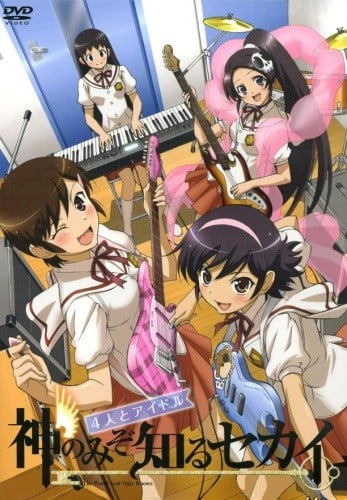
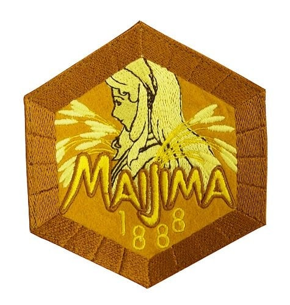

> [!bookinfo|noicon]+ **只有神知道的世界 四人与偶像**
> 
>
| 日文名 | 神のみぞ知るセカイ 4人とアイドル |
|:------: |:------------------------------------------: |
| 类型 | 漫改 |
| 新番 | 2011 年 9 月 |
| 集数 | 共1话 |
| 官网 | [http://kaminomi.jp](https://http://kaminomi.jp) |
| 制作 | Manglobe |
| 导演 | 高柳滋仁 |
| 脚本 | 倉田英之 |
| 评分 | 6.8|
| 制片人 | 河内山隆 |

> [!abstract]+ **简介**
> ＴＶアニメの後の世界を描いた完全新作ＯＶＡがコミックス１４巻に付いてくる!!　新たなＯＰ、ＥＤを携えて桂馬が、エルシィが大活躍!!　気になるストーリーは、かつて桂馬が攻略した少女、ちひろが結成したガールズバンド２Ｂpencilsによる青春ストーリー!!　さらにあのアイドルかのんも新曲と共に登場だ!!

> [!tip]+ **章节列表**
>- [ ] 第1话：

> [!tip]+ **主要角色**
> 
| 角色 | CV | 简介| 角色图片 |
|:----:|:---:|:---:|:--------:|
| 桂木桂馬 | 下野紘 | 外号“攻陷之神（落とし神）”的Galgame达人高中生。到目前为止已攻下10000名女角，玩的游戏接近5000部。  只喜欢二次元的女性。上课时都在玩Galgame，但是成绩相当优异。同学都称他为“眼镜宅男（オタメガネ）”。  因为回了大骷髅寄过来的邮件而与恶魔契约，成为帮助捕获“驱魂”的“协力者”。活用Galgame的知识攻下现实的女性。  爱用的游戏机是PFP。  口头禅是“我已经看到结局了”。 |  |
| エリュシア・デ・ルート・イーマ | 伊藤かな恵 | 新恶魔，隶属于地狱的冥界法治省极东支局的“驱魂队”，阶级为三等公务魔。在进入驱魂队之前当了300年的地狱扫除人员，目前是驱魂队的新人。头上戴有骷髅的发饰，这个发饰也是驱魂探测器，身上缠着的羽衣可以变化成各种东西，覆盖自己可以隐藏气息不让他人查觉。总是随身带着一把扫把，因为一旦离开身边会感到不自在。300年的扫除经验让艾鲁西会习惯性的打扫且技术非常完美。有着傻乎乎的性格，既冒失有时候还是个爱哭鬼，令桂马曾对恶魔有很强烈的误解，桂马将她称为“BUG恶魔”。     为了方便和桂马一起行动，假装成桂马父亲的私生女（此事引起桂马母亲的强烈误会，让她想和桂马父亲离婚，由于桂马父亲出差尚未回国，真相至今仍然无法揭开。），和桂马同住在一个屋檐下。并以桂马妹妹的身分转入桂马班上，目前已经相当习惯人间的生活。     非常的敬重桂马，听到别人对桂马的歧视会感到不高兴。起初假扮成桂马的异母妹妹时，被桂马的B.M.W.定义给反对。尽管如此，最后在艾鲁西的各种努力下还是让桂马认同艾鲁西能够成为他的妹妹。会有着上课时传字条给桂马的可爱举动，也可以从字条的内容看出艾鲁西对桂马的感情非常微妙。对于桂马拿自己当练习告白的对象会非常的害羞且不知所措。称呼桂马为“神大人”或“神大人哥哥”。     在刊篇时看到消防车的介绍之后不知为何对其着迷，之后一看到消防车就会陷入狂热状态。 |  |
| 高原歩美 | 竹達彩奈 | 陸上部でハードル走を種目とする明るく活発な女の子。 つねに前に向かって突っ走っている陸上少女だったが、 あることがきっかけで駆け魂にとり憑かれてしまう。 桂馬のことを「オタメガネ」と呼ぶ。 |  |
| 中川かのん | 東山奈央 | 　　舞岛学园高中2年B组的女高中生，16岁的现役新人偶像。桂马在现实世界的第三个攻略对象。 　　因为偶像的工作忙碌而很少去学校，但一旦去上学时就会有很多学生准备相机，相当有人气。 　　其实以前因为个性和外表朴素，所以不引人注目，组建过乐队不过后来解散了，所以一直没有自信。受到驱魂的影响时，心情低沉时身体会变透明。 　　体内有名叫阿波罗的女神。 　　被攻略时第一次认识桂马，记忆被消除后对于自己对桂马有印象感到疑惑(被攻略其间的记忆是她在再次认识桂马前对桂马的所有记忆)，因为当时的记忆确实是消除了，但是在阿波罗出现后，被消除的记忆慢慢苏醒了，记得桂马做过的一切和记得曾与桂马Kiss，对桂马有好感。  关于名字： 　　连载初期名为西原かのん，单行本发行时作者为其更名为中川かのん。由于未给出かのん的汉字写法，故台版取音译“加侬”，而港版则取意译“花音”。 　　另外曾被问及如把名字汉字化会用华音或奏音，作者回答选用奏音。（Twitlog发言纪录） |  |
| 小阪ちひろ | 阿澄佳奈 | 舞岛学园高中2年B组女生。桂马在现实世界的第六个攻略对象。步美的好朋友。 桂马说“现实女中的现实女”。非常普通的女孩，没什么特别的专长，对于人生也没什么目标。 喜欢帅哥，却是见一个爱一个。在告白被甩后，很快就会忘掉，接着马上再寻找下一个目标。 被攻略过后想要组个乐团。是主唱兼吉他手。 与艾鲁西、步美、京组成轻音社团。正为了秋天的舞高季努力中。 在被攻略期间的记忆被消除后依然对桂马有好感（本人对此感到疑惑）。 在加侬遇袭后被桂马列入“女神候补”，现正“再攻略”中。154话中虽然被桂马说不用来，放学后自行去桂马家后门，在浅间无意的接引下来观看病情。浑然不知步美在桂马家里躲著，在桂马面前演奏新曲后离开。离去前在门后对桂马告白（桂马假装没听到），回家途中接到步美的手机电话，被步美鼓励说:‘这次感情是真的，我会为你加油的。因此让千寻怀疑步美在桂马家。 |  |
| 寺田京 | 近村望実 | 2年B组学生 |  |
| 私立舞島学園高校 |  |  |  |