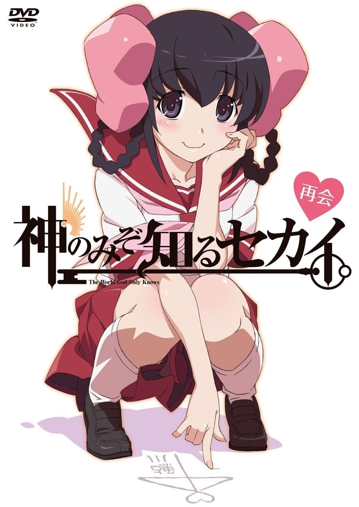
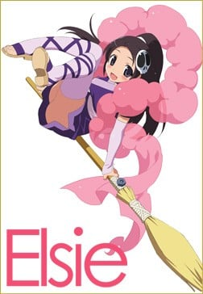

> [!bookinfo|noicon]+ **只有神知道的世界 天理篇**
> 
>
| 日文名 | 神のみぞ知るセカイ 天理篇 |
|:------: |:------------------------------------------: |
| 类型 | 漫改 |
| 新番 | 2012 年 10 月 |
| 集数 | 共2话 |
| 官网 | [http://kaminomi.jp](https://http://kaminomi.jp) |
| 制作 | Manglobe |
| 导演 | 大脊戸聡 |
| 脚本 | 倉田英之 |
| 评分 | 7.1|
| 制片人 | 河内山隆 |

> [!abstract]+ **简介**
> 神知新作动画「天理篇」制作決定！
漫画19巻DVD付限定版
2012年10月18日发售

> [!tip]+ **章节列表**
>- [ ] 第1话：再会 (2012-10-18)
>- [ ] 第2话：邂逅 (2012-12-18)

> [!tip]+ **主要角色**
> 
| 角色 | CV | 简介| 角色图片 |
|:----:|:---:|:---:|:--------:|
| 桂木桂馬 | 下野紘 | 外号“攻陷之神（落とし神）”的Galgame达人高中生。到目前为止已攻下10000名女角，玩的游戏接近5000部。  只喜欢二次元的女性。上课时都在玩Galgame，但是成绩相当优异。同学都称他为“眼镜宅男（オタメガネ）”。  因为回了大骷髅寄过来的邮件而与恶魔契约，成为帮助捕获“驱魂”的“协力者”。活用Galgame的知识攻下现实的女性。  爱用的游戏机是PFP。  口头禅是“我已经看到结局了”。 |  |
| エリュシア・デ・ルート・イーマ | 伊藤かな恵 | 新恶魔，隶属于地狱的冥界法治省极东支局的“驱魂队”，阶级为三等公务魔。在进入驱魂队之前当了300年的地狱扫除人员，目前是驱魂队的新人。头上戴有骷髅的发饰，这个发饰也是驱魂探测器，身上缠着的羽衣可以变化成各种东西，覆盖自己可以隐藏气息不让他人查觉。总是随身带着一把扫把，因为一旦离开身边会感到不自在。300年的扫除经验让艾鲁西会习惯性的打扫且技术非常完美。有着傻乎乎的性格，既冒失有时候还是个爱哭鬼，令桂马曾对恶魔有很强烈的误解，桂马将她称为“BUG恶魔”。     为了方便和桂马一起行动，假装成桂马父亲的私生女（此事引起桂马母亲的强烈误会，让她想和桂马父亲离婚，由于桂马父亲出差尚未回国，真相至今仍然无法揭开。），和桂马同住在一个屋檐下。并以桂马妹妹的身分转入桂马班上，目前已经相当习惯人间的生活。     非常的敬重桂马，听到别人对桂马的歧视会感到不高兴。起初假扮成桂马的异母妹妹时，被桂马的B.M.W.定义给反对。尽管如此，最后在艾鲁西的各种努力下还是让桂马认同艾鲁西能够成为他的妹妹。会有着上课时传字条给桂马的可爱举动，也可以从字条的内容看出艾鲁西对桂马的感情非常微妙。对于桂马拿自己当练习告白的对象会非常的害羞且不知所措。称呼桂马为“神大人”或“神大人哥哥”。     在刊篇时看到消防车的介绍之后不知为何对其着迷，之后一看到消防车就会陷入狂热状态。 |  |
| 鮎川天理 | 名塚佳織 | 小学时和桂马同班，桂马的青梅竹马（但不符合桂马的TOYOTA标准[注 1]而不被桂马承认）。 个性十分害羞和内向，十年前的地震发生时唯一和桂马一同在船上的人。在当时为桂马的冷静和坚强所吸引而对桂马有好感，但不算是桂马的攻略对象。 地震事件后两家各自搬走，直至诺拉事件后两家重新作邻居（因此正式成为邻居，恰恰符合桂马的TOYOTA的标准）。 身体寄居着名为蒂雅娜，性质与驱魂完全相反的“神”，在十年前的事件中为了从被驱魂们围攻的手中保护被石头砸晕的桂马而让戴安娜寄居在自己身上。 由于身体不时会被戴安娜夺去控制权，本人对此有些不满并曾向戴安娜抱怨。另外因互抢身体控制权以及蒂亚娜好动的关系，现在容易肚子饿。 长大后与桂马再会时头发刘海较长，诺拉的事件结束后修整了刘海，秀出可爱的样貌与漂亮的水汪眼。 本人相当温柔贴心，由于性格较内向和害羞的缘故，虽然对桂马有好感却比较不主动去交谈，恋爱之路很少有进展，所以戴安娜也常常对她碎碎念。 喜欢戳气泡袋与变魔术，烦恼是常被蒂雅娜说跟桂马结婚的事。 事件后并没有被消除记忆[注 2]，戴安娜亦留在她的身体里。    附注一：T.O.Y.O.TA.为『隣に（Tona-ri）、お兄ちゃん（Onichann）或弟（Otouto）、約束（Yaku‐soku）、思い出（Omoide）、立場（TAchi-ba）』的缩写。指住在隔壁、感情兄妹（姊弟）以上但恋人未满、曾订下约定却几乎从回忆中淡去、最后在彼此立场改变的状况下重逢。  附注二：因女神的记忆不受地狱修正的影响，故攻略过后，女神的宿主能透过和女神共享记忆而回忆起被攻略的种种。 |  |
| 桂木麻里 | 柚木涼香 | 桂馬の母親。自宅を兼ねた喫茶店「カフェ・グランパ」を経営している。一児の母とは思えない程スタイルが良い。姑との関係は良好だが、舅との関係は悪い。 現在は非常に朗らかな性格であるが、かつては「峠の雪女」と呼ばれた元暴走族。そのため一度キレるとかつての凶暴な一面を垣間見せることがある。普段は髪をアップに結い眼鏡をかけているが、キレると髪留めと眼鏡をはずす癖がある。 夫は職業柄取材で日本国外へ出張することが多く、ドクロウ入魂の偽手紙のせいでエルシィを夫の隠し子だと信じ切ってしまい夫とは離婚する構えを取っていた。しかしFLAG.118で夫の急病の報（実は桂馬が流した偽情報）を受け出張先へ急遽出立する場面が描かれたり、アニメ第2期FLAG.8.5でも夫への愛情が描かれたりしている。 母を亡くした（ことになっている）エルシィに対して「面倒を見る」と自分や桂馬との同居を認めるなど懐の深い一面を見せている。また、そんなエルシィのことを「エルちゃん」と呼んで実の娘のように可愛がっている一面もある。 |  |
| ノーラ・フロリアン・レオリア | 豊口めぐみ | 地狱的冥界法治省极东支局的“驱魂队”成员之一，大艾鲁西10年的前辈。 出身于地狱里的贵族世家，性格里带有优越感而瞧不起人，喜好邀功、沽名钓誉以及欺负后辈，做事风格相当自我，不守规矩是家常便饭。 她在收服驱魂这件事以快速结案而广为人知，曾有用不到半天时间就结案的传说，但是行事风格有点偏激，造成失败案例颇多甚至有驱魂变本壮大的离谱事件，在天理事件中还曾考虑过要桂马的老命。 在驱魂队人员地区编制有更动的情况下，成为第30-2地区地区长，变成艾鲁西的顶头上司。 由于出身贵族，因此知晓相当多的黑幕，她的一番话词让哈克雅明白旧地狱封印跟神族的事情不是空穴来风。 在桂马以功劳全都会归诺拉为条件，帮助桂马对地狱的上司隐瞒女神的存在。 在前往地狱作定期报告时，为了得到更多情报而加入了正统恶魔社，同时命令亮前往桂木家按下菲欧蕾的女神探测器按钮，阻止了琉妮进入桂木家。从夏丽处得知哈克雅被捕的原因不是女神被暴露。 |  |
| 私立舞島学園高校 |  |  |  |