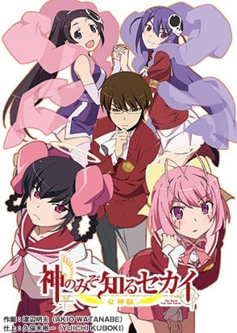
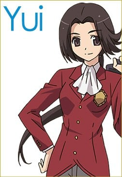
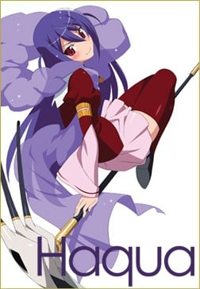
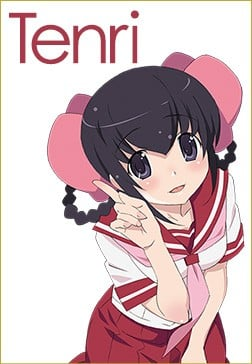
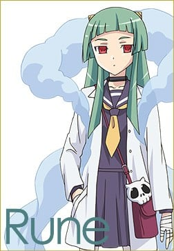

> [!bookinfo|noicon]+ **只有神知道的世界 女神篇**
> 
>
| 日文名 | 神のみぞ知るセカイ 女神篇 |
|:------: |:------------------------------------------: |
| 类型 | 漫改 |
| 新番 | 2013 年 7 月 |
| 集数 | 共12话 |
| 官网 | [http://kaminomi.jp](https://http://kaminomi.jp) |
| 制作 | Manglobe |
| 导演 | 大脊戸聡 |
| 脚本 | 髙橋龍也,倉田英之 |
| 评分 | 7.3|
| 制片人 | 河内山隆 |

> [!abstract]+ **简介**
> 已经确定将于今年7月在TV东京电视台开播的「只有神知道的世界」TV动画第3季，近日于杂志公开了第3季的主线！新篇章将以原作漫画中的女神篇为主题，讲述男主桂木桂马率领众后宫寻找未知女神的故事，动画中桂木桂马将对过去攻略过的少女们进行再攻略！

> [!tip]+ **章节列表**
>- [ ] 第1话：When the Sun Goes Down (2013-07-08)
>- [ ] 第2话：Scramble Formation (2013-07-15)
>- [ ] 第3话：5 HOME (2013-07-22)
>- [ ] 第4话：Doll Roll Hall (2013-07-29)
>- [ ] 第5话：用约会进行较量 (2013-08-05)
>- [ ] 第6话：关于我 (2013-08-12)
>- [ ] 第7话：Bad Medicine (2013-08-19)
>- [ ] 第8话：女神MIX (2013-08-26)
>- [ ] 第9话：Absent Lovers (2013-09-02)
>- [ ] 第10话：迷宫 (2013-09-09)
>- [ ] 第11话：SHOW ME (2013-09-16)
>- [ ] 第12话：第一次恋爱的记忆 (2013-09-23)

> [!tip]+ **主要角色**
> 
| 角色 | CV | 简介| 角色图片 |
|:----:|:---:|:---:|:--------:|
| 桂木桂馬 | 下野紘 | 外号“攻陷之神（落とし神）”的Galgame达人高中生。到目前为止已攻下10000名女角，玩的游戏接近5000部。  只喜欢二次元的女性。上课时都在玩Galgame，但是成绩相当优异。同学都称他为“眼镜宅男（オタメガネ）”。  因为回了大骷髅寄过来的邮件而与恶魔契约，成为帮助捕获“驱魂”的“协力者”。活用Galgame的知识攻下现实的女性。  爱用的游戏机是PFP。  口头禅是“我已经看到结局了”。 |  |
| エリュシア・デ・ルート・イーマ | 伊藤かな恵 | 新恶魔，隶属于地狱的冥界法治省极东支局的“驱魂队”，阶级为三等公务魔。在进入驱魂队之前当了300年的地狱扫除人员，目前是驱魂队的新人。头上戴有骷髅的发饰，这个发饰也是驱魂探测器，身上缠着的羽衣可以变化成各种东西，覆盖自己可以隐藏气息不让他人查觉。总是随身带着一把扫把，因为一旦离开身边会感到不自在。300年的扫除经验让艾鲁西会习惯性的打扫且技术非常完美。有着傻乎乎的性格，既冒失有时候还是个爱哭鬼，令桂马曾对恶魔有很强烈的误解，桂马将她称为“BUG恶魔”。     为了方便和桂马一起行动，假装成桂马父亲的私生女（此事引起桂马母亲的强烈误会，让她想和桂马父亲离婚，由于桂马父亲出差尚未回国，真相至今仍然无法揭开。），和桂马同住在一个屋檐下。并以桂马妹妹的身分转入桂马班上，目前已经相当习惯人间的生活。     非常的敬重桂马，听到别人对桂马的歧视会感到不高兴。起初假扮成桂马的异母妹妹时，被桂马的B.M.W.定义给反对。尽管如此，最后在艾鲁西的各种努力下还是让桂马认同艾鲁西能够成为他的妹妹。会有着上课时传字条给桂马的可爱举动，也可以从字条的内容看出艾鲁西对桂马的感情非常微妙。对于桂马拿自己当练习告白的对象会非常的害羞且不知所措。称呼桂马为“神大人”或“神大人哥哥”。     在刊篇时看到消防车的介绍之后不知为何对其着迷，之后一看到消防车就会陷入狂热状态。 |  |
| 高原歩美 | 竹達彩奈 | 陸上部でハードル走を種目とする明るく活発な女の子。 つねに前に向かって突っ走っている陸上少女だったが、 あることがきっかけで駆け魂にとり憑かれてしまう。 桂馬のことを「オタメガネ」と呼ぶ。 |  |
| 中川かのん | 東山奈央 | 　　舞岛学园高中2年B组的女高中生，16岁的现役新人偶像。桂马在现实世界的第三个攻略对象。 　　因为偶像的工作忙碌而很少去学校，但一旦去上学时就会有很多学生准备相机，相当有人气。 　　其实以前因为个性和外表朴素，所以不引人注目，组建过乐队不过后来解散了，所以一直没有自信。受到驱魂的影响时，心情低沉时身体会变透明。 　　体内有名叫阿波罗的女神。 　　被攻略时第一次认识桂马，记忆被消除后对于自己对桂马有印象感到疑惑(被攻略其间的记忆是她在再次认识桂马前对桂马的所有记忆)，因为当时的记忆确实是消除了，但是在阿波罗出现后，被消除的记忆慢慢苏醒了，记得桂马做过的一切和记得曾与桂马Kiss，对桂马有好感。  关于名字： 　　连载初期名为西原かのん，单行本发行时作者为其更名为中川かのん。由于未给出かのん的汉字写法，故台版取音译“加侬”，而港版则取意译“花音”。 　　另外曾被问及如把名字汉字化会用华音或奏音，作者回答选用奏音。（Twitlog发言纪录） |  |
| 汐宮栞 | 花澤香菜 | 本を愛し、本の世界に生きる図書委員の女の子。 大人しくて控えめ、ヒトと話すのが苦手だけど、 心の中ではとってもおしゃべり？ いつも不思議な本を読んでいる。 |  |
| 五位堂結 | 高垣彩陽 | 初出场时是叛逆的大小姐  2段变身是男装丽人 |  |
| ハクア・ド・ロット・ヘルミニウム | 早見沙織 | 新恶魔，地狱的冥界法治省极东支局驱魂队讨伐队极东支部第32地区长，阶级为一等公务魔，和艾鲁西是学生时代的同学兼密友。全学年第一名的天才，手上拿的大镰刀是学年第一名毕业的象征“证明之镰”。能使用窥视过去或同时压制复数对象等艾鲁西做不到的羽衣使用法，在学生时代经常帮艾鲁西，而艾鲁西也相当尊敬她。     虽说是天才，但本人说是努力的成果。成为驱魂队一员后，对学校所学和现实的差异感到困扰，连唯一一只有机会捕捉的驱魂也失手没抓到。因为对自己要求太严苛，加上自己与艾鲁西成绩和实绩的反差使驱魂趁隙进到她的心里，后来因艾鲁西的告白才赶出驱魂。事件过后也常常会来葛兰巴咖啡店找艾鲁西和桂马玩。     明显对桂马有好感，洗澡时被桂马看过裸体，但桂马却完全没把哈克雅的裸体放在眼里，恋爱路似乎走得不太顺利。曾经一度以为多喝“咕乐多”可以让胸部变大，因此喝了一段时间，但是胸部没有因此变大。     协力者是以推销“咕乐多”的方式攻略驱魂的丸井雪枝。但以哈克雅的角度来看，雪枝除了每天配送咕乐多外什么事都没做。对交不出好成绩感到非常烦躁与不满，在雪枝曝光前，向桂马强烈主张“我才没有协力者！”，在雪枝交出一周内一次赶出四个躯魂的成绩后，二人关系趋近和好密切。     在加侬遇袭后代替艾鲁西跟桂马组成临时协力关系并住在桂马家，在学校则成为艾鲁西的替身。 |  |
| 小阪ちひろ | 阿澄佳奈 | 舞岛学园高中2年B组女生。桂马在现实世界的第六个攻略对象。步美的好朋友。 桂马说“现实女中的现实女”。非常普通的女孩，没什么特别的专长，对于人生也没什么目标。 喜欢帅哥，却是见一个爱一个。在告白被甩后，很快就会忘掉，接着马上再寻找下一个目标。 被攻略过后想要组个乐团。是主唱兼吉他手。 与艾鲁西、步美、京组成轻音社团。正为了秋天的舞高季努力中。 在被攻略期间的记忆被消除后依然对桂马有好感（本人对此感到疑惑）。 在加侬遇袭后被桂马列入“女神候补”，现正“再攻略”中。154话中虽然被桂马说不用来，放学后自行去桂马家后门，在浅间无意的接引下来观看病情。浑然不知步美在桂马家里躲著，在桂马面前演奏新曲后离开。离去前在门后对桂马告白（桂马假装没听到），回家途中接到步美的手机电话，被步美鼓励说:‘这次感情是真的，我会为你加油的。因此让千寻怀疑步美在桂马家。 |  |
| 鮎川天理 | 名塚佳織 | 小学时和桂马同班，桂马的青梅竹马（但不符合桂马的TOYOTA标准[注 1]而不被桂马承认）。 个性十分害羞和内向，十年前的地震发生时唯一和桂马一同在船上的人。在当时为桂马的冷静和坚强所吸引而对桂马有好感，但不算是桂马的攻略对象。 地震事件后两家各自搬走，直至诺拉事件后两家重新作邻居（因此正式成为邻居，恰恰符合桂马的TOYOTA的标准）。 身体寄居着名为蒂雅娜，性质与驱魂完全相反的“神”，在十年前的事件中为了从被驱魂们围攻的手中保护被石头砸晕的桂马而让戴安娜寄居在自己身上。 由于身体不时会被戴安娜夺去控制权，本人对此有些不满并曾向戴安娜抱怨。另外因互抢身体控制权以及蒂亚娜好动的关系，现在容易肚子饿。 长大后与桂马再会时头发刘海较长，诺拉的事件结束后修整了刘海，秀出可爱的样貌与漂亮的水汪眼。 本人相当温柔贴心，由于性格较内向和害羞的缘故，虽然对桂马有好感却比较不主动去交谈，恋爱之路很少有进展，所以戴安娜也常常对她碎碎念。 喜欢戳气泡袋与变魔术，烦恼是常被蒂雅娜说跟桂马结婚的事。 事件后并没有被消除记忆[注 2]，戴安娜亦留在她的身体里。    附注一：T.O.Y.O.TA.为『隣に（Tona-ri）、お兄ちゃん（Onichann）或弟（Otouto）、約束（Yaku‐soku）、思い出（Omoide）、立場（TAchi-ba）』的缩写。指住在隔壁、感情兄妹（姊弟）以上但恋人未满、曾订下约定却几乎从回忆中淡去、最后在彼此立场改变的状况下重逢。  附注二：因女神的记忆不受地狱修正的影响，故攻略过后，女神的宿主能透过和女神共享记忆而回忆起被攻略的种种。 |  |
| 桂木麻里 |  | 桂馬の母親。自宅を兼ねた喫茶店「カフェ・グランパ」を経営している。一児の母とは思えない程スタイルが良い。姑との関係は良好だが、舅との関係は悪い。 現在は非常に朗らかな性格であるが、かつては「峠の雪女」と呼ばれた元暴走族。そのため一度キレるとかつての凶暴な一面を垣間見せることがある。普段は髪をアップに結い眼鏡をかけているが、キレると髪留めと眼鏡をはずす癖がある。 夫は職業柄取材で日本国外へ出張することが多く、ドクロウ入魂の偽手紙のせいでエルシィを夫の隠し子だと信じ切ってしまい夫とは離婚する構えを取っていた。しかしFLAG.118で夫の急病の報（実は桂馬が流した偽情報）を受け出張先へ急遽出立する場面が描かれたり、アニメ第2期FLAG.8.5でも夫への愛情が描かれたりしている。 母を亡くした（ことになっている）エルシィに対して「面倒を見る」と自分や桂馬との同居を認めるなど懐の深い一面を見せている。また、そんなエルシィのことを「エルちゃん」と呼んで実の娘のように可愛がっている一面もある。 |  |
| ノーラ・フロリアン・レオリア | 豊口めぐみ | 地狱的冥界法治省极东支局的“驱魂队”成员之一，大艾鲁西10年的前辈。 出身于地狱里的贵族世家，性格里带有优越感而瞧不起人，喜好邀功、沽名钓誉以及欺负后辈，做事风格相当自我，不守规矩是家常便饭。 她在收服驱魂这件事以快速结案而广为人知，曾有用不到半天时间就结案的传说，但是行事风格有点偏激，造成失败案例颇多甚至有驱魂变本壮大的离谱事件，在天理事件中还曾考虑过要桂马的老命。 在驱魂队人员地区编制有更动的情况下，成为第30-2地区地区长，变成艾鲁西的顶头上司。 由于出身贵族，因此知晓相当多的黑幕，她的一番话词让哈克雅明白旧地狱封印跟神族的事情不是空穴来风。 在桂马以功劳全都会归诺拉为条件，帮助桂马对地狱的上司隐瞒女神的存在。 在前往地狱作定期报告时，为了得到更多情报而加入了正统恶魔社，同时命令亮前往桂木家按下菲欧蕾的女神探测器按钮，阻止了琉妮进入桂木家。从夏丽处得知哈克雅被捕的原因不是女神被暴露。 |  |
| リューネ | 戸松遥 | 正统恶魔社的干部，于152话豋场。在不悦时会用美工刀自残(因为古恶魔还未复活，无法在这段时间杀人，所以以自残发泄)。受伤流血时情绪和身体会有异常亢奋的反应，此反应使她在FLAG187与哈克雅的对战中稳占上风。 |  |