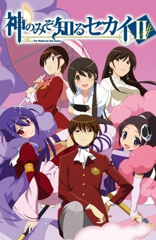
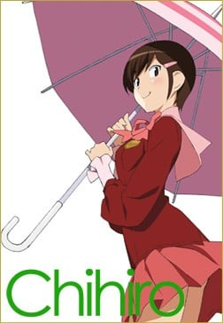
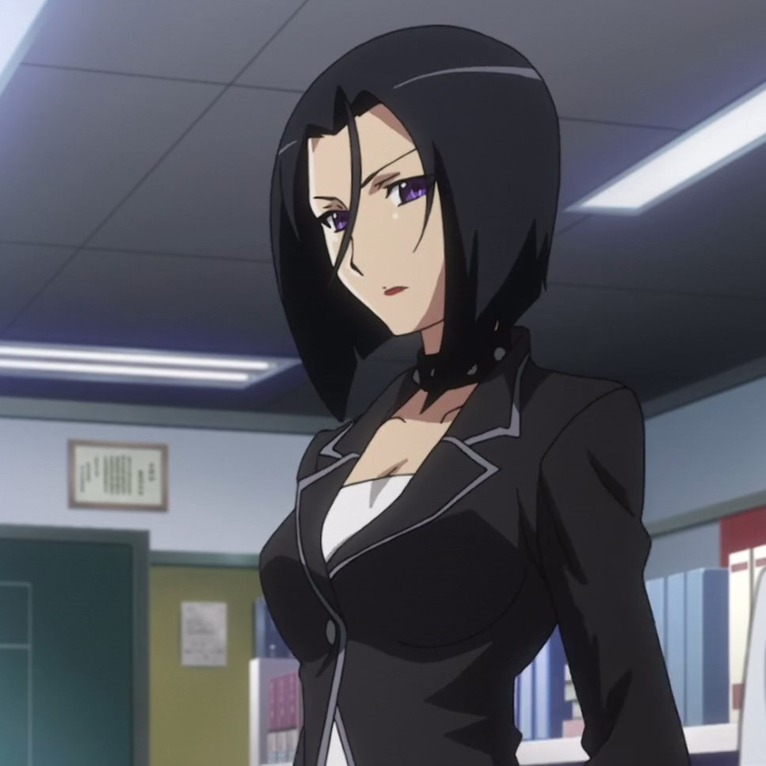
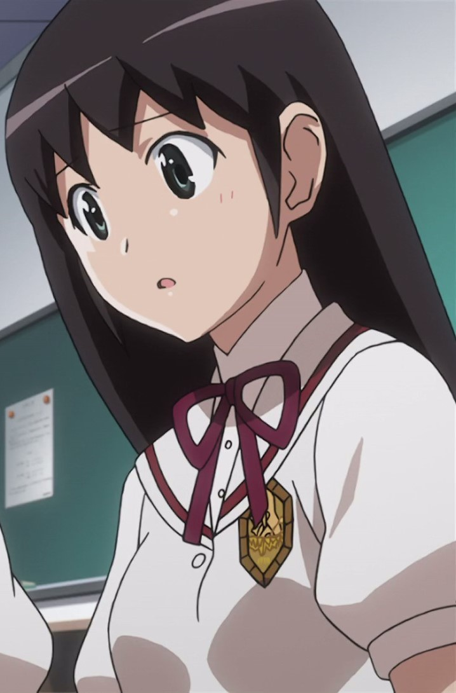
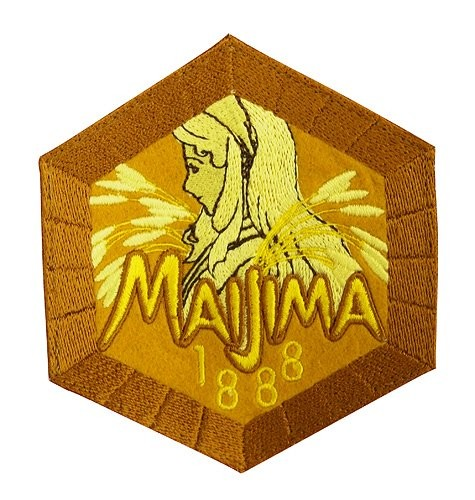

> [!bookinfo|noicon]+ **只有神知道的世界 第二季**
> 
>
| 日文名 | 神のみぞ知るセカイII |
|:------: |:------------------------------------------: |
| 类型 | 漫改 |
| 新番 | 2011 年 4 月 |
| 集数 | 共12话 |
| 官网 | [http://kaminomi.jp](https://http://kaminomi.jp) |
| 制作 | Manglobe |
| 导演 | 高柳滋仁 |
| 脚本 | 倉田英之 |
| 评分 | 7.3|
| 制片人 | 河内山隆 |

> [!abstract]+ **简介**
> 故事将继续讲诉桂木桂马在笨蛋恶魔艾露西的帮助下狩猎驱魂的故事，艾露西在地狱的好朋友白娅也将露面。

> [!tip]+ **章节列表**
>- [ ] 第1话：一花繚乱 (2011-4-11)
>- [ ] 第2话：一挙落着 (2011-4-18)
>- [ ] 第3话：地区長、来たる。 (2011-4-25)
>- [ ] 第4话：地区長、誇りを取り戻す。 (2011-5-2)
>- [ ] 第5话：たどりついたらいつも雨ふり (2011-5-9)
>- [ ] 第6话：10%の雨予報 (2011-5-16)
>- [ ] 第7话：Singing in the Rain (2011-5-23)
>- [ ] 第8话：はじめての☆おつかい (2011-5-30)
>- [ ] 第9话：2年B組 長瀬先生 (2011-6-6)
>- [ ] 第10话：学校★战争 (2011-6-13)
>- [ ] 第11话：将阳光照入心中 (2011-6-20)
>- [ ] 第12话：Summer Wars (2011-6-27)

> [!tip]+ **主要角色**
> 
| 角色 | CV | 简介| 角色图片 |
|:----:|:---:|:---:|:--------:|
| 桂木桂馬 | 下野紘 | 外号“攻陷之神（落とし神）”的Galgame达人高中生。到目前为止已攻下10000名女角，玩的游戏接近5000部。  只喜欢二次元的女性。上课时都在玩Galgame，但是成绩相当优异。同学都称他为“眼镜宅男（オタメガネ）”。  因为回了大骷髅寄过来的邮件而与恶魔契约，成为帮助捕获“驱魂”的“协力者”。活用Galgame的知识攻下现实的女性。  爱用的游戏机是PFP。  口头禅是“我已经看到结局了”。 |  |
| エリュシア・デ・ルート・イーマ | 伊藤かな恵 | 新恶魔，隶属于地狱的冥界法治省极东支局的“驱魂队”，阶级为三等公务魔。在进入驱魂队之前当了300年的地狱扫除人员，目前是驱魂队的新人。头上戴有骷髅的发饰，这个发饰也是驱魂探测器，身上缠着的羽衣可以变化成各种东西，覆盖自己可以隐藏气息不让他人查觉。总是随身带着一把扫把，因为一旦离开身边会感到不自在。300年的扫除经验让艾鲁西会习惯性的打扫且技术非常完美。有着傻乎乎的性格，既冒失有时候还是个爱哭鬼，令桂马曾对恶魔有很强烈的误解，桂马将她称为“BUG恶魔”。     为了方便和桂马一起行动，假装成桂马父亲的私生女（此事引起桂马母亲的强烈误会，让她想和桂马父亲离婚，由于桂马父亲出差尚未回国，真相至今仍然无法揭开。），和桂马同住在一个屋檐下。并以桂马妹妹的身分转入桂马班上，目前已经相当习惯人间的生活。     非常的敬重桂马，听到别人对桂马的歧视会感到不高兴。起初假扮成桂马的异母妹妹时，被桂马的B.M.W.定义给反对。尽管如此，最后在艾鲁西的各种努力下还是让桂马认同艾鲁西能够成为他的妹妹。会有着上课时传字条给桂马的可爱举动，也可以从字条的内容看出艾鲁西对桂马的感情非常微妙。对于桂马拿自己当练习告白的对象会非常的害羞且不知所措。称呼桂马为“神大人”或“神大人哥哥”。     在刊篇时看到消防车的介绍之后不知为何对其着迷，之后一看到消防车就会陷入狂热状态。 |  |
| 高原歩美 | 竹達彩奈 | 陸上部でハードル走を種目とする明るく活発な女の子。 つねに前に向かって突っ走っている陸上少女だったが、 あることがきっかけで駆け魂にとり憑かれてしまう。 桂馬のことを「オタメガネ」と呼ぶ。 |  |
| 地球君 |  | 人...人家才不是为了你在转动！ |  |
| ハクア・ド・ロット・ヘルミニウム | 早見沙織 | 新恶魔，地狱的冥界法治省极东支局驱魂队讨伐队极东支部第32地区长，阶级为一等公务魔，和艾鲁西是学生时代的同学兼密友。全学年第一名的天才，手上拿的大镰刀是学年第一名毕业的象征“证明之镰”。能使用窥视过去或同时压制复数对象等艾鲁西做不到的羽衣使用法，在学生时代经常帮艾鲁西，而艾鲁西也相当尊敬她。     虽说是天才，但本人说是努力的成果。成为驱魂队一员后，对学校所学和现实的差异感到困扰，连唯一一只有机会捕捉的驱魂也失手没抓到。因为对自己要求太严苛，加上自己与艾鲁西成绩和实绩的反差使驱魂趁隙进到她的心里，后来因艾鲁西的告白才赶出驱魂。事件过后也常常会来葛兰巴咖啡店找艾鲁西和桂马玩。     明显对桂马有好感，洗澡时被桂马看过裸体，但桂马却完全没把哈克雅的裸体放在眼里，恋爱路似乎走得不太顺利。曾经一度以为多喝“咕乐多”可以让胸部变大，因此喝了一段时间，但是胸部没有因此变大。     协力者是以推销“咕乐多”的方式攻略驱魂的丸井雪枝。但以哈克雅的角度来看，雪枝除了每天配送咕乐多外什么事都没做。对交不出好成绩感到非常烦躁与不满，在雪枝曝光前，向桂马强烈主张“我才没有协力者！”，在雪枝交出一周内一次赶出四个躯魂的成绩后，二人关系趋近和好密切。     在加侬遇袭后代替艾鲁西跟桂马组成临时协力关系并住在桂马家，在学校则成为艾鲁西的替身。 |  |
| 春日楠 | 小清水亜美 | 舞岛学园高中3年A组，古式武术春日流罗新活杀术的传承者。桂马在现实世界的第五个攻略对象。 女子空手道部社长。楠成为部长后，全部的社员都退社了。嘴里说著“讨厌软弱的人”，但那只是作为春日流的头领抑制自己的感情。 受到驱魂的影响，会在遇上“软弱”（其实全是些可爱或让人害羞的事）的物件或事情的时候，会出现另一个有着十分喜爱“软弱”的分身。 在攻略桧篇中确认其没有女神寄宿。 |  |
| 小阪ちひろ | 阿澄佳奈 | 舞岛学园高中2年B组女生。桂马在现实世界的第六个攻略对象。步美的好朋友。 桂马说“现实女中的现实女”。非常普通的女孩，没什么特别的专长，对于人生也没什么目标。 喜欢帅哥，却是见一个爱一个。在告白被甩后，很快就会忘掉，接着马上再寻找下一个目标。 被攻略过后想要组个乐团。是主唱兼吉他手。 与艾鲁西、步美、京组成轻音社团。正为了秋天的舞高季努力中。 在被攻略期间的记忆被消除后依然对桂马有好感（本人对此感到疑惑）。 在加侬遇袭后被桂马列入“女神候补”，现正“再攻略”中。154话中虽然被桂马说不用来，放学后自行去桂马家后门，在浅间无意的接引下来观看病情。浑然不知步美在桂马家里躲著，在桂马面前演奏新曲后离开。离去前在门后对桂马告白（桂马假装没听到），回家途中接到步美的手机电话，被步美鼓励说:‘这次感情是真的，我会为你加油的。因此让千寻怀疑步美在桂马家。 |  |
| 長瀬純 | 豊崎愛生 | 桂马在现实世界的第七个攻略对象。舞岛高中的实习女老师，为了梦想而相当热血，但不太被学生接受。 桂马的导师二阶堂是她的学姊。 在加侬遇袭后桂马利用摔角比赛的话题确认其没有女神寄宿。 |  |
| 桂木麻里 | 柚木涼香 | 桂馬の母親。自宅を兼ねた喫茶店「カフェ・グランパ」を経営している。一児の母とは思えない程スタイルが良い。姑との関係は良好だが、舅との関係は悪い。 現在は非常に朗らかな性格であるが、かつては「峠の雪女」と呼ばれた元暴走族。そのため一度キレるとかつての凶暴な一面を垣間見せることがある。普段は髪をアップに結い眼鏡をかけているが、キレると髪留めと眼鏡をはずす癖がある。 夫は職業柄取材で日本国外へ出張することが多く、ドクロウ入魂の偽手紙のせいでエルシィを夫の隠し子だと信じ切ってしまい夫とは離婚する構えを取っていた。しかしFLAG.118で夫の急病の報（実は桂馬が流した偽情報）を受け出張先へ急遽出立する場面が描かれたり、アニメ第2期FLAG.8.5でも夫への愛情が描かれたりしている。 母を亡くした（ことになっている）エルシィに対して「面倒を見る」と自分や桂馬との同居を認めるなど懐の深い一面を見せている。また、そんなエルシィのことを「エルちゃん」と呼んで実の娘のように可愛がっている一面もある。 |  |
| 二階堂ゆり | 田中敦子 | 舞島学園高等部的教师 主角所在2年B组的班主任 |  |
| 寺田京 |  | 2年B组学生 |  |
| 私立舞島学園高校 |  |  |  |