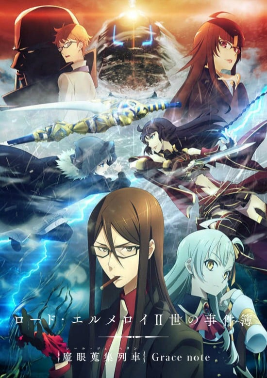
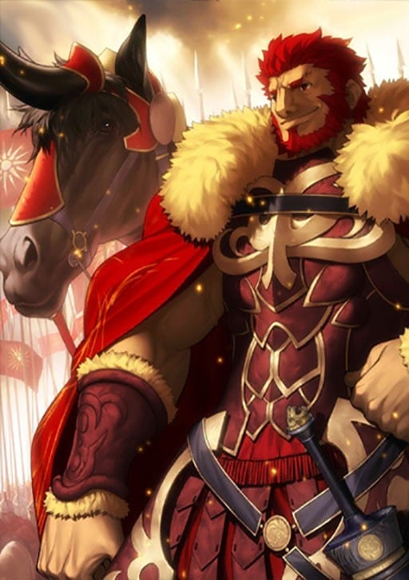
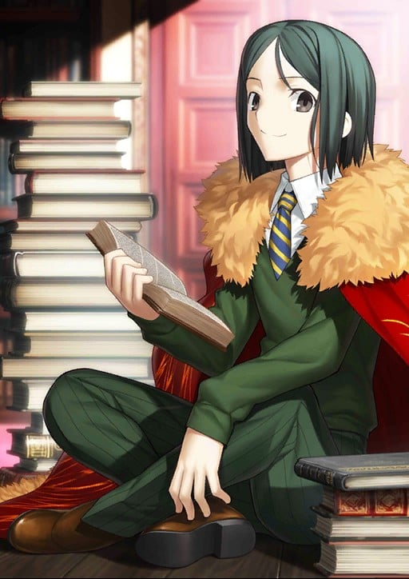
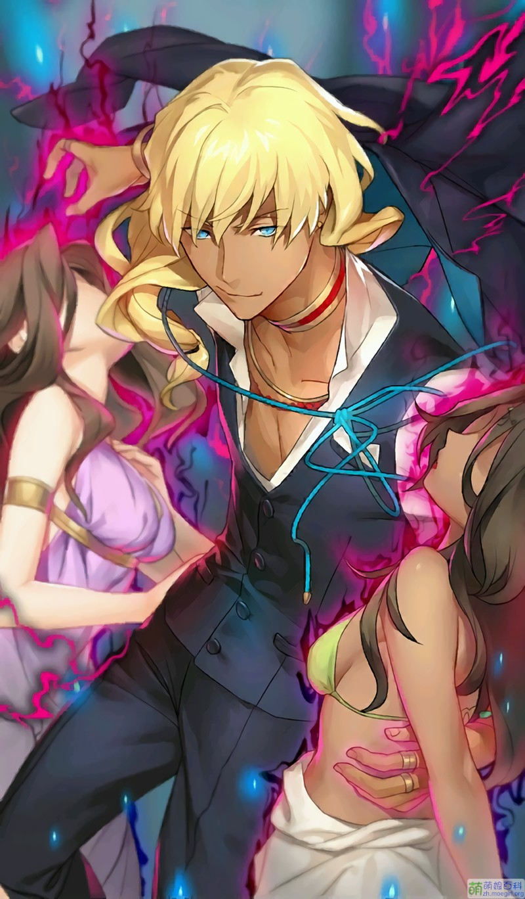
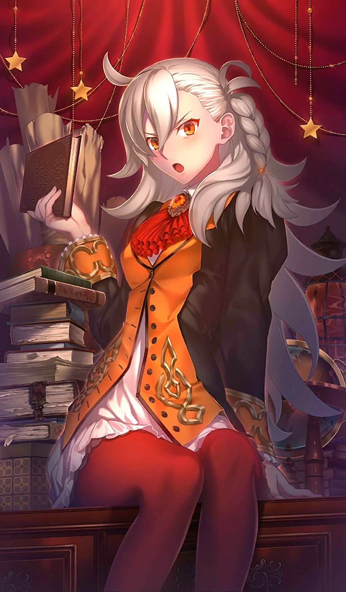
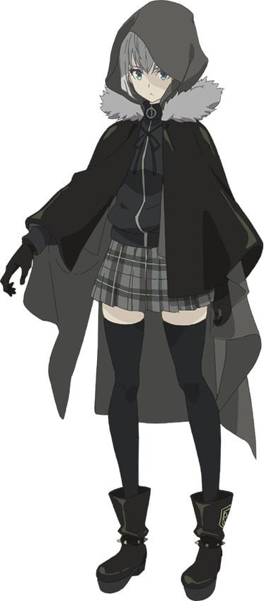

> [!bookinfo|noicon]+ **君主·埃尔梅罗二世事件簿 魔眼收集列车 Grace note**
> 
>
| 日文名 | ロード・エルメロイⅡ世の事件簿 -魔眼蒐集列車 Grace note- |
|:------: |:------------------------------------------: |
| 类型 | 小说改 |
| 新番 | 2019 年 7 月 |
| 集数 | 共14话 |
| 官网 | [https://anime.elmelloi.com/](https://https://anime.elmelloi.com/) |
| 制作 | TROYCA |
| 导演 | 加藤誠 |
| 脚本 | 重信康,三輪清宗,小太刀右京 |
| 评分 | 6.7|
| 制片人 | 長野敏之 |

> [!abstract]+ **简介**
> 在『Fate/Zero』中，与征服王伊斯坎达尔一同跨越了第四次圣杯战争的少年，韦伯·维尔维特。时光流转，少年继承了君主·埃尔梅罗的称号，以君主·埃尔梅罗Ⅱ世的身份，在魔术师们的总部·时钟塔面临了各种充满神秘的事件——
（前6话为原创剧情。）

> [!tip]+ **章节列表**
>- [ ] 第1话：巴比伦与倒吊人与王的记忆 (2019-07-06)
>- [ ] 第2话：七颗行星与永远的牢笼 (2019-07-13)
>- [ ] 第3话：雷鸣与地下迷宫 (2019-07-20)
>- [ ] 第4话：工房与墓穴与死灵术师 (2019-07-27)
>- [ ] 第5话：终焉之枪与妖精眼 (2019-08-03)
>- [ ] 第6话：少女与百货商店与礼物 (2019-08-10)
>- [ ] 第7话：魔眼收集列车1/6 启程的汽笛与第一起杀人案件 (2019-08-17)
>- [ ] 第8话：魔眼收集列车2/6 神威之车轮（Gordias Wheel）与征服王的记忆 (2019-08-24)
>- [ ] 第9话：魔眼收集列车3/6 巫女与决意与腑海林（Einnashe）之子 (2019-08-31)
>- [ ] 第10话：魔眼收集列车4/6 泡影之魔眼和苏醒的侦探 (2019-09-07)
>- [ ] 第11话：魔眼收集列车5/6 残像与拍卖会 (2019-09-14)
>- [ ] 第12话：魔眼收集列车6/6 雷光与流星 (2019-09-21)
>- [ ] 第13话：时钟塔与日常与迈向未来的第一步 (2019-09-28)
>- [ ] 第0话：守墓人与猫与魔术师 (2018-12-31)

> [!tip]+ **主要角色**
> 
| 角色 | CV | 简介| 角色图片 |
|:----:|:---:|:---:|:--------:|
| アルトリア・ペンドラゴン | 川澄綾子 | Fate/stay night 被卫宫士郎召唤的英灵。作为三骑士之一的Saber，以「最优秀的剑之骑士」闻名。她曾在第四次圣杯战争中被召唤，当时士郎的养父——卫宫切嗣是她的Master。 她的真实身份是英格兰传说中的英雄——亚瑟王。从石中拔出选王之剑的少女「阿尔托莉雅」，为了成为理想的君主而隐瞒了自己的性别。然而，在内乱中目睹国土荒废的她，认为自己未能胜任王者之位，因此渴望借由圣杯重新选定合格的王，以拯救祖国不列颠。 她拥有不负传说之名的强大力量，但由于与士郎之间缺乏魔力的“通路”，常因魔力不足而陷入苦战。性格极其刻板认真，对于自己是女性的自觉也相当淡薄，以至于一开始总与士郎意见不合。但最终，她在与士郎的相处中肯定了自己的人生，并决心摧毁寄宿着“此世全部之恶”的圣杯。对她而言，能让自己镜像一般的士郎成为Master，或许是再幸运不过的事情了。  Fate/Zero 传说中的骑士王亚瑟现界的身姿，真名是阿尔托莉雅。卫宫切嗣召唤的从者，召唤时所用的圣遗物是Excalibur的剑鞘，她在第四次圣杯战争中保护着作为代理Master的爱丽丝菲尔。 传说中的亚瑟王是男性，那是因为她为了统治方便而隐瞒了性别。拔出选定之剑后身体便不再成长与老化，因此一直是少女的模样。高尚而廉洁、认真而顽固，怀抱的愿望是拯救曾经走上灭亡之路的祖国不列颠。  Fate/Grand Order 不列颠传说中的王。也被誉为骑士王。阿尔托莉雅是幼名，自从当上国王之后，就开始被称为亚瑟王了。在骑士道凋零的时代，手持圣剑，给不列颠带来了短暂的和平与最后的繁荣。史实上虽为男性，但在这个世界内却似乎是男装丽人，行为举止都以男性为标准，因此很不擅长应对异性向自己表达的好感。 崇尚万人眼中正确生活、正确人生的理想王者之一。锄强扶弱，是个无可非议的人物。冷静沉着，无论何时都十分认真的优等生。尽管如此……虽说从不愿意开口承认，但她却有着不服输的一面。对任何需要一争高下的事都不会手下留情，一旦败北则会非常懊悔。 她具有指挥军团的天生才能。在团体战斗中，可令我军的能力提升。贯彻清廉正直，大公无私的王。其公正令骑士们愿意守护于她的身旁，令民众们在对贫困的忍耐中看到了希望。她的王者之路并不是为了统帅少数强者，而是为了领导更多无力之人而存在的。 亚瑟王传说以骑士时代的终结为结局。亚瑟王虽然击退了异民族，但却无法回避不列颠土地的毁灭。圆桌骑士之一·莫德雷德的反叛导致国家一分为二，骑士之城卡美洛也失去了其辉煌。亚瑟王在卡姆兰之丘成功讨伐了莫德雷德，自己却也因负重伤而倒下。在去世前，她将圣剑交给了最后的心腹贝德维尔，离开了这个世界。死后她被送往了理想乡——不存于此世的乐园·阿瓦隆，并打算在遥远的未来再次拯救不列颠。 |  |
| バゼット・フラガ・マクレミッツ |  | “夜之圣杯战争”的主人公/女主角。23岁，爱尔兰人。隶属魔术协会的封印指定执行者，被派遣到冬木市参加第五次圣杯战争，召唤出库丘林，Lancer英灵的原Master。 在圣杯战争开始之前被言峰偷袭，失去左臂连同与Lancer的契约。处于濒死状态的她，求生意念被圣杯感知，从而与重生的Avenger缔结契约，在后者的帮助下驻留灵魂并在无限的四日循环里参与由Avenger/圣杯重现的“圣杯战争”。 随着经历的积累，终于察觉自身处境的异样，并回忆起自己遭袭以及和Avenger契约的真相。但出于对现世的绝望，拒绝终止无限的四日，而宁可在虚假的世界里活下去。在故事最后，其徘徊在圣杯里的灵魂被Avenger说服，重拾向未来迈进的勇气并终止了四日循环。 现世中的巴泽特在假死半年后，事实上是被卡莲发现和救助，最终苏醒过来。 出身于被称为传承保菌者的魔术师家系，携带以后发先至、一击必杀为概念的迎击宝具——斩击战神之剑，加上本身出色的体术和魔术，具有同英灵正面对决的实力。有“人间凶器”的称号。 虽然外在强悍但内心非常软弱。与言峰绮礼在某次任务中相识，并很快对后者产生信任和倾慕的感情。对于来到远东参加圣杯战争抱有很大期待也是因为言峰的缘故。 |  |
| ギルガメッシュ |  | 号称拥有最强宝具的Servant，将其他所有人都蔑称为“杂种”的傲慢的王者。其真身乃是人类最古老的英灵——英雄王吉尔伽美什。 |  |
| イスカンダル | 大塚明夫 | 真实身份为征服王伊斯坎达尔（イスカンダル），史称为亚历山大大帝。是一名可用“豪放不羁”形容的男人，身高更高达2m。性格是典型的豪杰型，完全欠缺从者与御主关系的常识。想要征服世界，圣杯只是他长远计划的一环。在战斗中途甚至招募其他从者作为手下，共同征服世界，还可以讨论待遇。      持有数种宝具的英灵。     其中一种是由二匹神雷缠身的神牛驱动的战车—对军宝具“神威之车轮（ゴルディアス・ホイール）”。     另一种为EX等级的固有结界—“王之军势（アイオニオン・ヘタイロイ）”，能将生前的部下作为独立的从者连续召还。 |  |
| ウェイバー・ベルベット | 浪川大輔 | Rider的Master。 时钟塔的学生之一。因为家族的魔术师背景只到三代，经常被其他家族和导师看不起。因为不满导师行为，偷走导师的关连物参加第四次圣杯之战表现实力。不喜欢满身肌肉的巨汉，却不得不面对超级壮硕的Rider。是一个「坚信自己是天才的家伙」。 |  |
| ルヴィアゼリッタ・エーデルフェルト | 伊藤静 | 为了一血先代家主在第三次圣杯战争中负于远坂之耻，仓促加入圣杯战争的Edelfelt家现任家主。有着贵族的精英意识，总是用高人一等的态度待人。那高贵气质的支柱，不是身为贵族的骄傲，而是Luvia深爱到不能自已的职业摔跤。在时钟塔和凛是好敌手，这次的战斗中两个人似乎建立起了奇怪的友情。虽然本人否定，但和凛是相像的人，伊利雅对她们两人的的评价是：“都像是笨蛋但实力是真的”、“没有血缘关系的姐妹”。 |  |
| ケイネス・エルメロイ・アーチボルト | 山崎たくみ | 肯尼斯是延续了九代的魔术师家系——阿奇博尔德家的家主，是功绩卓越的天才魔术师。他在统率全世界魔术师的魔术协会总部（通称“时钟塔”）担任降灵科的一级讲师，并与降灵科部长的女儿索拉·娜泽莱·索非亚莉订有婚约。 为了增加知名度而参加圣杯战争。原本想用圣遗物召唤出Rider，但是被自己的学生韦伯·维尔维特盗走媒介，只好改用别的媒介。以此媒介所召唤出的就是Lancer。 Servant和Master之间本来就是只有一条因果线的。而将魔力供给和令咒权利分开，由两名召唤者分别掌握的技术，凭借肯尼斯那天才的能力将这个不可能实现的技术实现了。 所以拥有令咒的肯尼斯不提供魔力，而是由其未婚妻索拉提供。因此是两人一起参赛。 “月灵髓液”是他的魔术礼装之一，利用魔术化的水银进行防御、攻击、搜索三项合一的礼装。搜索是放出水银，利用触觉感应周遭的变化搜集情报；攻击是利用水银凝聚成鞭状打击目标，具有比拟刀刃的攻击；防御是把水银变化成薄膜抵挡攻击，由于利用流体力学的原理因此无法防御剧烈变化的攻击。 |  |
| 獅子劫界離 | 乃村健次 | 「赤」Saber的Master。不过并没有跟随言峰四郎，而是和从者一同采取独自行动。 凶恶的外表给人一种美国逃犯的感觉。不是魔术师，是魔术使。虽然知识这点无法和魔术师们相提并论，但论战斗经验可是能和活了百年的达尼克比肩。 平常在战场四处回收魔术师的尸体或互相抢夺魔术刻印。基本上不会故意去做增加死者之类的事情。再说因为就算不用做那种事，在这世界上每分每秒都会出现死者。 魔术礼装虽然爱用短型猎枪，但这不过是拿来当咒弹应用魔术的媒介在使用，没有拿来当普通的枪用过。其他基本上使用心脏加工成的手榴弹或动物的眼球和猴子的手之类的，因为是死灵魔术，所以礼装大部分都非常恶趣味。 作为魔术师的力量是以前一流，现在二流。魔术使的话是一流。 似乎非常喜爱连名字都没出现过的养女，只要找外套后面的内口袋就会出现一些老照片之类的。 |  |
| アトラム・ガリアスタ |  | 魔术协会的暴发户，参加第五次圣杯战争的御主之一。  第五次圣杯战争中，Caster（美狄亚）的前任 Master，使用残忍的人体炼成结晶，被 Caster 所杀。 |  |
| オルガマリー・アニムスフィア | 米澤円 | 魔術協会の総本山「時計塔」を総べる12人のロードの一角、アニムスフィア家当主でもある。 数年前に前所長である父から家督を受け継ぎ、カルデア所長の座に就く。 ストーリー序盤の爆発事故に巻き込まれ、主人公たちと共に「特異点F」へとレイシフトする。 その後は共闘戦線を持ちかけてきたキャスターの助けを借りながら特異点の調査を進めるが・・・? 2016年7月1日より彼女の概念礼装「パーソナル・レッスン」が期間限定で入手可能。 また「路地裏ナイトメア」、「ロード・エルメロイⅡ世の事件簿」などでゲストキャラとして登場している。 |  |
| グレイ | 上田麗奈 | ロード・エルメロイⅡ世の内弟子の15歳ほどの少女。「拙」という一人称を用いる。学がないことを自覚しており、長い話を覚えること、人が多い環境、近代文明が苦手。霊園の墓守の一族であるが、霊体に対する感応性が以上に強く、幽霊の類が大の苦手。魔術師ではないので魔術は使用しないものの卓越した戦闘技術を持っている。アーサー王の遠縁の子孫であり、容貌は第四次聖杯戦争におけるセイバーのものと酷似している。本人はその顔を晒したがらず、Ⅱ世の指示もあって常に顔を隠すようにフードを深くかぶっている。その実、グレイの一族が聖槍の使い手としてアーサー王を再現するために代々に渡って作ってきた人造人間の一人であり、唯一の成功例。ある時を境に顔がオリジナルに似る様になり、それ以来顔を隠し自分の顔と鏡を嫌うようになる。 Ⅱ世の話から聖杯戦争に興味を持ち、彼とともに参加することを願っている。 |  |
| ライネス・エルメロイ・アーチゾルテ | 水瀬いのり | ロード・エルメロイII世の義妹。エルメロイの分家筋でありケイネスの死後、内乱状態に陥ったエルメロイ一派をまとめ上げて権力を掌握した。15歳ほどの少女で普段は中性的な喋り方をするも、慣れた相手や心の声だと年相応に蓮っ葉になる。自他ともに認めるほど性格が悪く相手をイジり甚振り、困惑させて右往左往するさまを見るのが大好きで、II世いわく「胃を壊す悪魔」（ライネス曰くエルメロイの家系は大概性格が悪いらしい）。サディストであるが、責められるのも嫌いではない。前述のII世と交わさせた契約により、彼をロード・エルメロイII世に仕立て、義兄のためと称して無理難題をたびたび持ち込んでくる。そんな彼女が持ち込む案件から物語が始まる。「相手の底を視る」「魔力を探知できる」「魔力を調整する」能力を持つ魔眼の持ち主。II世ほどではないが、魔術師としての能力は高くない。しかしII世いわく、「魔力の精密作業」即ち「魔術の上に魔術を重ねる技術」については先代エルメロイに比肩する才があり、魔眼が安定すればそれなりの魔術師になれる、らしい。 |  |