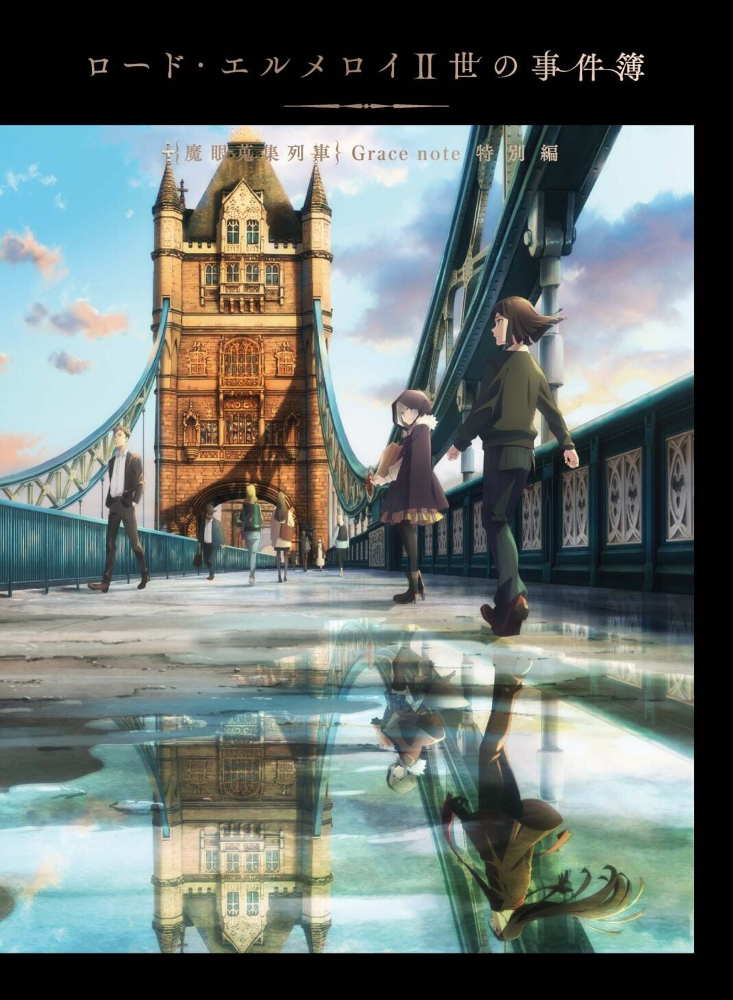
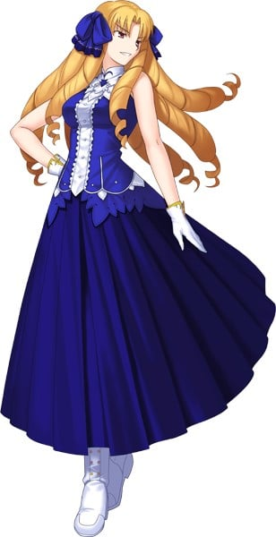
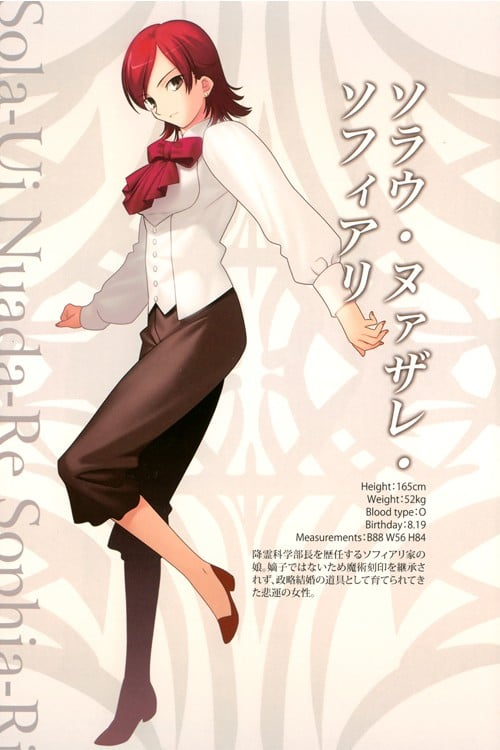
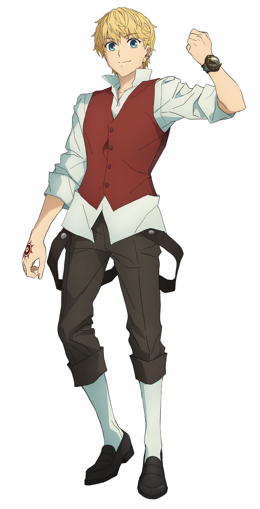
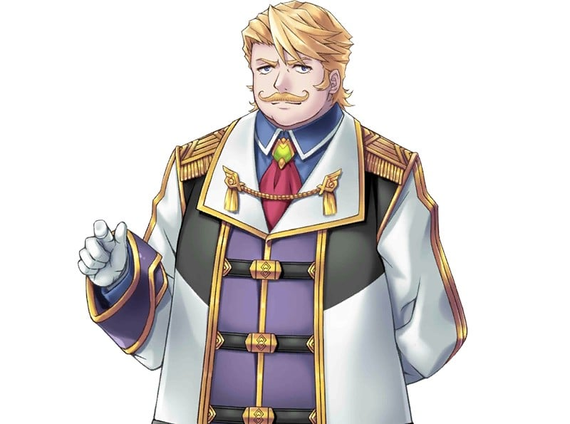

> [!bookinfo|noicon]+ **君主·埃尔梅罗二世事件簿 魔眼收集列车 特别篇**
> 
>
| 日文名 | ロード・エルメロイⅡ世の事件簿 -魔眼蒐集列車 特別編 |
|:------: |:------------------------------------------: |
| 类型 | 小说改 |
| 新番 | 2021 年 12 月 |
| 集数 | 共1话 |
| 官网 | [https://anime.elmelloi.com/](https://https://anime.elmelloi.com/) |
| 制作 | TROYCA |
| 导演 | 加藤誠 |
| 脚本 | 小太刀右京 |
| 评分 | 6.6|
| 制片人 | 長野敏之 |

> [!abstract]+ **简介**
> ロード・エルメロイⅡ世の元に届いた一通の手紙――それは、かつての時計塔の同窓会の報せだった。

だが開催日が近づくある朝、ロード・エルメロイⅡ世は、鏡に映る自分の姿に驚愕する。
身体が10年前のウェイバー・ベルベットの姿に戻っていたのだ。

高度な幻術によるものと推測したロード・エルメロイⅡ世は、自分の身に起きた異変を解明するために調査を進める。
そして同窓会当日、同期たちで賑わう会場へと足を運び、この変身を引き起こした人物とその目的を解き明かす。
しかし事態は、蒼崎橙子の登場によって思わぬ方向へと進んでいくのだった――。

> [!tip]+ **章节列表**
>- [ ] 第1话：特别篇 韦伯与同学会与幻灯机 (2021-12-31)

> [!tip]+ **主要角色**
> 
| 角色 | CV | 简介| 角色图片 |
|:----:|:---:|:---:|:--------:|
| 蒼崎橙子 | 本田貴子 | 　　奈须小说《空之境界》中的最高位的人形使，整部《空之境界》的故事导向者。礼园女学院的校友，被魔术协会制定封印的人偶师。个性独特，二十多岁就升到支配者层级，有魔眼，拥有魔术回路二十左右。虽身为魔术师却有接近魔法使的实力。在魔术协会学习期间以追求肉体的原型为目标，结识了同样研究卢文字和人偶制作的柯尼勒斯·阿鲁巴和追求魂之原型的荒耶宗莲，对荒耶有着相当复杂的感情。 　　与《空之境界》的主角两仪式相遇后将其收为名义上的使魔，并偶尔会交一些工作给她。 　　喜欢抽烟，而且似乎还抽得很凶。香烟据说是产自台湾的劣质烟，剧场版里可以看见品牌貌似叫做“烟龙”。是个浪漫主义者，喜欢新的东西，对有兴趣的东西百般折腾。也是一个飚车爱好者，小说中喜欢的车是Mini Maina—1000型的迷你酷派车，剧场版中开的则是阿斯顿·马丁的DB9，并且貌似不止一辆，拥有的哈雷摩托似乎也是复数。　 　　橙子的专长是伦文字（Rune）魔术、人偶制作及各种创作设计。 　　《月姬》中 远野志贵 的眼镜——魔眼杀，就是出自她手。《Fate stay night》「Heaven Feel」True End中，替代卫宫士郎被破坏的人偶也被怀疑由橙子制作。（川添绿注：魔眼杀是苍崎橙子的妹妹苍崎青子交给远野志贵的） 　　能够利用伦文字【如尼文（Rune）】进行火焰的攻击，也会使用自制的各种使魔进行战斗，其使魔的强度据说是可以瞬间吞下一栋公寓的魔兽。使魔通常被装在随身携带的橙色提包或提箱中。自己则身披一件能够防御各种魔术侵袭的茶色大衣。（剧场版改为橙色） 　　同时，在《空之境界》中也曾设计出可令进入者陷入混乱状态的螺旋型建筑——小川公寓。是一个集魔术，创作及设计天赋于一身的多面天才。 　　大概是奈须目前已发表的故事中，最能代表魔术师存在的一个人。 　　讨厌橙色，不太喜欢自己橙子(とうこ)这个名字，不过偏偏身上总是会挂着橙色的装饰品。 |  |
| ウェイバー・ベルベット | 浪川大輔 | Rider的Master。 时钟塔的学生之一。因为家族的魔术师背景只到三代，经常被其他家族和导师看不起。因为不满导师行为，偷走导师的关连物参加第四次圣杯之战表现实力。不喜欢满身肌肉的巨汉，却不得不面对超级壮硕的Rider。是一个「坚信自己是天才的家伙」。 |  |
| ルヴィアゼリッタ・エーデルフェルト | 伊藤静 | 为了一血先代家主在第三次圣杯战争中负于远坂之耻，仓促加入圣杯战争的Edelfelt家现任家主。有着贵族的精英意识，总是用高人一等的态度待人。那高贵气质的支柱，不是身为贵族的骄傲，而是Luvia深爱到不能自已的职业摔跤。在时钟塔和凛是好敌手，这次的战斗中两个人似乎建立起了奇怪的友情。虽然本人否定，但和凛是相像的人，伊利雅对她们两人的的评价是：“都像是笨蛋但实力是真的”、“没有血缘关系的姐妹”。 |  |
| ケイネス・エルメロイ・アーチボルト | 山崎たくみ | 肯尼斯是延续了九代的魔术师家系——阿奇博尔德家的家主，是功绩卓越的天才魔术师。他在统率全世界魔术师的魔术协会总部（通称“时钟塔”）担任降灵科的一级讲师，并与降灵科部长的女儿索拉·娜泽莱·索非亚莉订有婚约。 为了增加知名度而参加圣杯战争。原本想用圣遗物召唤出Rider，但是被自己的学生韦伯·维尔维特盗走媒介，只好改用别的媒介。以此媒介所召唤出的就是Lancer。 Servant和Master之间本来就是只有一条因果线的。而将魔力供给和令咒权利分开，由两名召唤者分别掌握的技术，凭借肯尼斯那天才的能力将这个不可能实现的技术实现了。 所以拥有令咒的肯尼斯不提供魔力，而是由其未婚妻索拉提供。因此是两人一起参赛。 “月灵髓液”是他的魔术礼装之一，利用魔术化的水银进行防御、攻击、搜索三项合一的礼装。搜索是放出水银，利用触觉感应周遭的变化搜集情报；攻击是利用水银凝聚成鞭状打击目标，具有比拟刀刃的攻击；防御是把水银变化成薄膜抵挡攻击，由于利用流体力学的原理因此无法防御剧烈变化的攻击。 |  |
| ソラウ・ヌァザレ・ソフィアリ |  | 英国人。时钟塔降灵科部长的女儿。对Lancer有爱慕之情，即使自身具有抵御魔貌的能力。 Lancer的Master，  原简介：3年目の浮気ぐらい大目にみろよ |  |
| 獅子劫界離 | 乃村健次 | 「赤」Saber的Master。不过并没有跟随言峰四郎，而是和从者一同采取独自行动。 凶恶的外表给人一种美国逃犯的感觉。不是魔术师，是魔术使。虽然知识这点无法和魔术师们相提并论，但论战斗经验可是能和活了百年的达尼克比肩。 平常在战场四处回收魔术师的尸体或互相抢夺魔术刻印。基本上不会故意去做增加死者之类的事情。再说因为就算不用做那种事，在这世界上每分每秒都会出现死者。 魔术礼装虽然爱用短型猎枪，但这不过是拿来当咒弹应用魔术的媒介在使用，没有拿来当普通的枪用过。其他基本上使用心脏加工成的手榴弹或动物的眼球和猴子的手之类的，因为是死灵魔术，所以礼装大部分都非常恶趣味。 作为魔术师的力量是以前一流，现在二流。魔术使的话是一流。 似乎非常喜爱连名字都没出现过的养女，只要找外套后面的内口袋就会出现一些老照片之类的。 |  |
| オルガマリー・アニムスフィア | 米澤円 | 魔術協会の総本山「時計塔」を総べる12人のロードの一角、アニムスフィア家当主でもある。 数年前に前所長である父から家督を受け継ぎ、カルデア所長の座に就く。 ストーリー序盤の爆発事故に巻き込まれ、主人公たちと共に「特異点F」へとレイシフトする。 その後は共闘戦線を持ちかけてきたキャスターの助けを借りながら特異点の調査を進めるが・・・? 2016年7月1日より彼女の概念礼装「パーソナル・レッスン」が期間限定で入手可能。 また「路地裏ナイトメア」、「ロード・エルメロイⅡ世の事件簿」などでゲストキャラとして登場している。 |  |
| グレイ | 上田麗奈 | ロード・エルメロイⅡ世の内弟子の15歳ほどの少女。「拙」という一人称を用いる。学がないことを自覚しており、長い話を覚えること、人が多い環境、近代文明が苦手。霊園の墓守の一族であるが、霊体に対する感応性が以上に強く、幽霊の類が大の苦手。魔術師ではないので魔術は使用しないものの卓越した戦闘技術を持っている。アーサー王の遠縁の子孫であり、容貌は第四次聖杯戦争におけるセイバーのものと酷似している。本人はその顔を晒したがらず、Ⅱ世の指示もあって常に顔を隠すようにフードを深くかぶっている。その実、グレイの一族が聖槍の使い手としてアーサー王を再現するために代々に渡って作ってきた人造人間の一人であり、唯一の成功例。ある時を境に顔がオリジナルに似る様になり、それ以来顔を隠し自分の顔と鏡を嫌うようになる。 Ⅱ世の話から聖杯戦争に興味を持ち、彼とともに参加することを願っている。 |  |
| ライネス・エルメロイ・アーチゾルテ | 水瀬いのり | ロード・エルメロイII世の義妹。エルメロイの分家筋でありケイネスの死後、内乱状態に陥ったエルメロイ一派をまとめ上げて権力を掌握した。15歳ほどの少女で普段は中性的な喋り方をするも、慣れた相手や心の声だと年相応に蓮っ葉になる。自他ともに認めるほど性格が悪く相手をイジり甚振り、困惑させて右往左往するさまを見るのが大好きで、II世いわく「胃を壊す悪魔」（ライネス曰くエルメロイの家系は大概性格が悪いらしい）。サディストであるが、責められるのも嫌いではない。前述のII世と交わさせた契約により、彼をロード・エルメロイII世に仕立て、義兄のためと称して無理難題をたびたび持ち込んでくる。そんな彼女が持ち込む案件から物語が始まる。「相手の底を視る」「魔力を探知できる」「魔力を調整する」能力を持つ魔眼の持ち主。II世ほどではないが、魔術師としての能力は高くない。しかしII世いわく、「魔力の精密作業」即ち「魔術の上に魔術を重ねる技術」については先代エルメロイに比肩する才があり、魔眼が安定すればそれなりの魔術師になれる、らしい。 |  |
| フラット・エスカルドス | 松岡禎丞 | 現代魔術科「エルメロイ教室」に所属する天才少年。魔術師同士の戦闘において、他者の魔術に干渉・反転させる芸当を即興でこなす圧倒的な才覚の持ち主。時計塔内ではトップクラスの評価と問題児としての悪評を併せ持ち、エルメロイⅡ世の胃袋に深刻な影響を与えている。無邪気で人懐こく、憎めない人物だが理解者は多くはない。反面、腐れ縁となった同教室のスヴィンとは抜群のコンビネーションを見せる。 |  |
| カウレス・フォルヴェッジ・ユグドミレニア | 小林裕介 | 「黑」Berserker的Master，擅长召唤低级灵或昆虫、动物。 姊姊菲欧蕾虽然诞生时具备百年难得一见的稀世魔术回路，却因双脚问题引发沃尔温族长的不安，因此让妻子生下盖列斯作为后备继承人，同时充当照顾菲欧蕾的人。 很可惜，奇迹并未发生第二次，盖列斯的平凡宛如沃尔温家族的衰退一般。族长判断即使双脚不便也应该让菲欧蕾成为继承人，因此命令盖列斯负责照顾她。 本人则是抱持轻松的人生观与半放弃的态度学习魔术，可是很快地不只菲欧蕾，连沃尔温家族都开始抱持微妙的危机感。因为在由双亲的亲自指导下虽然对菲欧蕾彻底灌输了魔术知识，却让她成为除了魔术以外对世事一无所知的残念系大小姐。 因此身为弟弟，只得肩负起照顾姊姊的责任。在圣杯战争之际，也负责担任菲欧蕾的后备，两人一同前往罗马尼亚。此时出现了令咒的征兆，因此被迫召唤了Berserker。 基本个人主义是将魔术当成人生的附属品，丝毫没有将所有人生奉献给魔术的想法。但在历经圣杯大战后，这种有些厌世的想法貌似也产生各种变化。想法颇为冷淡，一旦姊弟在通常的圣杯战争中阋墙，菲欧蕾在杀害他后会陷入很长一段绝望之中；但盖列斯在感受到一阵绝望后会毫不犹豫杀害姊姊。亦即某种意义上他作为魔术师的意识比菲欧蕾更强。 同时盖列斯也具备丰富的现代知识，教菲欧蕾用手机的就是他。刻意仰赖机械，并在这方面保持从容，尽可能扩大自己贫乏的魔术规模。 在『埃尔梅罗二世事件簿』中也有登场。（没有“·千界树”的后缀） |  |
| ゴルドルフ・ムジーク |  | 『Fate/Grand Order』第2部のプロローグで、カルデアの新所長として登場。新所長として人理継続保障機関フィニス・カルデアにやってきた錬金術師の名家の嫡子。  略歴 7つの部門に分売されかけていたカルデアを私財を投じて一括購入し、所長の座に就いた。コヤンスカヤと言峰の裏切りにより命を落としかけるが、主人公に救われて事なきを得た。 何とか虚数潜航艇シャドウ・ボーダーへの避難に成功した後は、主人公やマシュを始めとする生き残ったカルデアのスタッフと共に人跡未踏の旅に出る。  人物 尊大だが小心者。自己顕示欲が強い一方、一度も他人にも認められず、誰にも愛されていないことが関係しているのか、悲観的な言動も目立つ。典型的な小物であるが、自分が嫌われ者、かつ役立たずであるという自覚は十分に持っている。 他方、大切な仲間を失い、さらには故郷ともいえるカルデアの崩壊にこれまでになく取り乱すマシュへの気遣いを遠回しながらも見せるなど、嫌われ者ではあっても外道にはなれない人物でもある。 ムジーク家の当主として家名の高貴さを誇示し、トップであることに執着する様子も見せているが、彼自身は「家名に恥じない功績を残す」ことを最優先としているようで、それさえあれば別段順位に拘るつもりは無い模様。  能力 魔術師としての腕は、時計塔からの評価は平均クラス。 だが、手持ちの魔銃や魔除けを用い、サーヴァントレベルの戦闘力を持つと評された殺戮猟兵複数の攻撃を救援が来るまで耐え凌ぐなど、戦闘の腕はそこそこある模様。 カーレースが趣味で、自らドライバーとしてハンドルを握り、「不死鳥のムジーク」という異名を持つらしい。車両に加わる衝撃から走行状態を的確に分析しているあたり、経験は豊富な様子。 |  |