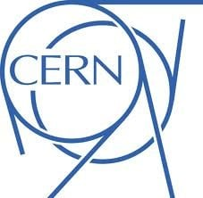

> [!bookinfo|noicon]+ **命运石之门**
> 
>
| 日文名 | STEINS;GATE |
|:------: |:------------------------------------------: |
| 类型 | 游戏改 |
| 新番 | 2011 年 4 月 |
| 集数 | 共25话 |
| 官网 | [http://steinsgate.tv/](https://http://steinsgate.tv/) |
| 制作 | WHITE FOX |
| 导演 | 佐藤卓哉×浜崎博嗣（第1～24話）、小林智樹（第25話）,浜崎博嗣,佐藤卓哉,小林智樹 |
| 脚本 | 花田十輝,林直孝,花田十輝(1-5,9,11-14,21-23,23β,24-25)、横谷昌宏(6,10,15-16,18)、根元歳三(7-8,17,19-20)、林直孝(23β),根元歳三,横谷昌宏 |
| 评分 | 8.8|
| 制片人 | 岩佐岳,吉川綱樹,岩佐がく [ 岩佐岳 ] 、吉川綱樹（第25話） |

> [!abstract]+ **简介**
>        故事发生在「CHAOS;HEAD」的“涩谷崩坏”事件一年半之后的世界，而舞台则从涩谷转移到了秋叶原。主角冈部伦太郎是一位深度中二病的大学生，时常幻想自己身肩重任，并自称“狂气的疯狂科学家・凤凰院凶真”，不过说到底其作为不过就是在名为“未来道具研究所”中与两个伙伴开发着奇奇怪怪又不切实际的东西。然而，这样的他们却在偶然间发明出可以把电子讯息传送过去的时间机器。在他们对未来及过去知道得越多的同时，却不知道危难正渐渐临到自己身上……

> [!tip]+ **章节列表**
>- [ ] 第1话：始与终的序章-Turning Point- (2011-04-05)
>- [ ] 第2话：时间跳跃的偏执狂-Time Travel Paranoia- (2011-04-12)
>- [ ] 第3话：并列过程的偏执狂-Parallel World Paranoia- (2011-04-19)
>- [ ] 第4话：空谈彷徨的交汇-Interpreter Rendezvous- (2011-04-26)
>- [ ] 第5话：电荷冲突的交汇-Starmine Rendezvous- (2011-05-03)
>- [ ] 第6话：蝶翼的发散-Butterfly Effect's Divergence- (2011-05-10)
>- [ ] 第7话：断层的发散-Divergence Singularity- (2011-05-17)
>- [ ] 第8话：梦幻的恒定状态-Chaos Theory Homeostasis (2011-05-24)
>- [ ] 第9话：幻相的恒定状态-Chaos Theory Homeostasis- (2011-05-31)
>- [ ] 第10话：相生的恒定状态-Chaos Theory Homeostasis- (2011-06-07)
>- [ ] 第11话：时空境界的教义-Dogma in Event Horizon- (2011-06-14)
>- [ ] 第12话：静止界限的教义-Dogma in Ergosphere- (2011-06-21)
>- [ ] 第13话：形而上的坏死-Metaphysics Necrosis- (2011-06-28)
>- [ ] 第14话：形而下的坏死-Physically Necrosis- (2011-07-05)
>- [ ] 第15话：亡环上的坏死-Missing Link Necrosis- (2011-07-12)
>- [ ] 第16话：不可逆的坏死-Sacrificial Necrosis- (2011-07-19)
>- [ ] 第17话：虚像歪曲的情意综-Made in Complex- (2011-07-26)
>- [ ] 第18话：自己相似的两性同体-Fractal Androgynous- (2011-08-02)
>- [ ] 第19话：无限连锁的细胞凋亡-Endless Apoptosis- (2011-08-09)
>- [ ] 第20话：怨恨灭绝的细胞凋亡-Finalize Apoptosis - (2011-08-16)
>- [ ] 第21话：因果律的消散-Paradox Meltdown- (2011-08-23)
>- [ ] 第22话：存在了解的消散-Being Meltdown- (2011-08-30)
>- [ ] 第23话：境界面上的斯坦因之门-Open The Steins Gate- (2011-09-06)
>- [ ] 第24话：终与始的序章-Open The Steins Gate- (2011-09-13)
>- [ ] 第23话：境界面上的缺失之环-Divide by Zero- (2015-12-02)
>- [ ] 第25话：横行跋扈的浪荡之徒-Egoistic Poriomania- (2012-02-22)

> [!tip]+ **主要角色**
> 
| 角色 | CV | 简介| 角色图片 |
|:----:|:---:|:---:|:--------:|
| アルパカ |  | 在那荒茫美丽马勒戈壁  有一群草泥马，  他们活泼又聪明，  他们调皮又灵敏，  他们由自在生活在那草泥马戈壁，  他们顽强勇敢克服艰苦环境。  噢，卧槽的草泥马！  噢，狂槽的草泥马！  他们为了卧草不被吃掉 打败了河蟹，  河蟹从此消失草泥马戈壁 |  |
| 椎名まゆり | 花澤香菜 | 私立花浅葱大学附属学园二年级。 保持着不紧不慢的行动和语调，是个一直挂着笑容的天然系角色。 相当能吃，即使吃很多还是很瘦。 虽然住在池袋，不过每天都去与学校和打工地点很近的未来道具研究所。 对冈伦的厨二病发言不装傻也不吐槽而是直接点头接受(直接忽视的次数也很多)。  虽然是未来道具研究所的成员，不过对于发明没有兴趣，所以转而制作 Cosplay 服。 但实际上做的只有女性服装，而且自己并不穿，最近正努力地在使漆原(伪娘)穿上自己制作的衣服。 受到景仰的奶奶的影响，喜欢抬头仰望星空，经常可以看到她面向夜空伸出手。 |  |
| 岡部倫太郎 | 宮野真守 | 主人公，东京电机大学一年级，“未来道具研究所”研究员No.001。 虽然清瘦的外表看上去很帅，但交谈时会突然掏出手机，然后开始莫名其妙的自言自语，并在结束的时候附上“这是 Steins;Gate 的选择”和不明所以的“エル・プサイ・コングルゥ”的句尾，不禁使人退避三舍，是个严重厨二病患者。 自称是狂乱的疯狂科学家，而为了将这个自我设定扮演好，平时的行动也总是装出一副恶役般的造型。 以改革世界的支配构造为最终目标进行活动。不过实际上做的事是在“未来道具研究所”里天天制作奇怪的发明。 他的“信念”过于强烈，又不会看别人脸色做事，这使得他身边的朋友非常少。 |  |
| 牧瀬紅莉栖 | 今井麻美 | 维克多·孔多利亚（原型为哥伦比亚大学）大学脑科学研究所的研究员，18 岁即从大学毕业(因为美国的跳级制度，所以实际年龄跟高三学生相当)，在美国著名的学术杂志上刊登论文而受到瞩目。 或许是因为饱尝周围人们充满羡慕与嫉妒的目光，面对他人时从来不会露出半点破绽。 然而作为研究者，其本质还是个难以掩藏旺盛的好奇心、对感兴趣的事物一头扎进去的女孩。 其言行让人感觉比起一般世间的常识更加注重研究的成果，而因此也被冈部评为“相当程度的科学狂人“，然而本人却并不这么认为。  外表是个美人，纤细的双腿充满魅力。 平时穿着按照自己的风格所改造的高中制服，虽然严格来说已经不是高中生了，不过常用“因为可爱”这样的理由进行辩解。 是个典型的傲娇，而且是一旦关系变好后就用情很深的类型。 平时经常引用动画『10之使魔』女主角“露易丝”的台词，但这似乎只是受到大型论坛2ch的影响而在不知出处的情况下使用。 想做一名匿名的 2cher，不过却反而暴露出来。 因为天才的个性使然，所以对冈伦的厨二病发言毫不留情。 |  |
| 阿万音鈴羽 | 田村ゆかり | 在未来道具研究所所在的一楼「显象管工房」打工的少女。 因为直率的性格(也被说成自来熟)，所以和别人的关系能很快就融洽起来(但不知原因惟独敌视红莉栖) 。 虽然有时元气过剩，时时让人感觉粗枝大叶，但实际相处起来还是个很乐于帮助人的人，也会有很细心的一面。  不过在与人交往时往往不会相交太深，也不喜欢借助他人的力量，因此即使自己已经陷入困境，除非实在无法忍耐下去，否则也不会向周围的人诉说。 从不提及自己的事，因此让人感觉充满了谜团。　　  能把杂草虫子之类的东西很好地进行料理，看起来拥有很高的生存能力。 相当擅长的格斗技，有着在实战中也不辱其名的实力，本人则称之为生存技巧。  　　她生活的中心就是骑自行车，是个狂热的自行车爱好者。 一但提到时就会性格突变，采取积极的行动，甚至还会邀请冈伦和桥田等未来道具研究所成员一起骑车去兜风。 常用Mountain Bike(山地自行车)，简称 MTB。 虽然刚买不久，不过已经完全喜欢上了，常能看见她在「显像管工房」前努力维护自行车的身影。 |  |
| 漆原るか | 小林ゆう | 私立花浅葱大学附属学园二年级。秋叶原的柳林神社当家的儿子。在家里的神社时穿着巫女服。 　　清秀端庄，一副正统美少女的性格——不过，是男性。 　　外表上怎么看都是美少女——不过，是男性。 　　(因为是男性，所以胸部是机场。) 　　不喜欢引人注目，也没有什么自己的主张，一遇到问题就会脸红。做事认真缺乏变通。一直被真由理拜托穿 Cosplay服，虽然毎次都以「害羞」为借口拒绝，但她(？)还能坚持多久呢。妖刀・ 五月雨作为柳林神社代代相传的退魔宝刀，其实是冈伦送给他的仿制刀(980 日元)。身为师父的冈伦命令他每天练习抡刀，如果没带的话会被训斥。因为本性过于认真，所以把冈伦的厨二病发言都误解成了事实。总是把暗语说错。 　　请参见『STEINS;GATE』女主角报告　“漆原 るか”是大和抚子般的伪娘巫女 |  |
| フェイリス・ニャンニャン | 桃井はるこ | 　　在秋叶原的大人气猫耳女仆咖啡厅打工的少女。因为平时就戴着猫耳，所以使用着动画中常出现的“喵喵～”的口癖。自称有着只要注视对方眼睛就知道内心想法的特殊能力“笑面猫的微笑”，所以对他人的心情十分敏感。由于猫耳的萌要素和能力使她在打工的地方赢得了 No.1 的人气，是那种玩弄男人内心的小恶魔。 　　在世界规模的人气对战卡片游戏『雷 net access battles』上有着一流的技术，不过并没有怎么在正式比赛中出过场。因为是战略性很高的游戏，所以她擅长的心理洞察的特殊能力能得到充分的发挥。 　　虽然是冈伦天敌一般的存在，却亲切地(？)称呼他为“凤凰院凶真”，经常把他耍得团团转。 |  |
| 橋田至 | 関智一 | 　东京电机大学一年级。冈伦高中时代的友人，两人也在同一所大学上学。因为出色的编程和黑客技术，被冈伦称为「右手」的未来道具研究所的宝贵战力。 　　御宅族，常常使用2ch用语，喜欢谈下半身的话题，是个从2次元到3次元甚至到无机物都能萌上的家伙。口癖“常考”。最近喜欢的是动画『10 之使魔』的露易丝，在女仆咖啡厅『女仆皇后+喵 2』打工的菲利斯等。 |  |
| 桐生萌郁 | 後藤沙緒里 | 为了都市传说的取材而寻找幻之 PC「IBN5100」的时候，在秋叶原邂逅了冈伦。她沉默寡言到了与别人的交流全部都要通过手机短信的地步(就算对方在眼前)。虽然会让人觉得她的性格十分冷淡，但其实只是因为她不擅长与别人交谈罢了。而且这个不擅长当面交谈的问题即使通过电话也改不了，所以与其说是手机依赖症，不如说是手机短信依赖症更为恰当。 　　让人大跌眼镜的是，她透过短信传达过来的感情意外的高昂开朗，与本人的形象有着鲜明的反差。 　　每当有新机种上市，她都会立刻进行更换。另外，她打字的速度是连眼睛都跟不上的杰出的特技，亲眼目睹过的冈伦将其称之为「闪光的指压师」(Shining Finger，机战玩家一定很熟悉)。 |  |
| 天王寺綯 | 山本彩乃 | 电器店店长兼Rounder指挥官天王寺裕吾的女儿，十一岁。 有点害怕冈部和桥田，被两人称作“小动物”。 |  |
| Organisation Européenne pour la Recherche Nucléaire |  | 欧洲核子研究组织，通常被简称为CERN ，是世界上最大型的粒子物理学实验室，也是万维网的发祥地。它整个机构位于瑞士日内瓦西部接壤法国的边境。 CERN成立于1954年9月29日，为物理科学家提供必要的研究工具。最初，欧洲核子研究组织的签字发起人只有12位，现在会员增加到20名成员国。 缩略词CERN在法语里原本代表欧洲核子研究委员会（Conseil Européen pour la Recherche Nucléaire），是一个1952年由11个欧洲政府建立的，临时为实验室设定的委员会。在临时委员会被解散后，新的实验室在1954年9月29日被改名为欧洲核子研究组织（Organisation Européenne pour la Recherche Nucléaire），这个缩略词仍然被保留着。前任CERN的董事科瓦尔斯基在任时，CERN的名称正式更改为European Organization for Nuclear Research。而沃纳·海森堡认为“虽然名字是这样，但缩略词仍然可以是CERN。” 欧洲核子研究组织的总部位于瑞士日内瓦近郊的梅汉地区。它的主要功能是为高能物理学研究的需要，提供粒子加速器和其它基础设施，以进行许多国际合作的实验。同时也设立了资料处理能力很强的大型电脑中心，协助实验数据的分析，供其他地方的研究员使用，形成了一个庞大的网络中枢。 欧洲核子研究组织现在已经聘用大约三千名的全职员工。并有来自80个国籍的大约6500位科学家和工程师，代表500余所大学机构，在CERN进行试验。这大约占了世界上的粒子物理学圈子的一半。 |  |
| Committee of 300 |  | 300人委员会，又被称为奥林匹斯众神，是基于1727年英国东印度公司的300人议会，由英国贵族们所成立的。阴谋论者相信它是世界影子政府的最高层领导机关，致力于将世界政治，经济，贸易和媒体实现统一化的管理。 关于该委员会的传闻最早可以追溯到1909年瓦尔特·拉特瑙在《新自由报》（Neue Freie Presse）上发表的一篇文章《Geschäftlicher Nachwuchs》： “三百个人，他们相互都认识，主导着欧洲大陆的经济命运，并想在他们的追随者中找到接班人。” 根据上下文，拉特瑙当时只是在遗责寡头政治，而且也没有提到这三百人是犹太人。然而到了1912年，特奥多尔·弗里奇把这句话概括为“毋庸置疑的犹太人霸权的公开坦白”。这个提法在第一次世界大战后随着锡安长老会纪要的转播变得流行开来。拉特瑙在1921年的一封信中提到了这件事，他指出这三百人指的是商界领袖，而非犹太人。 当拉特瑙于1922年遭暗杀身亡后，一位行刺者以拉特瑙是“锡安三百人长老会”成员为由来为他的行刺辩解。这促使议会通过了共和国保护法，立法禁止散播这一传闻。 |  |