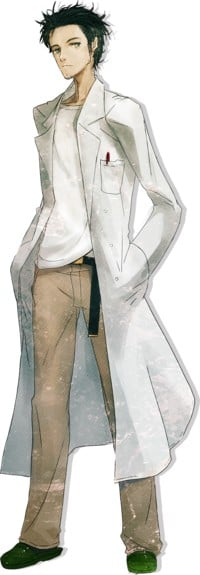
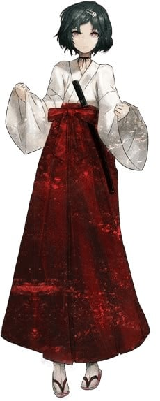
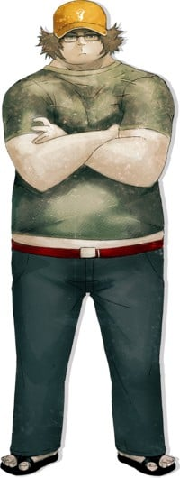

> [!bookinfo|noicon]+ **命运石之门 聪明睿智的认知计算**
> 
>
| 日文名 | STEINS;GATE 聡明叡智のコグニティブ・コンピューティング |
|:------: |:------------------------------------------: |
| 类型 | 游戏改 |
| 新番 | 2014 年 10 月 |
| 集数 | 共4话 |
| 官网 | [http://www.mugendai-web.jp/steinsgate/](https://http://www.mugendai-web.jp/steinsgate/) |
| 制作 | WHITE FOX |
| 导演 | 川村賢一,村川健一郎 |
| 脚本 | 林直孝 |
| 评分 | 7|
| 制片人 |  |

> [!abstract]+ **简介**
> 命运石之门×IBM推出新作动画系列短片：IBM与《命运石之门》的合作企划官网开放，并制作了新作动画短片系列《聪明睿智的认知计算》，讲述了IBM提倡的次世代认知型计算系统融入并改变了冈部等主角们生活的故事。

> [!tip]+ **章节列表**
>- [ ] 第1话：料理篇 (2014-10-15)
>- [ ] 第2话：导航篇 (2014-10-22)
>- [ ] 第3话：时尚篇 (2014-11-05)
>- [ ] 第4话：会议篇 (2014-11-12)

> [!tip]+ **主要角色**
> 
| 角色 | CV | 简介| 角色图片 |
|:----:|:---:|:---:|:--------:|
| 椎名まゆり | 花澤香菜 | 私立花浅葱大学附属学园二年级。 保持着不紧不慢的行动和语调，是个一直挂着笑容的天然系角色。 相当能吃，即使吃很多还是很瘦。 虽然住在池袋，不过每天都去与学校和打工地点很近的未来道具研究所。 对冈伦的厨二病发言不装傻也不吐槽而是直接点头接受(直接忽视的次数也很多)。  虽然是未来道具研究所的成员，不过对于发明没有兴趣，所以转而制作 Cosplay 服。 但实际上做的只有女性服装，而且自己并不穿，最近正努力地在使漆原(伪娘)穿上自己制作的衣服。 受到景仰的奶奶的影响，喜欢抬头仰望星空，经常可以看到她面向夜空伸出手。 |  |
| 岡部倫太郎 | 宮野真守 | 主人公，东京电机大学一年级，“未来道具研究所”研究员No.001。 虽然清瘦的外表看上去很帅，但交谈时会突然掏出手机，然后开始莫名其妙的自言自语，并在结束的时候附上“这是 Steins;Gate 的选择”和不明所以的“エル・プサイ・コングルゥ”的句尾，不禁使人退避三舍，是个严重厨二病患者。 自称是狂乱的疯狂科学家，而为了将这个自我设定扮演好，平时的行动也总是装出一副恶役般的造型。 以改革世界的支配构造为最终目标进行活动。不过实际上做的事是在“未来道具研究所”里天天制作奇怪的发明。 他的“信念”过于强烈，又不会看别人脸色做事，这使得他身边的朋友非常少。 |  |
| 牧瀬紅莉栖 | 今井麻美 | 维克多·孔多利亚（原型为哥伦比亚大学）大学脑科学研究所的研究员，18 岁即从大学毕业(因为美国的跳级制度，所以实际年龄跟高三学生相当)，在美国著名的学术杂志上刊登论文而受到瞩目。 或许是因为饱尝周围人们充满羡慕与嫉妒的目光，面对他人时从来不会露出半点破绽。 然而作为研究者，其本质还是个难以掩藏旺盛的好奇心、对感兴趣的事物一头扎进去的女孩。 其言行让人感觉比起一般世间的常识更加注重研究的成果，而因此也被冈部评为“相当程度的科学狂人“，然而本人却并不这么认为。  外表是个美人，纤细的双腿充满魅力。 平时穿着按照自己的风格所改造的高中制服，虽然严格来说已经不是高中生了，不过常用“因为可爱”这样的理由进行辩解。 是个典型的傲娇，而且是一旦关系变好后就用情很深的类型。 平时经常引用动画『10之使魔』女主角“露易丝”的台词，但这似乎只是受到大型论坛2ch的影响而在不知出处的情况下使用。 想做一名匿名的 2cher，不过却反而暴露出来。 因为天才的个性使然，所以对冈伦的厨二病发言毫不留情。 |  |
| 阿万音鈴羽 |  | 在未来道具研究所所在的一楼「显象管工房」打工的少女。 因为直率的性格(也被说成自来熟)，所以和别人的关系能很快就融洽起来(但不知原因惟独敌视红莉栖) 。 虽然有时元气过剩，时时让人感觉粗枝大叶，但实际相处起来还是个很乐于帮助人的人，也会有很细心的一面。  不过在与人交往时往往不会相交太深，也不喜欢借助他人的力量，因此即使自己已经陷入困境，除非实在无法忍耐下去，否则也不会向周围的人诉说。 从不提及自己的事，因此让人感觉充满了谜团。　　  能把杂草虫子之类的东西很好地进行料理，看起来拥有很高的生存能力。 相当擅长的格斗技，有着在实战中也不辱其名的实力，本人则称之为生存技巧。  　　她生活的中心就是骑自行车，是个狂热的自行车爱好者。 一但提到时就会性格突变，采取积极的行动，甚至还会邀请冈伦和桥田等未来道具研究所成员一起骑车去兜风。 常用Mountain Bike(山地自行车)，简称 MTB。 虽然刚买不久，不过已经完全喜欢上了，常能看见她在「显像管工房」前努力维护自行车的身影。 |  |
| 漆原るか |  | 私立花浅葱大学附属学园二年级。秋叶原的柳林神社当家的儿子。在家里的神社时穿着巫女服。 　　清秀端庄，一副正统美少女的性格——不过，是男性。 　　外表上怎么看都是美少女——不过，是男性。 　　(因为是男性，所以胸部是机场。) 　　不喜欢引人注目，也没有什么自己的主张，一遇到问题就会脸红。做事认真缺乏变通。一直被真由理拜托穿 Cosplay服，虽然毎次都以「害羞」为借口拒绝，但她(？)还能坚持多久呢。妖刀・ 五月雨作为柳林神社代代相传的退魔宝刀，其实是冈伦送给他的仿制刀(980 日元)。身为师父的冈伦命令他每天练习抡刀，如果没带的话会被训斥。因为本性过于认真，所以把冈伦的厨二病发言都误解成了事实。总是把暗语说错。 　　请参见『STEINS;GATE』女主角报告　“漆原 るか”是大和抚子般的伪娘巫女 |  |
| フェイリス・ニャンニャン |  | 　　在秋叶原的大人气猫耳女仆咖啡厅打工的少女。因为平时就戴着猫耳，所以使用着动画中常出现的“喵喵～”的口癖。自称有着只要注视对方眼睛就知道内心想法的特殊能力“笑面猫的微笑”，所以对他人的心情十分敏感。由于猫耳的萌要素和能力使她在打工的地方赢得了 No.1 的人气，是那种玩弄男人内心的小恶魔。 　　在世界规模的人气对战卡片游戏『雷 net access battles』上有着一流的技术，不过并没有怎么在正式比赛中出过场。因为是战略性很高的游戏，所以她擅长的心理洞察的特殊能力能得到充分的发挥。 　　虽然是冈伦天敌一般的存在，却亲切地(？)称呼他为“凤凰院凶真”，经常把他耍得团团转。 |  |
| 橋田至 | 関智一 | 　东京电机大学一年级。冈伦高中时代的友人，两人也在同一所大学上学。因为出色的编程和黑客技术，被冈伦称为「右手」的未来道具研究所的宝贵战力。 　　御宅族，常常使用2ch用语，喜欢谈下半身的话题，是个从2次元到3次元甚至到无机物都能萌上的家伙。口癖“常考”。最近喜欢的是动画『10 之使魔』的露易丝，在女仆咖啡厅『女仆皇后+喵 2』打工的菲利斯等。 |  |
| 桐生萌郁 |  | 为了都市传说的取材而寻找幻之 PC「IBN5100」的时候，在秋叶原邂逅了冈伦。她沉默寡言到了与别人的交流全部都要通过手机短信的地步(就算对方在眼前)。虽然会让人觉得她的性格十分冷淡，但其实只是因为她不擅长与别人交谈罢了。而且这个不擅长当面交谈的问题即使通过电话也改不了，所以与其说是手机依赖症，不如说是手机短信依赖症更为恰当。 　　让人大跌眼镜的是，她透过短信传达过来的感情意外的高昂开朗，与本人的形象有着鲜明的反差。 　　每当有新机种上市，她都会立刻进行更换。另外，她打字的速度是连眼睛都跟不上的杰出的特技，亲眼目睹过的冈伦将其称之为「闪光的指压师」(Shining Finger，机战玩家一定很熟悉)。 |  |
| 天王寺綯 | 山本彩乃 | 电器店店长兼Rounder指挥官天王寺裕吾的女儿，十一岁。 有点害怕冈部和桥田，被两人称作“小动物”。 |  |
| ピンクウパ | 山本彩乃 | 来自《命运石之门 聪明睿智的认知计算》中登场的粉红色乌帕，由牧濑红莉栖制造，目前已知功能是可以协助制作料理并计算料理所需食材，此外还有智能手机应用版本，拥有导航功能但是也会恶作剧…(后续待补充) |  |
| 天王寺裕吾 |  | 32歳。1978年3月12日生まれ。身長187cm、体重86kg。血液型はO型。 未来ガジェット研究所階下、大檜山ビル1階で「ブラウン管工房」を経営している中年の大男。岡部からは「ミスターブラウン」と呼ばれている。ブラウン管と娘の綯をこよなく愛し、液晶や綯にちょっかいをかける者に対しては怒りを抱く。怒らせると容赦なく鉄拳制裁を加えたりするが、基本的に度量が広く優しい性格をしている。また、大檜山ビルのオーナーでもあるため、借主の岡部達にとっては頭の上がらない存在であるが、格安の家賃でスペースを貸したり入居祝いにとブラウン管テレビ（オンボロではあるが）を譲ったりしている。 フランスへの長期滞在経験がある。フランス育ちで、1997年に日本へと来た。漫画「恩讐のブラウニアンモーション」では「M2」のコードネームを持つラウンダーであった若い頃の彼が主人公である。 科学シリーズの『ROBOTICS;NOTES』において、2019年8月時点でも存命であり、相変わらず娘の綯を愛しているようである。 |  |