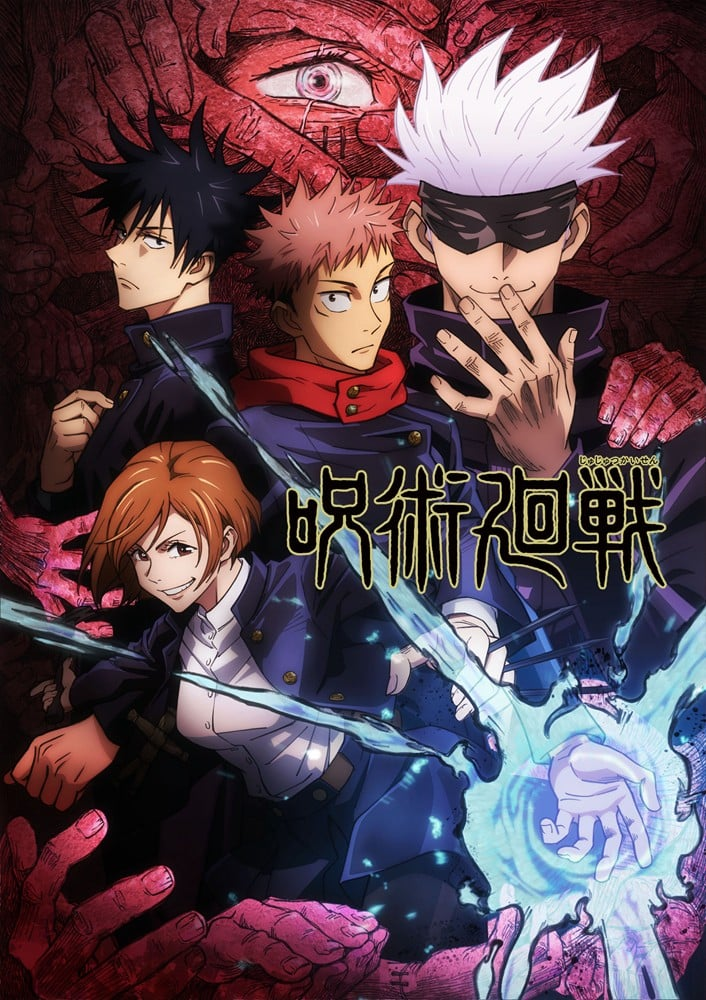

> [!bookinfo|noicon]+ **咒术回战**
> 
>
| 日文名 | 呪術廻戦 |
|:------: |:------------------------------------------: |
| 类型 | 漫改 |
| 新番 | 2020 年 10 月 |
| 集数 | 共24话 |
| 官网 | [https://jujutsukaisen.jp/](https://https://jujutsukaisen.jp/) |
| 制作 | MAPPA |
| 导演 | 朴性厚 |
| 脚本 | 瀬古浩司 |
| 评分 | 7.1|
| 制片人 | 瀬下恵介 |

> [!abstract]+ **简介**
> 少年战斗着——「为寻求正确的死亡」
辛酸·后悔·耻辱人类产生的负面情感，化为诅咒，潜入日常生活诅咒是蔓延于世界的祸源，最糟糕的情况下，会让人类踏入死亡，并且诅咒只能以诅咒拔除。
虎杖悠仁是一位体育万能的高中生，某天他为了从“咒物”危机中解救学姐，而吞下了被诅咒的手指“两面宿傩之指”，让“宿傩”这种诅咒跟自己合而为一。
在最强咒术师五条悟的指引下，进入对诅咒专门机关「东京都立咒术高等专门学校」，并遇到了伏黑惠与钉崎野蔷薇这两位同学。
某日，突然出现“特级咒物”，他们三人就奉命到现场支援。为了实现爷爷要他“助人”的遗言，虎杖将会继续与“诅咒”奋斗下去。
为了祓除诅咒而成为诅咒的少年，无法回头的壮阔故事开始了——

> [!tip]+ **章节列表**
>- [ ] 第1话：两面宿傩 (2020-10-02)
>- [ ] 第2话：为了自己 (2020-10-09)
>- [ ] 第3话：铁娘子 (2020-10-16)
>- [ ] 第4话：咒胎戴天 (2020-10-23)
>- [ ] 第5话：咒胎戴天 二 (2020-10-30)
>- [ ] 第6话：雨后 (2020-11-06)
>- [ ] 第7话：急袭 (2020-11-13)
>- [ ] 第8话：无聊 (2020-11-20)
>- [ ] 第9话：幼鱼与逆罚 (2020-11-27)
>- [ ] 第10话：无为转变 (2020-12-04)
>- [ ] 第11话：守旧愚蠢 (2020-12-11)
>- [ ] 第12话：致曾几何时的你 (2020-12-18)
>- [ ] 第13话：明天见 (2020-12-25)
>- [ ] 第14话：京都姐妹校交流会-团体战0- (2021-01-15)
>- [ ] 第15话：京都姐妹校交流会-团体战①- (2021-01-22)
>- [ ] 第16话：京都姐妹校交流会-团体战②- (2021-01-29)
>- [ ] 第17话：京都姐妹校交流会-团体战③- (2021-02-05)
>- [ ] 第18话：贤者 (2021-02-12)
>- [ ] 第19话：黑闪 (2021-02-19)
>- [ ] 第20话：超规格 (2021-02-26)
>- [ ] 第21话：咒术甲子园 (2021-03-05)
>- [ ] 第22话：起始雷同 (2021-03-12)
>- [ ] 第23话：起始雷同 二 (2021-03-19)
>- [ ] 第24话：共犯 (2021-03-26)
>- [ ] 第1话：新春特番『呪術廻戦』今からでも間に合う 見逃して後悔はしたくない！スペシャル！ (2021-01-08)

> [!tip]+ **主要角色**
> 
| 角色 | CV | 简介| 角色图片 |
|:----:|:---:|:---:|:--------:|
| 虎杖悠仁 | 榎木淳弥 | 本作主人公，爱看电视，常做些微妙的模仿，拿手戏很多，体脂率极低，有极强的运动神经，同时有超乎常人的身体能力可以将铅球扔向运动场的另一端并把笼门框打坏。 |  |
| 伏黒恵 | 内田雄馬 | 东京咒术高专一年级男学生，入学第一年就被冠以二级咒术师称号的天才少年，有禅院家的血脉，被加茂评价道论天赋比宗家还优秀。擅长使用以影子作为媒介的动物式神。 |  |
| 釘崎野薔薇 | 瀬戸麻沙美 | 东京咒术高专一年级女学生，发色是染出来的。很尊敬同样身为女性咒术师的禅院真希。 |  |
| 五条悟 | 中村悠一 | 东京咒术高专一年级男班主任，28岁，身高超过190cm。个性轻浮，是个什么都会的人，所以就什么都不做，本人称之“培养新人”，大多时间为刺猬头(抓出来的)，并以黑布遮盖住眼睛作为眼罩用的造型示人，偶尔会将头发放下，原本并不喜欢甜食，但因需要动脑想很多事情，所以吃甜点来帮助脑部有效率地运转，久而久之变成了甜食控。 |  |
| 両面宿儺 | 諏訪部順一 | 千年以上前に生存し、死後もなお現世を脅かす呪いの王。呪術全盛の時代、術師が総力を挙げて彼に挑み敗れた。死後その死体は屍蝋の呪物となって様々な呪いを引きつけ悪化させる。指を取り込んだ虎杖の体に受肉し、人類塵殺を高らかに謳う。 |  |
| 禪院真希 | 小松未可子 | 東京都立呪術高等専門学校二年 等級：4級 エリート呪術師の家系に生まれるも、呪力を持たず呪いも見えない。呪力を持たない分、高い身体能力を持ち、呪具使いとして禅院家を見返すべく奮闘する。 |  |
| 狗巻棘 | 内山昂輝 | 東京都立呪術高等専門学校二年 等級：準1級 呪言師。己の言葉が呪いの武器となる呪言師の末裔。普段から不用意に人を呪わないよう、おにぎりの具でのみ会話をする。 |  |
| パンダ | 関智一 | 東京都立呪術高等専門学校二年 等級：準2級 見た目はただのパンダだが、その正体は夜蛾校長が作り出した、人語を話す突然変異呪骸。 感情豊かで、面倒見がよく漢気もある。 |  |
| 七海建人 | 津田健次郎 | 等級：1級 五条の後輩で脱サラ一級呪術師。高専で呪術師はクソということを学び、一般企業で労働はクソであると学び、より適性のある呪術師となった。大人オブ大人。 |  |
| 伊地知潔高 | 岩田光央 | 東京都立呪術高等専門学校の補助監督。呪術師を現場に送り届ける、結界術で帳を作る、任務方針の指示、等バックアップを担当する。事務仕事が非常に得意。 |  |
| 家入硝子 | 遠藤綾 | 東京都立呪術高等専門学校の医師。呪力を反転させ正のエネルギーを生む「反転術式」を駆使し、他人の体をも修復し命を救う。いつもけだるげなのは、寝不足か好物の酒のせいか。 |  |
| 夜蛾正道 | 黒田崇矢 | 東京都立呪術高等専門学校の学長。人形に呪いを込めた呪骸を生み出すことができる。以前は五条や家入の担任でもあった。熱いハートをその身に宿す教育者。 |  |