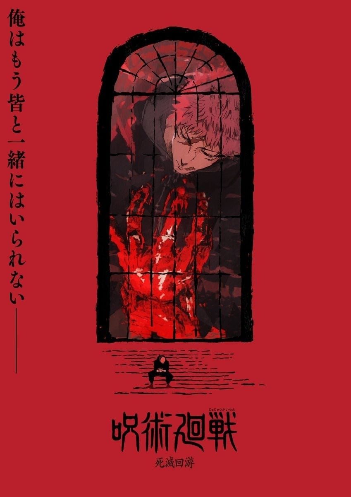
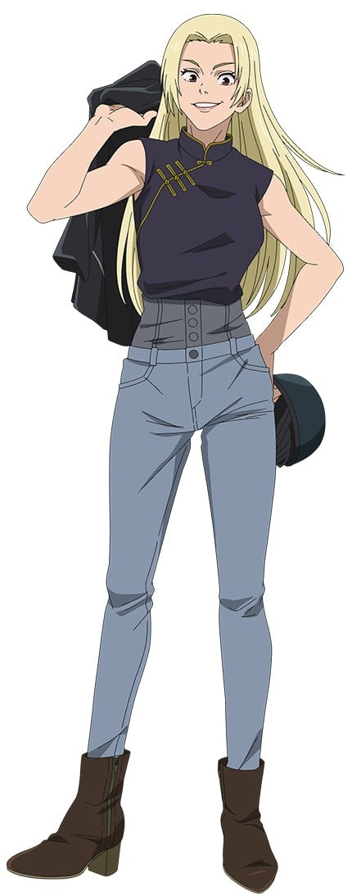
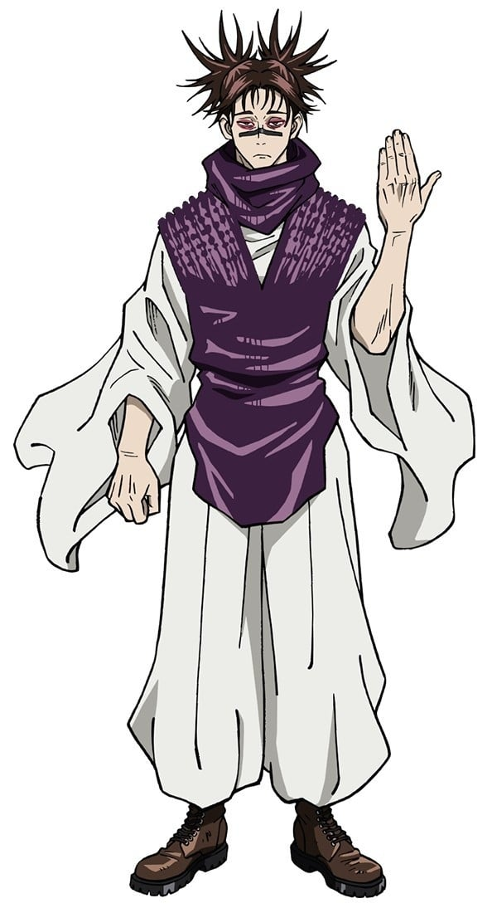
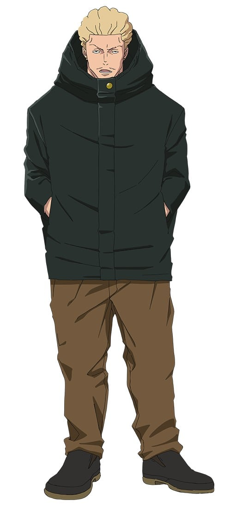
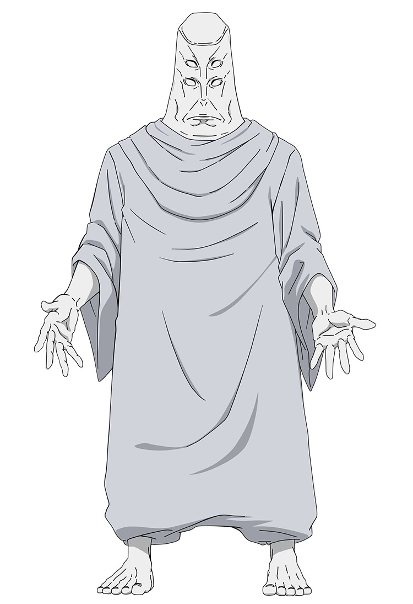
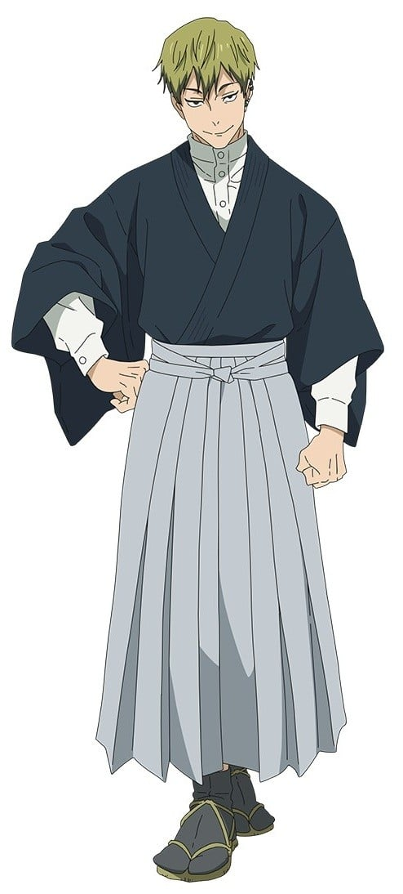
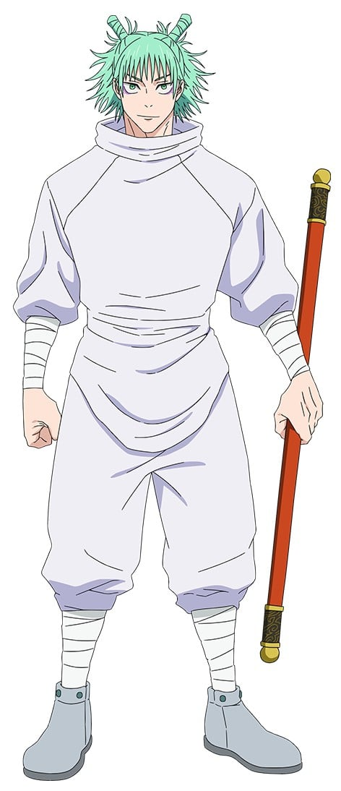
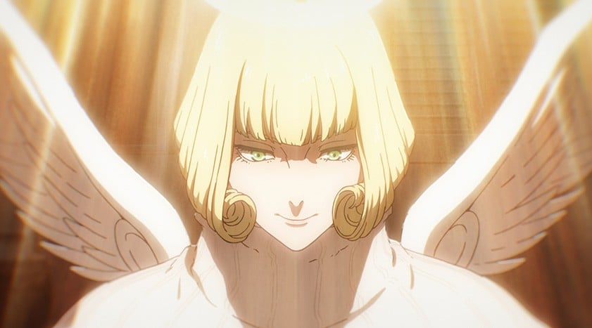
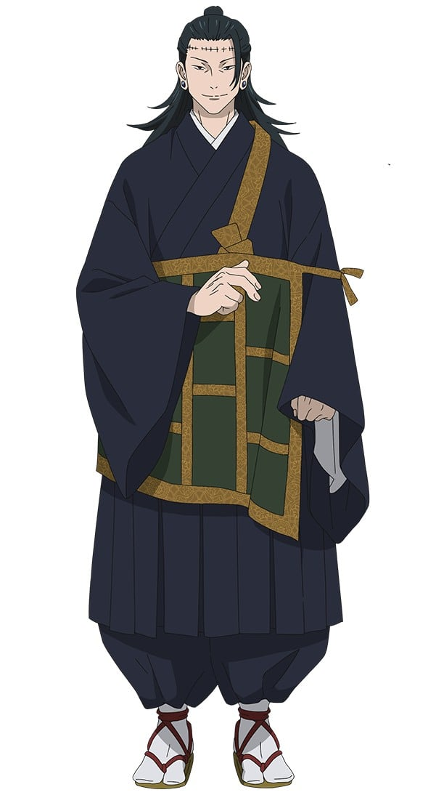

> [!bookinfo|noicon]+ **咒术回战 死灭回游 后篇**
> 
>
| 日文名 | 呪術廻戦 死滅回游 後編 |
|:------: |:------------------------------------------: |
| 类型 | 漫改 |
| 新番 | 0 年 0 月 |
| 集数 | 共0话 |
| 官网 | [https://jujutsukaisen.jp/](https://https://jujutsukaisen.jp/) |
| 制作 | MAPPA |
| 导演 |  |
| 脚本 |  |
| 评分 | 7.8|
| 制片人 |  |

> [!abstract]+ **简介**
> 

> [!tip]+ **章节列表**
- 暂无章节信息

> [!tip]+ **主要角色**
> 
| 角色 | CV | 简介| 角色图片 |
|:----:|:---:|:---:|:--------:|
| 虎杖悠仁 |  | 本作主人公，爱看电视，常做些微妙的模仿，拿手戏很多，体脂率极低，有极强的运动神经，同时有超乎常人的身体能力可以将铅球扔向运动场的另一端并把笼门框打坏。 |  |
| 伏黒恵 |  | 东京咒术高专一年级男学生，入学第一年就被冠以二级咒术师称号的天才少年，有禅院家的血脉，被加茂评价道论天赋比宗家还优秀。擅长使用以影子作为媒介的动物式神。 |  |
| 両面宿儺 |  | 千年以上前に生存し、死後もなお現世を脅かす呪いの王。呪術全盛の時代、術師が総力を挙げて彼に挑み敗れた。死後その死体は屍蝋の呪物となって様々な呪いを引きつけ悪化させる。指を取り込んだ虎杖の体に受肉し、人類塵殺を高らかに謳う。 |  |
| 禪院真希 |  | 東京都立呪術高等専門学校二年 等級：4級 エリート呪術師の家系に生まれるも、呪力を持たず呪いも見えない。呪力を持たない分、高い身体能力を持ち、呪具使いとして禅院家を見返すべく奮闘する。 |  |
| 九十九由基 |  | 作中现存的四名特级咒术师之一，东堂葵的导师。 高个子且面容身材姣好的长发女性。性格开朗，有时会突然大笑。 虽然身为特级，但完全不接任务，总是在国外游手好闲，将自己评为很不靠谱。 兴趣是摩托车，喜欢吃鸡肉卷，讨厌海藻类的东西，压力的来源是任务。 |  |
| 脹相 |  | 人称“史上最邪恶的术师”的加茂宪伦所制造的特级咒物“咒胎九相图”的胎儿之一；九相图的长子，诅咒和人类的混血的特级咒灵。  能够感觉到弟弟们的状态，尤其是死亡这一信号。非常爱自己的弟弟，可以为了他们去死。 |  |
| 秤金次 |  | 東京都立呪術高等専門学校三年 呪術界上層部保守派と揉めて停学中。胴元として賭け試合を主催している。"熱"を愛し、よりダイレクトな"熱"のやり取りであるギャンブルを好む。乙骨曰く「ノってるときは僕より強い」。 |  |
| 天元 |  | 不死の術式を持ち、都立呪術高専最下層「薨星宮 本殿」にいる国内結界の要となる存在。 |  |
| 禪院直哉 |  | 等級：特別一級 禪院家26代目当主・禪院直毘人の息子で、真希・真依の従兄弟。 |  |
| 鹿紫雲一 |  | 受肉して復活した過去の術師。 100点を使用して死滅回游へのルール追加を行う。 |  |
| 来栖華 |  |  |  |
| 羂索 |  | [mask]先后附身加茂宪伦、虎杖香织、夏油杰[/mask] |  |