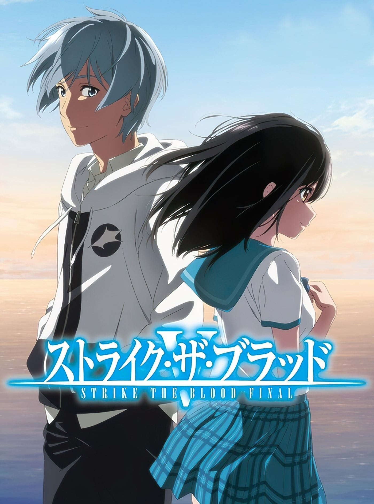
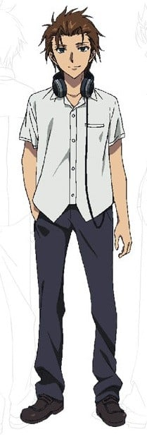
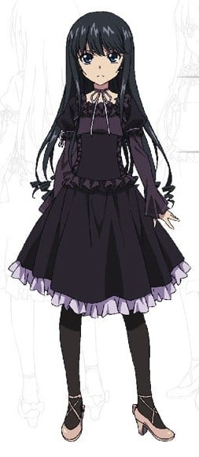
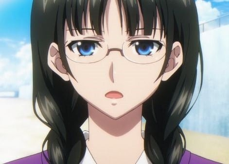
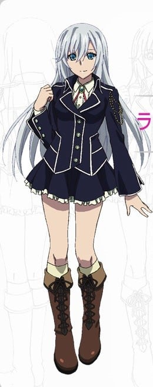
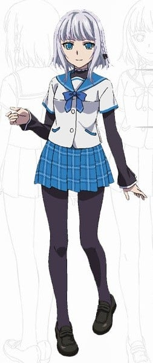
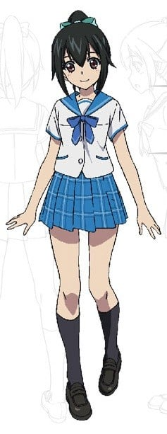

> [!bookinfo|noicon]+ **噬血狂袭 最终季**
> 
>
| 日文名 | ストライク・ザ・ブラッドFINAL |
|:------: |:------------------------------------------: |
| 类型 | 小说改 |
| 新番 | 2022 年 3 月 |
| 集数 | 共4话 |
| 官网 | [http://www.strike-the-blood.com/final/index.html](https://http://www.strike-the-blood.com/final/index.html) |
| 制作 | CONNECT |
| 导演 | 山本秀世 |
| 脚本 | 吉野弘幸 |
| 评分 | 6.6|
| 制片人 | 中川二郎,田部谷昌宏 |

> [!abstract]+ **简介**
> 2020年8月に刊行された原作小説22巻で、本編の物語が完結した「ストライク・ザ・ブラッド」。OVA第5期にあたる「ストライク・ザ・ブラッド FINAL」では、原作22巻「暁の凱旋」を全4話でアニメ化し、本編完結までを描く。OVAは全2巻で、3月30日に1巻、6月29日に2巻が、Blu-rayとDVDで発売される。

「……私は暁先輩の監視役です。これまでも、これからも」

“異境”へと渡ったＭＡＲ総帥 シャフリヤル・レンは咎神の遺産である古代の超兵器“眷獣弾頭”を入手し、世界を再び天部の支配下に置こうと目論む。
その圧倒的な武力を前に、獅子王機関と攻魔局は“異境”と現世をつなぐ“門”である絃神島の破壊を極秘裏に決定するのだった……。
上層部から下された無情な任務に思い悩む雪菜。そして大切なものを護るため、絃神島の領主として仲間と共に最後のケンカに臨む古城。

「これから先の行動は、お前が自分で決めろよ。この島をぶっ壊しに行くか、 それともこの島を救うために手を貸すか」

雪菜、浅葱、紗矢華、ラ・フォリア、雫梨……、歴代のヒロイン達も大集合し、『ストライク・ザ・ブラッド』シリーズ“完結篇”――ついに開幕!!

> [!tip]+ **章节列表**
>- [ ] 第1话：晓的凯旋Ⅰ (2022-03-30)
>- [ ] 第2话：晓的凯旋Ⅱ (2022-03-30)
>- [ ] 第3话：晓的凯旋Ⅲ (2022-07-29)
>- [ ] 第4话：晓的凯旋Ⅳ (2022-07-29)

> [!tip]+ **主要角色**
> 
| 角色 | CV | 简介| 角色图片 |
|:----:|:---:|:---:|:--------:|
| 暁古城 | 細谷佳正 | 被称为世界最强吸血鬼“第四真祖”的少年。大概15岁、16岁左右，就读于弦神岛私立彩海学园高等部一年B组、出席号为1号。 在卷一的时间点的三个月前还是个普通人类，在某一次事件中继承了上一辈的“第四真祖”「焰光的夜伯」的那个能力，而成为了新的“第四真祖”，也就是魔族。但本人还是扮成普通人类瞒着周围的人像以前一样生活着。不过本人没有吸过血因此大多眷兽不听控制。 在四年前就搬到弦神市，曾经是学校篮球队队员兼队长，拥有在比赛中被评为MVP的实力。但本人失去热情放弃打蓝球。有在夹娃娃机方面很擅长的特技。在战斗的关键时刻总是说：“从现在开始，是第四真祖的战争啊” 目前可控制眷兽： 第5号眷兽——狮子的黄金 雷之魔力组成的狮子的眷兽，灵媒是雪菜 第9号眷兽——双角的深绯 释放高周波振动波的双角兽，灵媒是纱矢华 第3号眷兽——龙蛇的水银 拥有吞噬空间能力的双头龙，灵媒是雪菜和拉·法利亚·利哈瓦因 第4号眷兽——甲壳的银雾 被银雾所覆盖的灰色甲壳兽，灵媒是优麻和纱矢华 第11号眷兽——水精的白钢 青白色的水之精灵——水妖，灵媒是雪菜 |  |
| 姫柊雪菜 | 種田梨沙 | 位于彩海学园中等部三年级。14岁的见习“剑巫”，狮子王机关的下属攻魔师。使用刻印“神格振动波驱动术式”的“七式突击降魔机枪”——“雪霞狼”（将魔力无效化的能力）。不擅长诅咒和占卜，但对于剑术和灵视很擅长。 之前在狮子王机关设立的神道女子学校“高神的森林"就读。对于大城市常见的某些东西却有点陌生（比如夹娃娃机）不擅长坐飞机。 名义上受组织任命负责监视和抹杀“第四真祖”，实际上被狮子王机关送来做“第四真祖”——晓古城的妻子（本人并不知情）。 |  |
| 藍羽浅葱 | 瀬戸麻沙美 | 彩海学园高等部一年级，古城的同学。世界顶尖骇客级的计算机天才少女，作为程序员的水平高到同行无所不知“电子的女王”的称号。现被管理弦神岛的国营公司所雇佣。特别能吃，是个超越常识级别的大胃王。 在古城搬到弦城市读国中不久与古城在国中时代就认识了，喜欢古城。 被弦神冥驾称为“该隐（魔族之祖）的巫女”，和“第四真祖”的“敌人”有某种关系。 |  |
| 矢瀬基樹 | 逢坂良太 | 浅葱的青梅竹马，古城的好朋友，非常阳光的同班同学，善于给人打诨逗笑。家庭十分富裕。 与浅葱一样与古城在国中时代就认识了。 有个大他两学年的三年级女朋友，实际上连对方的手都没牵过。 曾在国中时带了色情片去古城家被凪沙发现，其后被狂怒的凪沙严厉责备，因而一段时间得了女性恐惧症。 在国中时也是篮球部成员。擅于模仿，不太擅长唱歌，但非常擅长跳舞。 据古城及浅葱所言，基树与平时轻浮的样子相反，在细节上是处处留心的人，不过有时会过于留心，而策划出些奇怪的阴谋或多管闲事。 能力是“声响结界（Soundscape）”，能够张开雷达一般的结界来监视，还能吃下化合药物来操纵气流等。但只要受到剧烈的声音影响就会被破坏，如大规模的爆炸，并需要数小时恢复，及不擅于水中使用。 |  |
| 南宮那月 | 金元寿子 | 彩海学园高等部的英语教师，古城的班主任，性格唯我独尊，本人自称26岁。有着哥特萝莉的外表，但却有具有奇妙的威严感和领导才能而受到学生们不错的评价。被学生们称为“那月酱”，不过本人似乎不太喜欢。同时也是彩海学园的校友。 另一个身份是兼任了特区警备队的指导教官的现役的专业攻魔师，以“空隙的魔女”的称号而广为魔族所知，擅长在魔术中也是高级别的空间制御魔术，在第四卷中古城说过“在弦神市中，没有比待在她身边更安全的地方了”。实际身份为魔女（出卖灵魂给恶魔的人类），身体年龄停止在了某个时刻，作为魔女的代价为“到死为止独自看守监禁结界”。弦神岛的传说中监狱“监禁结界”的管理者，也是结界的钥匙。因此通常活动时都以魔法构筑的幻影出现，可以使用空间魔术召唤锁链战斗，本体则是沉睡在结界内。 知道晓古城第四真祖的身份，因为她的关系古城能像普通人类一样过学校生活，所以古城自然偶尔也被她拉去帮忙。 |  |
| アスタルテ | 井口裕香 | 由洛塔林基亚歼教师欧伊斯塔通过将捕获的孵化前的眷兽寄生在体内，成功地产出了寄宿着眷兽的人工生命体。 在众多培育实验中的人工生命体就只有阿斯塔鲁特培育成功存活。 三无少女，不擅长表露自己感情，常用语为“命令受诺”。说话总是用报告的语气来说话。 过去听命于洛塔林基亚歼教师欧伊斯塔，欧伊斯塔驱逐出境后就听命于南宫那月。协助那月处理一切事情。 本人因那月的兴趣而变成女仆打扮，不过本人似乎对这工作很喜欢。 眷兽为“蔷薇的指尖”（Rododaktylos）外表是约四五米高的巨人，全身被厚实的肌肉之铠甲所覆盖的，无脸的巨人。力量足以超越古老世代的眷兽。 由于非吸血鬼的体质，使用眷兽吞噬生命力的原故寿命不断减少，但由于古城打败了欧伊斯塔后借吸血的原故把眷兽消耗生命的对象转为古城自己而停止了承受使用眷兽的代价——折损寿命，不过眷兽控制权还在阿斯塔鲁特手中。 |  |
| 煌坂紗矢華 | 葉山いくみ | 舞威媛，使用弓箭的优美射手。 使用的武器是六式重装降魔弓（斩开空间的能力），名为“煌华麟（Der Freischütz）”，可变成刀或弓。 身材纤细高挑及有隐藏巨乳。 对雪菜如同妹妹一般疼爱，往往因为雪菜的事而暴走。原先作为迪米特列公爵的监视者来到弦神岛，因为父亲经常施以暴力所以有男性恐惧症，开始因为雪菜拼命追杀古城。 从雪菜7岁的时候就开始在一起了，比起雪菜真正的家人，两人在一起的时间更长。 对雪菜的爱已开始扭曲了，曾在雪菜不在房间时偷偷地钻进过雪菜的床并享受被雪菜身上的余香所包围的幸福时光。 据雪菜所言本身是非常讨厌电话的，就算是上司（男性）的电话也不想接，但在小说第三卷中得知，常常在大半夜打电话给古城，内容大多都是问雪菜当天的情况及不知为何连绵不断地对古城说教。第四卷时在电话中得知把古城设为最爱，但却说那是诅咒人死。小说第六集古城从黑猫（缘堂缘）得知她在休假期间为了私事带出“煌华麟”及将贵重的咒矢全部用完而在本土闭门思过，当式神被破坏时黑猫大叔嫌式神修理太花时间，秘密将本尊运回弦神岛时，古城误以为本尊是式神对穿上女仆装的她出手，被本尊施以三连击打倒。 喜欢古城，但因个性傲娇而不承认，以及也有洁癖。 大腿上戴着为了收纳咒矢用的皮带式箭套，如果是普通的内裤会成为阻碍而在穿或脱的时候会很麻烦，因此内裤是侧边用细绳打结的绳裤。 缘的式神模仿了纱矢华的样貌及身型。 起初和浅葱不太合得来。 也与雪菜同做晓古城的妻子（不知情），第二卷末让晓古城吸血，觉醒的第九眷兽为“双角之深绯（Alnasl Minium）”。 有一张被粗暴地撕裂，然后又被透明胶带仔细黏好的古城照片。 雪菜曾说要是纱矢华认真起来的话，就算自己跟她对战五次都未必能赢一次。 煌华麟祷词为“狮子之舞伶的高神之真射姬在此赞颂奉供。极光的炎驹，煌华的麒麟。汝为统率天乐与轰雷，缠绕愤焰射穿妖灵冥鬼之人—”。 |  |
| 緋稲古詠 |  | 狮子王机关的长老“三圣”之长，外形是一位戴眼镜的高三女生。 |  |
| 仙都木優麻 |  | 图书馆‘LCO’的苍蓝魔女，蛊惑全城的古城之旧友。阿夜为了逃狱制造出来的“女儿”，外表年龄16岁（10年前被制造出来时已是6岁模样），使用空间制御魔术。 浅葱说因优麻轻易做出各种亲密行为造成古城现在迟钝的个性。第四卷与古城接吻并交换身体。 第五卷末让晓古城吸血，治疗古城。 拥有守护者‘苍Le Bleu’，外貌为身着蓝色铠甲的无脸骑士。 |  |
| ラ・フォリア・リハヴァイン | 大西沙織 | 北欧阿尔迪基亚国王卢卡斯·立赫班的长女，身居公主之位，聪明伶俐（对晓古城有点小腹黑）以及好奇心旺盛而且具备超常行动力的人。白银皇女，夏音的侄女。因搭乘的战舰被摧毁所以漂流到“魔导士工塑”的私人无人岛，刚好碰到晓古城，并在卷末当煌坂与姬柊以及来找古城的浅葱和凪沙面前亲吻了古城。给围观的众人造成了极大的动摇。 使用强大且稀有的咒式枪，且家族都是强大的灵媒，第三卷末让晓古城吸血，觉醒的第三眷兽为“龙蛇之水银（AI Meissa Mercury）”。喜欢古城，曾说过要和他生下继承人。 第四卷时因优麻空间操控魔术的副作用因此和纱矢华一起在弦神市不断迷路，最后被转移到宾馆而一同投宿一晚，与梅雅姐妹打斗时请了阿尔迪基亚的军队支援，并打败梅雅姐妹。小说第六卷中要求古城乘坐圣环骑士团所有的试制飞机‘弗洛缇’拯救雪菜及夏音，不过‘弗洛缇’实际上是一枚经过改装的巡航导弹。 不时被侍女们灌输各种错误知识而引发极大的误会。 解放拟造圣剑的咏唱咒为“——众神的女儿宿于我身。军势的护法。剑之时代。死亡的推手终要带来胜利！” |  |
| 叶瀬夏音 |  | 模造天使，中学生，凪沙的朋友。被昵称“中学部的圣女”实际上则是‘面具寄生者’模造天使【编号XDA-7】。是阿尔迪基亚前任国王的私生女，母亲死去后被舅舅叶濑贤生认养，但却是被改造成兵器，天性善良，在废弃的亚迪拉德修道院里饲养流浪猫。在小说第六卷中，曾经与贤生目睹亚迪拉德修道院的惨剧同时以自身的灵力阻止惨剧继续扩大。 非常向往成为修女。 现在由那月作为监护人，开始在那月家生活后，现在和亚丝塔露蒂相处得非常好。 在小说第四卷得知，是属于睡觉不穿内衣的类型。 动物爱好者，平时循规蹈矩且文静，一旦和野生动物打交道，就会发挥惊人的行动力。 |  |
| 暁凪沙 | 日高里菜 | 晓古城的妹妹。彩海学园中学部三年C班，啦啦队成员，成绩优秀，家事万能，但非常爱讲话及有几近病态的洁癖，有着表里如一的性格，一般很少说别人的坏话（并不指有关别人的其他事），但当生气时会格外恐怖，和无法保守秘密，而且有不把真正想说的事说出口的麻烦性格，在小学五年级之前一直相信有圣诞老人的存在。 口味也和兄长一样十分奇特，喜欢挑战崭新的食品。 平时有为母亲深森送换洗衣物及打扫房间。 据古城所言凪沙对交通工具完全没辙，只要一乘坐时就会严重晕车。 很喜欢动物，就算是爬虫类也接受。但是对昆虫系稍微有点不擅长，特别是对海蜘蛛（雪菜曾想指出蜘蛛不是昆虫，但最后并未说出）。 |  |