> [!bookinfo|noicon]+ **在下坂本，有何贵干？**
> 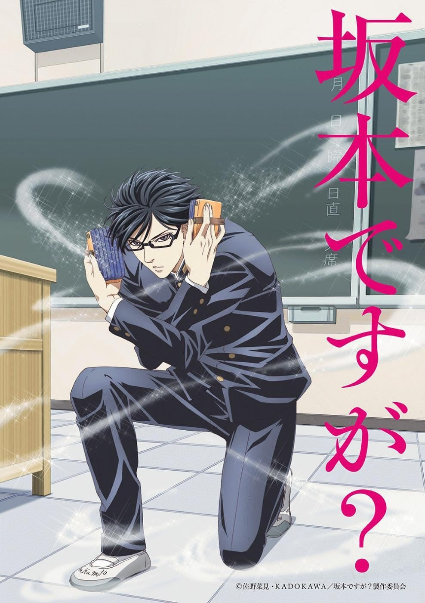
>
| 日文名 | 坂本ですが？ |
|:------: |:------------------------------------------: |
| 类型 | 漫改 |
| 新番 | 2016 年 4 月 |
| 集数 | 共13话 |
| 官网 | [http://www.tbs.co.jp/anime/sakamoto/](https://http://www.tbs.co.jp/anime/sakamoto/) |
| 制作 | スタジオディーン |
| 导演 | 高松信司 |
| 脚本 | 高松信司 |
| 评分 | 6.5|
| 制片人 |  |

> [!abstract]+ **简介**
> 酷、很酷、最最酷的高中生登场了！
本故事是某个很酷，不，是最酷的高中生坂本的校园生活的集锦。
刚入学不久，就出现一位被全班，不是被全校瞩目的学生。
他名为坂本。
一旦与他扯上关系，普通的反复横跳就会升级为秘技“Repetition Side Step”
他把上级生强加于他的“跑腿活”华丽升格为“尽心尽责的服务”。
这样炫酷的他，一举手一投足都摄人心魄。

> [!tip]+ **章节列表**
>- [ ] 第1话：1年2班坂本君/保持安静 (2016-04-07)
>- [ ] 第2话：与其被保护不如去保护/即学即会的恋爱心理术 (2016-04-21)
>- [ ] 第3话：跑腿小弟坂本/恋爱捉迷藏 (2016-04-28)
>- [ ] 第4话：坂本是色狼吗？/课堂二三事/坂本消失的夏天 (2016-05-05)
>- [ ] 第5话：投棒球/超凡脱俗的不良少年8823学长/健康管理 (2016-05-12)
>- [ ] 第6话：放学路上的规则/透过相机的爱/食堂销售学 (2016-05-19)
>- [ ] 第7话：坂本果然是色狼吗？/濑良的法国大革命 (2016-05-26)
>- [ ] 第8话：忧郁的文化祭 (2016-06-02)
>- [ ] 第9话：坂本君与我的相遇/远在天边近在眼前之人 (2016-06-09)
>- [ ] 第10话：魔王/不足之处 (2016-06-16)
>- [ ] 第11话：不要温度/1-2的回忆 (2016-06-23)
>- [ ] 第12话：再见 坂本君 (2016-06-30)
>- [ ] 第13话： (2016-10-08)

> [!tip]+ **主要角色**
> 
| 角色 | CV | 简介| 角色图片 |
|:----:|:---:|:---:|:--------:|
| モブキャラクター | 荻野晴朗 | 闲角，常称作路人，在电视剧、电影等作品中，指戏份薄弱的副角、不相关的小人物、串场的闲杂人等。可能用来表达地方民众的声音，或是充当背景。 モブキャラクター（mob character）とは、漫画、アニメ、映画、コンピュータゲームなどに描かれる端役のこと。群衆（群集）、または主要キャラクター以外の、その他大勢のこと。群集キャラ、背景キャラともいう。 |  |
| 坂本 | 緑川光 | 本作の主人公。下の名前は不詳。私立イノセンス学園出身。 メガネで七三分けの美少年。絵に描いたようなエリートで、学問・スポーツの成績どちらも優秀である。あまりにも様々な技能を兼ね備えるためこれといって目立つ特技はないが、例えば、裁縫ができる,筆記体が書ける,こちらを向いている生徒を透かして黒板の文字を板書する,(逆さに見ると正面から見た絵とは違う絵柄がでてくる)絵を描く,など洒落たものから超能力的な能力までたくさん備えている。動物が好きで、放課後に小鳥の様子を見に木の上の小屋に出向いたり、校庭に現れた犬を「ゲスト様」と呼んだりする。テストは毎回全て100点で、当然のごとく性知識が異常なほど豊富なようで保健のテストは120点を獲得している。 彼の最大の特徴は、その完璧なポテンシャルが生み出す「完全無欠の生活」であり、クラスメイトが仕掛ける罠という罠を華麗に回避することも造作ない。美男子すぎるために食堂のおばさんもデレデレになってしまうため、彼のアルバイト先で教育係を担当する松山は、そのカリスマっぷりを生かしてレジに彼を置くことで「坂本君効果」なるマダムを標的とした接客で普段混むことのない時間帯に満席にするという現象を引き起こした。そして、そのイケメンっぷりは不良グループの一人をBLに追い込むほどでもある。そんな彼には不良に絡まれた時、酷い仕打ちを考えている人物達に対して「……下衆が」と言い放つ正義感と勇敢な心を持つ一面もある。 彼はあらゆる手段を使って人を改心させることを信条としており、それこそがこの作品の一番の本筋である。その手段というのが極めて個性的な「秘技」であり、これによって確実に対象を改心させることに成功している。このことは人間を真摯に見る目と解決の糸口を見出す驚異的な観察眼と読心術的なスキルに裏付けされている。 | 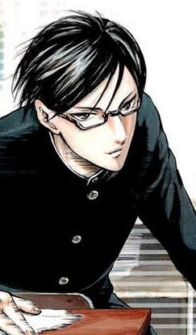 |
| 女子生徒 | 斎藤桃子 |  |  |
| 男子生徒 | 松田健一郎 |  | 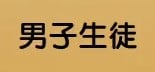 |
| 久保田吉伸 | 石田彰 | 1年2組のクラスメイト。天然パーマのチビで小太りのニキビ顔。不良たちにはパシリや財布代わりとして使われている。そんな生活を送っているのは「自分が弱いからだ」と言い訳し逃げていたが、坂本はこれを改心させ、久保田は自分の「誇り」が汚されるのが嫌だったと理解した。その一件の後は、天然パーマにストレートパーマーをかけている。話が進むにつれて勉強を坂本から教わるようになったり、8823の望む坂本とのタイマンを実現させるための挑発としてヤンキーグループの1年生2人に髪を切られた際に坂本がタイマンに向かうなど絆が深くなっている。 | 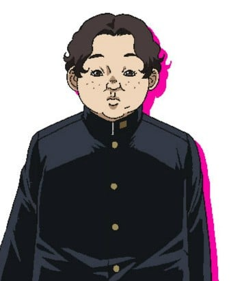 |
| 瀬良裕也 | 森久保祥太郎 | 1年2組のクラスメイト。ナルシストでオシャレに目がなく、ファッション雑誌に読者モデルとして載ることがある。ナルシスト故にそれを自慢しクラスの女子をウンザリさせている。お調子者でプライドを持ってはいるが薄っぺらく、少しの恐怖でそれは容易く崩れ去ってしまう性格。いつも注目を集める人気者の坂本をライバル視しているが、彼の完全無欠のポテンシャルを前にそのプライドはずたずたにされることとなった。しかし坂本に窮地を救われ、またその美しく戦う姿に見とれてしまい、後に「オモシロキャラ」として自分の人気の活路を見出した。しかし、その後のギャグの評判はよろしくない。また、話が進むにつれ腹の出っ張りが存在感を増してくる。 | 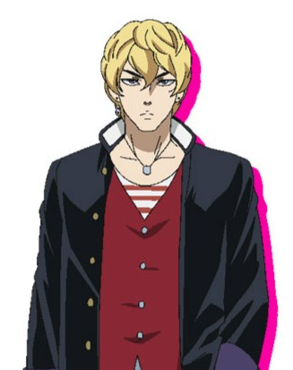 |
| 黒沼あいな | 堀江由衣 | 1年2組のクラスメイト。クラスのアイドル的存在。坂本に対して恋愛感情を持っており、彼に積極的にアタックするものの落とせないでいる。性格は計算高く、またぶりっこであることからクラスの女子には好かれていなかったが、坂本の画策によってクラスメイトとの距離が縮まることとなった。その後も他の女子生徒同様坂本に恋心を抱いており、その恋愛スキルと驚異的な身体能力を使い坂本に近づくチャンスを作ろうと努力している。見た目とは裏腹に怪力であり、女子生徒らと打ち解けた後はチンパンジー級の推定握力300kgという馬鹿力をネタにいじられるようになっている。 | 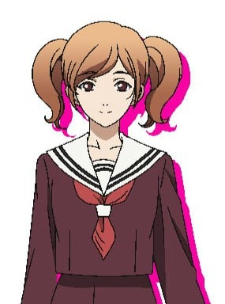 |
| 8823 | 遊佐浩二 | 2年生。ヤンキーグループの一員でイケメンかつ頭も切れ人望も厚い上に喧嘩も強いまさに学文高校のトップに君臨する漢。同年代のヤンキーを総括しており、学文の後輩ヤンキーはピンチの時に彼を頼っている。また坂本並にイケメンなので女子からの注目も高い(当然の如く、坂本には及ばない)。丸山が坂本を怖がるようになったため、示しがつかないとして勝負を挑もうとした。しかし最終的には技量でも人間としても敗北。元々義理堅いため、後輩の失態を一緒になって謝りに行ったりする。 | 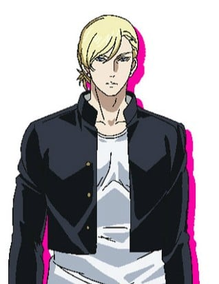 |
| 丸山 | 稲田徹 | ヤンキーグループの一員で、1年生の教育係。｢教育｣と称し1年生を扱き使うため、同じヤンキーからは冷視されている。また王様精神が強い為に周りを見下す癖があり、2年生を仕切っている8823を良く思っていない。後輩をパシらせることによって快適に高校生活を過ごそうとしたが、坂本の「おもてなし」によって心を入れ替え、自ら進んで行動するようになった。しかしその後は坂本を見るたび、おもてなしの悪夢がよみがえり嘔吐感に苛まれることとなる。 | 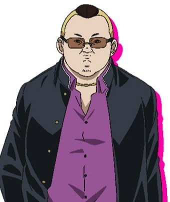 |
| 藤田恵 | 中原麻衣 | 1年2組のクラスメイト/委員長。真面目な良い子なのだが、坂本を盗撮する趣味を持っている。 | 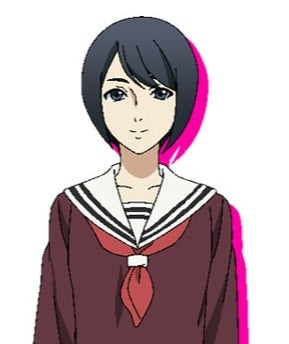 |
| 久保田茂美 | くじら | 久保田吉伸の母。韓流ドラマが好きで、特にチョン・チョリソーという俳優が好き。坂本が久保田に勉強を教えに家に来た際、チョンに似ている坂本に一目ぼれした。 | 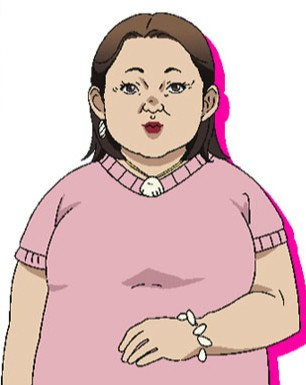 |
| 深瀬 | 岩田光央 | 8823にも恐れられる3年生。「留年している」「三十路を超えている」「バツ2」など様々な噂が飛び交うが、実年齢等その実態はつかめない。普段学校には来ないが時たまフラリと現れては、暇つぶしに学校の人気者の居場所を根こそぎ奪う「ゲーム」を仕掛けてくる。 | 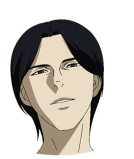 |