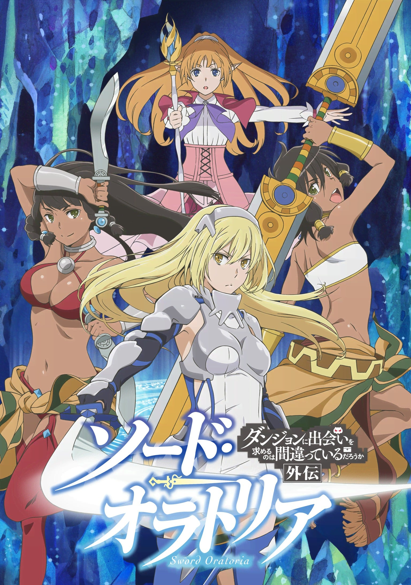
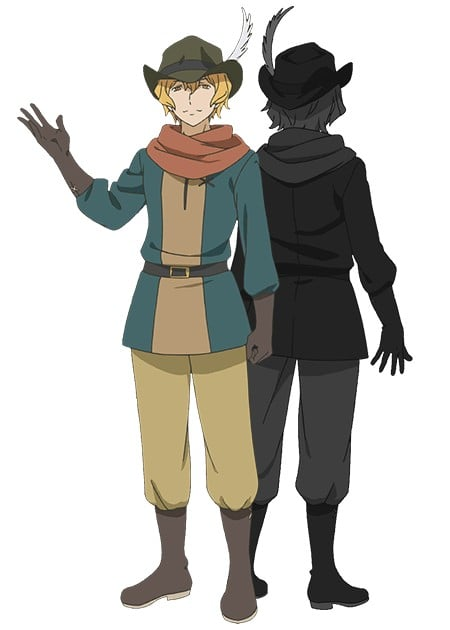
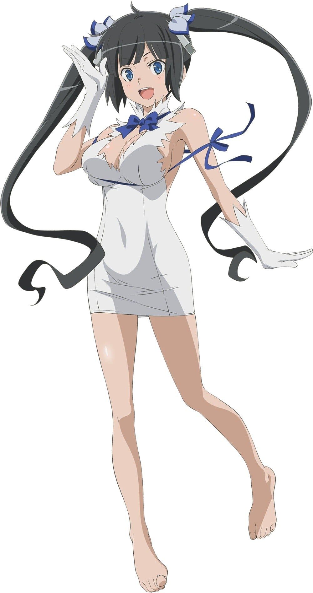
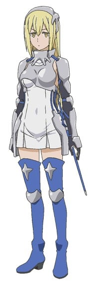
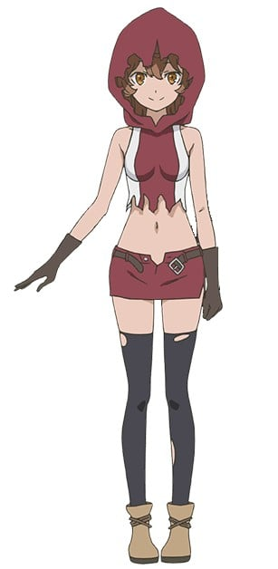
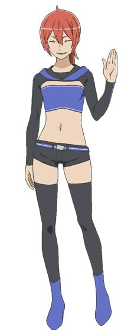
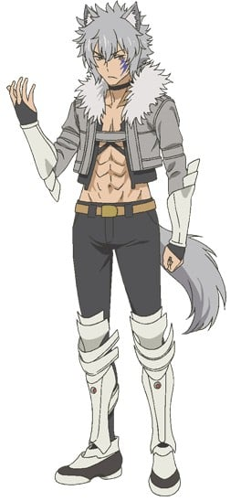
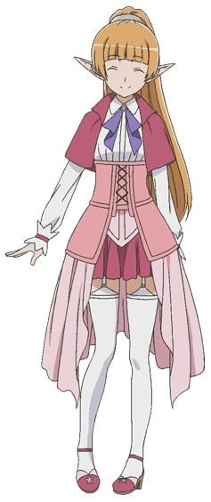

> [!bookinfo|noicon]+ **在地下城寻求邂逅是否搞错了什么 外传 剑姬神圣谭**
> 
>
| 日文名 | ダンジョンに出会いを求めるのは間違っているだろうか外伝 ソード・オラトリア |
|:------: |:------------------------------------------: |
| 类型 | 小说改 |
| 新番 | 2017 年 4 月 |
| 集数 | 共12话 |
| 官网 | [http://danmachi.com/sword_oratoria/](https://http://danmachi.com/sword_oratoria/) |
| 制作 | J.C.STAFF |
| 导演 | 鈴木洋平 |
| 脚本 | 久尾歩,谷畑ユキ,白根秀樹 |
| 评分 | 6.6|
| 制片人 | 鈴木薫 |

> [!abstract]+ **简介**
> 【剑姬】艾丝·华伦斯坦。以最强出名的女剑士今天也与同伴们一起前往广大的地下迷宫“地下城”。
在各种各样的谜团与威胁扑面而来的深层域，艾丝呼唤疾风，在迷宫的黑暗中刻画出一道闪光！
迷宫都市欧拉丽里，人们各自的故事，如今深刻地交织在了一起！
这是不断追求强大的少女，及其家族的故事。

> [!tip]+ **章节列表**
>- [ ] 第1话：剑姬与妖精 (2017-04-14)
>- [ ] 第2话：试穿与购买 (2017-04-21)
>- [ ] 第3话：祭典与勇气 (2017-04-28)
>- [ ] 第4话：杀人与宝玉 (2017-05-05)
>- [ ] 第5话：赤发与孤王 (2017-05-12)
>- [ ] 第6话：讨伐与逃亡 (2017-05-19)
>- [ ] 第7话：委托与切断 (2017-05-26)
>- [ ] 第8话：污秽与少女 (2017-06-02)
>- [ ] 第9话：训练与嫉妒 (2017-06-09)
>- [ ] 第10话：少年与英雄 (2017-06-16)
>- [ ] 第11话：冒险与未知 (2017-06-23)
>- [ ] 第12话：上神与眷族 (2017-06-30)

> [!tip]+ **主要角色**
> 
| 角色 | CV | 简介| 角色图片 |
|:----:|:---:|:---:|:--------:|
| ヘルメス | 斉藤壮馬 | 种族：神 年龄：上亿岁 喜欢的事物：旅行、闲聊 眷族徽章：带有羽翼的旅行帽及凉鞋 “荷米斯眷族”的主神，行踪不定，喜欢四处旅游，从来没有在一个地方呆着超过半个月。 受贝尔的祖父宙斯所托，前往欧拉丽观察贝尔的成长。 明著暗着帮了贝尔许多忙。 主要还是因为好玩（神之本性），甚至还骗贝尔和他去偷窥“洛基眷族”的女性洗澡。 对眷族的成员都下达了要隐瞒等级的指示，因此眷族虽然在公会中纪录为F级，但是实际上眷族的实力远远高的多。 |  |
| ヘスティア | 水瀬いのり | 本作女主角之一。降临自天界的神仙，是超越人类、亚人的高级人物，也是贝尔隶屣的【赫斯缇雅眷族】之领导者。容貌、体格一如“萝莉神”之名娇小稚嫩，不过却拥有着丰满的上围。 |  |
| ベル・クラネル | 松岡禎丞 | 本作主角。遵从祖父的教诲，梦想着能够“在地下城邂逅迷人女主角”的菜鸟冒险者。 |  |
| アイズ・ヴァレンシュタイン | 大西沙織 | 本作女主角之一，外传小说《剑姬神圣谭》的主角。对贝尔有好感。 隶属于“洛基眷族”的冒险者。拥有不逊于众女神的美貌，是贝尔憧憬的对象。 欧拉丽最强的女剑士，被人称作【剑姬】，是个家喻户晓的存在。在地下城攻略方面立下了辉煌战果，诸神、同业者在提到这类话题时总会提及她的名字。 虽然身为各种能力皆弱于其他种族的人类，却在八年前以八岁的年纪打平历史纪录。仅花一年的时间便升级为Lv.2，震撼整个欧拉丽甚至是全世界。 对外都抱持著冷淡的态度，令人摸不清楚在想什么，有点少根筋，似乎是个天然呆。 爱吃红豆奶油口味炸薯球，如果让她喝酒就会发生很麻烦的事情。 赫斯缇雅对她的称呼是“华伦什么小姐”。 洛基对她疼爱有加，视为最重要的家人，也常常想摸艾丝的屁股，但没成功过。 与贝尔恰巧在同一个酒馆时，因为眷族伙伴的不礼貌发言使贝尔颜面尽失，一直对这件事耿耿于怀。 怪物祭时偶然发现到贝尔不为人知的实力。利用眷族没有进行远征的空档锻炼贝尔，作为酒馆不愉快事件的补偿，另外想了解贝尔在极短的时间变强的秘密。 贝尔与弥诺陶洛斯一战后，发现贝尔与记忆中父亲的背影重合在一起，自此之后便十分地在意贝尔。 于安全楼层的瀑布泉池沐浴及舞会上撞见贝尔时，均展现出罕见的害羞的一面。 在第十一卷，看到贝尔周围都是女人，认为贝尔可能变坏了。 |  |
| リリルカ・アーデ | 内田真礼 | 地下城里面负责回收掉落道具等物的非战斗人员“支援者”女孩。 莉莉露卡的双亲隶属于“苏摩眷族”，故莉莉打从出生后便是“苏摩眷族”的成员。 双亲因极度缺钱前往地下城，结果葬身于战斗中。在眷族中受欺压的莉莉在外也不断受到冒险者的压榨，随后短暂逃离了眷族。眷族成员发现花店商人夫妇收留了莉莉而摧毁花店，间接导致莉莉受人厌恶，使的莉莉非常讨厌冒险者。 可能是在隶属的“苏摩眷族”里面经常是受压榨一方的关系，因此在初次遇到贝尔时，态度显得有些自甘堕落。 第二卷时开始与贝尔共同攻略地下城，对于奖金分红并非公平，总是64分帐或是73分帐使自己拿到比较多的钱。有次与贝尔在地下城将战役打完时，更偷走了贝尔的“赫斯缇雅之剑”，并拿去贩卖，结果被商人说的一文不值，之后被琉发现此事。之后在与贝尔一起冒险的过程中，数度受到贝尔的温柔感化，而且又在生死垂危之际获得搭救，因此这些事情也让她改过自新重新做人。不过在这之前却显现出对于拯救自己的贝尔感到非常震惊又感动，还糊里糊涂的大声责备贝尔为何要来救自己，对贝尔有好感，与赫斯缇雅一样，对贝尔身边的女性感到不快并经常吃醋。 擅长变身魔法，不只能够变身为犬人等其他种族，甚至连性别都能够自由控制。 在小说第六卷为脱离“苏摩眷族”而接受苏摩的条件，喝了一口神酒，但仍然能保持清醒。最后获得苏摩同意，改宗至“赫斯缇雅眷族”。 |  |
| エイナ・チュール | 戸松遥 | 冒险者公会的服务窗口小姐，是贝尔的负责人。外貌端庄，是人类和精灵的混血儿。 |  |
| シル・フローヴァ | 石上静香 | 酒馆“丰饶的女主人”的年轻女店员，在机缘巧合下与贝尔相遇。 |  |
| ロキ | 久保ユリカ | なぜかエセ関西弁を話す、ロキ・ファミリアの主神。 貧乳であることを気にしており、巨乳のヘスティアとは何かと相性が悪い。 |  |
| フレイヤ | 日笠陽子 | “芙蕾雅眷族”的主神，有著无与伦比美貌的“美神”。与洛基眷族并称为欧拉丽最强眷族。 私生活很乱，只要看到中意的总会毫不留情下手抢过来，因为身为“美神”所以具有“媚惑”能力，不论异性或同性光看到她身心很容易一下子被勾走。性格难以捉摸，经常做出意想不到的举动。 拥有看见灵魂本质的“眼”，第一眼看到贝尔后，就像恋爱般地想得到他。认为贝尔的灵魂是她所见过的最纯净美丽的灵魂，贝尔遇到的多次事件都与其的计划有关，对于阻碍贝尔成长的存在，会彻底毫不留情的击溃。 曾让奥它调教一头弥诺陶洛斯来让贝尔跨过当初的阴影。 在神会上保护贝尔，使其他神不继续追究贝尔升等快速的原因。 |  |
| ベート・ローガ | 岡本信彦 |  |  |
| レフィーヤ・ウィリディス | 木村珠莉 | 隶属于“洛基眷族”。仰慕艾丝的年轻魔导士，拥有优秀的魔力与魔法，以后卫魔导士而言堪称完美。 作为同为魔导士的里维莉雅的后继人而在修行当中。性格上有着容易紧张的一面。在艾丝她们的面前尤为显著。 |  |
| ティオネ・ヒリュテ | 髙橋ミナミ | 隶属于“洛基眷族”。 亚马逊姐妹的姐姐一方。比妹妹蒂奥娜要来得冷静，总是会在看清状况后才开始战斗。虽然平时沉稳，但在靠近团长芬恩或是遇到什么看不过去的事情时也会暴走。 |  |