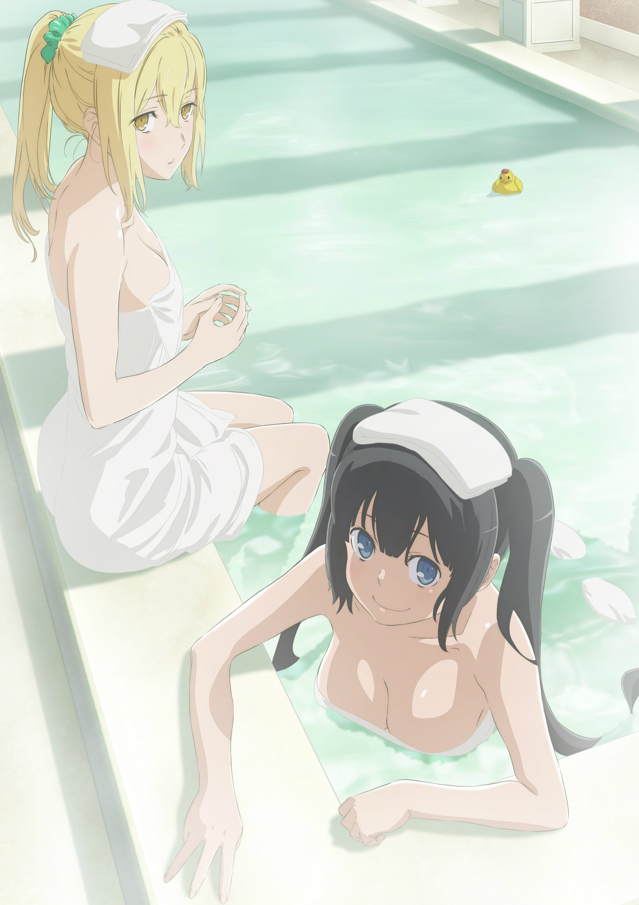
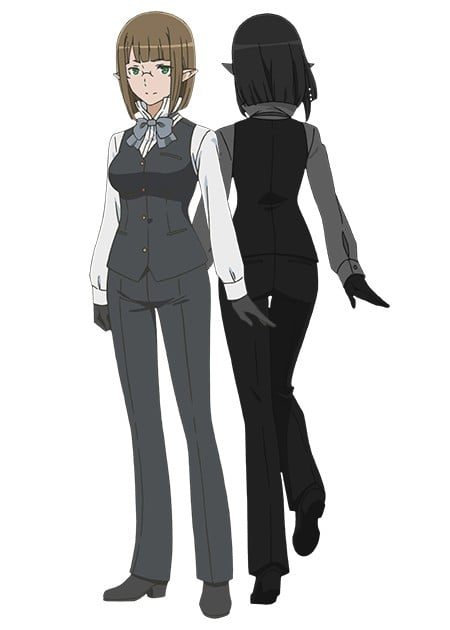
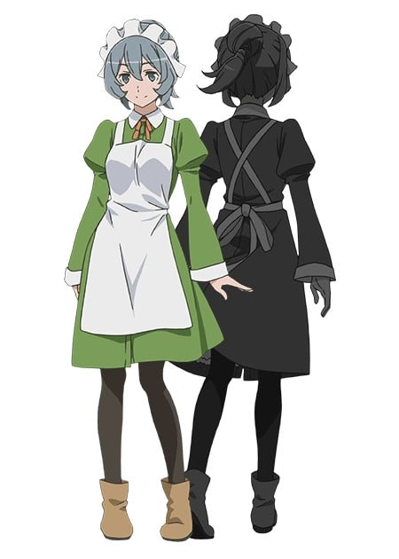
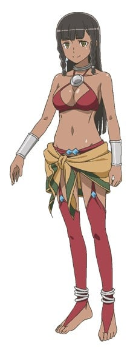
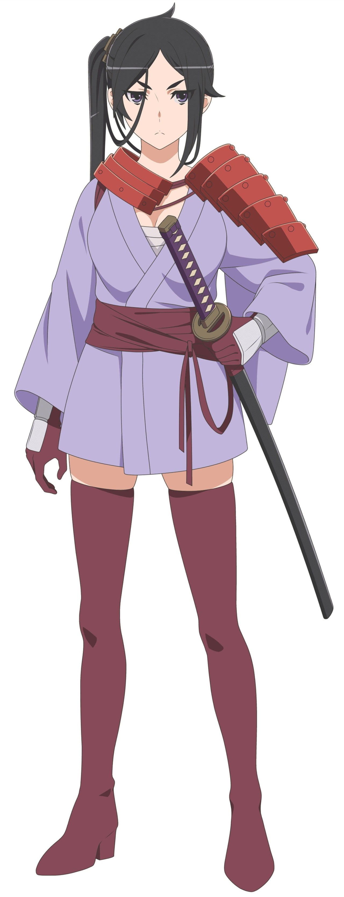
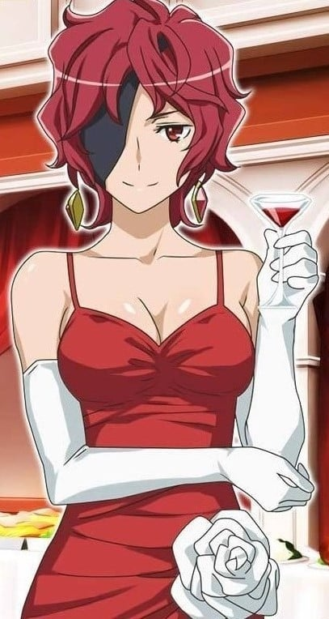
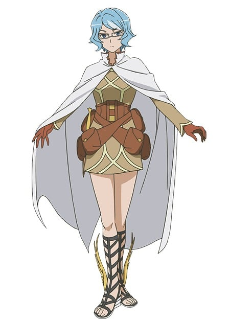

> [!bookinfo|noicon]+ **在地下城寻求邂逅是否搞错了什么 第三季 OVA**
> 
>
| 日文名 | ダンジョンに出会いを求めるのは間違っているだろうかⅢ OVA |
|:------: |:------------------------------------------: |
| 类型 | 小说改 |
| 新番 | 2021 年 4 月 |
| 集数 | 共1话 |
| 官网 | [http://danmachi.com/danmachi3/index.html](https://http://danmachi.com/danmachi3/index.html) |
| 制作 | J.C.STAFF |
| 导演 | 橘秀樹 |
| 脚本 | 白根秀樹 |
| 评分 | 6.6|
| 制片人 | 鈴木薫 |

> [!abstract]+ **简介**
> 突如、迷宮都市に出現した温泉施設――『天然温泉・お風呂の神様ケヒトの湯』降って湧いた地上の楽園で勃発する湯みどろの抗争！冒険の果て、ベルたちは真実の目撃者となる―

> [!tip]+ **章节列表**
>- [ ] 第1话：在欧拉丽寻求温泉是否搞错了什么~永远的浴场之神~ (2021-04-28)

> [!tip]+ **主要角色**
> 
| 角色 | CV | 简介| 角色图片 |
|:----:|:---:|:---:|:--------:|
| ヘルメス | 斉藤壮馬 | 种族：神 年龄：上亿岁 喜欢的事物：旅行、闲聊 眷族徽章：带有羽翼的旅行帽及凉鞋 “荷米斯眷族”的主神，行踪不定，喜欢四处旅游，从来没有在一个地方呆着超过半个月。 受贝尔的祖父宙斯所托，前往欧拉丽观察贝尔的成长。 明著暗着帮了贝尔许多忙。 主要还是因为好玩（神之本性），甚至还骗贝尔和他去偷窥“洛基眷族”的女性洗澡。 对眷族的成员都下达了要隐瞒等级的指示，因此眷族虽然在公会中纪录为F级，但是实际上眷族的实力远远高的多。 |  |
| ヘスティア | 水瀬いのり | 本作女主角之一。降临自天界的神仙，是超越人类、亚人的高级人物，也是贝尔隶屣的【赫斯缇雅眷族】之领导者。容貌、体格一如“萝莉神”之名娇小稚嫩，不过却拥有着丰满的上围。 |  |
| ベル・クラネル | 松岡禎丞 | 本作主角。遵从祖父的教诲，梦想着能够“在地下城邂逅迷人女主角”的菜鸟冒险者。 |  |
| アイズ・ヴァレンシュタイン | 大西沙織 | 本作女主角之一，外传小说《剑姬神圣谭》的主角。对贝尔有好感。 隶属于“洛基眷族”的冒险者。拥有不逊于众女神的美貌，是贝尔憧憬的对象。 欧拉丽最强的女剑士，被人称作【剑姬】，是个家喻户晓的存在。在地下城攻略方面立下了辉煌战果，诸神、同业者在提到这类话题时总会提及她的名字。 虽然身为各种能力皆弱于其他种族的人类，却在八年前以八岁的年纪打平历史纪录。仅花一年的时间便升级为Lv.2，震撼整个欧拉丽甚至是全世界。 对外都抱持著冷淡的态度，令人摸不清楚在想什么，有点少根筋，似乎是个天然呆。 爱吃红豆奶油口味炸薯球，如果让她喝酒就会发生很麻烦的事情。 赫斯缇雅对她的称呼是“华伦什么小姐”。 洛基对她疼爱有加，视为最重要的家人，也常常想摸艾丝的屁股，但没成功过。 与贝尔恰巧在同一个酒馆时，因为眷族伙伴的不礼貌发言使贝尔颜面尽失，一直对这件事耿耿于怀。 怪物祭时偶然发现到贝尔不为人知的实力。利用眷族没有进行远征的空档锻炼贝尔，作为酒馆不愉快事件的补偿，另外想了解贝尔在极短的时间变强的秘密。 贝尔与弥诺陶洛斯一战后，发现贝尔与记忆中父亲的背影重合在一起，自此之后便十分地在意贝尔。 于安全楼层的瀑布泉池沐浴及舞会上撞见贝尔时，均展现出罕见的害羞的一面。 在第十一卷，看到贝尔周围都是女人，认为贝尔可能变坏了。 |  |
| リリルカ・アーデ | 内田真礼 | 地下城里面负责回收掉落道具等物的非战斗人员“支援者”女孩。 莉莉露卡的双亲隶属于“苏摩眷族”，故莉莉打从出生后便是“苏摩眷族”的成员。 双亲因极度缺钱前往地下城，结果葬身于战斗中。在眷族中受欺压的莉莉在外也不断受到冒险者的压榨，随后短暂逃离了眷族。眷族成员发现花店商人夫妇收留了莉莉而摧毁花店，间接导致莉莉受人厌恶，使的莉莉非常讨厌冒险者。 可能是在隶属的“苏摩眷族”里面经常是受压榨一方的关系，因此在初次遇到贝尔时，态度显得有些自甘堕落。 第二卷时开始与贝尔共同攻略地下城，对于奖金分红并非公平，总是64分帐或是73分帐使自己拿到比较多的钱。有次与贝尔在地下城将战役打完时，更偷走了贝尔的“赫斯缇雅之剑”，并拿去贩卖，结果被商人说的一文不值，之后被琉发现此事。之后在与贝尔一起冒险的过程中，数度受到贝尔的温柔感化，而且又在生死垂危之际获得搭救，因此这些事情也让她改过自新重新做人。不过在这之前却显现出对于拯救自己的贝尔感到非常震惊又感动，还糊里糊涂的大声责备贝尔为何要来救自己，对贝尔有好感，与赫斯缇雅一样，对贝尔身边的女性感到不快并经常吃醋。 擅长变身魔法，不只能够变身为犬人等其他种族，甚至连性别都能够自由控制。 在小说第六卷为脱离“苏摩眷族”而接受苏摩的条件，喝了一口神酒，但仍然能保持清醒。最后获得苏摩同意，改宗至“赫斯缇雅眷族”。 |  |
| エイナ・チュール | 戸松遥 | 冒险者公会的服务窗口小姐，是贝尔的负责人。外貌端庄，是人类和精灵的混血儿。 |  |
| シル・フローヴァ | 石上静香 | 酒馆“丰饶的女主人”的年轻女店员，在机缘巧合下与贝尔相遇。 |  |
| ヴェルフ・クロッゾ | 細谷佳正 | ベルのパーティーメンバー。職人気質で気持ちのいい性格。面倒見もよくベルの兄貴分のような存在。17歳。『戦える鍛冶師』を自称しているだけあり、パーティでも前線を担う。 王国（ラキア）の鍛冶貴族クロッゾ家の末裔。魔剣を打つには本来高い【鍛冶】アビリティが必要だが、《魔剣血統》 のスキルによりこれを作成することが出来る。魔剣を生み出す力はオラリオ最高の鍛冶師である椿すら凌ぐ。 |  |
| ティオネ・ヒリュテ | 髙橋ミナミ | 隶属于“洛基眷族”。 亚马逊姐妹的姐姐一方。比妹妹蒂奥娜要来得冷静，总是会在看清状况后才开始战斗。虽然平时沉稳，但在靠近团长芬恩或是遇到什么看不过去的事情时也会暴走。 |  |
| ヤマト・命 |  | 极东出身的女冒险者。原“建御雷眷族”成员。 曾与“建御雷眷族”其他5名成员在攻略中层时遭遇强大魔物，迫不得已向贝尔的小队使用了“怪物奉送”。为此一直觉得对不起贝尔他们。 由于愧疚，在“赫斯缇雅眷族”与“阿波罗眷族”进行战争游戏时，以一年时间为限，改宗进入“赫斯缇雅眷族”进行支援。 自幼父母离她而去，由建御雷照顾，由年幼开始便对建御雷产生感情，成大后化为爱慕之情。 |  |
| ヘファイストス | 寺崎裕香 | 种族：女神 年龄：上亿岁 喜欢的事物：铁匠们打造的未知武器 锻造的女神，率领精通锻造技术的“赫菲斯托丝眷族”。 眷族所打造的武器与经营的店面都有着“Ηφαιστος”的著名标记。 与赫斯缇雅有着剪不断理还乱的孽缘，总是在不知不觉中照顾着她，就像个大姐头。 贝尔的武器“赫斯缇雅之刃”就是由她所锻造。 |  |
| アスフィ・アル・アンドロメダ |  | 等级：Lv.4（对外宣称Lv.2） 称号：万能者Perseus 种族：人类 职业：冒险者、魔道具制作者 发展能力：神秘、调合、雕金 “荷米斯眷族”的团长，能制造许多道具，包括使装备者附有透明状态的“黑帝斯头盔”以及飞天鞋“塔拉利亚”。 是为荷米斯的各种行为善后的人。 |  |