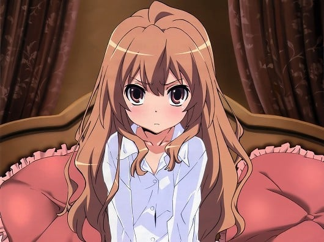
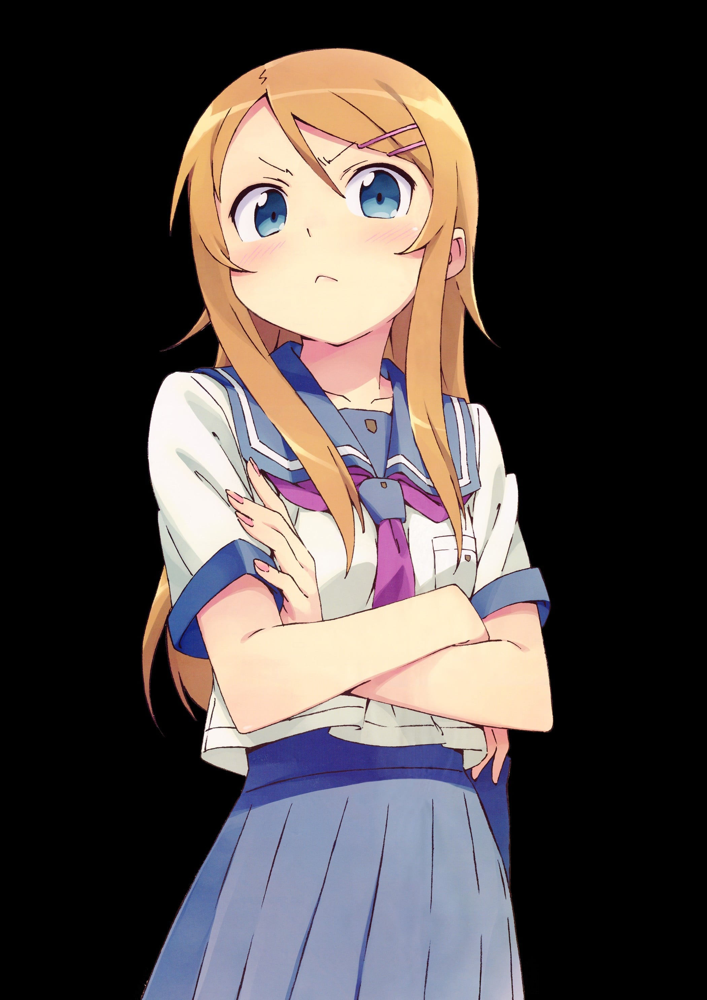
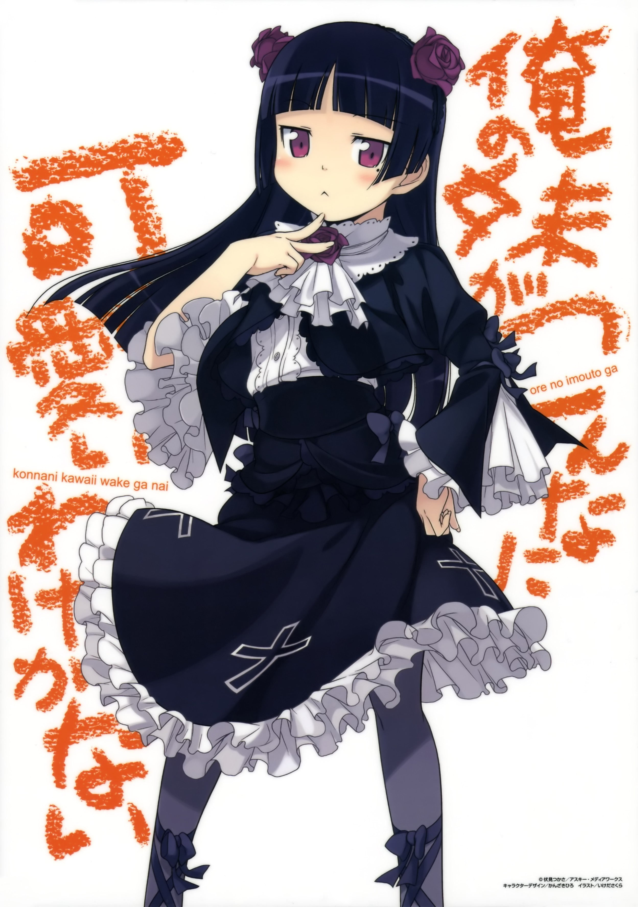
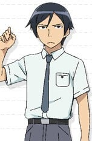
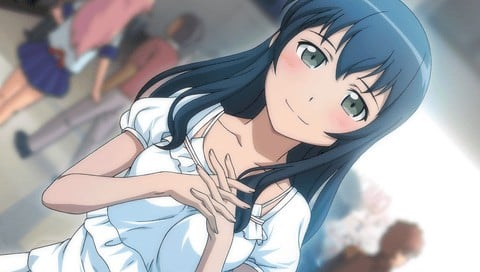
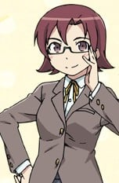
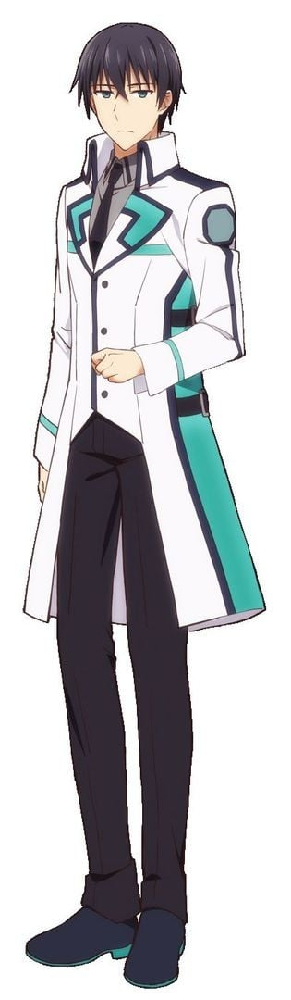

> [!bookinfo|noicon]+ **埃罗芒阿老师**
> 
>
| 日文名 | エロマンガ先生 |
|:------: |:------------------------------------------: |
| 类型 | 小说改 |
| 新番 | 2017 年 4 月 |
| 集数 | 共12话 |
| 官网 | [https://eromanga-sensei.com](https://https://eromanga-sensei.com) |
| 制作 | A-1 Pictures |
| 导演 | 竹下良平 |
| 脚本 | 髙橋龍也,伏見つかさ,雑破業 |
| 评分 | 6.6|
| 制片人 | 五十嵐守 |

> [!abstract]+ **简介**
> 高中生兼小说作家的“和泉正宗”（笔名：和泉征宗）有个家里蹲的妹妹“和泉纱雾”。一年前才成为家人的她，却完全不走出居室，并也用力踩踏地板，要我帮她准备食物。为了这段称不上“兄妹”的关系，正宗得想个办法让她自己走出居室才行，因为两人已是目前仅存能相依为命的“家人”……至于正宗的搭挡插画家“情色漫画老师”，是个能够画出非常棒煽情图的可靠伙伴。虽然双方并没见过面，但我一直很感谢他！只是在某一天，正宗突然发现到一个冲击事实，那就是“情色漫画老师”其实就是纱雾！？

> [!tip]+ **章节列表**
>- [ ] 第1话：妹妹与封闭的房间 (2017-04-08)
>- [ ] 第2话：现充班长与无畏妖精 (2017-04-15)
>- [ ] 第3话：全裸之馆与堕落之主 (2017-04-22)
>- [ ] 第4话：埃罗芒阿老师 (2017-04-29)
>- [ ] 第5话：和妹妹一起创造轻小说计划吧 (2017-05-06)
>- [ ] 第6话：和泉征宗与一千万部的宿敌 (2017-05-13)
>- [ ] 第7话：妹妹与世界上最有趣的小说 (2017-05-20)
>- [ ] 第8话：做梦的纱雾与夏日的烟花 (2017-05-27)
>- [ ] 第9话：妹妹与妖精之岛 (2017-06-03)
>- [ ] 第10话：和泉征宗与年幼的前辈 (2017-06-10)
>- [ ] 第11话：两人的相遇与未来的兄妹 (2017-06-17)
>- [ ] 第12话：埃罗芒阿节 (2017-06-24)

> [!tip]+ **主要角色**
> 
| 角色 | CV | 简介| 角色图片 |
|:----:|:---:|:---:|:--------:|
| シャナ |  | 继承了第一代“炎发灼眼的杀手”的火雾战士，作品的女主角。 　　在动画版中，身高被设定为141cm。从样貌看，是一个大约11或12岁的女孩，但因为订立了契约后，会变成长生不老，因此看不出她的真实年龄。 　　“夏娜”之名是悠二由其所持武器大太刀“贽殿遮那（台湾播出的动画中文版本翻成“贽殿纱那”）”命名的。其在尚未觉醒自燃的能力之前就定契约，因此作战以挥舞贽殿遮那和近身肉搏为主，在遇上悠二之前都是过着追杀红世使徒的流浪生活，在取代平井缘的存在之后，才开始其正常社交活动和处世的一面。 　　特别喜爱甜食，连喝咖啡也是喝特别甜的；最喜爱的食物是甜瓜包（又译密瓜包、菠萝包，日文原字为メロンパン（melon bun）），并自创一套理论：吃甜瓜包时，要先咬一口酥脆的外皮，再咬一口柔软的部份，在这两种口感相互交替，才能享受甜瓜包的美味。 　　性格非常倔强，为傲娇的代表人物之一，对悠二有很深厚的感情。口头禅是：“吵死了！吵死了！吵死了！（うるさい！うるさい！うるさい！）” 　　从小就居住在“天道宫”，跟着威尔艾米娜．卡梅尔还有专门训练他的梅利希姆(小白)，文武双全的杀手，御崎高中不少只会使用老师的地位却没有实际才能的老师在她的面前失去身为老师的尊严，后来就分成两种类型(正面对决和视而不见)，跟吉田一美算是情敌也算好友。在和法利亚葛尼的战斗被宝具“幸福扳机”强迫其体内的亚拉斯特尔显现，因此在和“悼文吟诵人”战斗中回想当时感受到的强大的自己，因而得到了使用火焰的能力，并学会使用火焰的翅膀飞翔，深信有悠二在旁没有办不到的事情。（2008中国萌战冠军，与C.C.并列萌王）（娇蛮版萝莉） 2016年世界最萌大赛萌王 |  |
| 逢坂大河 |  | 就读2年C班。通称“掌中老虎”。其名字－“大河”的日文发音和老虎的英文－“Tiger”发音类似。特征是傲娇、凶暴、任性、毒言但又有点爱哭的冒失娘。自称身高145厘米（事实上143.6厘米），好像可以捧在手中一样的娇小。这也是她绰号的来源。对绰号也有些情结。比起起司和甜点，比较喜欢乳制品。喜欢同班同学北村祐作，但曾经拒绝过他的告白。在北村面前表现得极度紧张，常常有可笑的言行举止。总是穿着棉制折边的衣服，常常被批评像人偶。双亲是有钱人，但因为关系不好，而离开他们，只靠定期的生活费过活。然而，大河对于家事完全不拿手，总是要龙儿照顾。同时对自己的贫乳身材也十分在意。是超级旱鸭子，经过龙儿的特训后，终于可以使用浮板游泳。 |  |
| ホロ |  | 外表是拥有狼耳与尾巴的少女，但实际上是神话中被称为神明的巨狼。自称为贤狼赫萝，寄宿在帕斯罗村的麦子中带来长期丰收。在帕斯罗村的庆典中从帕斯罗村的仓库逃入罗伦斯马车上的麦子(因为赫萝可以从小把的麦逃到大把的麦中,村民也有说过:「如果收割太贪心的话,丰收之神赫萝会逃走的」这句话)，与罗伦斯一同行商，想回到遥远北方的出生故乡“约伊兹森林”。      跟自称“贤狼”相符的冷静老练言语，丰富的经验与智慧常常拯救罗伦斯。性格自大，但因为长期离开故乡因此有着孤独脆弱的一面。     赫萝以15岁左右的可爱少女模样出现，第一人称词为“咱”（日语：わっち（＝私）），第二人称词为“汝”，语助词则以“呗”（日语：～でありんす）作结，这种独特的口癖是受到花魁的影响。与罗伦斯共同遭遇了各种事情，途中虽然常常主导对话，但也有因为不了解现代知识而被驳倒的时候。喜欢美味的食物与酒，但似乎特别喜欢苹果及甜食。在追伊弗的时候，意外被罗伦斯发现，赫萝怕水。      喜欢帮助他人，但对方没有要求，赫萝也不会去回应，对于无法出一份力的自己感到有些自责。      对自己的美丽尾巴十分自豪，不懈怠地用梳子整理以及清除跳蚤。十分喜欢被别人赞美尾巴，如果糟蹋了她的尾巴，将会发生无法预知的严重后果。 |  |
| 高坂桐乃 | 竹達彩奈 | 《我的妹妹哪有这么可爱》（俺の妹がこんなに可爱いわけがない）男主角高坂京介的妹妹，出生于1997年,居住于千叶市,目前就读国中二年级。和平凡的哥哥相反，外表出众，在流行杂志担任模特儿赚了不少钱。不知不觉间爱上了萌系动画和美少女游戏（不分是不是限制级），喜欢逛かーずSP和アキバBlog等网志，常因此冲动购物。对旁人的眼光十分在意而不敢公开自己的兴趣而闷在心理，刚好此时装在“梅露露”盒子中的“和妹妹恋爱吧♪”被哥哥发现，虽然不是她的本意，但还是向哥哥商量该怎么办。 在京介的建议和陪同下参加了“宅女集合”的线下聚会。在参加夏Comi后回家时偶遇好友新垣绫濑，并且暴露了自己的兴趣，曾一度绝交。在京介的介入下得以和绫濑恢复关系。 |  |
| 五更瑠璃 | 花澤香菜 | 和沙织一样只用网络称呼－“黑猫（黒猫（くろねこ））”，而本名则在第五卷得知，但作为本作的旁白的京介，仍然称呼她为黑猫。而在“游戏研究会”时，社员都会叫她“五更”。  住在高坂家的附近，家中小孩除了她之外还有几个妹妹。 初登场时，就读初中三年级。在第四卷之后，与京介就读同一高中。 在参加“宅女集合”时打扮成哥德萝莉，和打扮时髦的桐乃同样无法融入团体当中而被沙织邀请参加二次集会。非常期待每周播放的动画“maschera 〜堕入凡间的魔兽的恸哭〜”（和“梅露露”同时段的动画），被桐乃批评为“中二病动画”时和她大吵一架。但因为和桐乃一样，都很想要能够热烈讨论的对象，所以两人虽然常常吵架但还是相处的不错，曾经为了桐乃，帮她赢得“真妹大歼”的限定盘。 |  |
| 高坂京介 | 中村悠一 | 男主角，是个长着一张“一看就是日后在某个不知名的可怜企业当小小室长”（加奈子语）的大众脸，喜欢喝麦茶的高中二年级学生。作为本作最接近“现实真实感”的人物，对于观众来说应该是最能引起共鸣的一个角色了，也正如他所说：“做人平凡最好”。其人一个突出的地方就是具有很强大的语言辩论能力（原作中表现为无时无刻的吐槽），甚至还有相当推理的思维出现（与黑猫一起为妹妹解决手机小说被侵权问题）。一直以来莫名其妙的被妹妹藐视，并且两人话少得可怜，自从在门口捡到以“梅露露”为封套实际为18x内容的DVD后，得知妹妹的秘密（当夜就被妹妹桐乃抓去进行“人生商谈”），在后来的日子里便一直为妹妹遮风挡雨奔波劳碌，是个典型口硬心软的好哥哥。经常把H书藏在床底下，被妈妈发现过。 不知道是不是因为麻奈实的原因，偷藏的Ｈ书，多半是眼镜娘的类型。为此桐乃曾大发脾气（实际上是恼怒为什么没有妹控系列）在第七卷最后疑似跟黑猫交往。 自从得知妹妹不想被别人知道的秘密以后，开始了被桐乃强迫玩“和妹妹谈恋爱吧♪”、“妹歼”多支18禁恋爱冒险游戏的生活。 |  |
| 槇島沙織 | 生天目仁美 | 在作品中只用网络上的称呼－“沙织·巴吉纳（沙織・バジーナ（さおり・バジーナ））”，而本名则在第六卷得知。 就读初中三年级，作品时间进入第二年后升读名校高中。有一个名为香织的姐姐，已经结婚及移居海外。 京介为了解决桐乃的烦恼，提议她到社交网站去找志同道合的朋友。而沙织是桐乃加入的社群“宅女集合”的管理人。有着与藤原纪香一样的身材，戴着深度眼镜，在背包内插著海报，初期外表为典型的秋叶原系形象。于第六集中得知其实是个有气质的美女。很关心别人，在网聚时还特地邀请无法融入团体的人参加二次聚会。 自宅位于距离高坂家稍远，千叶县北区海手町的高级住宅区。暂时独居于属家庭资产之一的其中一间别墅。房间中收藏及陈列了不少高达模型、怀旧游戏、昭和时代的食玩与玩具、以及美少女手办玩偶。 |  |
| キリト / 桐ヶ谷和人 |  | 主人公。开始玩SAO时是14岁，2年后的故事本篇是16岁。生日日期为10月7号。     名副其实的重度玩家。拥有超群的反射神经和洞察力，游戏的才能被茅场晶彦评为最强等级。参加过限额1000名的SAO封测，在封测期间就非常投入游戏。因为完全潜行正式版的SAO而被卷入死亡游戏，并以此为开端，牵扯进各种的虚拟世界事件。非常崇拜茅场晶彦，但这份崇拜因为被茅场晶彦关进死亡游戏而混入了憎恨，变成一种很复杂的感情。     出生没多久父母就因车祸去世，和人虽然也受了重伤但保住了性命，之后被桐谷家（母亲妹夫的家庭）收为养子。6岁就会自己组电脑。10岁时就发现自己的电子户口被修改过并发觉自己的身世，令养父母十分惊讶。五官看起来像少女一样纤细，态度却非常冷淡，给人一种“捉摸不定”、“年龄不详”的印象。     有因为自己而让公会伙伴全部死亡的心理创伤[注 1]，害怕拥有伙伴或与人扯上关系，在亚丝娜半强制的组队下才慢慢克服。和亚丝娜心意相通后在系统上“结婚”，买下艾恩葛朗特22层的玩家小屋开始了新婚生活。ALO事件后和亚丝娜重聚，在现实世界也成为情侣。     在SAO事件中共杀死三名玩家，除了克拉帝尔外都被桐人以自欺欺人的方式忘却，成为桐人的另一心理创伤。     因为SAO事件，长期在VRMMORPG的环境下经历生死相关的“实战”，使和人在现实生活中也拥有极强的剑术。配合原本就过人的反射神经和洞察力，连全国中学剑道大赛前八强的直叶也无法在练习战中以技术取胜，仅能靠力量的差异压制大病初愈的和人。而这些剑术同时也让和人在某些非等级制的VRMMORPG中直接就拥有匹敌甚至凌驾顶级玩家的实力。     在SAO世界是以攻略艾恩葛朗特最上层为目标，分类为“攻略组”的独行玩家，只装备一把单手剑的顶级剑士。技能空格有12格，其中单手长剑技能、索敌技能和武器防御技能已完全习得。喜欢装备朴素但匿踪效果高的黑色斗篷，因全身黑的造型被称为“黑色剑士”。拥有全玩家中最高的反应速度而获得独有技能“二刀流”，使用时会同时装备两把单手剑：黑色剑身的“阐释者（Elucidator／エリュシデータ）”[注 2]和白色剑身的“逐闇者（Dark Repulser／ダークリパルサー）”[注 3]。起初因不想惹麻烦而一直隐藏此技能，在被迫曝光后，和希兹克利夫同样被当成拥有异次元强度的最强玩家。     在第75层的头目攻略战中识破了希兹克利夫的真正身分和想法，与其进行双方设定为超低血量的最终对决。虽然失去冷静而战败，但在消失的瞬间超越系统限制，从已被判定死亡的状态下硬发出一次攻击，成功对茅场造成致命伤，最终二人同归于尽，成功攻略游戏。     在妖精之舞篇中，为了找寻仍然被囚禁在虚拟实景的亚丝娜，而以守护精灵剑士的角色完全潜行“ALO”。因使用保有旧SAO存盘的NERvGear登入ALO，造成SAO中的黑衣剑士“桐人”的资料覆盖到守护精灵“桐人”身上[注 4]，在新手状态就拥有极高的技能熟练度和可观的游戏货币。并因为系统错误而出现在使用相同IP的直叶（莉法）附近，在不知道彼此真正身份下结识对方，直到桐人在游戏中提到亚丝娜的名字才被直叶认出。     新生ALO开始营运后，以“剑士桐人的任务已经完成”为由，将自己的数值重置。     在幽灵子弹篇中，受到菊冈委托，完全潜行“GGO”调查“死枪事件”。使用的武器为光剑和一把口径5.7的FN Five-seveN手枪。     在新生ALO中，以自己在SAO中使用二刀流和GGO中砍断子弹的体验，开发出不在游戏系统内的技能：能无延迟左右手交互施放单手剑剑技的“剑技连携”和以剑技抵销某些种类魔法的“魔法破坏”。被莉法形容比在剑道比赛中使用不合规定的轻量竹刀还要过分100倍。     曾被“绝剑”有纪指有一种“在方向上和自己不同，但也不像活在现实世界的人”的感觉。     座右铭是：在不幸中找出幸运、可以利用的事物就尽量利用。     使用二刀流时的招式有“星爆气流斩”（16连击）（Starburst Stream），“日蚀”（27连击）和“双重扇形斩”     在小说第10集中，遭受金本敦的袭击，被注入药物而濒死，虽然捡回一命，但因脑部缺氧过久，造成神经损耗，目前在Soul Translator中进行神经复原，并在Underworld中进行游戏。     在《加速世界》的番外篇中，由于第四世代的完全潜行机器发生错误的量子纠缠，意外进入了该作的世界，以SAO的黑衣剑士“桐人”姿态登场。与该作主角有田春雪的对战虚拟角色“Silver Crow”短暂交手。 |  |
| モブキャラクター | 梶原岳人 | 闲角，常称作路人，在电视剧、电影等作品中，指戏份薄弱的副角、不相关的小人物、串场的闲杂人等。可能用来表达地方民众的声音，或是充当背景。 モブキャラクター（mob character）とは、漫画、アニメ、映画、コンピュータゲームなどに描かれる端役のこと。群衆（群集）、または主要キャラクター以外の、その他大勢のこと。群集キャラ、背景キャラともいう。 |  |
| 赤城瀬菜 |  | 小說第5卷登場。赤城浩平的妹妹，高中一年級，是黑貓班上的班長，有著對於自己看不慣的事情就會想去改正的個性。對BL有著異常的熱愛，雖然平常隱藏著自己有著腐女的興趣，卻經常因為BL的話題而導致情緒失控。常常把周遭（如遊戲研究會）的男性變成BL情節人物並加以妄想，令人無言。夢想是當個遊戲開發人員，本身具有超乎常人的程式DeBug能力（自稱「第六感」），被黑貓稱為擁有「數位版直死之魔眼」的「魔眼使」。雖然嘴巴上對哥哥赤城浩平說是討厭，但實際上卻是個兄控。 |  |
| 司波達也 |  | 本作的主角。 2095年春天跟妹妹司波深雪一同入读第一高校。因为他在4月出生，与妹妹只相差了11个月，两人仍被分配在同一学年。 毫无疑问是名100分的好哥哥，同时亦是名重度妹控，多次无视场合在友人面前对妹妹展露出禁断的言行。 正经的外表下不时透露出腹黑个性，特别在妹妹不在场时曾多次用言语调戏其他女性朋友。 个性冷漠，对妹妹之外的事情漠不关心，会毫不犹豫残酷对待意图伤害深雪的人。 其实入读一高后并不如之前冷漠，也会关心身边的友人。 |  |
| 和泉正宗 | 松岡禎丞 | 一边上高中一边从事着小说家的工作。笔名是「和泉マサムネ」。不喜欢在网络上检索自己的作品或笔名之类的信息。有个家里蹲的妹妹。 |  |