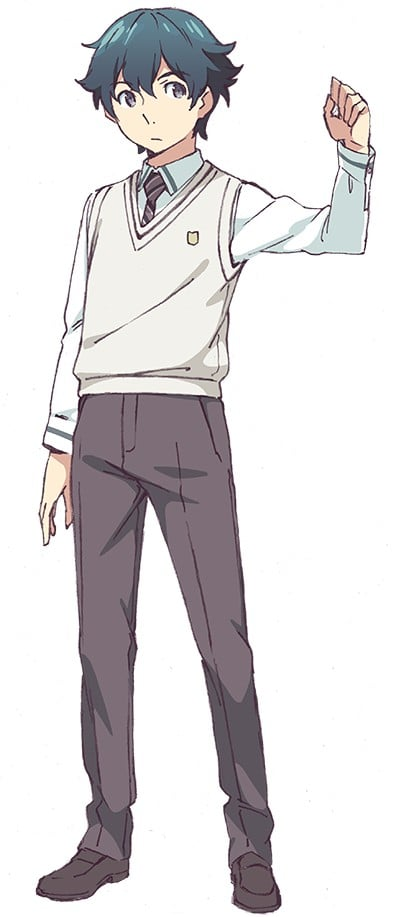
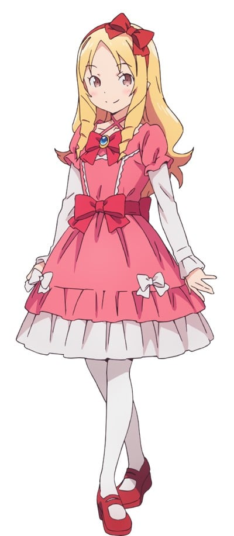
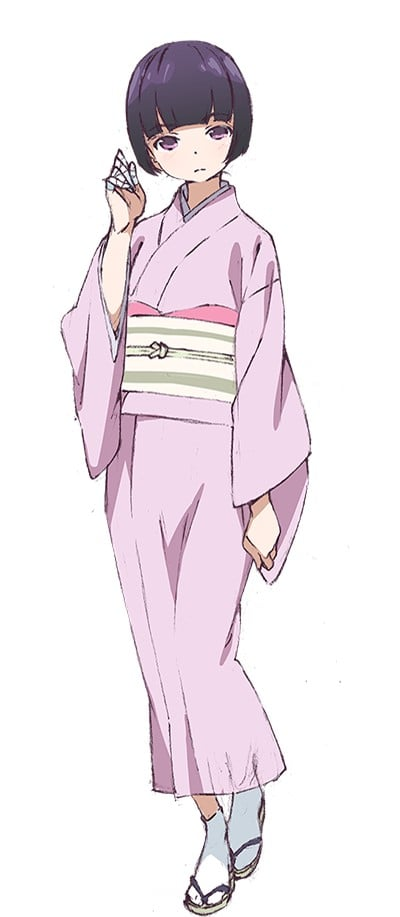
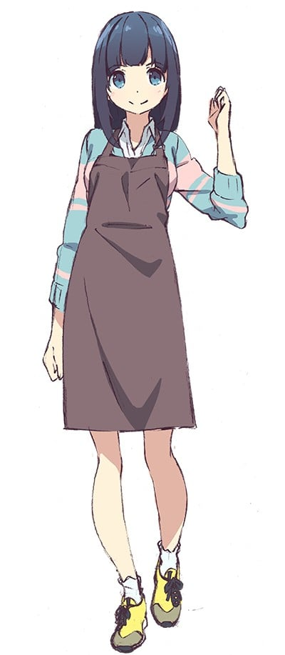
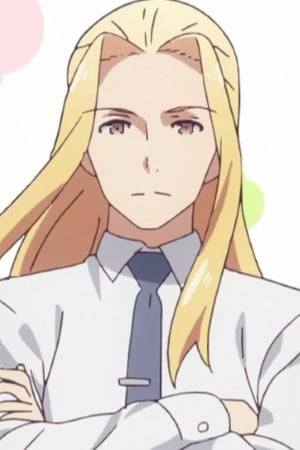
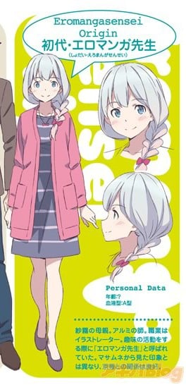

> [!bookinfo|noicon]+ **埃罗芒阿老师**
> 
>
| 日文名 | エロマンガ先生 |
|:------: |:------------------------------------------: |
| 类型 | 小说改 |
| 新番 | 2017 年 4 月 |
| 集数 | 共12话 |
| 官网 | [https://eromanga-sensei.com](https://https://eromanga-sensei.com) |
| 制作 | A-1 Pictures |
| 导演 | 竹下良平 |
| 脚本 | 雑破業,髙橋龍也,伏見つかさ |
| 评分 | 6.6|
| 制片人 | 五十嵐守 |

> [!abstract]+ **简介**
> 高中生兼小说作家的“和泉正宗”（笔名：和泉征宗）有个家里蹲的妹妹“和泉纱雾”。一年前才成为家人的她，却完全不走出居室，并也用力踩踏地板，要我帮她准备食物。为了这段称不上“兄妹”的关系，正宗得想个办法让她自己走出居室才行，因为两人已是目前仅存能相依为命的“家人”……至于正宗的搭挡插画家“情色漫画老师”，是个能够画出非常棒煽情图的可靠伙伴。虽然双方并没见过面，但我一直很感谢他！只是在某一天，正宗突然发现到一个冲击事实，那就是“情色漫画老师”其实就是纱雾！？

> [!tip]+ **章节列表**
>- [ ] 第1话：妹妹与封闭的房间 (2017-04-08)
>- [ ] 第2话：现充班长与无畏妖精 (2017-04-15)
>- [ ] 第3话：全裸之馆与堕落之主 (2017-04-22)
>- [ ] 第4话：埃罗芒阿老师 (2017-04-29)
>- [ ] 第5话：和妹妹一起创造轻小说计划吧 (2017-05-06)
>- [ ] 第6话：和泉征宗与一千万部的宿敌 (2017-05-13)
>- [ ] 第7话：妹妹与世界上最有趣的小说 (2017-05-20)
>- [ ] 第8话：做梦的纱雾与夏日的烟花 (2017-05-27)
>- [ ] 第9话：妹妹与妖精之岛 (2017-06-03)
>- [ ] 第10话：和泉征宗与年幼的前辈 (2017-06-10)
>- [ ] 第11话：两人的相遇与未来的兄妹 (2017-06-17)
>- [ ] 第12话：埃罗芒阿节 (2017-06-24)

> [!tip]+ **主要角色**
> 
| 角色 | CV | 简介| 角色图片 |
|:----:|:---:|:---:|:--------:|
| 和泉正宗 | 松岡禎丞 | 一边上高中一边从事着小说家的工作。笔名是「和泉マサムネ」。不喜欢在网络上检索自己的作品或笔名之类的信息。有个家里蹲的妹妹。 |  |
| 和泉紗霧 | 藤田茜 | 和泉正宗的没有血缘关系的妹妹。因为一些原因过着基本上只有两人的同居生活。重度家里蹲，只要家里有其他人就不会从房间里出来。是以「エロマンガ先生」为笔名的插画家，喜欢画H的画 |  |
| 神野めぐみ | 木戸衣吹 | 和泉纱雾的同学。人际关系方面拥有最强实力的超级班长，喜欢交朋友，为此可以不惜劳苦。不管对方是竖起坚壁还是缩在门后，都会将其打破走进去的类型。纱雾的天敌。 |  |
| 山田エルフ | 髙橋ミナミ | 以山田妖精为笔名的轻小说作家，本名不明。轻小说销量是和泉正宗的10倍，自称大小说家（Greater Novelist）。 |  |
| 千寿ムラマサ | 大西沙織 | 五官端正的和服少女。乍看是个凛然冷酷型的成熟女孩子，但实际上不过是天然呆罢了。对色情话题没有抵抗力，那超然的态度只要开个黄腔就会整个崩溃。 |  |
| 高砂智恵 | 石川由依 | 正宗的同学。“高砂书店”的看板娘，知道正宗职业的异性朋友。正宗的超级粉丝。爱好轻小说本身，被小看的时候会发怒。 |  |
| 神楽坂あやめ | 小松未可子 | 正宗やムラマサの担当編集の女性。血液型はO型。多数のヒット作を抱えるが、胡散臭い性格。 |  |
| 獅童国光 | 島﨑信長 | 正宗と同じ出版社で活動する男性新人作家。20歳。趣味はお菓子作り。ちょっとした誤解から、正宗を同性愛者だと長い間勘違いし、エロマンガ先生のことも「男」だと思い込んでいたが、第6巻の京香の捨て身のパフォーマンスのおかげで誤解は解けた模様。アルコールに弱く、酒に飲まれてしまうのが弱点。 |  |
| 山田クリス | 山下誠一郎 | 山田妖精的哥哥，任职于FULLDRIVE文库编辑部，也是山田妖精的责任编辑。 溺爱自己的妹妹，但是在催稿的时候也会毫不留情。 曾误会和泉与妹妹正在交往，建议和泉先与妹妹订下婚约。 |  |
| 初代・エロマンガ先生 | 井口裕香 | 和泉纱雾的生母。本名不明。 因为兴趣而画色色插图的事被有洁癖的丈夫发现后，因价值观不同，两人离婚。 与和泉虎彻再婚。和虎彻的妹妹和泉京香关系很好。 外貌清纯端庄温柔，脸上总是挂着微笑。 真实身份是以“エロマンガ先生”笔名从事插画工作的插画家。画黄图的本领很高。 |  |