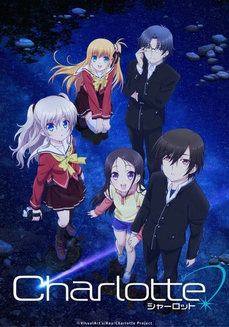
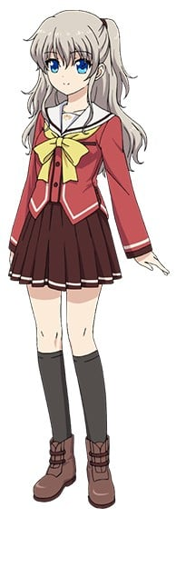
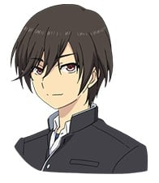
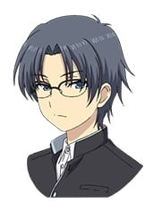
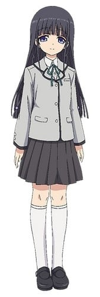
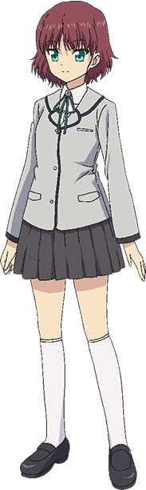
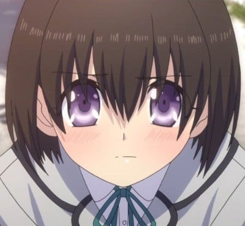
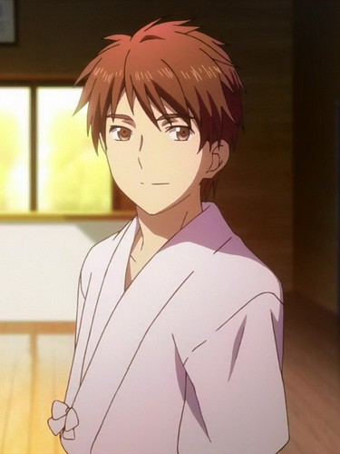
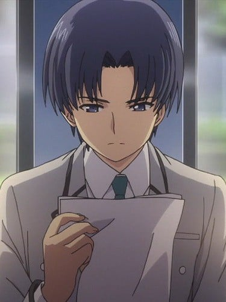

> [!bookinfo|noicon]+ **夏洛特**
> 
>
| 日文名 | Charlotte |
|:------: |:------------------------------------------: |
| 类型 | 原创 |
| 新番 | 2015 年 7 月 |
| 集数 | 共14话 |
| 官网 | [http://charlotte-anime.jp/](https://http://charlotte-anime.jp/) |
| 制作 | P.A.WORKS |
| 导演 | 浅井義之 |
| 脚本 | 麻枝准 |
| 评分 | 6.4|
| 制片人 | 辻充仁 |

> [!abstract]+ **简介**
> 思春期的少年少女中极少部分人会发作的特殊能力。
驱使着无人知晓的能力，过着顺风顺水学园生活的乙坂有宇。
突然出现在这样的他的面前的少女，友利奈绪。
从与她相遇之日起，被揭露出来的特殊能力者的宿命。
这是由麻枝准所描绘的，特殊能力者们奔跑着的青春物语——。

> [!tip]+ **章节列表**
>- [ ] 第1话：把自己想象成他人 (2015-07-04)
>- [ ] 第2话：绝望的旋律 (2015-07-11)
>- [ ] 第3话：恋情与火焰 (2015-07-18)
>- [ ] 第4话：刹那的真意 (2015-07-25)
>- [ ] 第5话：似曾相识的声音 (2015-08-01)
>- [ ] 第6话：未曾留意的幸福 (2015-08-08)
>- [ ] 第7话：在逃亡的终点 (2015-08-15)
>- [ ] 第8话：邂逅 (2015-08-22)
>- [ ] 第9话：不在此处的世界 (2015-08-29)
>- [ ] 第10话：掠夺 (2015-09-05)
>- [ ] 第11话：夏洛特 (2015-09-12)
>- [ ] 第12话：约定 (2015-09-19)
>- [ ] 第13话：由此开始的记录 (2015-09-26)
>- [ ] 第14话：强者们 (2016-03-30)
>- [ ] 第0话：放送直前特番！「Charlotte(シャーロット)」～新たな“運命”の始まり～ (2015-06-21)

> [!tip]+ **主要角色**
> 
| 角色 | CV | 简介| 角色图片 |
|:----:|:---:|:---:|:--------:|
| モブキャラクター | 伊藤美紀 | 闲角，常称作路人，在电视剧、电影等作品中，指戏份薄弱的副角、不相关的小人物、串场的闲杂人等。可能用来表达地方民众的声音，或是充当背景。 モブキャラクター（mob character）とは、漫画、アニメ、映画、コンピュータゲームなどに描かれる端役のこと。群衆（群集）、または主要キャラクター以外の、その他大勢のこと。群集キャラ、背景キャラともいう。 |  |
| 友利奈緒 | 佐倉綾音 | 星之海学园高中一年生，学生会长，拥有一头漂亮的银发和蓝色眼睛的无口系美少女，是“从任意一人的视线中消失”的能力持有者。由于不近人情和处事冷漠的行为作风，遭到班级同学的孤立，但谈到喜欢的东西是会变的兴奋。和哥哥一样是摇滚乐队『ZHIEND（ジエンド）』的粉丝。 |  |
| 乙坂有宇 | 内山昂輝 | 本作的主人公，高中一年级，16岁。活用“在5秒以内夺取任意对象的身体”这一能力进入精英学校阳野森高中的伪优等生。由于某个契机而转学星之海学园。  [mask]实际能力为「略奪」[/mask] |  |
| 高城丈士朗 | 水島大宙 | 星之海学园高中一年生，学生会成员。  拥有「瞬间移动」能力，但经常因此负伤住院，通过体能训练和在衣服下穿防护装备来作为安全对策，是西森柚咲的狂热粉丝。 |  |
| 西森柚咲 | 内田真礼 | 乐队「How-Low-Hello」的人气主唱，拥有只能被姐姐依凭的超能力「口寄せ」，由于无法主动使用本人并不自知，认为是多重人格和嗜睡症，事件后转入星之海学园。擅长料理特别是炖菜，双亲在长野县的深山中经营着一家乌冬面店。 |  |
| 黒羽美砂 | 内田真礼 | 大柚咲一岁的姐姐，死于车祸。  拥有超能力「発火」，在依凭后眼睛和头发末端会变红且可以自由控制火焰的产生和熄灭。是个脾气暴躁满嘴脏话的不良少女，口癖是「センスがない」。实际上非常关心自己的妹妹和朋友们。 |  |
| 乙坂歩未 | 麻倉もも | 乙坂有宇的妹妹，中学一年级生，性格纯真。擅长料理，经常在料理中加入非常甜的乙坂家特制披萨酱，会使用「なのですぅ」和「なのでござる」作为尾语的口癖。喜欢乐队「How-Low-Hello」是西森柚咲的粉丝。爱好天体观测经常熬夜看星星。和哥哥乙坂有宇一同转入星之海学园中等部。  [mask]能力为「崩壊」[/mask] |  |
| 白柳弓 | 中原麻衣 | 阳野森高校一年级生，被称为阳野森的「マドンナ」，个性端庄非常容易害羞。 |  |
| 三嶋 | 民安ともえ | 阳野森高校一年级生，白柳弓的友。个性活泼且喜欢管闲事。 |  |
| 杉本 | 大和田仁美 | 阳野森高校学生，向乙坂有宇告白遭到婉拒。 |  |
| 有働 | 織田優成 | 2年E班，其他学校的弓道部部长。能力为「念写」，  [mask]使用能力拍摄裸体照片进行贩卖。[/mask] |  |
| 大村佳之 | 間島淳司 | 阳野森高中学生会长。怀疑有宇的入学考试有作弊嫌疑，并要求他重做试卷。 |  |