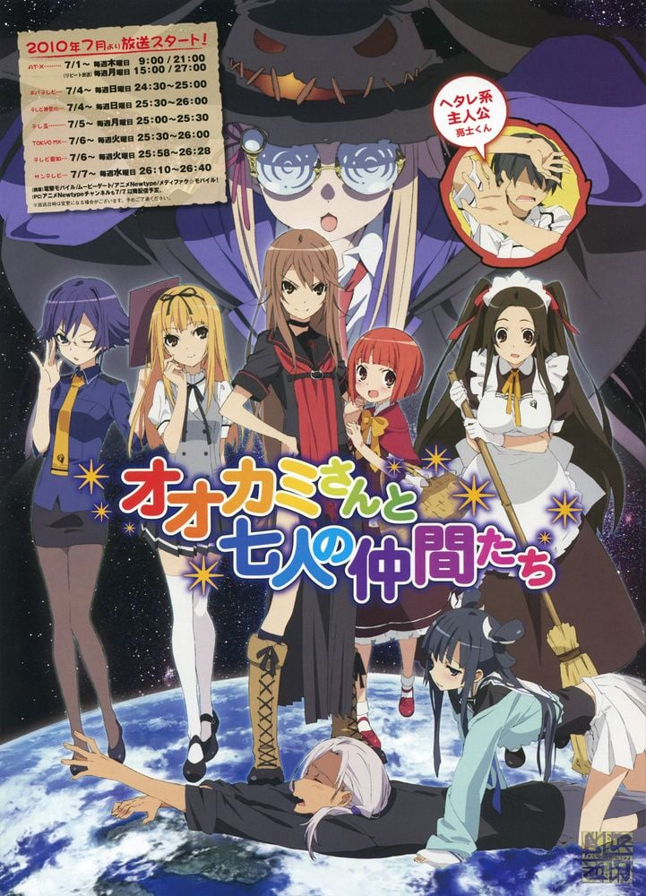
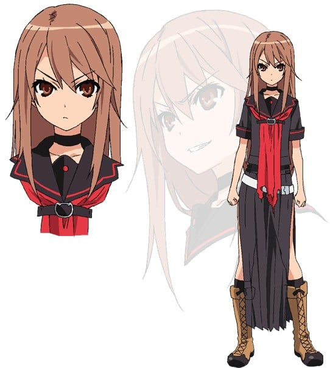
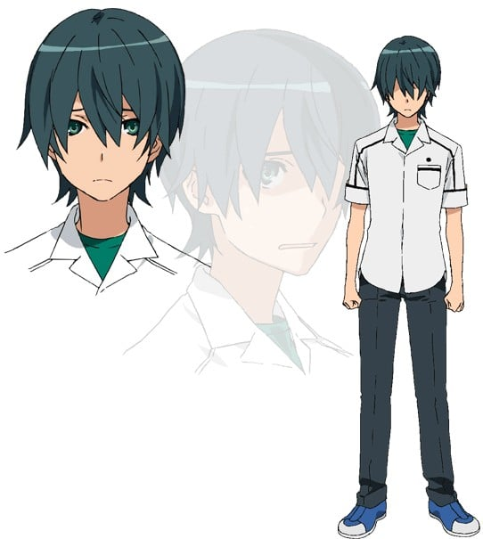
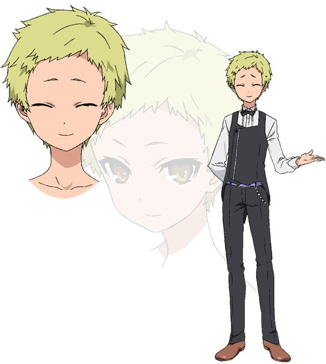
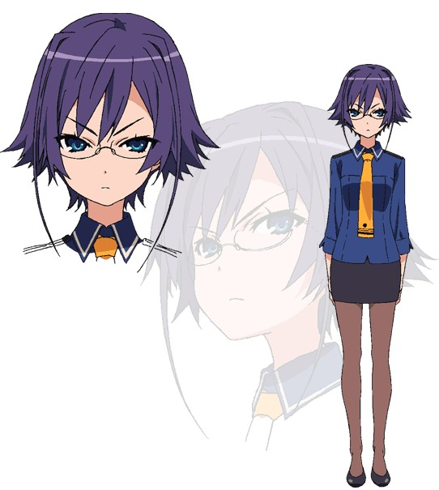
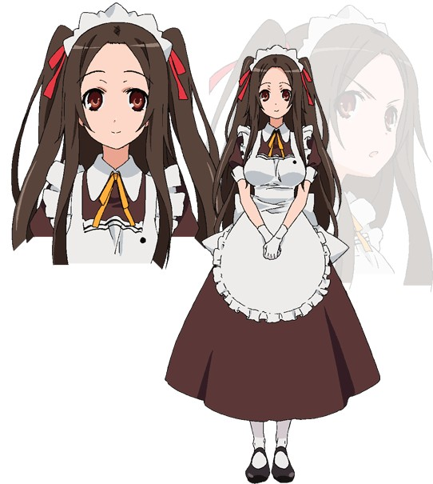
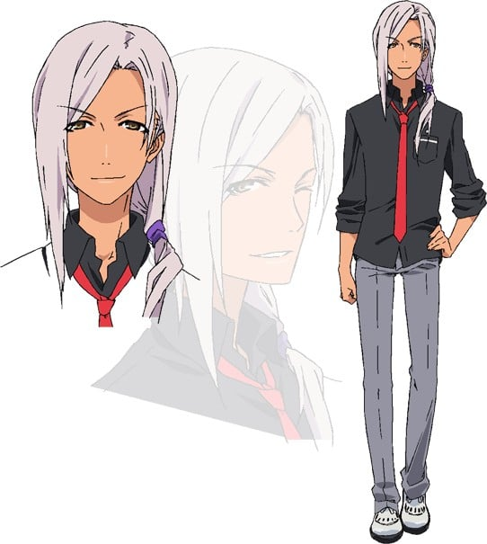
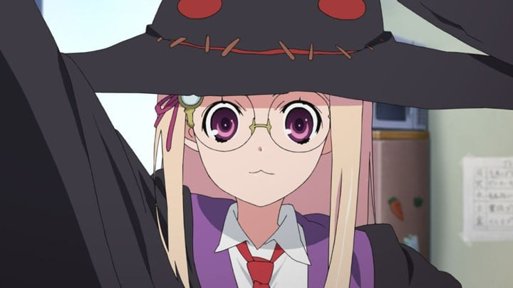
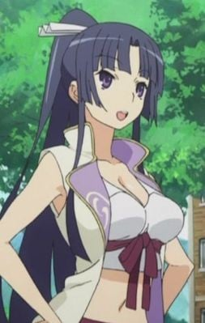

> [!bookinfo|noicon]+ **大神与七位伙伴**
> 
>
| 日文名 | オオカミさんと七人の仲間たち |
|:------: |:------------------------------------------: |
| 类型 | 小说改 |
| 新番 | 2010 年 7 月 |
| 集数 | 共12话 |
| 官网 | [http://otogi-bank.com/](https://http://otogi-bank.com/) |
| 制作 | J.C.STAFF |
| 导演 | 岩崎良明 |
| 脚本 | 伊藤美智子,白根秀樹 |
| 评分 | 6.5|
| 制片人 | 大橋正夫 |

> [!abstract]+ **简介**
> 大神凉子（通称为‘大神’）是就读私立御伽学园高中一年级，与赤井林檎（通称为‘小红帽’）合伙，虽然与御伽学园学生互助协会（通称为‘御伽银行’）的每个人合作，但是今天也为了任意改造社会而持续战斗著！！

> [!tip]+ **章节列表**
>- [ ] 第1话：大神與御伽銀行的夥伴們 (2010-07-01)
>- [ ] 第2话：說謊的大神與亮士 (2010-07-08)
>- [ ] 第3话：大神被捲入了龜兔之間醜陋的爭鬥之中 (2010-07-15)
>- [ ] 第4话：大神与小通前輩的報恩 (2010-07-22)
>- [ ] 第5话：大神和桃子学姐去除鬼 (2010-07-29)
>- [ ] 第6话：大神與小紅帽、附帶亮士 (2010-08-05)
>- [ ] 第7话：大神與地藏进行double date (2010-08-12)
>- [ ] 第8话：おおかみさんとねずみの嫁探しとやっぱり豚はこういう扱い (2010-08-19)
>- [ ] 第9话：おおかみさんと毒りんごが効かない白雪姫 (2010-08-26)
>- [ ] 第10话：おおかみさんと御伽銀行のすごく長い一日 (2010-09-02)
>- [ ] 第11话：おおかみさんと羊の毛皮を着た狼 (2010-09-09)
>- [ ] 第12话：おおかみさんとマッチ売りじゃないけど不幸な少女 (2010-09-16)

> [!tip]+ **主要角色**
> 
| 角色 | CV | 简介| 角色图片 |
|:----:|:---:|:---:|:--------:|
| 大神涼子 | 伊藤静 | 本作的女主角，为御伽学园高中部一年F班学生，也是御伽学园学生互助协会的成员。原型角色是《小红帽》当中的大野狼。 |  |
| 赤井林檎 | 伊藤かな恵 | 御伽学园高中部一年F班学生。原型角色是《小红帽》里的小红帽和《白雪公主》里的“毒苹果”。 |  |
| 森野亮士 | 入野自由 | 本作的主人公，御伽学园高中部一年F班学生。原型角色是《小红帽》当中的猎人。 |  |
| 桐木リスト | 野島裕史 | 御伽学园高中部三年级生。原型角色是伊索寓言中的《蚂蚁与蟋蟀》的蟋蟀。他是御伽银行的行长。 |  |
| 桐木アリス | 堀江由衣 | 御伽学园高中部三年级生，御伽银行的副行长。原型角色是《蚂蚁与蟋蟀》里的蚂蚁。与李斯特的关系是表堂兄妹。 |  |
| 鶴ヶ谷おつう | 川澄綾子 | 御伽学园高中部二年级生。原型角色是《白鹤报恩》里的鹤。 |  |
| 浦島太郎 | 浅沼晋太郎 | 御伽学园高中部1年F班。原型角色来自《浦岛太郎》。对男人毫无兴趣看都不看，严重的喜欢女人，只要对方是女性态度就会产生巨变。 |  |
| 竜宮乙姫 | 豊崎愛生 | 御伽学园高中部1年级的学生。原型角色来自《浦岛太郎》。 |  |
| マジョーリカ・ル・フェイ | こやまきみこ | 御伽学园高中二年级生，穿着所谓黑衣单边扣衬衫、尖顶帽子、牛奶瓶底型眼镜等服饰的正统派魔女服的女性；头发是金色的直发，通称为魔女。名字是由亚瑟王传说中的魔女Morgan le Fay而来。 |  |
| 宇佐見美々 | 釘宮理恵 | 御伽学园二年级生，原型角色是《龟兔赛跑》里的兔子。 |  |
| 下桐すずめ | 矢作紗友里 | 原型角色是《舌切り雀》里的麻雀。御伽学园广播部的人员。 |  |
| 吉備津桃子 | 甲斐田裕子 | 御伽学园三年级生，原型角色是《桃太郎》里的桃太郎。男女通吃，极度快乐主义者，不论男女只要被她看上都照推不误，从中学开始看上了凉子。 |  |