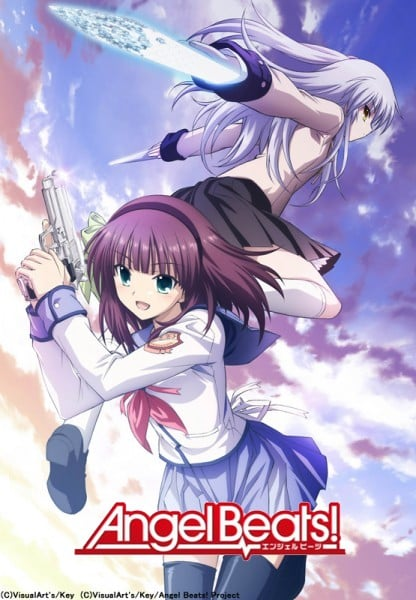
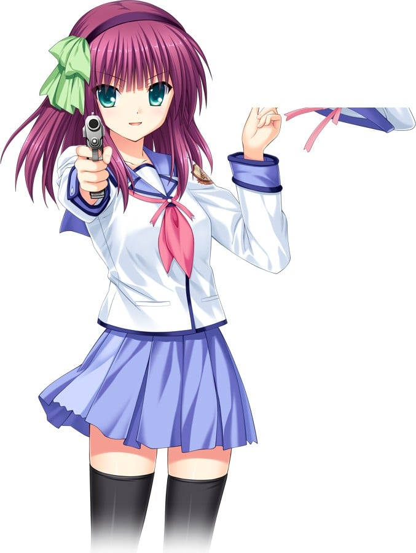
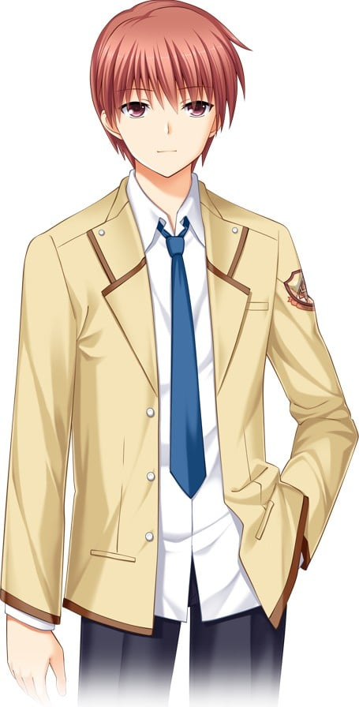
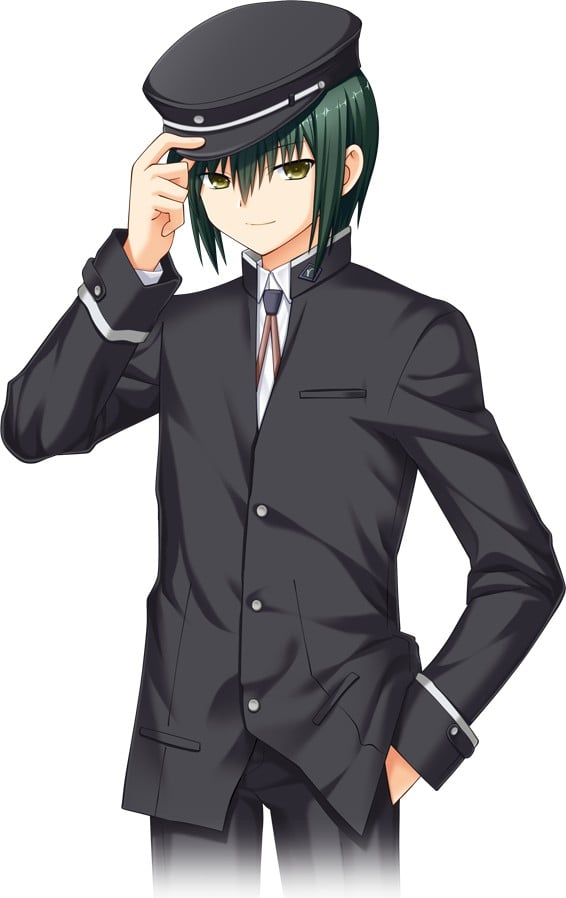
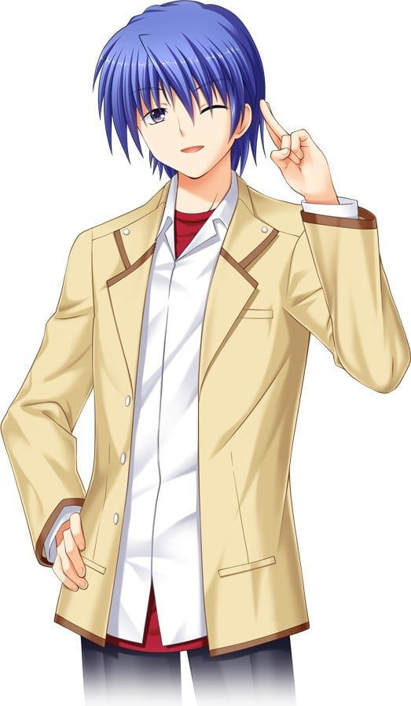
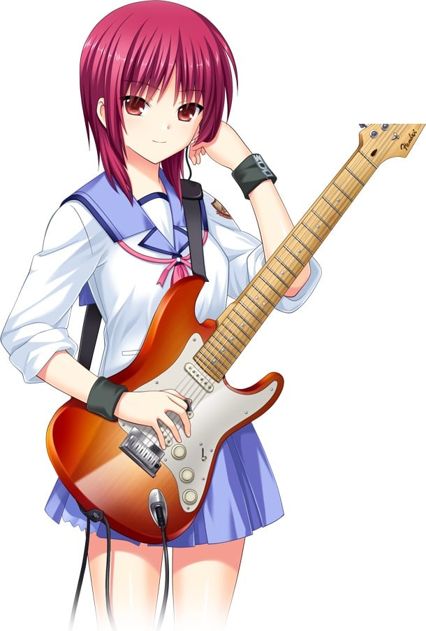
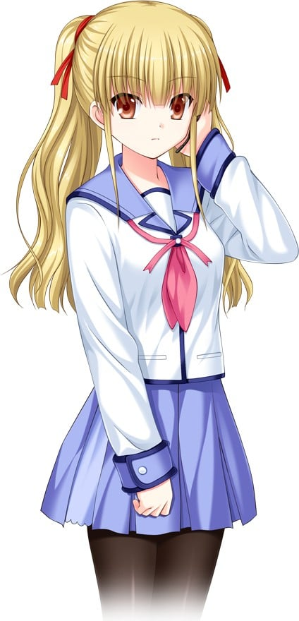
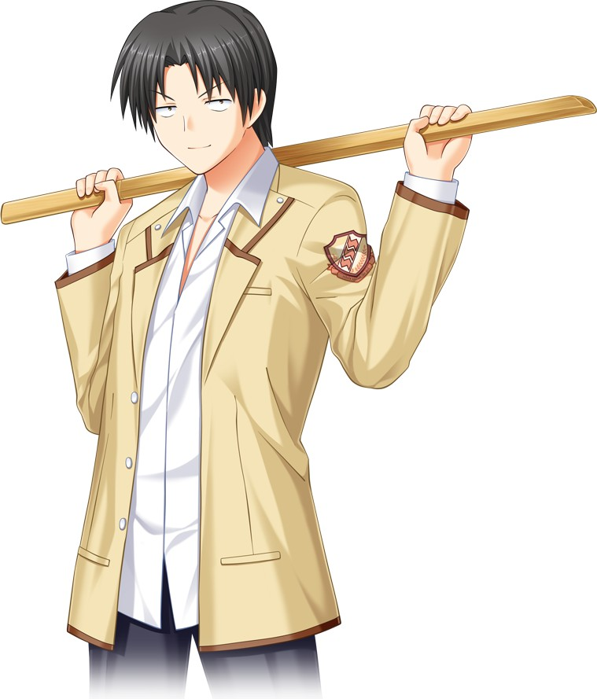
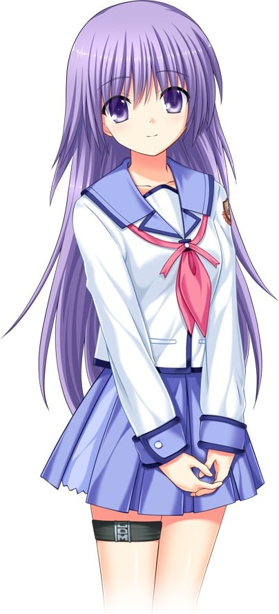

> [!bookinfo|noicon]+ **天使的心跳！**
> 
>
| 日文名 | Angel Beats! |
|:------: |:------------------------------------------: |
| 类型 | 原创 |
| 新番 | 2010 年 4 月 |
| 集数 | 共13话 |
| 官网 | [http://www.angelbeats.jp/](https://http://www.angelbeats.jp/) |
| 制作 | P.A.WORKS |
| 导演 | 岸誠二 |
| 脚本 | 麻枝准 |
| 评分 | 7.6|
| 制片人 | 辻充仁 |

> [!abstract]+ **简介**
> 　　故事从男主角死亡之后从“死后的世界”醒来开始，在“死后的世界”中的学校里，他与一位名为由利(ゆり)、在“死后的世界”率领着一个名为“死んだ(Shinda)世界(Sekai)战线(Sensen)”简称“SSS”的组织的少女相遇了。“SSS”成立的主要目的是与赐予他们生前悲哀命运的神以及神之使者——天使交战，在天使超乎常理的异能面前，“SSS”只能用枪来反抗。就这样一场发生在“死后的世界”的学校里的超能大战物语开始了……

> [!tip]+ **章节列表**
>- [ ] 第1话：出发 (2010-04-02)
>- [ ] 第2话：公会 (2010-04-09)
>- [ ] 第3话：我的歌 (2010-04-16)
>- [ ] 第4话：竞技日 (2010-04-23)
>- [ ] 第5话：最喜欢的味道 (2010-04-30)
>- [ ] 第6话：家事 (2010-05-07)
>- [ ] 第7话：生存 (2010-05-14)
>- [ ] 第8话：黑暗中的舞者 (2010-05-21)
>- [ ] 第9话：在你的记忆中 (2010-05-28)
>- [ ] 第10话：离别的日子 (2010-06-04)
>- [ ] 第11话：改变世界 (2010-06-11)
>- [ ] 第12话：敲响天堂的大门 (2010-06-18)
>- [ ] 第13话：毕业 (2010-06-25)
>- [ ] 第4.5话：通向天堂的阶梯 (2010-12-22)
>- [ ] 第13.5话：另一个尾声 (2010-12-22)

> [!tip]+ **主要角色**
> 
| 角色 | CV | 简介| 角色图片 |
|:----:|:---:|:---:|:--------:|
| 立華かなで | 花澤香菜 | 守护学园秩序的学生会长 “……我，不是什么天使” 死后世界学校的学生会长。 沉默而冷静，不经常显露感情，不过本质却是个天然呆。喜欢麻婆豆腐。 使用名为“Handsonic”、“Distortion”的特殊能力与战线成员交战。  动画：守护秩序的神秘少女 在死后世界的学校担任学生会长的、少女姿态的天使。 与不愿意老老实实成佛的“死后世界战线”成员们展开了多次激烈的战斗。 虽然不是没有感情，但欠缺表情的变化，很难弄清楚她在想什么。 |  |
| 仲村ゆり | 櫻井浩美 | 死后世界战线的领导者 “虽然很唐突，但你不加入我们队伍吗？” 统率着SSS（死后世界战线）的少女。 爱称是“游离子”。作战时会戴上白色的贝雷帽。平时以手枪战斗，不过也很擅长使用刀具进行白刃战，有着能和天使一对一单挑的实力。性格强势、不服输，在故事的前半部分为了打倒天使，即使同伴有所损伤也并不介意。  动画：持续与命运和神抗争的少女 在死后的世界率领着“死后世界战线（SSS）”的少女。 性格坚强好胜，是那种在说之前先去做的类型，即使如此也并不会惹人厌烦，是个受到大家喜爱的女孩子。 本名是由理，不过战线的成员都亲切地称呼她“游离子（ゆりっぺ）”。 顺带一提，腰间插着的手枪是她的武器。 |  |
| 死んだ世界戦線 |  | Shinda Sekai Sensen（日文罗马拼音），简称SSS（其实更名多次，但每次缩写都是“SSS”）。由理为反抗“神”而建立。队员人数不明，但常驻作战前线的人只有十数个，全经领袖由理精心挑选。有专属制服，并占据了学园一幢大楼，肩上有“rebels against the god”字样的徽章。 战线由对天使作战本部、佯攻部队、地下工厂组成。 |  |
| 音無結弦 | 神谷浩史 | 丧失记忆的少年 本篇的主人公。 在丧失记忆的状态下来到死后世界的少年。 被最初遇到的少女“由理”半强制性地拉入了“死后世界战线”。 脑子转得很快，虽然是新人但在有事时也会进行对战线的指挥。  动画：因环境的急变而困惑的少年 失去了生前记忆的本篇主人公。 自己是为什么死去，死后的世界究竟是什么，以及自己究竟是否应该也参加战线……突然的环境变化将这些选择强加给他。 |  |
| 直井文人 | 緒方恵美 | “我是神” 学生会副会长。 使用催眠术的不可思议的少年。 |  |
| 日向秀树 | 木村良平 | 战线的气氛制造者 “这样子终于可以称为同伴了哪” 战线创始人之一，有着老资历的成员，战线的气氛制造者。对于新人音无采取善意的态度，如同好友一般地对待他。虽然本人好像很有人望的样子，实际上并没达到那种程度。不过即使如此也由于那种不会遭人厌恶的性格而处在成员的中心位置。游戏版中是音无的室友。  动画：战线的气氛营造者 性格开朗、随和，是战线的氛围营造者的存在。 对新参加者音无也有着好意，讲了许多战线和死后世界的事情，是可以称呼为挚友的存在。 |  |
| 芳岡ユイ | 喜多村英梨 | Gldemo的超级粉丝 “你知道吗？很厉害的哟，Gldemo！！” 战线佯攻部队的辅助人员，同时是Gldemo的超级粉丝的少女。 在街头表演中演奏Gldemo的曲子等活动当中也拥有着自己的粉丝。 动画版中代替岩泽担当主唱及吉他手。外表看似可爱，但却有着急躁而毒舌的内在性格。特别是和日向总因为一些无聊的小事吵架，两人是拥有着“能够吵架程度的良好关系”的“凸凹组合”。  动画：GDM的忠实粉丝。 利用歌曲来引起周遭注意的佯攻部队“Girls Dead Monster（简称GDM）”的助手，本身也是GDM的铁杆粉丝。 由于这份憧憬的心意，自己也立志走上音乐的道路，正在进行单手吉他的街头Live活动。 |  |
| 岩沢雅美 | 沢城みゆき | 吸引着听众的Gldemo的吉他手&主唱 “我为音乐而生……我是这样想的” 死后世界的人气乐队Girl Dead Monster（通称Gldemo）的主导人物。担当主唱及节奏吉他手，也是Gldemo所演奏的乐曲的作词、作曲者。性格冷静，却是个隐藏着对音乐的热切感情的天才乐手，也是由依所憧憬的人物。 基本上只会考虑和音乐有关的事情，除此之外的事情则毫不关心。  动画：寄思念于歌声的队长 负责主唱和节奏吉他，性格沉静的乐队队长。 她并不是率先把大家聚集起来的类型，但那卓越的吉他音色和歌声却极度吸引听者。 另外，乐队中演奏歌曲的曲和词也都是经她由的手作出的。 将自己的思念完全用歌曲表达，是一个有着纯粹的音乐家之魂的女孩。 |  |
| 遊佐 | 牧野由依 | “到例行会议的时间了” 神出鬼没的通信员。 在战线内担当传达情报的工作。  动画：冷静的接线员 在强行进行作战时，担任接线员、将变化的战况逐一向由理报告的女孩子。 她如同通信员一样的冷静之处确实很好，但相应地，被淡淡地吐槽时也很刺耳。 |  |
| 音無初音 | 中原麻衣 | 音无结弦的妹妹。 渴望与朋友们相伴学习、出游，但长期因病卧床。 期间，音无结弦常会购买妹妹喜欢的漫画到医院探望。 最后的希望是观赏病院外的景色。 |  |
| 藤巻 | 増田裕生 | “嘿，给我拿出干劲啊” 拿着木刀、有着不良风格的少年。 在战线中是那种好像会最先挂掉一般的存在。  动画：永远的游兵小哥 喜欢使用长柄匕首和木刀的、品格差的少年。 与音无等人年龄相仿，却有着“离家出走的小哥”的表现。 虽然从属于“组”，但并不是学校的班级，而是别的意义上的“组”这种感觉。 |  |
| 入江みゆき | 阿澄佳奈 | “如果有诱敌以外我能胜任的工作的话，真的很想做呢……” Gldemo的鼓手担当 胆怯的小动物般的角色，和同样担当节奏的关根关系很好。和平常的性格以及外表相反地，在现场演出时演奏着很有活力的鼓点。非常胆小，经常被关根捉弄。通称“美雪吉”。  动画：胆怯的小动物系 战线中最胆小的角色。 明明自己都已经死了，却还会害怕幽灵，并且讨厌恐怖故事，拥有这样矛盾的女孩子。 也不知是因为觉得可爱还是很欢乐，她被关根以各种各样的方式玩弄，被当成玩具了。 而这样的入江也在乐队中负责击鼓。演奏时镇静自若，表情也像一个够格的音乐家。 |  |