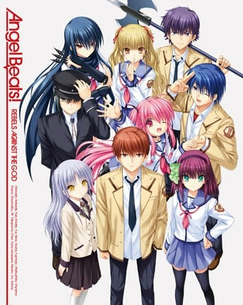

> [!bookinfo|noicon]+ **天使的心跳！地狱厨房**
> 
>
| 日文名 | Angel Beats! Hell's Kitchen |
|:------: |:------------------------------------------: |
| 类型 | 原创 |
| 新番 | 2015 年 6 月 |
| 集数 | 共1话 |
| 官网 |  |
| 制作 | P.A.WORKS |
| 导演 | 岸誠二 |
| 脚本 | 麻枝准 |
| 评分 | 6.6|
| 制片人 |  |

> [!abstract]+ **简介**
> Blu-ray BOXには第2.5話に相当する書き下ろし新作エピソードを収録。 

> [!tip]+ **章节列表**
>- [ ] 第1话：地狱厨房 (2015-06-24)

> [!tip]+ **主要角色**
> 
| 角色 | CV | 简介| 角色图片 |
|:----:|:---:|:---:|:--------:|
| 入江みゆき | 阿澄佳奈 | “如果有诱敌以外我能胜任的工作的话，真的很想做呢……” Gldemo的鼓手担当 胆怯的小动物般的角色，和同样担当节奏的关根关系很好。和平常的性格以及外表相反地，在现场演出时演奏着很有活力的鼓点。非常胆小，经常被关根捉弄。通称“美雪吉”。  动画：胆怯的小动物系 战线中最胆小的角色。 明明自己都已经死了，却还会害怕幽灵，并且讨厌恐怖故事，拥有这样矛盾的女孩子。 也不知是因为觉得可爱还是很欢乐，她被关根以各种各样的方式玩弄，被当成玩具了。 而这样的入江也在乐队中负责击鼓。演奏时镇静自若，表情也像一个够格的音乐家。 |  |
| 関根しおり | 加藤英美里 | “试着强硬地立下了恋爱FLAG！” Gldemo的贝斯担当 爱恶作剧的问题儿童，以捉弄入江为乐。贝斯的水平很高，但有时会突然地即兴表演导致舞台陷入混乱……。 通称“小诗织”。  动画：爱恶作剧的问题儿童 最喜欢看到大家惊诧的表情的、顽皮的麻烦制造者。 在乐队演奏时，什么都不商量就突然开始随兴弹奏，是个想做什么就做什么的女孩子。 虽然每次都会把久子惹恼，但完全看不出有悔过。 最近作为惩罚的一部分在写乐队的活动日志。 |  |
| Girls Dead Monster |  | Gldemo乐队实际为“死后世界战线”（SSS团）组织下属的“佯攻部队”。  在死后世界战线采取行动的时候，Gldemo即举行现场演唱会，主要目的是将普通学生吸引到安全场所，避免被卷入战斗。同时，有时也负责吸引“天使”的部分注意力，或者以演唱会本身作为行动开始的暗号，等等，该佯动部队作用多多。  在NPC鼓手新木毕业消失后入江美雪和关根诗织相继进入死后世界，两人都受过久子(和岩泽)的魔鬼训练。关根一开始说自己会弹BASS但跟其他3人合奏之后发现完全不是一个等级，吐槽道自己只是在学园祭上弹弹的水平而这些人却是是职业级水准。  [mask]剧情的问题，两位主唱以外的3人在动画里完全没怎么塑造，被认为是比较失败的设定，入江、关根甚至连动画的粉丝都不一定能分清。直至[/mask]2015年6月OVA2《Hell's Kitchen》中[mask]才[/mask]给GDM除补充了较多戏份（可以算是以关根等为主角），因太过[s]血腥[/s]（gaoxiao）而不在此剧透。后在2023年2月，其成员之一入江美雪相关剧情在游戏《炽焰天穹》联动活动“波斯菊常开的地方”中得以补完。  官方有一篇有关GDM的番外小说《星期一的黎明》。 |  |
| 天上学園 |  | 森に囲まれた丘陵地にある生徒総数2000名を越える全寮制の学校。一見するとごく普通の生徒らが生活を送っている学園だが、実は死後の世界。 |  |