> [!bookinfo|noicon]+ **女高中生的无所事事**
> 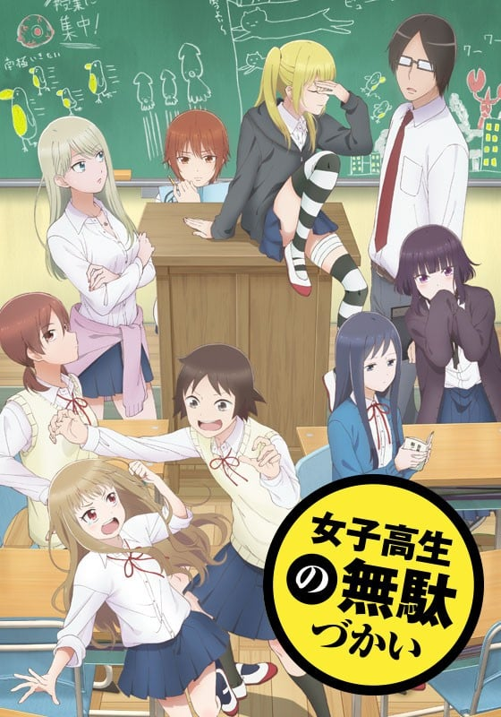
>
| 日文名 | 女子高生の無駄づかい |
|:------: |:------------------------------------------: |
| 类型 | 漫改 |
| 新番 | 2019 年 7 月 |
| 集数 | 共12话 |
| 官网 | [http://jyoshimuda.com/](https://http://jyoshimuda.com/) |
| 制作 | パッショーネ |
| 导演 | さんぺい聖 |
| 脚本 | 坂井史世,横谷昌宏,福田裕子 |
| 评分 | 7.6|
| 制片人 | 西藤和広,西藤和広；ラインプロデューサー：渡辺秀信 |

> [!abstract]+ **简介**
> 被浪费的青春——
偏差值差不多的田中（通称“笨蛋”）、沉迷于BL的菊池（通称：“御宅”）、面无表情的才女・鹭宫（通称“机”）。个性十足的女高中生们无所事事的日常校园生活——

> [!tip]+ **章节列表**
>- [ ] 第1话：厉害 (2019-07-05)
>- [ ] 第2话：漫画 (2019-07-12)
>- [ ] 第3话：遗忘的东西 (2019-07-19)
>- [ ] 第4话：死认真 (2019-07-26)
>- [ ] 第5话：莉莉 (2019-08-02)
>- [ ] 第6话：魔女 (2019-08-09)
>- [ ] 第7话：有病 (2019-08-16)
>- [ ] 第8话：泳装回 (2019-08-23)
>- [ ] 第9话：时尚 (2019-08-30)
>- [ ] 第10话：机器人 (2019-09-06)
>- [ ] 第11话：梦想 (2019-09-13)
>- [ ] 第12话：伙伴 (2019-09-20)

> [!tip]+ **主要角色**
> 
| 角色 | CV | 简介| 角色图片 |
|:----:|:---:|:---:|:--------:|
| 田中望 | 赤﨑千夏 | 本作の主人公。ニックネームは「バカ」。さいのたま女子高等学校1年生。菊池や鷺宮とは小学生からの友人。ニックネーム通りバカで問題児である。クラス全員のニックネームを考えた。 | 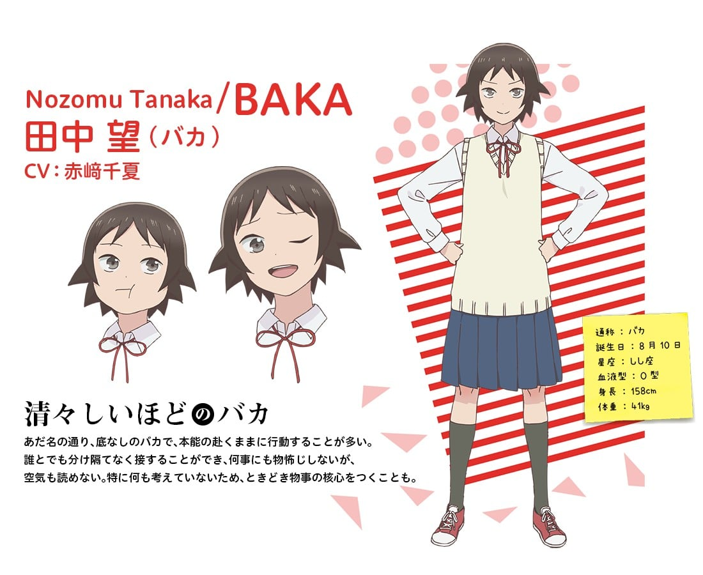 |
| 菊池茜 | 戸松遥 | ニックネームは「ヲタ」。さいのたま女子高等学校1年生。低所得Pのファンである。 | 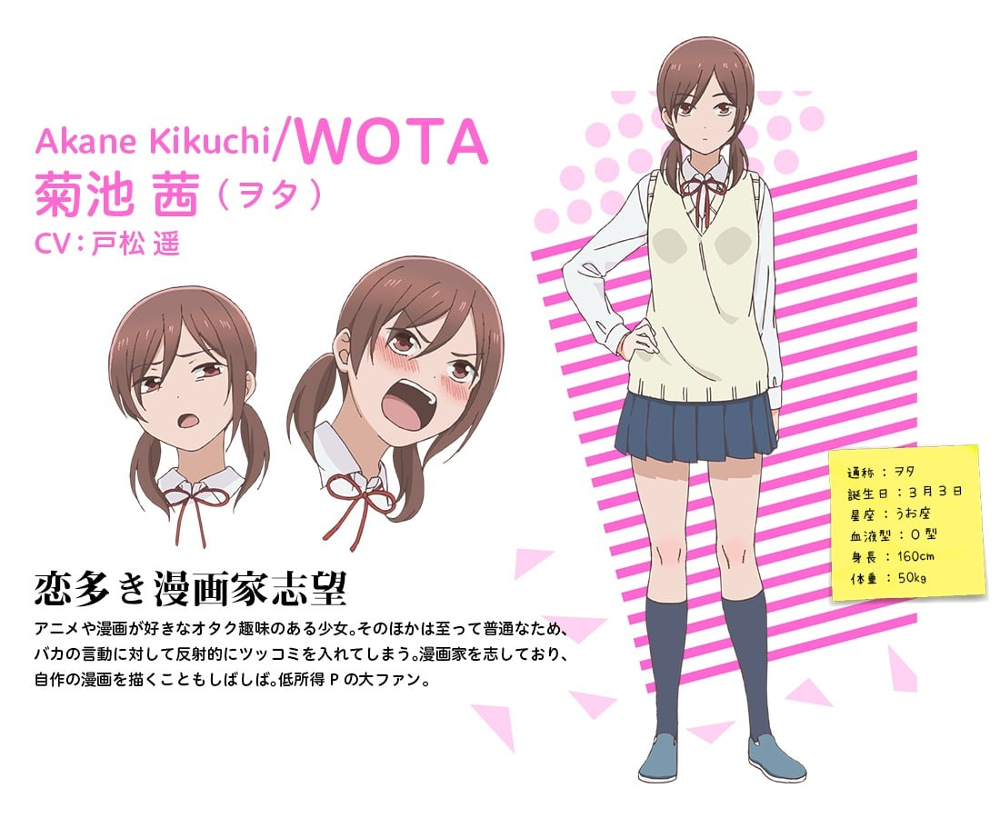 |
| 鷺宮しおり | 豊崎愛生 | ニックネームは「ロボ」。さいのたま女子高等学校1年生。頭が良いが、感情が死んでいる。ヲタとバカとは中学校が別になったが、高校ではさいじょに入学した。家でペットの菌を栽培している。 | 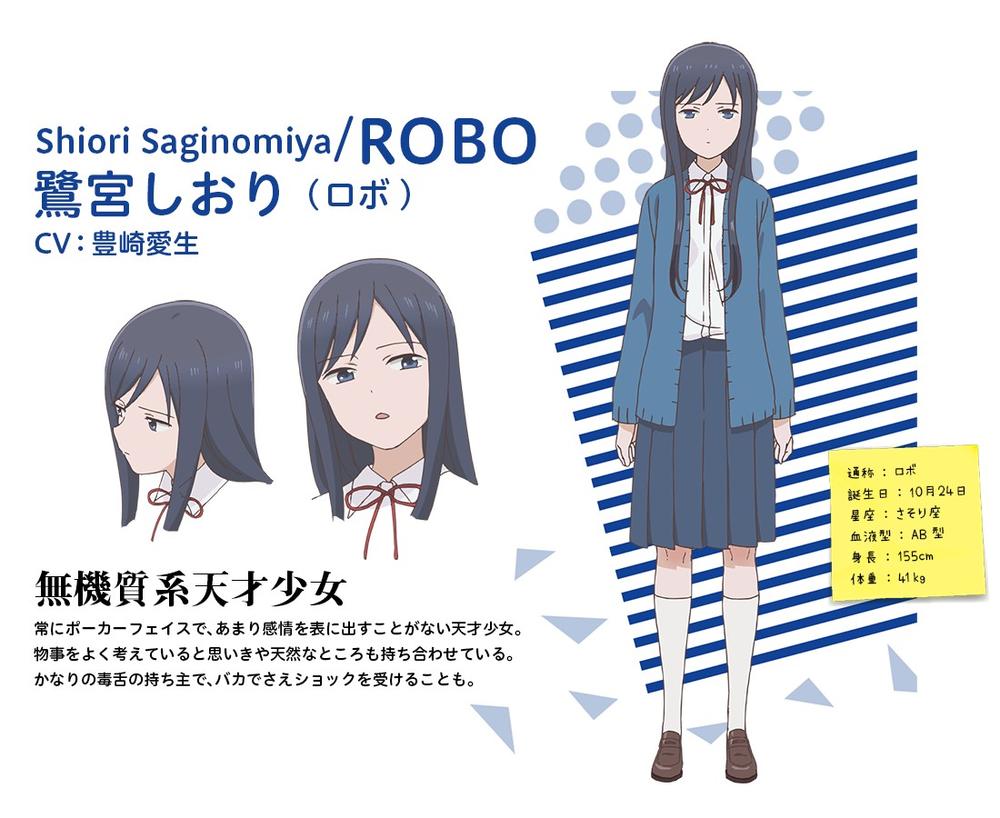 |
| 百井咲久 | 長縄まりあ | ニックネームは「ロリ」。さいのたま女子高等学校1年生。小学生並みの身長で、反抗的な態度を学校でしているが、根が優しい。 | 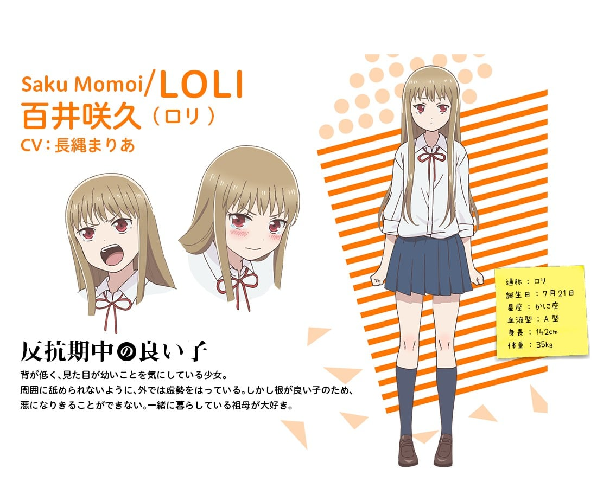 |
| 山本美波 | 富田美憂 | ニックネームは「ヤマイ」。さいのたま女子高等学校1年生。厨二病全開の高校生。いつも頬に絆創膏、右腕に包帯をしている。 | 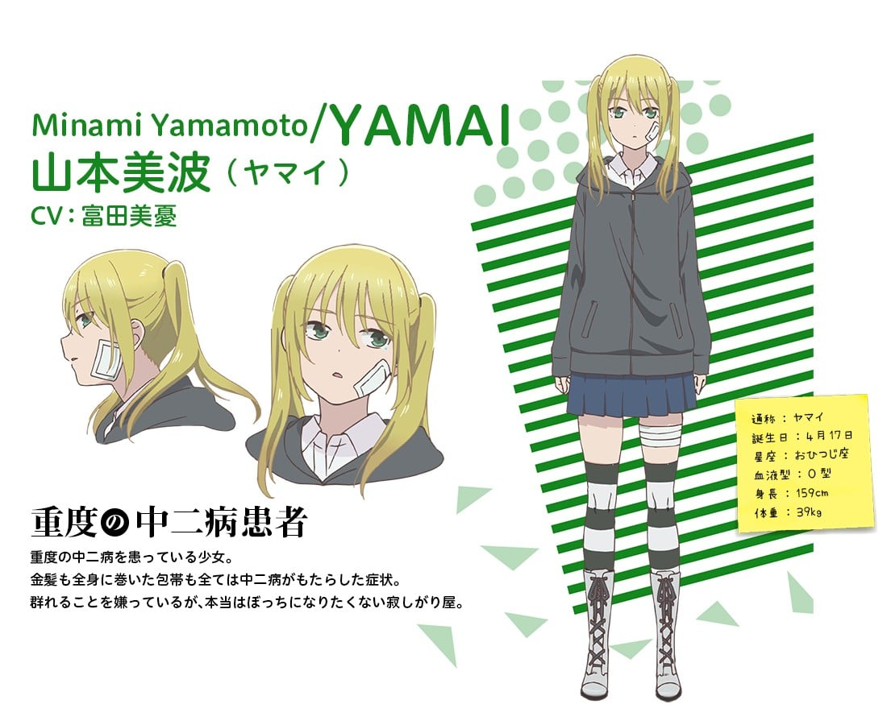 |
| 一奏 | 高橋李依 | ニックネームは「マジメ」。さいのたま女子高等学校1年生。ニックネーム通りマジメの優等生だが、心と頭が弱い。 | 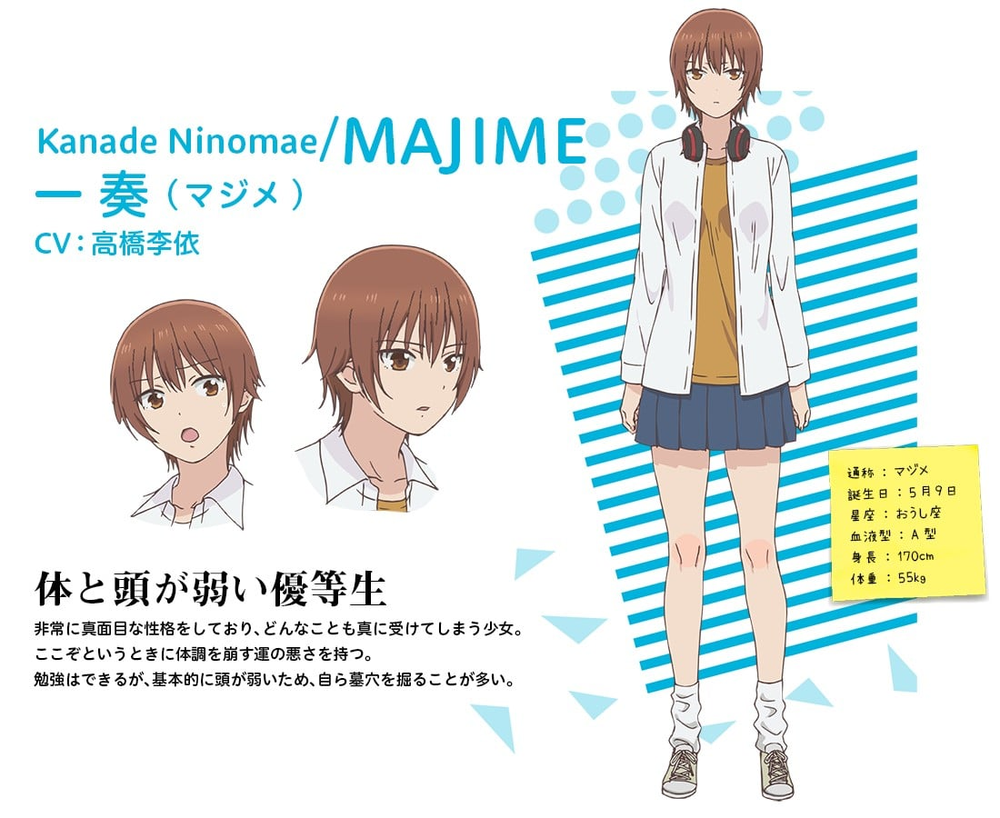 |
| 染谷リリィ | 佐藤聡美 | ニックネームは「リリィ」。さいのたま女子高等学校1年生。百合が大好きで、逆に男性に接触すると蕁麻疹がでるほど男性恐怖症。また、なぜか田中とも接触すると蕁麻疹がでる。一奏ことマジメに嫉妬しているが友人関係である。 | 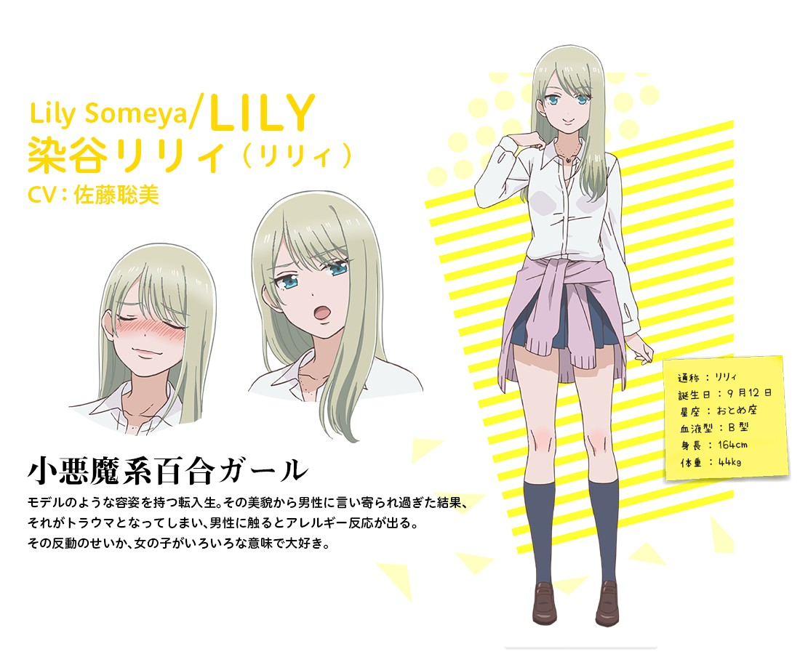 |
| 久条翡翠 | M・A・O | ニックネームは「マジョ」。さいのたま女子高等学校1年生。琥珀曰く「生まれてくる時に姉のコミュニケーション能力やまともな感性をすべて奪いとってしまった」。 | 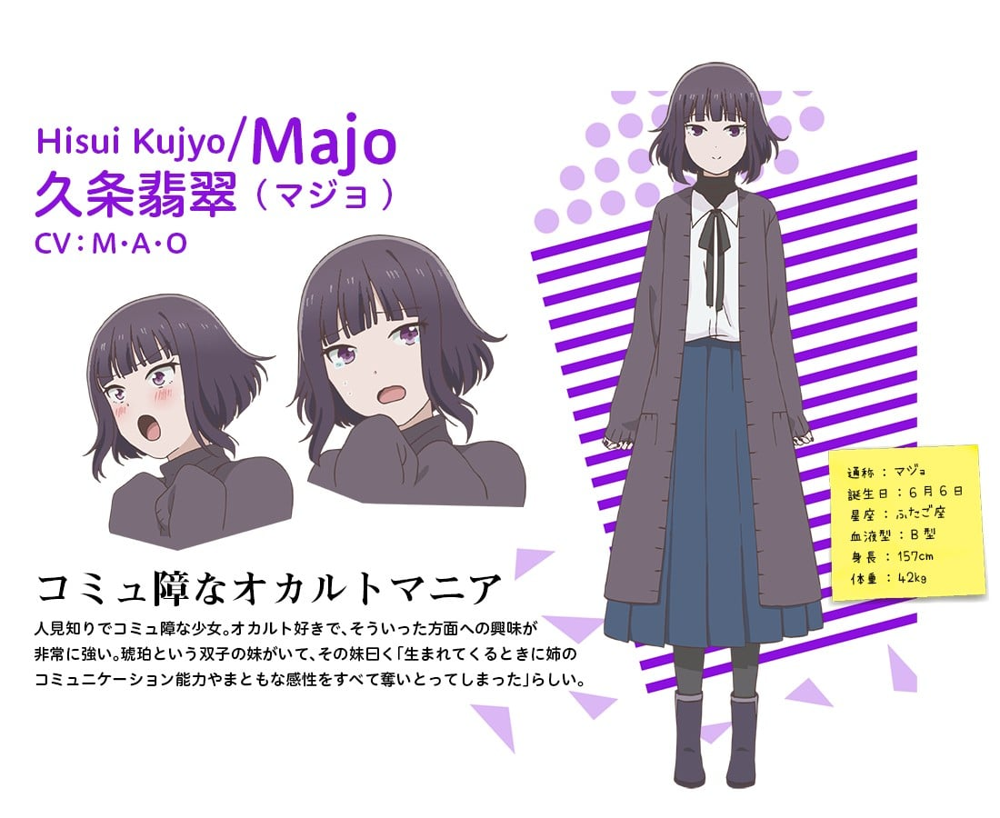 |
| 佐渡正敬 | 興津和幸 | ニックネームは「ワセダ」。さいのたま女子高等学校1年2組担任。早稲田大学出身。27歳独身。就任早々に、クラスの前で女子大生派と公言する。実はプライベートではボカロPとして曲を作っており、「低所得P」で活動している。 | 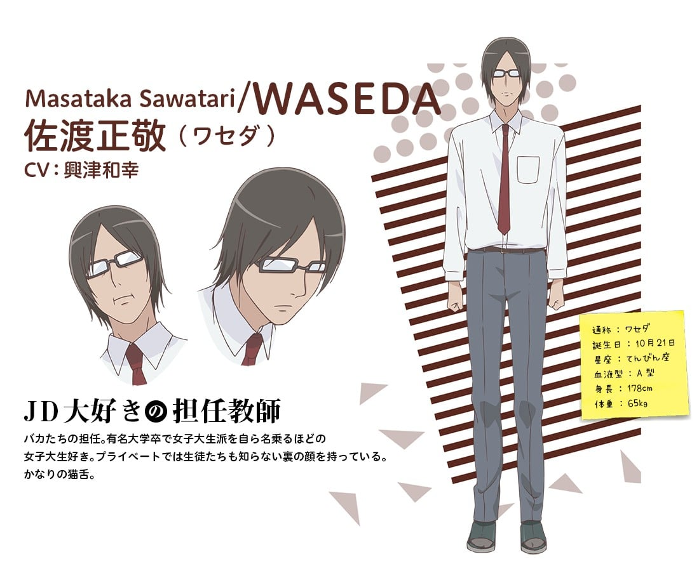 |
| 久条琥珀 | 上田麗奈 | マジョの妹 翡翠の双子の妹で、姉とは対照的に明るくて何事にも積極的な性格をした少女。 コミュ障の姉を常に心配している。 | 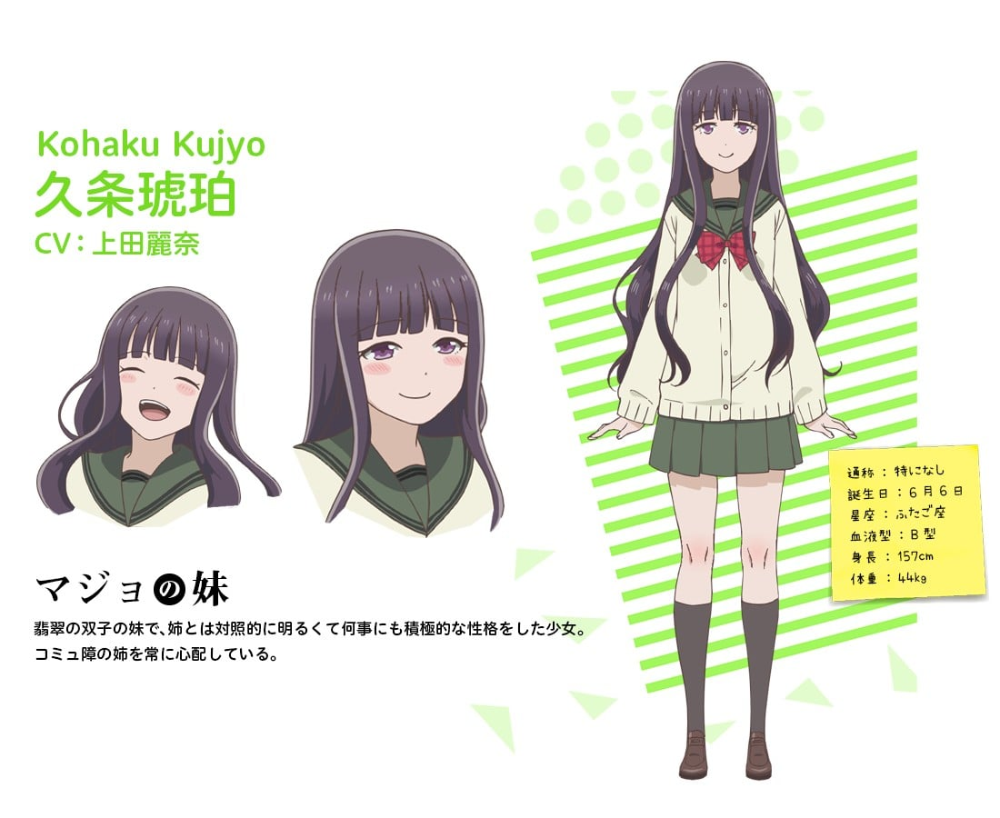 |
| シーキョン | 名塚佳織 | 養護教諭。ヤマイの中二病キャラ（設定）に対して話を合わせてくれる数少ない人物。 |  |
| ぴーなっつP | 落合福嗣 | ぴーなっつクラブで活動している。ボーカロイドマイスターの同人即売会でワセダのサークルと隣同士になる。会話では意味不明な比喩表現を頻繁に使用するため、相手に真意が伝わっていない。 | 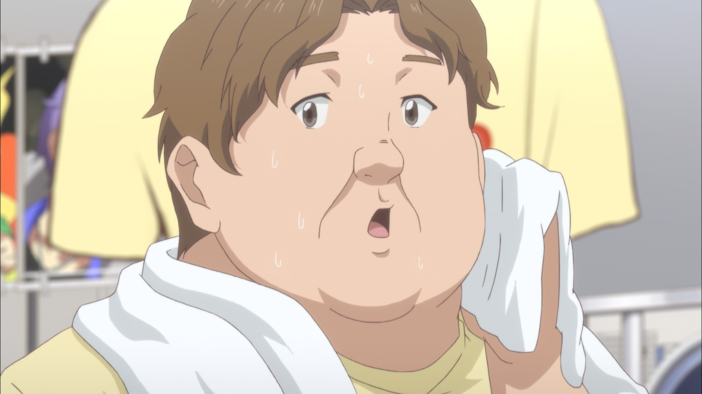 |