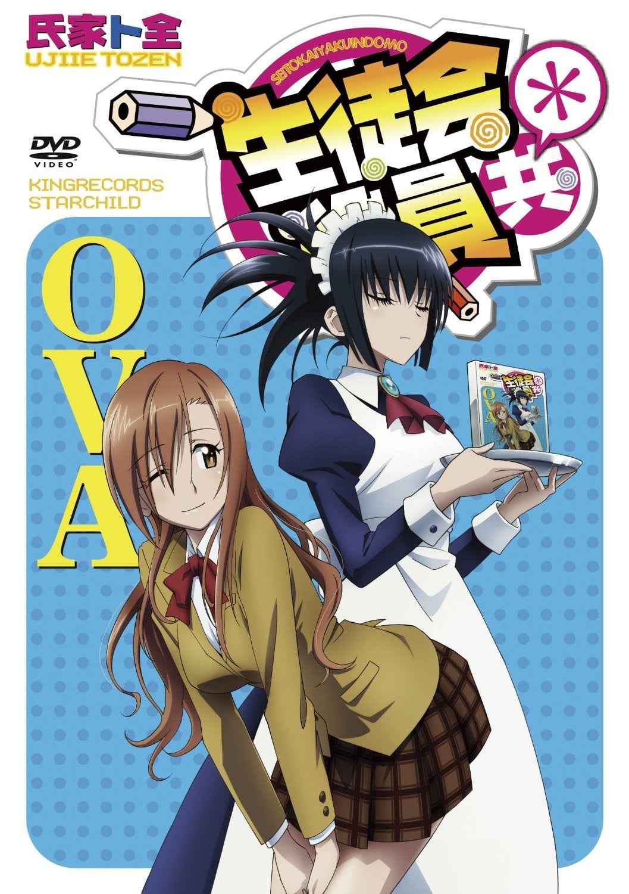
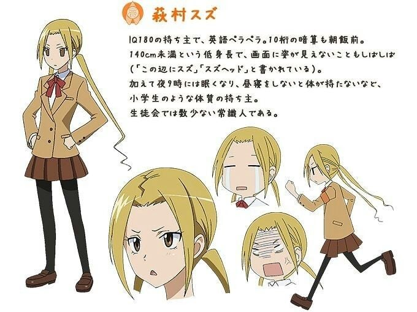

> [!bookinfo|noicon]+ **妄想学生会＊ OVA**
> 
>
| 日文名 | 生徒会役員共* OVA |
|:------: |:------------------------------------------: |
| 类型 | 漫改 |
| 新番 | 2014 年 10 月 |
| 集数 | 共1话 |
| 官网 |  |
| 制作 | GoHands |
| 导演 | 金澤洪充 |
| 脚本 | 金澤洪充 |
| 评分 | 7.5|
| 制片人 | 岸本鈴吾 |

> [!abstract]+ **简介**
> 2期OVA系列。
2#15は2014年10月22日発売 『生徒会役員共* OVA』。

> [!tip]+ **章节列表**
>- [ ] 第15话：再见硬币/原作未消化章节!积累了就发泄出来!!在里面!!/强者云集/早上好 来自身体的记忆 (2014-10-22)

> [!tip]+ **主要角色**
> 
| 角色 | CV | 简介| 角色图片 |
|:----:|:---:|:---:|:--------:|
| 津田タカトシ | 浅沼晋太郎 | 学生会副会长。第一批进入樱才学园的男生之一，因为离家比较近，所以选择了就读樱才学园。入学不久就被天草筱拉进了原来清一色是女生的学生会作为学校男生在学生会的代表，并成为学生会的副会长。  声优：浅沼晋太郎、小林ゆう（幼少時） |  |
| 天草シノ | 日笠陽子 | 学生会会长。课业、运动、家务方面都很完美，不管什么事情都非常认真且照顾人，是个容貌秀丽、外貌得体的少女，在督导学生方面也不怠惰，有着孩子气的一面，非常喜欢可爱的小动物。 |  |
| 七条アリア | 佐藤聡美 | 学生会书记。成绩优异，是个外貌温柔体贴、容貌漂亮的淑女，不过有点的天然呆。身材高挑丰满，出身于富裕家庭，所用的物品和每天的便当都十分豪华；擅长茶道、花道、书法等多种才艺。不过经常做出令人无语的发言和举动，喜欢开重口味玩笑，也跟筱一样喜欢开色情玩笑，尺度甚至更大。 |  |
| 萩村スズ | 矢作紗友里 | 学生会会计。归国子女，家世不错。IQ高达180的天才少女，英语十分流利，会讲五国语言，梦想高中毕业以后出国留学，能够很快心算出10位数的计算。与天草和七条相比，算是比较正常的存在，因此有时跟津田一样得负责吐槽。 |  |
| 横島ナルコ | 小林ゆう | 担任学生会顾问的女教师。25岁。虽然是学生会顾问老师却几乎被学生会的人给遗忘跟忽略掉，就连要替她说一两句好话都很困难，似乎没有身为教师的威严。喜欢年龄较小的男性，偶尔会尝试学某些成人电视内容的剧情，而且同样很喜欢开黄腔。 |  |
| 三葉ムツミ | 小見川千明 | 柔道社社长，目前柔道二段。是个非常清纯的女孩子；食量比正常人还要多。 |  |
| 五十嵐カエデ | 加藤英美里 | 风纪委员长，有强烈的正义感。不过有男性恐惧症，所以校内巡视从来没去一年级的楼层。 |  |
| 出島サヤカ | 田村睦心 | 七条家的女仆。擅长料理与打扫，兴趣是闻大小姐穿过的衣服。容易在宅邸里迷路，常有糊里糊涂的表现。 |  |
| 魚見チヒロ | 斎藤千和 | 英棱高中的学生会长。个性及思考模式和筱十分合得来。 因为亲戚与津田的亲戚结婚，因此两人就变成了亲戚。让津田称呼自己为“姐姐”。 |  |
| 海辺ナナコ | 安済知佳 |  |  |
| 私立桜才学園高等学校 |  | 私立樱才学园高等部是主人公津田隆利等所就读的一所高中。  樱才学园原本是传统的女子高中，但因少子化问题影响，不得不改制为男女合校。每年也会举行学园祭、新生欢迎会等例行活动。  校歌为樱之空。  [mask]这歌很煽情！但放完之后基本不会有什么正经事发生！截止剧场版一共就放了二次，第二次仅仅放了一句话就急刹车太监了！[/mask]  樱才学园尚未透露具体地址，学校周边环境取材于神奈川县相模原市。  曾有一栋学生宿舍，但后来由于住宿人数越来越少被关闭、拆除。横岛鸣子学生时代曾在这栋宿舍住宿。故事第二年，学生会干部们在宿舍拆除之前帮忙搬出了宿舍内残留的物品。 |  |