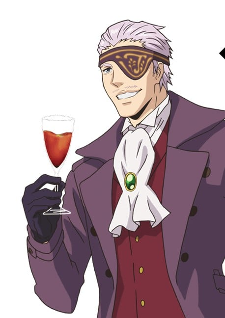
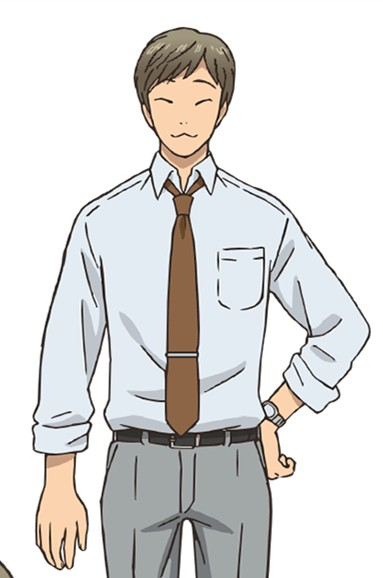
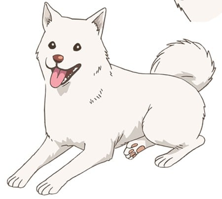

> [!bookinfo|noicon]+ **妖怪公寓的优雅日常**
> 
>
| 日文名 | 妖怪アパートの幽雅な日常 |
|:------: |:------------------------------------------: |
| 类型 | 漫改 |
| 新番 | 2017 年 7 月 |
| 集数 | 共26话 |
| 官网 | [http://youapa-anime.jp/](https://http://youapa-anime.jp/) |
| 制作 | シンエイ動画 |
| 导演 | 橋本みつお |
| 脚本 |  |
| 评分 | 5.7|
| 制片人 | 三浦俊一郎 |

> [!abstract]+ **简介**
> 因为父母双亡而艰难寄居在亲戚家的稻叶夕士，升入高中后决心独自生活。稻叶夕士找到了价格非常便宜的公寓“寿庄”。但是，那里是聚集了妖怪・幽灵・人类的“妖怪公寓”——！
稻叶夕士并不习惯去面对有着令人恐惧的身姿的妖怪们以及富有个性的怪人们，但是在与他们奇妙的共同生活中，稻叶夕士逐渐敞开了紧闭的心扉……。

> [!tip]+ **章节列表**
>- [ ] 第1话：夕士与寿庄 (2017-07-03)
>- [ ] 第2话：妖怪公寓的房客们 (2017-07-10)
>- [ ] 第3话：阿栗与小白 (2017-07-17)
>- [ ] 第4话：这一边 (2017-07-24)
>- [ ] 第5话：能说&quot;我回来了&quot;的地方 (2017-07-31)
>- [ ] 第6话：小希洛佐异魂 (2017-08-07)
>- [ ] 第7话：正在修行中！ (2017-08-14)
>- [ ] 第8话：书之主人 (2017-08-21)
>- [ ] 第9话：新学期 (2017-08-28)
>- [ ] 第10话：学校的怪谈？ (2017-09-04)
>- [ ] 第11话：最糟糕的邂逅 (2017-09-11)
>- [ ] 第12话：我会迈向未来 (2017-09-18)
>- [ ] 第13话：蜕变 (2017-09-25)
>- [ ] 第14话：妖怪公寓的夏夜渐深 (2017-10-02)
>- [ ] 第15话：新任教师登场 (2017-10-09)
>- [ ] 第16话：看着中秋的月亮蹦蹦跳 (2017-10-16)
>- [ ] 第17话：通往地狱的道路是用善意铺垫的 (2017-10-23)
>- [ ] 第18话：从心底深处说出的话语 (2017-10-30)
>- [ ] 第19话：让大家相互沟通吧 (2017-11-06)
>- [ ] 第20话：贴金的内在 (2017-11-13)
>- [ ] 第21话：这又不是漫画！ (2017-11-20)
>- [ ] 第22话：剑拔弩张的学生大会 (2017-11-27)
>- [ ] 第23话：另一张面孔，喜欢还是讨厌？ (2017-12-04)
>- [ ] 第24话：暴风雨前的暴风雨 (2017-12-11)
>- [ ] 第25话：狂风暴雨来袭 (2017-12-18)
>- [ ] 第26话：妖怪公寓的优雅日常 (2017-12-25)

> [!tip]+ **主要角色**
> 
| 角色 | CV | 简介| 角色图片 |
|:----:|:---:|:---:|:--------:|
| モブキャラクター | 梶原岳人 | 闲角，常称作路人，在电视剧、电影等作品中，指戏份薄弱的副角、不相关的小人物、串场的闲杂人等。可能用来表达地方民众的声音，或是充当背景。 モブキャラクター（mob character）とは、漫画、アニメ、映画、コンピュータゲームなどに描かれる端役のこと。群衆（群集）、または主要キャラクター以外の、その他大勢のこと。群集キャラ、背景キャラともいう。 |  |
| 稲葉夕士 | 阿部敦 | 主人公にして語り手（本作は彼による一人称形式）。中学1年のときに両親を交通事故で亡くし、中学校3年間は伯父の家で過ごしたが、伯父一家とはあまり折り合いがよくなく、高校進学を機に学生寮で一人暮らしを決断。ところが、学生寮が火事で全焼してしまい、「前田不動産」で格安アパート「寿荘」を借りるが、それが「妖怪アパート」だった。アパートでは202号室に住んでいる。一度「普通の世界に戻る」という理由でアパートを去ったが、「普通とは何か」をよく考えた末に再び戻ってくる。 当初はアパートの住人たちによって常識を破壊され続けていたが、時が経つにつれてさまざまなことを吸収してゆく。また本人の素直さや苦労したことから経験の豊富な大人達の言葉を素直に受け入れることができる素地を持っておりバイト先、学校の友人などからの言葉も受け入れることができる。成長するようになって大局的に見据える力も持つように成長していく。本人も高校卒業後は公務員か県職員になるつもりだったが、のちに大学進学を決意する。普段はツッコミ担当だが、時折セクハラとも受け取れる発言をすることがあり、周囲からつっこまれることがある。「青春したい」と漏らしているが、中学生時代は長谷に「紹介してくれ」と言う女子がいたり、高校時代も仲のいい女子が複数いたりと自覚せずに青春している。 縁あって小（プチ）ヒエロゾイコンのマスターとなる。が、あまりにも使えないため余程のことがないと使わないよう自制している。秋音から魔道書の本質を知り、少しでも扱えるように特訓を始める。秋音には「トランス状態に入りやすいため練習の際は誰かいないとだめ」だと注意される。実際にアパートに住むようになってからは霊能力の素質が開花し始め、クラスメイトの田代貴子の危機を救っている。特訓の甲斐もありプチも多少は扱えるようになった。 完結編では、古本屋と一緒に海外旅行をした後、世界的に有名な小説家になる。また、作中ラストで封じられた状態になっていたプチそのものの力も旅行中に回復した。 |  |
| 長谷泉貴 | 中村悠一 | 夕士の唯一無二の友人。中学を卒業するとき、別れの挨拶として夕士と殴り合いをした。 容姿端麗、頭脳明晰（夕士曰く「よくて東大、悪くても東大」らしい）で、進学先でも生徒会の一員たる優等生として知られるが、いつの日にか父・慶二が重役を務めている会社を乗っ取ろうと画策する野心家で、陰では地元の不良どもを束ねて着々と準備を進めている。合気道が得意。怒らせてはいけないタイプで、キレると無双に入るらしく容赦がない。 一流のビジネスマンである父親から、さまざまなこと（酒、女、帝王学…など）を教え込まれている。週末や長期の休みにはバイクでアパートにやってくることも多く、そのたびにドンペリやキャビアといった高価な品々を持ちこみ、古本屋らとともに大宴会を開く。「必要な場所への根回しには金と手間を惜しむな」を主義としており住人からの評判も良い。特にクリに懐かれており、長谷自身もクリを溺愛している。高校卒業の後、東大へ進学する。 家族内では最年少であるため、家族旅行の雑用や冷え切った関係にある本家への挨拶など、厄介事を押し付けられてばかりいる。妖怪アパートでの余暇はその憂さ晴らしでもある。 最終巻では、夕士の協力で祖父・恭造の怨念と対峙する。社会に出てからは父親の跡を継ぐのではなく、仲間を集めて会社を興し、社長に納まっている。また、高校卒業直後から妖怪アパートの201号室を（本宅であるマンションとは別に）確保していた模様。 |  |
| 久賀秋音 | 沢城みゆき | 204号室。鷹ノ台の高校に通う女子高生。昼間は高校に通い夜は人間・妖怪両方を診る「月野木病院」で丁稚奉公として働く、除霊師の卵。 両親共に霊感を持つ家系で、小学生の時に「久賀流心錬術」という精神修行道場の門下生になり、裏で霊能力者の修行を積む。「久賀秋音」は小学6年生の時に才能を認められた際に貰った名であり、本名は「鈴木まゆこ」。夕士が「プチ」の主となったことから、彼の霊力トレーニングを手助けする。かなりパワフルで夕士の特訓に付き合った後にバイトに向かう姿を見て「かっこいい」と言わしめるほど。性格は明るく朗らかだが、時折長谷のようなシビアさを見せることも。ストーカーの幽霊（死んだ後も女性に付きまとっていた）が自分の後をついてきた時、「禁!」と唱え、撃退したことがある。 かなりの大食いで、毎回その大食漢っぷりを披露している。所謂どんぶり飯で大盛りを毎回食べている。 後にプロの除霊師を目指して四国へ修行に行き、アパートを去った。その修行後は介護福祉士となって月野木病院で勤務している。 |  |
| 一色黎明 | 石田彰 | 102号室。有名な詩人で童話作家。夕士曰く「子供のラクガキのような顔」。性別は男性だが一人称は「アタシ」。甚平姿が定番。 自室は最新のAV機器やパソコンで埋め尽くされていて、デジカメで撮った写真などを加工しているらしい。 収入源もいつ仕事をしているのかも分からない人だが、その耽美でグロテスクな作風と文体から一部に偏執狂的なファンを持ち、熱狂的なファンの1人に刺されそうになったことがある。 『僕とおじいちゃんと魔法の塔』に登場する美術商「黎明苑」の社長・一色 清弥とは従兄弟同士らしい。 |  |
| 深瀬明 | 中井和哉 | 103号室。外見は暴走族の頭（ヘッド）にしか見えない、流離のヤンキー画家。国内より海外で人気が高い。 相当な場数を潜っていることを窺わせるほど喧嘩が強く、本人も好戦的。性格は頼れる兄貴分といった感じだが、第3巻では「救えないものは、救えない」とバッサリ切り捨てるリアリストな一面を覗かせた。 パフォーマンスとしてたまに個展で暴れるらしく、それを楽しみにするファンもいる。愛犬「シガー」は狼の血が混じった大型犬で、アラスカを旅行していた時に譲られたらしい（当時は子犬だった）。最終巻以降はアラスカに永住。 |  |
| 龍さん | 森川智之 | 203号室（本宅は別に持っている模様）。長身痩躯で長髪、黒ずくめの美男子という出で立ちだが、年齢不詳。「龍さん」と呼ばれる。 かなりの力を持った霊能力者で、彼がアパートにやってくると妖怪たちも襟を正すような存在感の持ち主。秋音にとっての憧れの君。普段は温厚だが、自分の力で困難を乗り越えようとしない人間には力を貸さないという、厳しい面も持つ。幽霊は幽霊と割り切ったところがあり、まり子が男湯に来ても動じないらしい。 ふらりとどこかへ出かけており、霊能力者ということで犯罪捜査に協力している。大半が所謂「X-FILE」的なことであちこちに手を貸しているらしい。古本屋曰く、ヤクザな商売らしく、危ない宗教団体の壊滅などの手伝いで刀傷が残っていることから相当の修羅場を潜っていることが窺える。 『地獄堂霊界通信』に登場する藤門 蒼龍と同一人物とする説あり。 |  |
| 古本屋 | 杉田智和 | 妖怪アパートの住人だが、普段は世界各地を歩き回っている。時折妖怪アパートに帰ってご飯を食べ、「日本人でよかった」と絶叫する。骨董屋と同じく怪しいものを扱っているらしく、一度ヴァチカンの「奇跡狩り」に連行されたことがある。 希少本や依頼があれば世界各地へ行くらしく、初登場時で1年振り（夕士が入る以前）で帰って来たと住人達は語っている。旅行トランクに本を大量に詰め込んでおり、骨董屋と同じく怪しげな本が多い。小（プチ）ヒエロゾイコンも紛れており、縁あって夕士の元に渡った。依頼された本も様々でいわく憑きも扱う。そういった本に対処するため魔道書『七賢人の書』を所持している。 『下町不思議町物語』にも登場する。 |  |
| 骨董屋 | 速水奨 | 怪しげな商品を売る商人。オールバックで薄い口髭、黒いコートを纏い、左目には幅の広い眼帯。いつも大きな荷物を背負い、編み笠をかぶった従者を5人ほど従え、次元を超えて品を求め旅をしている。怪しいものも扱っているらしくヴァチカンの「奇跡狩り」から追い回されている。 |  |
| 佐藤さん | 遊佐浩二 | 208号室。「佐藤幸司」という名前で様々な会社を転々としながら働いている妖怪。一つの会社を勤め上げた後、若干容姿を変えて別の会社に再就職している。現在はソワール化粧品という会社で働いている。働いている間は妻子がいることにしている。いつか寿命が近づいたら本当に所帯を持って人間のように老いて行きたいと語っている。 |  |
| クリ | 釘宮理恵 | 母親に虐待されて死んだ男の子の霊。生まれてからも出生届が出されず名前すらも付けて貰えなかったため、「目がクリクリしているから」という理由で黎明に「クリ」と名付けられた。虐待の後遺症で喋ることや笑うことが出来ない。 母親の妄執に縛られているために成仏できないでいたが、最終巻にて遂に妄執が消え、龍の計らいで彼の知り合いの子に生まれ変わる。 |  |
| シロ | 田村睦心 | 犬の幽霊。牝。生前は虐待されていたクリにどこからか食べ物を持ってきて与えるなど、積極的にクリの世話をしていた。クリを殺した母親を噛み殺した直後駆けつけた隣人に殺され、死後もいつもクリと一緒にいる。死んでもなおクリに執着する母親から彼を守るため大神の聖域に駆け込んだが、茜と出会い妖怪アパートへと行くこととなった。 最終巻ではクリと共に龍の知り合いの子供（双子の兄弟）に生まれ変わる。 |  |