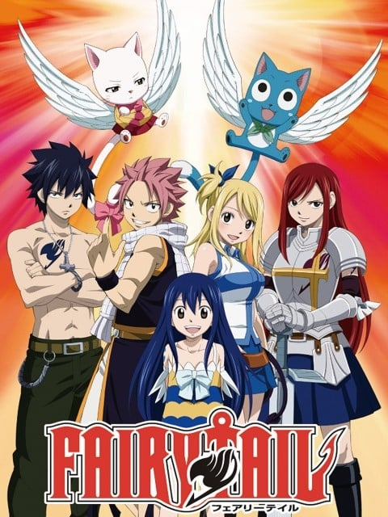
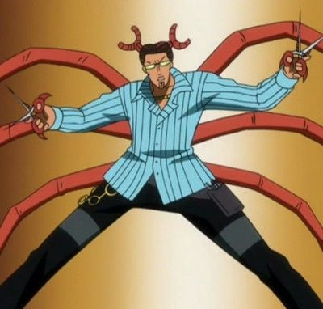

> [!bookinfo|noicon]+ **妖精的尾巴**
> 
>
| 日文名 | FAIRY TAIL |
|:------: |:------------------------------------------: |
| 类型 | 漫改 |
| 新番 | 2009 年 10 月 |
| 集数 | 共175话 |
| 官网 | [http://www.tv-tokyo.co.jp/anime/fairytail/](https://http://www.tv-tokyo.co.jp/anime/fairytail/) |
| 制作 | サテライト |
| 导演 | 石平信司 |
| 脚本 | 十川誠志,米村正二,冨岡淳広,志茂文彦,十川誠志、冨岡淳広、米村正二、志茂文彦 |
| 评分 | 7.4|
| 制片人 | 川人憲治郎,中山浩太郎 |

> [!abstract]+ **简介**
> 故事叙述在一个充满魔法的世界－“亚斯蓝德（Earth land）”中，位于菲欧烈王国的一个众多厉害魔导士云集的魔导士公会“妖精尾巴”。露西·哈特菲利亚一直希望能加入，成为其中的成员。在纳兹·多拉格尼尔的引导下，露西终于得尝所愿，并结识了许多厉害的魔导士。随后，露西跟纳兹、格雷·佛尔帕斯塔、艾尔莎·史卡雷特和哈比组成“最强队伍”，在这个全世界最吵闹、最暴力，但也是最快乐的公会里，创造出数不清的传说的，借着各种委托人的任务而不断变强，伙伴也一个一个加入，故事就这样渐渐揭开……

> [!tip]+ **章节列表**
>- [ ] 第1话：妖精的尾巴 (2009-10-12)
>- [ ] 第2话：火龙和猿和牛 (2009-10-19)
>- [ ] 第3话：潜入！艾巴尔大宅！ (2009-10-26)
>- [ ] 第4话：DEAR KABY～致亲爱的卡比～ (2009-11-02)
>- [ ] 第5话：盔甲魔导士 (2009-11-09)
>- [ ] 第6话：妖精们在风中 (2009-11-16)
>- [ ] 第7话：火和风 (2009-11-23)
>- [ ] 第8话：最强小队！！！ (2009-11-30)
>- [ ] 第9话：纳兹吞食村庄 (2009-12-07)
>- [ ] 第10话：纳兹vs.艾尔莎 (2009-12-14)
>- [ ] 第11话：被诅咒的岛 (2009-12-21)
>- [ ] 第12话：月之雫 (2009-01-04)
>- [ ] 第13话：纳兹vs.波动的悠卡 (2010-01-11)
>- [ ] 第14话：随你的便吧！！ (2010-01-18)
>- [ ] 第15话：永远的魔法 (2010-01-25)
>- [ ] 第16话：迦尔纳岛 最终决战 (2010-02-01)
>- [ ] 第17话：BURST (2010-02-08)
>- [ ] 第18话：传达到那片天空 (2010-02-15)
>- [ ] 第19话：Changeling (2010-02-22)
>- [ ] 第20话：纳兹和龙蛋 (2010-03-01)
>- [ ] 第21话：幽鬼的支配者 (2010-03-08)
>- [ ] 第22话：露西·哈特菲利亚 (2010-03-15)
>- [ ] 第23话：15分钟 (2010-03-22)
>- [ ] 第24话：为了不见到你的泪水 (2010-03-29)
>- [ ] 第25话：雨中绽放的花朵 (2010-04-12)
>- [ ] 第26话：炎之翼 (2010-04-19)
>- [ ] 第27话：两个灭龙魔导士 (2010-04-26)
>- [ ] 第28话：妖精的法律 (2010-5-3)
>- [ ] 第29话：我的决心 (2010-5-10)
>- [ ] 第30话：下一代 (2010-5-17)
>- [ ] 第31话：回不了天空的星星 (2010-5-24)
>- [ ] 第32话：星灵王 (2010-5-31)
>- [ ] 第33话：乐园之塔 (2010-6-7)
>- [ ] 第34话：杰拉尔 (2010-6-21)
>- [ ] 第35话：暗之声 (2010-6-28)
>- [ ] 第36话：乐园游戏 (2010-7-5)
>- [ ] 第37话：心灵的铠甲 (2010-07-12)
>- [ ] 第38话：命运 (2010-07-19)
>- [ ] 第39话：向圣光祈祷 (2010-07-26)
>- [ ] 第40话：妖精女王，凋零 (2010-08-02)
>- [ ] 第41话：家 (2010-08-09)
>- [ ] 第42话：「妖精的尾巴」之战 (2010-08-16)
>- [ ] 第43话：为了朋友讨伐朋友 (2010-08-23)
>- [ ] 第44话：神鸣殿 (2010-08-30)
>- [ ] 第45话：撒旦降临 (2010-09-06)
>- [ ] 第46话：激战！卡路迪亚大教堂 (2010-09-13)
>- [ ] 第47话：三条龙 (2010-09-20)
>- [ ] 第48话：幻想曲 (2010-09-27)
>- [ ] 第49话：命运的相遇之日 (2010-10-11)
>- [ ] 第50话：特别委托。注意喜欢的他！ (2010-10-18)
>- [ ] 第51话：LOVE &amp; LUCKY (2010-10-25)
>- [ ] 第52话：联合军，集结！ (2010-11-01)
>- [ ] 第53话：六魔将军现身！ (2010-11-08)
>- [ ] 第54话：天空的巫女 (2010-11-15)
>- [ ] 第55话：少女与亡灵 (2010-11-22)
>- [ ] 第56话：死亡GP (2010-11-29)
>- [ ] 第57话：暗 (2010-12-06)
>- [ ] 第58话：星灵合战 (2010-12-13)
>- [ ] 第59话：杰拉尔的回忆 (2010-12-20)
>- [ ] 第60话：迈向毁灭 (2010-12-27)
>- [ ] 第61话：超级空战！纳兹vs.眼镜蛇 (2011-01-10)
>- [ ] 第62话：圣十之裘拉 (2011-1-17)
>- [ ] 第63话：正因为你的话 (2011-1-24)
>- [ ] 第64话：零 (2011-1-31)
>- [ ] 第65话：天马致妖精们 (2011-2-7)
>- [ ] 第66话：思念的力量 (2011-2-14)
>- [ ] 第67话：有我的陪伴 (2011-2-21)
>- [ ] 第68话：只为一个人存在的公会 (2011-2-28)
>- [ ] 第69话：龙的诱惑 (2011-3-7)
>- [ ] 第70话：纳兹vs.格雷！！ (2011-3-14)
>- [ ] 第71话：跨过友人的尸体 (2011-3-21)
>- [ ] 第72话：「妖精的尾巴」的魔导士 (2011-3-28)
>- [ ] 第73话：彩虹之樱 (2011-04-02)
>- [ ] 第74话：温蒂，初次大任务！？ (2011-4-9)
>- [ ] 第75话：24小时耐久公路赛 (2011-4-16)
>- [ ] 第76话：基尔达斯 (2011-4-23)
>- [ ] 第77话：艾斯兰登 (2011-4-30)
>- [ ] 第78话：艾德拉斯 (2011-5-7)
>- [ ] 第79话：妖精狩猎 (2011-5-14)
>- [ ] 第80话：希望的钥匙 (2011-5-21)
>- [ ] 第81话：火球 (2011-5-28)
>- [ ] 第82话：欢迎回来 (2011-6-4)
>- [ ] 第83话：艾克斯塔利亚 (2011-6-11)
>- [ ] 第84话：飞吧！到朋友的身边！ (2011-6-18)
>- [ ] 第85话：代号ETD (2011-6-25)
>- [ ] 第86话：艾尔莎 vs. 艾尔莎 (2011-7-2)
>- [ ] 第87话：不惜生命！！！！ (2011-7-9)
>- [ ] 第88话：星之大河 因荣耀而存在 (2011-7-16)
>- [ ] 第89话：终结的龙锁炮 (2011-7-23)
>- [ ] 第90话：那时的少年 (2011-7-30)
>- [ ] 第91话：DRAGON SENSE (2011-8-6)
>- [ ] 第92话：活着的人们 (2011-8-13)
>- [ ] 第93话：我就站在这里 (2011-8-20)
>- [ ] 第94话：再见 艾德拉斯 (2011-8-27)
>- [ ] 第95话：莉莎娜 (2011-9-3)
>- [ ] 第96话：毁灭生命之人 (2011-9-10)
>- [ ] 第97话：最佳搭档 (2011-9-17)
>- [ ] 第98话：幸运儿是谁？ (2011-9-24)
>- [ ] 第99话：纳兹 vs. 吉尔达斯 (2011-10-1)
>- [ ] 第100话：梅斯特 (2011-10-8)

> [!tip]+ **主要角色**
> 
| 角色 | CV | 简介| 角色图片 |
|:----:|:---:|:---:|:--------:|
| ハッピー | 釘宮理恵 | 人間の言葉が話せるエクシードという種族の青い猫で、 ナツの相棒。 翼（エーラ）という魔法で空を飛ぶことができる。 お魚が大好き。 |  |
| エルザ・スカーレット | 大原さやか | 鎧を纏った、「妖精の尻尾」で“最強の女”と言われる魔導士。 精女王（ティターニア）の異名を持ち、「妖精の尻尾」で数少ないS級魔導士の一人。 騎士（ザ・ナイト）という魔法を駆使し、別空間にストックしている武器や鎧を瞬時に「換装」して戦う。 |  |
| グレイ・フルバスター | 喜多村英梨 | 氷を様々な形に変えて武器にして戦う造形魔導士。 父から受け継いだ滅悪魔法の使い手でもある。 ナツとはよくケンカをするが、良きライバル。 服を脱ぎたがる妙なクセを持つ。 |  |
| ミラジェーン・ストラウス | 小野涼子 | 「妖精の尻尾」の看板娘。通称ミラ。19歳で、左ももに白い紋章がある。好きなものは料理、嫌いなものはゴキブリ。 前髪を縛った銀色の長髪の美女。弟のエルフマンからは「姉ちゃん」、妹のリサーナからは「ミラ姉」と呼ばれている。穏やかかつ能天気な性格で、「妖精の尻尾」でも男女問わず人気が高いが、天然ボケを咬ますこともしばしば。本人は乗り気ではないが、たまにグラビアアイドルの仕事もしており、エルザに引けを取らないナイスバディの持ち主。それ故か、大魔闘演舞では「四つ首の番犬」のバッカスにリサーナと共に眼を附けられたことも。料理が得意だが、絵はとても下手。 |  |
| カナ·アルベローナ | 喜多村英梨 |  |  |
| レビィ・マグガーデン | 伊瀬茉莉也 |  |  |
| ジェラール・フェルナンデス | 浪川大輔 |  |  |
| キャンサー | 下山吉光 | 巨蟹宮の星霊。契約者はレイラ→ルーシィ。火曜・木曜・土曜・日曜に呼び出せる。 |  |
| バルゴ | 沢城みゆき | 処女宮の星霊。契約者はエバルー→ルーシィ。月曜〜土曜に呼び出せるが、呼ばれてもいないのに出てくることがある。 |  |
| アルザック・コネル | 下山吉光 | ビスカと同じく西部大陸からの移民。18歳⇒25歳（7年後）。好きなものはビスカとアスカ、嫌いなものは辛いもの。 右目が隠れるほどの長い黒髪の青年。少々気弱で落ち込みやすく、頼りない性格。ビスカに想いを寄せており、お互い両思いなのだが奥手なため、なかなか想いを告げられずにいた。ロキに相談した所「言わないなら僕がもらっていいのかな?」と冗談を言われ、それを真に受けてライバル心を燃やす。 ナツ達が行方不明になった1年後、ビスカと結婚し娘のアスカを儲ける。7年後は髪を短くしている。気弱だった性格も子を授かったこともあり、頼れる父親へと成長した。 |  |
| ナツ・ドラグニル | 柿原徹也 | 自らの体質を竜に変える滅竜魔法（めつりゅうまほう）を使用する火の滅竜魔導士（ドラゴンスレイヤー）。 子供の頃、炎竜王イグニールに育てられた。 感情的に熱くなりがちだが、仲間を想う気持ちは誰よりも強い。 黒魔導士ゼレフや黒竜アクノロギアとの激闘を経て、 仲間と共に「100年クエスト」に挑む権利を得る。 |  |
| ルーシィ・ハートフィリア | 平野綾 | 門（ゲート）の鍵を使って異界の星霊たちを召喚し、契約者しか使えない魔法を操る星霊魔導士。 星霊を愛し、黄道十二門の鍵の多くを所有する中、一度は別れてしまったアクエリアスの鍵が再び世界のどこかに出現したと知り、探している。 新人小説家でもある。 |  |