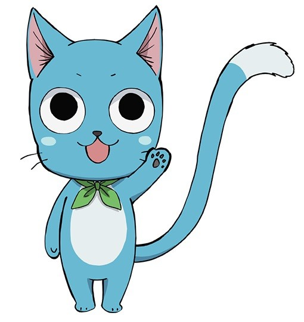
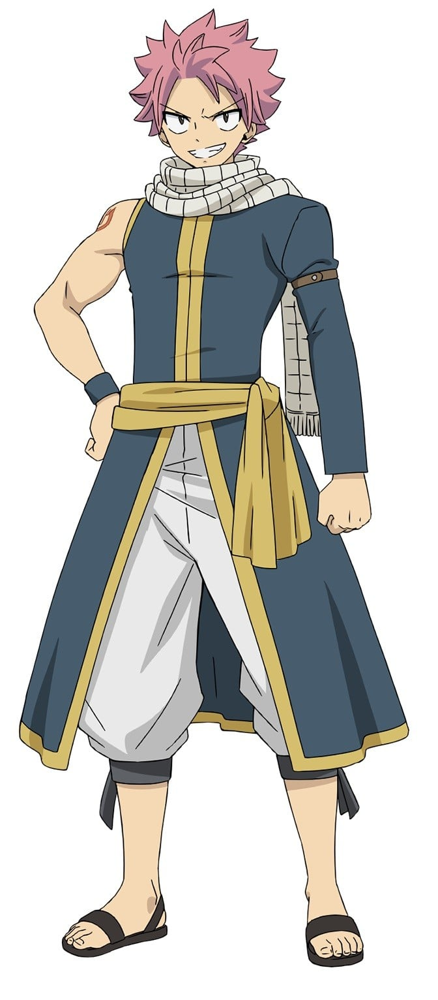
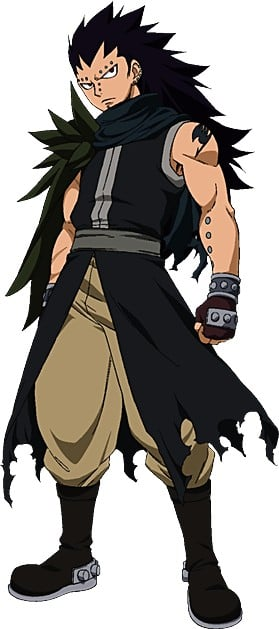

> [!bookinfo|noicon]+ **妖精的尾巴 妖精们的合宿**
> 
>
| 日文名 | FAIRY TAIL 妖精たちの合宿 |
|:------: |:------------------------------------------: |
| 类型 | 漫改 |
| 新番 | 2012 年 11 月 |
| 集数 | 共1话 |
| 官网 | [http://kc.kodansha.co.jp/fairytail/limited35/](https://http://kc.kodansha.co.jp/fairytail/limited35/) |
| 制作 |  |
| 导演 |  |
| 脚本 |  |
| 评分 | 6.8|
| 制片人 |  |

> [!abstract]+ **简介**
> 大魔闘演武にむけてナツやルーシィ達が合宿に！FAIRY TAILの仲間達が海や温泉で大騒ぎ！

> [!tip]+ **章节列表**
>- [ ] 第1话：

> [!tip]+ **主要角色**
> 
| 角色 | CV | 简介| 角色图片 |
|:----:|:---:|:---:|:--------:|
| ハッピー | 釘宮理恵 | 人間の言葉が話せるエクシードという種族の青い猫で、 ナツの相棒。 翼（エーラ）という魔法で空を飛ぶことができる。 お魚が大好き。 |  |
| エルザ・スカーレット | 大原さやか | 鎧を纏った、「妖精の尻尾」で“最強の女”と言われる魔導士。 精女王（ティターニア）の異名を持ち、「妖精の尻尾」で数少ないS級魔導士の一人。 騎士（ザ・ナイト）という魔法を駆使し、別空間にストックしている武器や鎧を瞬時に「換装」して戦う。 |  |
| グレイ・フルバスター | 中村悠一 | 氷を様々な形に変えて武器にして戦う造形魔導士。 父から受け継いだ滅悪魔法の使い手でもある。 ナツとはよくケンカをするが、良きライバル。 服を脱ぎたがる妙なクセを持つ。 |  |
| レビィ・マグガーデン | 伊瀬茉莉也 |  |  |
| ナツ・ドラグニル | 柿原徹也 | 自らの体質を竜に変える滅竜魔法（めつりゅうまほう）を使用する火の滅竜魔導士（ドラゴンスレイヤー）。 子供の頃、炎竜王イグニールに育てられた。 感情的に熱くなりがちだが、仲間を想う気持ちは誰よりも強い。 黒魔導士ゼレフや黒竜アクノロギアとの激闘を経て、 仲間と共に「100年クエスト」に挑む権利を得る。 |  |
| ルーシィ・ハートフィリア | 平野綾 | 門（ゲート）の鍵を使って異界の星霊たちを召喚し、契約者しか使えない魔法を操る星霊魔導士。 星霊を愛し、黄道十二門の鍵の多くを所有する中、一度は別れてしまったアクエリアスの鍵が再び世界のどこかに出現したと知り、探している。 新人小説家でもある。 |  |
| 妖精の尻尾 |  | 光明行会之一，光明联盟一员，名望很高，行会内高手云集。  　　妖精尾巴的宗旨就是：朝自己相信的道路前进，这才是妖精尾巴的魔导士。 |  |
| ウェンディ・マーベル | 佐藤聡美 | 「空気」を魔力の源とする、天空の滅竜魔導士（ドラゴンスレイヤー）。 攻撃力や防御力を上げる付加魔法（エンチャント）や、 治癒魔法を得意とする。 ナツと同じ第一世代の滅竜魔導士で、乗り物に弱い。 |  |
| ガジル・レッドフォックス | 羽多野渉 |  |  |
| メイビス・ヴァーミリオン |  | 妖精尾巴初代会长，有着可爱的外表，善良的内心，极聪明的头脑和自身都无法低估的能力，创造了“妖精的法律’‘、’‘妖精的光辉’‘、’‘妖精之球’‘三大超魔法，另外还有着“妖精军师”的称号，大魔导演武展现她惊人的推算能力。现自身状况为已故。妖精的尾巴公会的终极武器光子重构为冰封的梅比斯的身体。 |  |