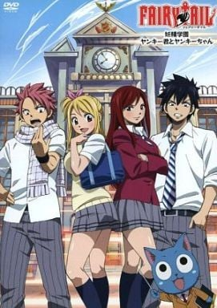
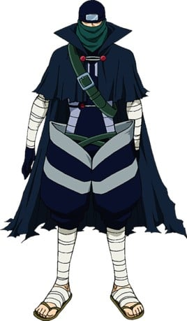
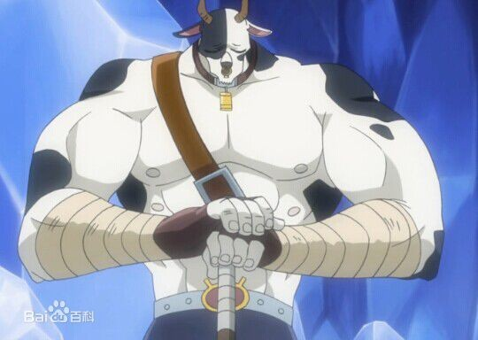
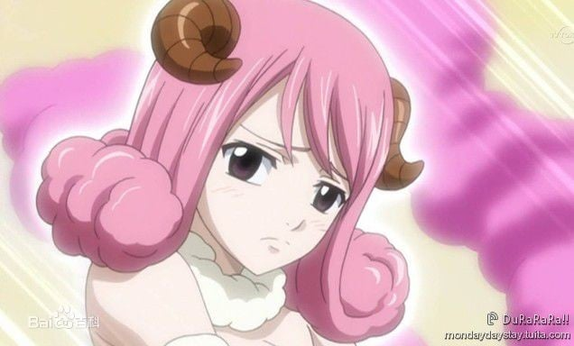
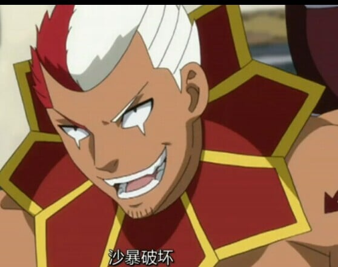
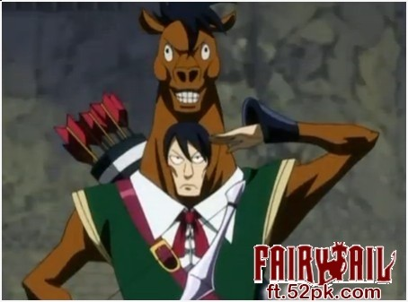

> [!bookinfo|noicon]+ **妖精的尾巴 妖精学园 不良少年与大姐头**
> 
>
| 日文名 | FAIRY TAIL 妖精学園 ヤンキー君とヤンキーちゃん |
|:------: |:------------------------------------------: |
| 类型 | 漫改 |
| 新番 | 2011 年 6 月 |
| 集数 | 共1话 |
| 官网 | [http://kc.kodansha.co.jp/fairytail/limited27/](https://http://kc.kodansha.co.jp/fairytail/limited27/) |
| 制作 |  |
| 导演 |  |
| 脚本 |  |
| 评分 | 6.7|
| 制片人 |  |

> [!abstract]+ **简介**
> 作品将以「妖精学园」作为舞台，转学生露西、总是在打架的纳兹与格雷、连不良少年也害怕的学生会长艾尔莎、完全不像是高中生的马卡罗夫……，集合了各种独具个性的师生们，他们在校园中过着快乐的每一天。某日，受到艾尔莎的委托到街上购物的露西，却无意中卷入了与幽鬼学园的争执中……。

> [!tip]+ **章节列表**
>- [ ] 第1话：

> [!tip]+ **主要角色**
> 
| 角色 | CV | 简介| 角色图片 |
|:----:|:---:|:---:|:--------:|
| プルー |  |  |  |
| ロキ |  | 背中に緑色の紋章がある。好きなものは女の子、嫌いなものは星霊魔導士（?）。 眼鏡をかけた美青年。「彼氏にしたい魔導士」ランキングの上位を常にキープしている。しかし本人はかなりキザな女好きで、過去にエルザを口説こうとして半殺しにされてからは、彼女を苦手としている。 |  |
| ミストガン |  | S級魔導士。 複数の杖を背負い、マントで身を包んでいる。顔も迷彩柄のマスクと布で覆っており、目元以外の肌が確認できない。ラクサス曰くシャイな性格で、人前に現れる際には強力な眠りの魔法を使うため、ギルド内ではマカロフとラクサス以外は彼の顔を見たことがない。ギルド外ではポーリュシカと面識がある様子。ギルド思いらしく、「幽鬼の支配者」との戦いでは直接の戦闘にこそ加担しなかったものの、「幽鬼の支配者」の支部を一人で全滅させた他、マカロフの魔力を集めて彼の回復に一役買った。　 その正体はエドラスにおけるジェラールであり、王国の王子。幼い頃、父である国王・ファウストの「永遠の魔力を手に入れる」という計画を阻止する為、7年前からアースランドでアニマを封じ回っていた。その途中で出逢ったウェンディを助けて行動を共にしていたが、自分の使命に巻き込ませないために別離を選んだ。王子ということもあって喋り方も気品があり、王族ならではのカリスマも有する。 |  |
| タウロス |  | 金牛宮の星霊。契約者はルーシィ。月曜・水曜・金曜・土曜に呼び出せるが、呼ばれてもいないのに出てくることがある。 |  |
| アリエス |  | 白羊宮の星霊。契約者はカレン→エンジェル→ルーシィ。 羊の角を生やし、モコモコの服を着た美女の姿をしている。星霊の中ではロキと親しい。「すみません」が口癖で、いつもオドオドしていて内向的な性格だが星霊の誇りは忘れない。 |  |
| スコーピオン |  | 天蝎宮の星霊。契約者はエンジェル→ルーシィ。 頭の右側が赤、左側が白という特徴的な頭髪を持つ男性の姿をしている。テンションの高いチャラ男であり、一人称は「オレっち」、口癖は「ウィーアー!!」。アクエリアスの彼氏であるが、彼女が彼に対し猫を被っていることを知らない（星霊界では彼女の怖さは有名であり、スコーピオンだけが知らないらしい）。銃が仕込まれた巨大なサソリの尻尾を持ち、砂嵐を操ることが出来る。 |  |
| サジタリウス |  | 人馬宮の星霊。契約者はルーシィ。 馬の被り物（顔の部分は生きているかのように動く）を着た男性の姿をしている。一人称は「某（それがし）」で、口癖は「〜であるからして〜もしもし」。ルーシィの事は「ルーシィ殿」と呼んでいる。弓矢の名手で、その実力は矢の射抜き方一つで機材を爆破させたり、発火させること等が可能であるほど。 鍵はガルナ島の村長から依頼の報酬として受け取った。 |  |
| アクエリアス |  | 宝瓶宮の星霊。契約者はレイラ→ルーシィ。水曜日に呼び出せる（後に呼び出せる曜日が増えた模様）。 瓶を持った女性の人魚の姿をしている。態度と愛想が悪く傲慢な性格で、基本的にルーシィのことを「小娘」呼ばわりしている。一方、彼氏であるスコーピオンの前では猫を被っており、それを見て唖然とするルーシィに対して「余計な事を言ったらぶっ殺す」と脅しをかけていた。自分の鍵を粗末に扱われるのを嫌がっており、「幽鬼の支配者」事件で自分の鍵を落としたルーシィに対し一晩中折檻した事もある。 手に持った瓶から大量の水を操り、大波を起こして攻撃する。ルーシィと契約している星霊では最強クラスだが、それ故に魔力の消費が激しくしかも水場でしか呼び出せない。彼女が攻撃する際、主人であるルーシィを狙って攻撃することもあるが、攻撃範囲が広いため結局は敵にも攻撃が当たる。小説版では水で構成される霧がある空間でも活動できることが明かされているが、ルーシィには教えていない。 |  |