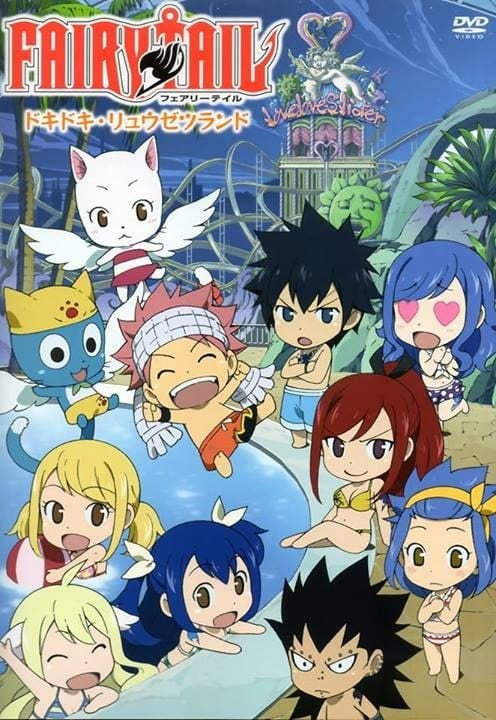
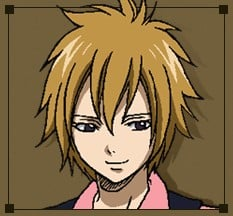
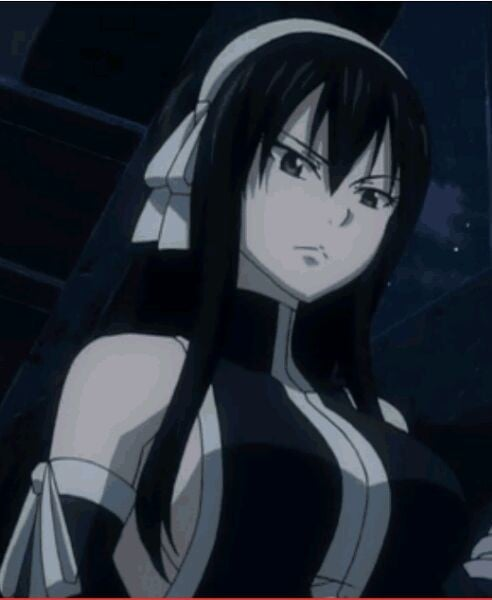
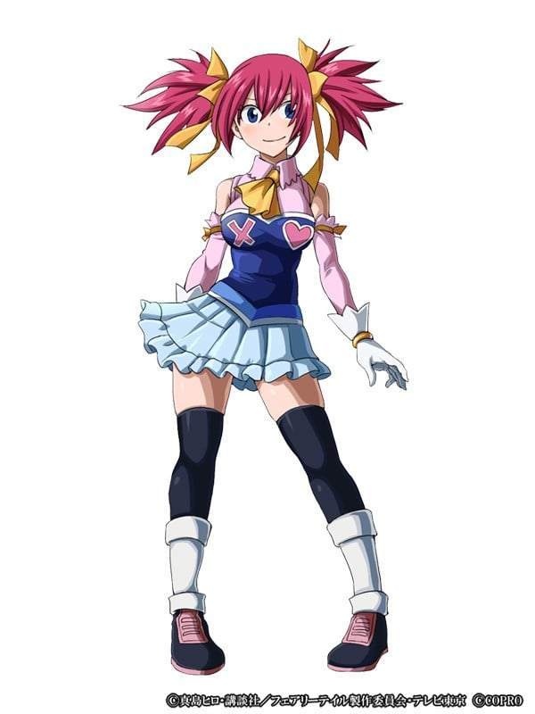
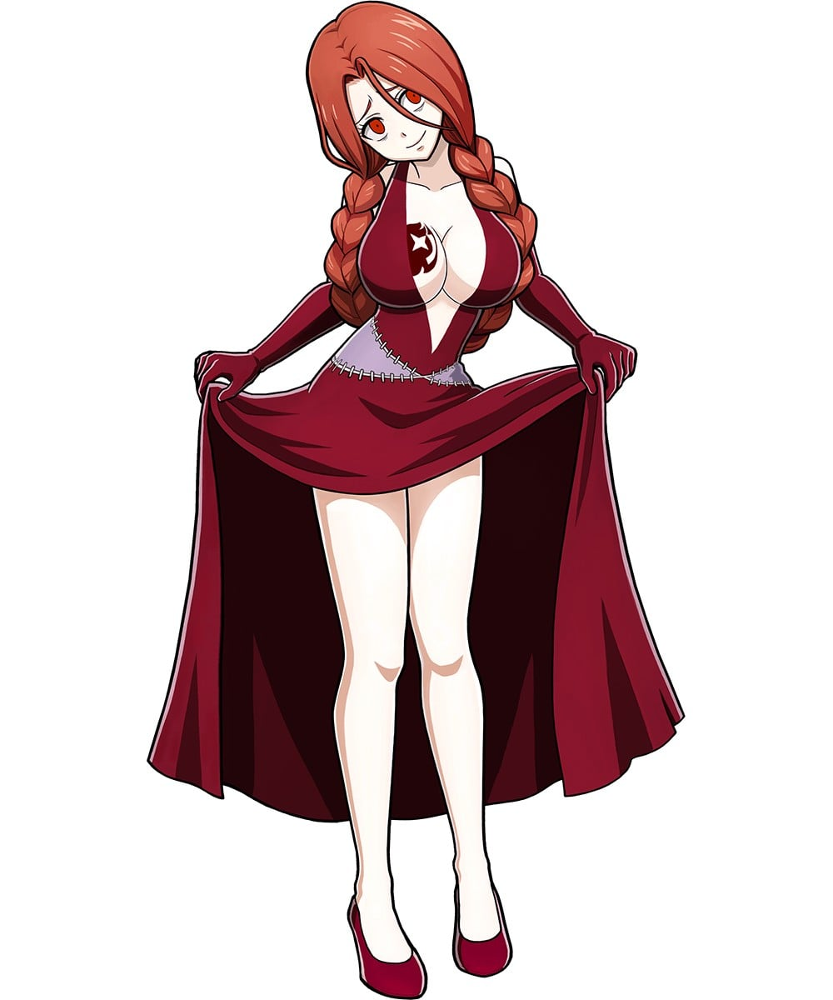
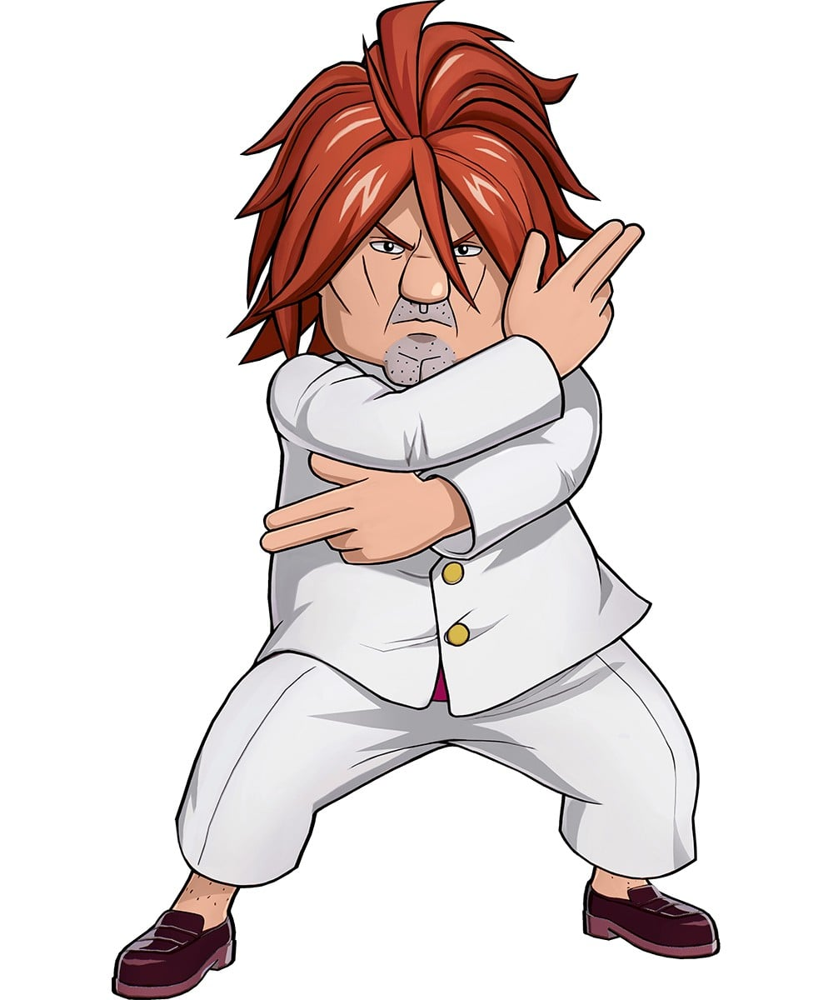
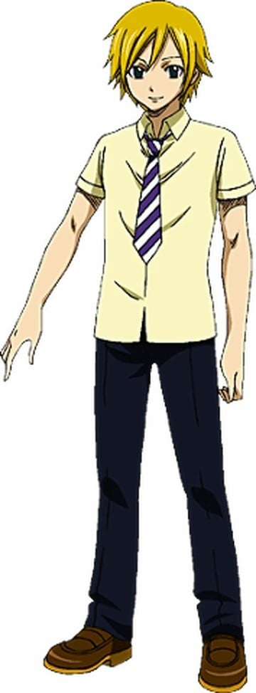
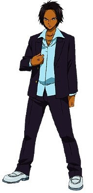
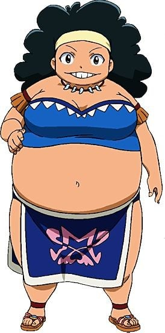

> [!bookinfo|noicon]+ **妖精的尾巴 心跳不已·龙舌兰乐园**
> 
>
| 日文名 | FAIRY TAIL ドキドキ・リュウゼツランド |
|:------: |:------------------------------------------: |
| 类型 | 漫改 |
| 新番 | 2013 年 6 月 |
| 集数 | 共1话 |
| 官网 | [http://kc.kodansha.co.jp/fairytail/limited38/index.html](https://http://kc.kodansha.co.jp/fairytail/limited38/index.html) |
| 制作 |  |
| 导演 |  |
| 脚本 |  |
| 评分 | 6.9|
| 制片人 |  |

> [!abstract]+ **简介**
> 勝利のためには息抜きが大事！？
大魔闘演武3日目の夜は、みんな"水着"で嬉しいハプニングがいっぱい

> [!tip]+ **章节列表**
>- [ ] 第1话：

> [!tip]+ **主要角色**
> 
| 角色 | CV | 简介| 角色图片 |
|:----:|:---:|:---:|:--------:|
| 妖精の尻尾 |  | 光明行会之一，光明联盟一员，名望很高，行会内高手云集。  　　妖精尾巴的宗旨就是：朝自己相信的道路前进，这才是妖精尾巴的魔导士。 |  |
| ヒビキ・レイティス | 近藤隆 | 別名「白夜のヒビキ」。20歳⇒27歳（7年後）で、左肩に水色の紋章がある。好きなものは女性全員、嫌いなものは虫。     週刊ソーサラーの「彼氏にしたい魔導士ランキング」の上位ランカーの美青年。かつてはカレンの恋人であったため、ロキ（レオ）、アリエスのことを知っていた。7年後はジェニーと恋愛関係にある模様で、人目を憚らずイチャついていた。     六魔将軍討伐のための「連合」に参加し、古文書を駆使して「連合」メンバーに指示を行っていた。「六魔将軍」のエンジェルに襲われて重傷を負い、彼女がカレンを殺したことを聞いて闇に落ちそうになるも、ルーシィに「ウラノ・メトリア」を与えて協力した。ニルヴァーナ起動後はクリスティーナでリオンらとの魔法で航行し、ニルヴァーナ侵入に成功したナツ達を手助けした。     大武闘演武では3日目の魔力測定器を用いた競技に出場するも、大きな結果を得られなかった。最終日ではトライメンズで行動し、「人魚の踵」のアラーニャとべスに勝利するも、ガジルの攻撃から逃れたところを、待ち伏せていたグレイに倒される。          古文書（アーカイブ） - 情報を魔法で圧縮して対象者に与える。また、この魔法に圧縮された情報を用いて攻撃や防御を行うこともできる。 |  |
| メイビス・ヴァーミリオン |  | 妖精尾巴初代会长，有着可爱的外表，善良的内心，极聪明的头脑和自身都无法低估的能力，创造了“妖精的法律’‘、’‘妖精的光辉’‘、’‘妖精之球’‘三大超魔法，另外还有着“妖精军师”的称号，大魔导演武展现她惊人的推算能力。现自身状况为已故。妖精的尾巴公会的终极武器光子重构为冰封的梅比斯的身体。 |  |
| アクエリアス |  | 宝瓶宮の星霊。契約者はレイラ→ルーシィ。水曜日に呼び出せる（後に呼び出せる曜日が増えた模様）。 瓶を持った女性の人魚の姿をしている。態度と愛想が悪く傲慢な性格で、基本的にルーシィのことを「小娘」呼ばわりしている。一方、彼氏であるスコーピオンの前では猫を被っており、それを見て唖然とするルーシィに対して「余計な事を言ったらぶっ殺す」と脅しをかけていた。自分の鍵を粗末に扱われるのを嫌がっており、「幽鬼の支配者」事件で自分の鍵を落としたルーシィに対し一晩中折檻した事もある。 手に持った瓶から大量の水を操り、大波を起こして攻撃する。ルーシィと契約している星霊では最強クラスだが、それ故に魔力の消費が激しくしかも水場でしか呼び出せない。彼女が攻撃する際、主人であるルーシィを狙って攻撃することもあるが、攻撃範囲が広いため結局は敵にも攻撃が当たる。小説版では水で構成される霧がある空間でも活動できることが明かされているが、ルーシィには教えていない。 |  |
| ウルティア·ミルコビッチ |  | 元「悪魔の心臓」の一員で、「煉獄の七眷属」のリーダー。グレイの師であるウルの娘。背中に紋章がある。 長い黒髪でカチューシャを付けた女性。 |  |
| シェリア・ブレンディ | 井口裕香 | 天空灭神魔导士。雪莉·布兰蒂的表妹，是一个冒失鬼（在大魔斗演武登场时摔倒），会很享受战斗，在战斗中吸入空气以提高自身力量。有时会小小的腹黑，被托比夸奖很厉害，左右两个辫子，喜欢利昂，所以视利昂暗恋的茱比亚为情敌。当雪莉娅在战斗中吸食空气时就代表认同了对方。和妖精的尾巴的温蒂是好朋友。 |  |
| ジェニー・リアライト | 名塚佳織 | 青色天马的魔导士，性感美丽，好胜心强。使用接收魔法（机械之魂）。珍妮·莉亚莱特是青色天马的魔导士，同时也是魔法周刊顶级写真模特。  7年前曾和妖精的尾巴米拉杰·斯特劳争夺这一宝座。七年后，珍妮抢下写真模特第一宝座，和米拉既是好对手，也是好朋友。在大魔斗演武中和米拉打赌并输给了她，因此在魔法周刊上公开了自己的全裸照。到了要拍照的关键时刻，其本人貌似并不完全不乐意。 |  |
| フレア・コロナ | 伊藤静 | 「大鴉の尻尾」のメンバー。自分の髪を操作して武器とする「髪しぐれ」の魔法を使う。 |  |
| 一夜＝ヴァンダレイ＝寿 | 速水奨 | ギルド「青い天馬」に所属する魔導士。美男美女揃いのギルドの中では異色の存在だが、実力は群を抜いて高く、メンバーからの信頼も厚い。様々な「香り」を使った魔法を得意とする。 |  |
| イヴ・ティルム | 緒乃冬華 | 伊凡·绨鲁姆，入公会以前在隶属于魔法评议院旗下的强制管束部队“Rune Knight”做见习，因评议会解体，在必须选择自己前途之时决定了加入公会。对同属于青色天马的一夜十分敬佩，尊称其为“老师”。 |  |
| レン・アカツキ | 松風雅也 | 蓝色天马所属的空气魔导士，被称作为空夜的莲，十分尊敬同属于青色天马的一夜，并尊称其为“老师”。他的魔法能够破坏空间，夺走氧气，如果他作为对手的话，是个难以对付的人。 |  |
| リズリー・ロー | ならはしみき | 人鱼脚跟的魔导士，是一个身材丰腴，戴着头带，有着乱发的女性，使用的魔法为重力变化，是由神乐所传授的。口头禅是“可别小看人鱼啊” |  |