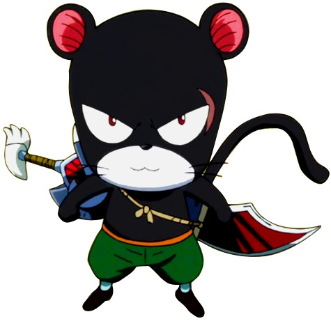

> [!bookinfo|noicon]+ **妖精的尾巴 总集篇**
> 
>
| 日文名 | FAIRY TAIL TVアニメ総集編 |
|:------: |:------------------------------------------: |
| 类型 | 漫改 |
| 新番 | 2010 年 12 月 |
| 集数 | 共1话 |
| 官网 | [http://kc.kodansha.co.jp/fairytail/limited24/](https://http://kc.kodansha.co.jp/fairytail/limited24/) |
| 制作 |  |
| 导演 |  |
| 脚本 |  |
| 评分 | 6.5|
| 制片人 |  |

> [!abstract]+ **简介**
> TV第1话~38话总集编

> [!tip]+ **章节列表**
>- [ ] 第1话：

> [!tip]+ **主要角色**
> 
| 角色 | CV | 简介| 角色图片 |
|:----:|:---:|:---:|:--------:|
| 妖精の尻尾 |  | 光明行会之一，光明联盟一员，名望很高，行会内高手云集。  　　妖精尾巴的宗旨就是：朝自己相信的道路前进，这才是妖精尾巴的魔导士。 |  |
| パンサーリリー | 東地宏樹 | 元エドラス王国軍第一魔戦部隊隊長。愛称はリリー。背中に白い紋章がある。好きなものはキウイ、嫌いなものは雷。 左目に傷のある黒豹に似たエクシード。人間の成人男性並の体躯を持つが、アースランドでは身体の調子が合わず、通常のエクシード並に身体が縮んでしまった（短時間なら元の姿である「戦闘フォーム」に戻れる）。基本的には生真面目で至って冷静な性格だが、パートナーになったガジルに多かれ少なかれ影響されてきており、性格や口癖が移って来ている。 鍔に猫の顔の意匠があるリリー自身の4倍の大きさの両刃剣「バスターマァム」を使い、刀身のサイズを変化できる。エドラスの戦闘でガジルに破壊され、後に「悪魔の心臓」メンバーが所持していた「バスターマァム」と同様の効果を持つ刀身に音符が刻まれた片刃剣「ムジカの剣」[41]を戦闘中に強奪、普段は自分の体のサイズに合わせて縮小し背中に帯剣している。 エドラス時代、幼少時のジェラール（ミストガン）を治療する為、無断でエクスタリアに連れ帰った事を理由に堕天の烙印を押され、故郷を追われて王国に与した。かつての同胞達を皆殺しにするコードETDには従っていたが、内心ではエクスタリアを愛しており、魔水晶衝突の際にシャゴットと和解した。アニマの逆展開で他のエクシード達と共にアースランドに渡った後はミストガンが所属していた「妖精の尻尾」に加入し、ガジルのパートナーにもなった。ギルド内では同じエクシードのハッピー、シャルルと共に「エクシード隊」も結成している。 |  |