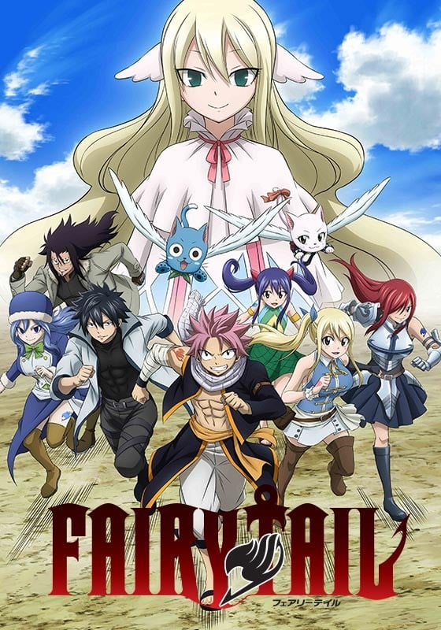
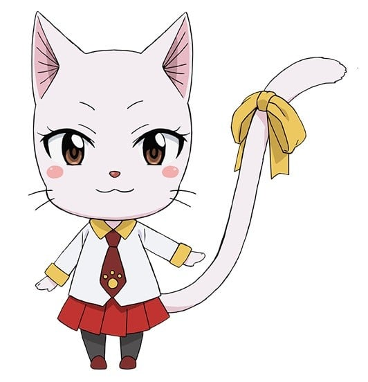
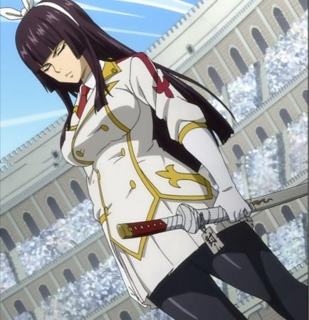

> [!bookinfo|noicon]+ **妖精的尾巴 最终季**
> 
>
| 日文名 | FAIRY TAIL ファイナルシリーズ |
|:------: |:------------------------------------------: |
| 类型 | 漫改 |
| 新番 | 2018 年 10 月 |
| 集数 | 共51话 |
| 官网 | [https://fairytail-tv.com/](https://https://fairytail-tv.com/) |
| 制作 | CloverWorks |
| 导演 | 石平信司 |
| 脚本 |  |
| 评分 | 6.7|
| 制片人 | 飯島弘志 |

> [!abstract]+ **简介**
> 仲間への想いを胸に、自分の信じた道を進め！

闇ギルド「冥府の門」との激闘、そして育ての親である＜火竜イグニール＞との哀しい別れを経たナツは、
更に強くなるべく、相棒のハッピーを連れて修行の旅へ出た。

一方、「妖精の尻尾」のマスター・マカロフは、何の前触れもなく一方的にギルド解散命令を出し、自身も行方をくらましてしまう。

それから約１年･･･、ルーシィは記者見習いの仕事をしながら、大陸中に散らばったかつての仲間たちの情報を集めていた。
そして年に一度の「大魔闘演武」の取材をしていたある日、ルーシィの前に修行を終えたナツが現れる！
魔導士ギルド「妖精の尻尾」の復活を掲げ、想いを一つに、ナツ・ルーシィ・ハッピーによる仲間探しの旅が始まるのだった!!

> [!tip]+ **章节列表**
>- [ ] 第278话：蛇姬之麟的感谢祭 (2018-10-07)
>- [ ] 第279话：因为爱 (2018-10-14)
>- [ ] 第280话：黑魔术教团 (2018-10-21)
>- [ ] 第281话：地下的激斗 (2018-10-28)
>- [ ] 第282话：净化作战 (2018-11-04)
>- [ ] 第283话：战之绊 (2018-11-11)
>- [ ] 第284话：回想录 (2018-11-18)
>- [ ] 第285话：七代目ギルドマスター (2018-11-25)
>- [ ] 第286话：空間の掟 (2018-12-02)
>- [ ] 第287话：皇帝スプリガン (2018-12-09)
>- [ ] 第288话：神に見捨てられた地へ (2018-12-16)
>- [ ] 第289话：メイビスとゼレフ (2018-12-23)
>- [ ] 第290话：妖精の心臓（フェアリーハート） (2019-01-06)
>- [ ] 第291话：マグノリア防衛戦 (2019-01-13)
>- [ ] 第292话：明星 (2019-01-20)
>- [ ] 第293话：その香り（パルファム）は誰がために (2019-01-27)
>- [ ] 第294话：ナツ vs. ゼレフ (2019-02-03)
>- [ ] 第295话：400年の時を超え (2019-02-10)
>- [ ] 第296话：あたしのしたい事 (2019-02-17)
>- [ ] 第297话：戦いが終わるまでは (2019-02-24)
>- [ ] 第298话：静かなる時の中で (2019-03-03)
>- [ ] 第299话：復活のナツ!! (2019-03-10)
>- [ ] 第300话：屍のヒストリア (2019-03-17)
>- [ ] 第301话：気魄 (2019-03-24)
>- [ ] 第302话：第三の印 (2019-03-31)
>- [ ] 第303话：ずっと二人で (2019-04-07)
>- [ ] 第304话：フェアリーテイル ZERO (2019-04-14)
>- [ ] 第305话：白きドラグニル (2019-04-21)
>- [ ] 第306话：冬の魔導士 (2019-04-28)
>- [ ] 第307话：グレイとジュビア (2019-05-05)
>- [ ] 第308话：ゼレフ書最強の悪魔 (2019-05-12)
>- [ ] 第309话：壊れた絆を (2019-05-19)
>- [ ] 第310话：快楽と苦痛 (2019-05-26)
>- [ ] 第311话：ナツノココロ (2019-06-02)
>- [ ] 第312话：白影竜のスティング (2019-06-09)
>- [ ] 第313话：竜の種 (2019-06-16)
>- [ ] 第314话：極限付加術（マスターエンチャント） (2019-06-23)
>- [ ] 第315话：竜か悪魔か (2019-06-30)
>- [ ] 第316话：グレイの切り札 (2019-07-07)
>- [ ] 第317话：黒い未来 (2019-07-14)
>- [ ] 第318话：ぼくのなまえは… (2019-07-21)
>- [ ] 第319话：情 (2019-07-28)
>- [ ] 第320话：ネオ・エクリプス (2019-08-04)
>- [ ] 第321话：愛はもう見えない (2019-08-11)
>- [ ] 第322话：誓いの扉 (2019-08-18)
>- [ ] 第323话：荒ぶる竜の炎 (2019-08-25)
>- [ ] 第324话：炎消える時 (2019-09-01)
>- [ ] 第325话：世界崩壊 (2019-09-08)
>- [ ] 第326话：希望の魔法 (2019-09-15)
>- [ ] 第327话：繋がる心 (2019-09-22)
>- [ ] 第328话：かけがえのない仲間たち (2019-09-29)

> [!tip]+ **主要角色**
> 
| 角色 | CV | 简介| 角色图片 |
|:----:|:---:|:---:|:--------:|
| ハッピー |  | 人間の言葉が話せるエクシードという種族の青い猫で、 ナツの相棒。 翼（エーラ）という魔法で空を飛ぶことができる。 お魚が大好き。 |  |
| エルザ・スカーレット |  | 鎧を纏った、「妖精の尻尾」で“最強の女”と言われる魔導士。 精女王（ティターニア）の異名を持ち、「妖精の尻尾」で数少ないS級魔導士の一人。 騎士（ザ・ナイト）という魔法を駆使し、別空間にストックしている武器や鎧を瞬時に「換装」して戦う。 |  |
| グレイ・フルバスター | 中村悠一 | 氷を様々な形に変えて武器にして戦う造形魔導士。 父から受け継いだ滅悪魔法の使い手でもある。 ナツとはよくケンカをするが、良きライバル。 服を脱ぎたがる妙なクセを持つ。 |  |
| ジェラール・フェルナンデス | 浪川大輔 |  |  |
| ナツ・ドラグニル |  | 自らの体質を竜に変える滅竜魔法（めつりゅうまほう）を使用する火の滅竜魔導士（ドラゴンスレイヤー）。 子供の頃、炎竜王イグニールに育てられた。 感情的に熱くなりがちだが、仲間を想う気持ちは誰よりも強い。 黒魔導士ゼレフや黒竜アクノロギアとの激闘を経て、 仲間と共に「100年クエスト」に挑む権利を得る。 |  |
| ルーシィ・ハートフィリア | 平野綾 | 門（ゲート）の鍵を使って異界の星霊たちを召喚し、契約者しか使えない魔法を操る星霊魔導士。 星霊を愛し、黄道十二門の鍵の多くを所有する中、一度は別れてしまったアクエリアスの鍵が再び世界のどこかに出現したと知り、探している。 新人小説家でもある。 |  |
| 妖精の尻尾 |  | 光明行会之一，光明联盟一员，名望很高，行会内高手云集。  　　妖精尾巴的宗旨就是：朝自己相信的道路前进，这才是妖精尾巴的魔导士。 |  |
| ウェンディ・マーベル |  | 「空気」を魔力の源とする、天空の滅竜魔導士（ドラゴンスレイヤー）。 攻撃力や防御力を上げる付加魔法（エンチャント）や、 治癒魔法を得意とする。 ナツと同じ第一世代の滅竜魔導士で、乗り物に弱い。 |  |
| シャルル |  | ハッピーと同じく人間の言葉が話せ、翼(エーラ)の魔法を使用する猫。 相棒であるウェンディとの絆は深く、いつも一緒にいる。 人型に変身することができ、予知能力を発揮することもある。 |  |
| プルー |  |  |  |
| カグラ・ミカヅチ | 早見沙織 | 「人魚の踵」最強の魔導士。頭上にリボンをした、姫カットの女性。常に気丈とした態度の冷静な性格。怨刀「不倶戴天」を持つが、決まった相手にしかその刀を抜くことは無い。 |  |
| ヒビキ・レイティス | 近藤隆 | 別名「白夜のヒビキ」。20歳⇒27歳（7年後）で、左肩に水色の紋章がある。好きなものは女性全員、嫌いなものは虫。     週刊ソーサラーの「彼氏にしたい魔導士ランキング」の上位ランカーの美青年。かつてはカレンの恋人であったため、ロキ（レオ）、アリエスのことを知っていた。7年後はジェニーと恋愛関係にある模様で、人目を憚らずイチャついていた。     六魔将軍討伐のための「連合」に参加し、古文書を駆使して「連合」メンバーに指示を行っていた。「六魔将軍」のエンジェルに襲われて重傷を負い、彼女がカレンを殺したことを聞いて闇に落ちそうになるも、ルーシィに「ウラノ・メトリア」を与えて協力した。ニルヴァーナ起動後はクリスティーナでリオンらとの魔法で航行し、ニルヴァーナ侵入に成功したナツ達を手助けした。     大武闘演武では3日目の魔力測定器を用いた競技に出場するも、大きな結果を得られなかった。最終日ではトライメンズで行動し、「人魚の踵」のアラーニャとべスに勝利するも、ガジルの攻撃から逃れたところを、待ち伏せていたグレイに倒される。          古文書（アーカイブ） - 情報を魔法で圧縮して対象者に与える。また、この魔法に圧縮された情報を用いて攻撃や防御を行うこともできる。 |  |