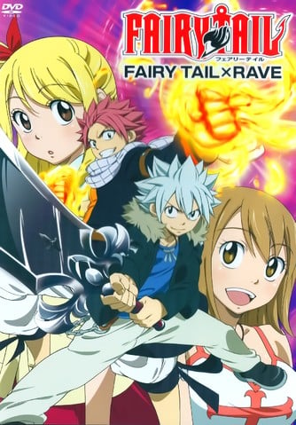
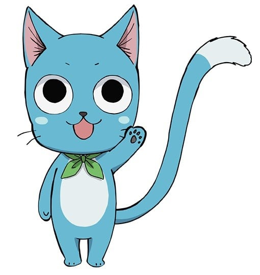
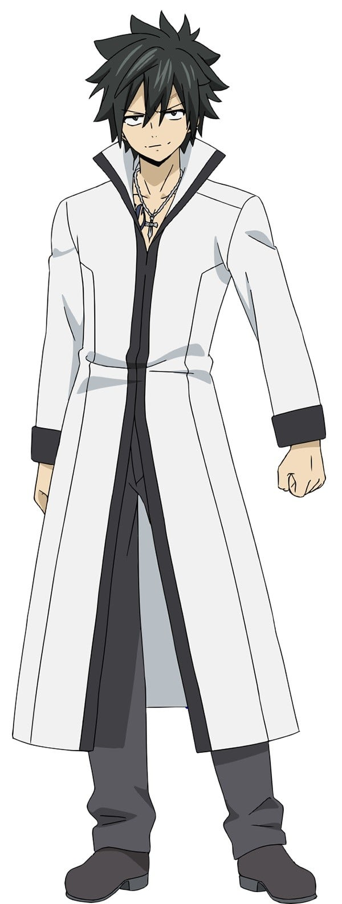
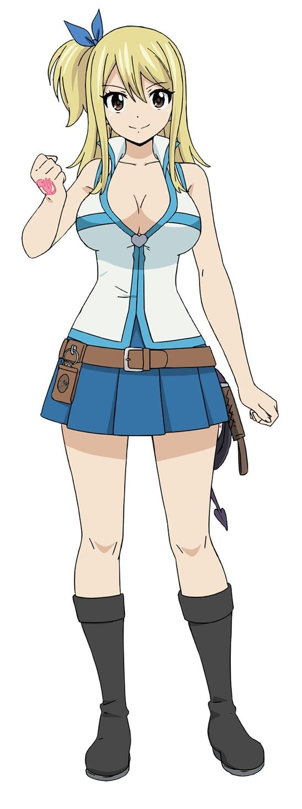
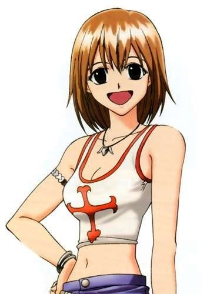
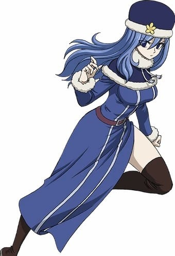

> [!bookinfo|noicon]+ **妖精的尾巴×圣石小子**
> 
>
| 日文名 | FAIRY TAIL×RAVE |
|:------: |:------------------------------------------: |
| 类型 | 漫改 |
| 新番 | 2013 年 8 月 |
| 集数 | 共1话 |
| 官网 |  |
| 制作 | A-1 Pictures |
| 导演 | 石平信司 |
| 脚本 | 十川誠志 |
| 评分 | 6.8|
| 制片人 |  |

> [!abstract]+ **简介**
> 

> [!tip]+ **章节列表**
>- [ ] 第1话：

> [!tip]+ **主要角色**
> 
| 角色 | CV | 简介| 角色图片 |
|:----:|:---:|:---:|:--------:|
| ハッピー |  | 人間の言葉が話せるエクシードという種族の青い猫で、 ナツの相棒。 翼（エーラ）という魔法で空を飛ぶことができる。 お魚が大好き。 |  |
| エルザ・スカーレット |  | 鎧を纏った、「妖精の尻尾」で“最強の女”と言われる魔導士。 精女王（ティターニア）の異名を持ち、「妖精の尻尾」で数少ないS級魔導士の一人。 騎士（ザ・ナイト）という魔法を駆使し、別空間にストックしている武器や鎧を瞬時に「換装」して戦う。 |  |
| グレイ・フルバスター |  | 氷を様々な形に変えて武器にして戦う造形魔導士。 父から受け継いだ滅悪魔法の使い手でもある。 ナツとはよくケンカをするが、良きライバル。 服を脱ぎたがる妙なクセを持つ。 |  |
| ナツ・ドラグニル |  | 自らの体質を竜に変える滅竜魔法（めつりゅうまほう）を使用する火の滅竜魔導士（ドラゴンスレイヤー）。 子供の頃、炎竜王イグニールに育てられた。 感情的に熱くなりがちだが、仲間を想う気持ちは誰よりも強い。 黒魔導士ゼレフや黒竜アクノロギアとの激闘を経て、 仲間と共に「100年クエスト」に挑む権利を得る。 |  |
| ルーシィ・ハートフィリア |  | 門（ゲート）の鍵を使って異界の星霊たちを召喚し、契約者しか使えない魔法を操る星霊魔導士。 星霊を愛し、黄道十二門の鍵の多くを所有する中、一度は別れてしまったアクエリアスの鍵が再び世界のどこかに出現したと知り、探している。 新人小説家でもある。 |  |
| 妖精の尻尾 |  | 光明行会之一，光明联盟一员，名望很高，行会内高手云集。  　　妖精尾巴的宗旨就是：朝自己相信的道路前进，这才是妖精尾巴的魔导士。 |  |
| ウェンディ・マーベル |  | 「空気」を魔力の源とする、天空の滅竜魔導士（ドラゴンスレイヤー）。 攻撃力や防御力を上げる付加魔法（エンチャント）や、 治癒魔法を得意とする。 ナツと同じ第一世代の滅竜魔導士で、乗り物に弱い。 |  |
| シャルル |  | ハッピーと同じく人間の言葉が話せ、翼(エーラ)の魔法を使用する猫。 相棒であるウェンディとの絆は深く、いつも一緒にいる。 人型に変身することができ、予知能力を発揮することもある。 |  |
| ハル・グローリー | 関智一 | 二代目レイヴマスターとなった正義感あふれる少年。彼の姉を守るために体を鍛えてきたので結構強い。 形状を変えることができるテン・コマンドメンツという剣を持っている。 |  |
| エリー | 川澄綾子 | 一年前以前の記憶を探している少女。 ギャンブル好きで、行動がカゲキ。 よく彼女の武器G(ガンズ)-トンファーをぶっ放す。 |  |
| プルー |  |  |  |
| ジュビア・ロクサー |  | 元「幽鬼の支配者」の一員で、「エレメント4」の紅一点。別名「大海のジュビア」。17歳で、左ももに青い紋章がある。好きなものはグレイ様、嫌いなものは雨。 色白の肌と青色の髪が特徴の少女。グレイとは対照的にかなりの熱帯域でも熱がらず服を着続けている[44]。自身のスタイルに自信を持っていないが、ルーシィやエルザにも劣らない巨乳体型。一人称は「ジュビア」で、基本的に「さん」付けで呼び（グレイやリオンには「様」付け）礼儀正しい口調で喋るが、同じく元「幽鬼の支配者」のガジルのことは「君」付けで呼んでおり、普通の口調で話す。当初は雨女体質で、てるてる坊主を首からぶら下げているにも拘らず、彼女が歩く場所は必ず雨が降っている程。その体質から人から嫌われたり、恋人から振られたりした過去を持つが、グレイに敗北した後は雨女体質を克服した（しかし、現在も感情的になると時々雨を降らせることがある）。また泣き上戸のため、飲酒するとグレイその他メンバーは何をやっても泣き続ける彼女のその扱いに苦慮している。 「幽鬼の支配者」と「妖精の尻尾」の抗争ではグレイと対峙するが、彼に一目惚れしてしまい、すぐに敗北を認めた。「幽鬼の支配者」の解散後は、グレイを物陰から見つめる等ストーカー紛いの行動を繰り返していたが、彼を追いかけ続けたことで「楽園の塔」事件に遭遇してナツ達に加勢。事件解決後に自ら望んで「妖精の尻尾」に加わった。当初はルーシィをグレイをめぐる恋敵と勘違いしていたが、次第に友情が芽生えていった（当時は彼女を「さん」付けしていたが、呼び捨てするようになる）[45]。自室にはグレイの人形や肖像画などが多数飾られており、グレイと出会ってから413日目の日を記念日[46]として定めたり手作りの品を送るなど、グレイに対し度々アプローチを掛けようとしているが、いざとなると奥手で引っ込み思案な所がある。それゆえ異常な妄想癖を発揮しており、リオンに好意を向けられた際にはかなり滅茶苦茶な恋愛相関図を展開させたり、最近[いつ?]ではグレイとリオンで男色関係を妄想するなど、かなり暴走して来ている。 収穫祭のミスコンでは新人にも拘らず3位を記録した[17]。S級魔導士昇格試験の8人に選ばれるも、一次試験で運悪くもエルザと当たってしまい、敗れている。だがこれは本来の力ではなく、後のメルディ戦でグレイの名が出た際にはエルザも戦慄するほどの実力を見せた。大魔闘演武にはBチームとして出場。またチーム編成後、王国側に捕えられたルーシィの奪還に向かったナツの代わりに大魔闘演武最終日に出場した。「冥府の門」との戦いではキースと戦ったが、交戦中にシルバーがグレイの実父でありキースを倒せばシルバーも消える真実を聞かされ動揺し、また念話でシルバーからフェイスの起動を阻止するためにキースを倒すよう託され躊躇するが、グレイとシルバーの絆は必ず残ると信じて魔障粒子に侵されながらもキースを倒し、グレイに謝る中でシルバーから感謝され涙し倒れる。 ギルド解散後、当初はグレイと共にアメフラシ村で同棲していたが[47]、後に彼が「黒魔術教団」に潜入するため失踪したのを切っ掛けに再び雨女に戻り、高熱を出しながらもグレイを待ち続けた。ナツ達と再会した後ウェンディに看病されていたが、「黒魔術教団」との戦いに駆け付けた。アルバレス帝国との戦いでは、インベルの魔法でグレイと殺し合わなければならない状況にされグレイを傷つけないために自害するが、自分と同じ選択をしたグレイに輸血して倒れる。しかし、シャルルの予知で駆け付けたウェンディに助けられ九死に一生を得た。 lluvia（ジュビア）はスペイン語で「雨」を意味する。モバゲーで行われた人気投票「ミスフェアリーテイルコンテスト2012」では7位に入賞。公式人気投票では8位。外伝『FAIRY GIRLS』ではルーシィ、エルザ、ウェンディと共に主人公を務めている。また、別の外伝『TALE OF FAIRY TAIL ICE TRAIL 〜氷の軌跡〜』では幼少時のグレイとニアミスしている。 |  |