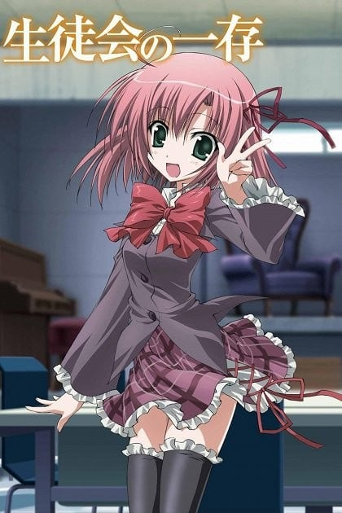
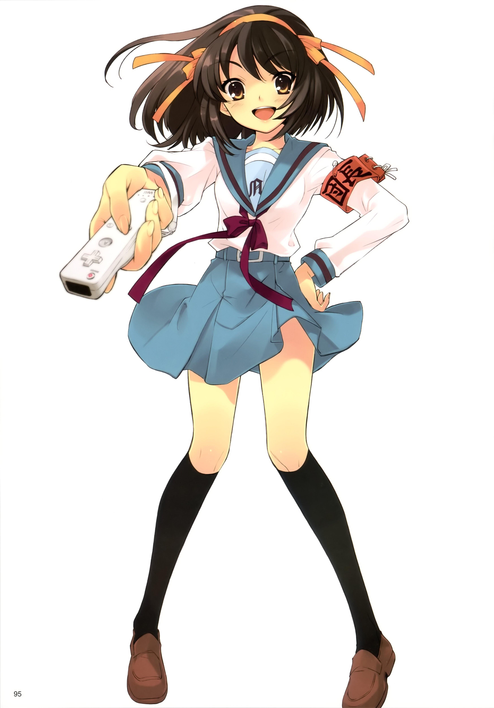
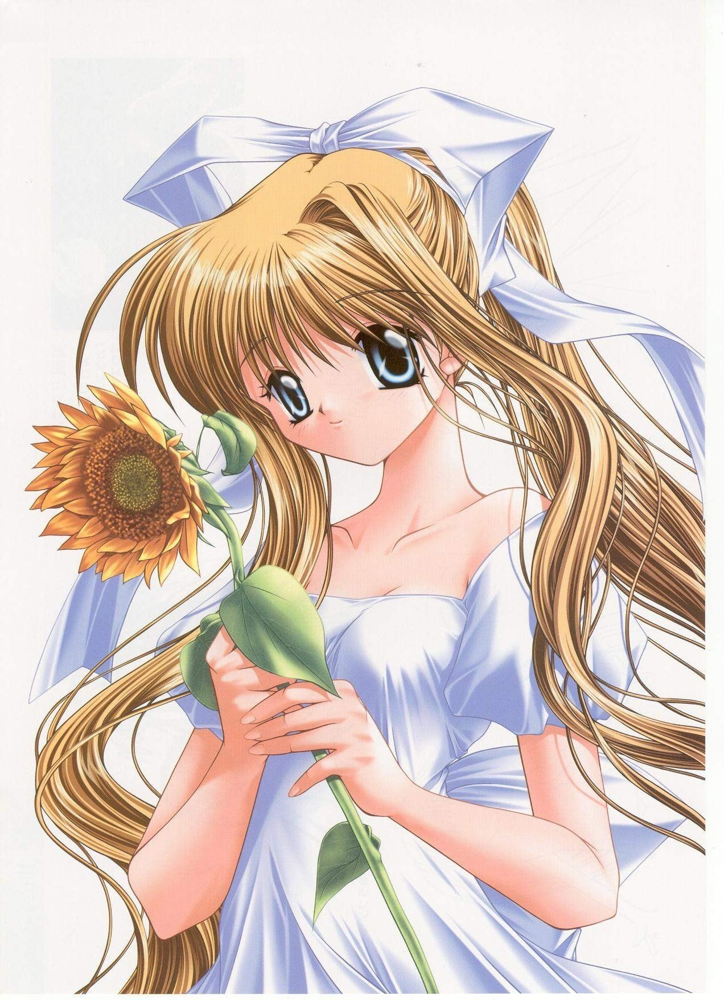
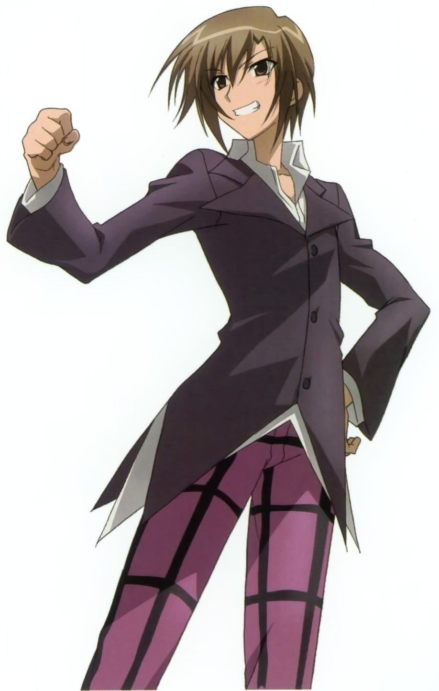
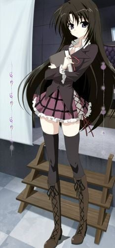
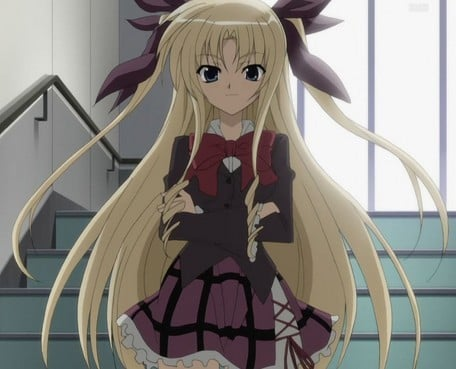
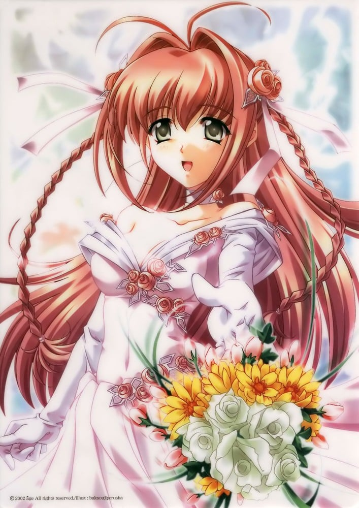

> [!bookinfo|noicon]+ **学生会的一己之见**
> 
>
| 日文名 | 生徒会の一存 |
|:------: |:------------------------------------------: |
| 类型 | 小说改 |
| 新番 | 2009 年 10 月 |
| 集数 | 共12话 |
| 官网 | [http://anime.webnt.jp/seitokai/index.html](https://http://anime.webnt.jp/seitokai/index.html) |
| 制作 | スタジオディーン |
| 导演 | 佐藤卓哉 |
| 脚本 | 花田十輝 |
| 评分 | 7.4|
| 制片人 | 飯嶋浩次 |

> [!abstract]+ **简介**
> 在私立碧阳学园。学生会成员的选举，有一套特殊的制度。
不举行一般的选举，只是单纯地用《人气投票》来选取学生会成员。
因此，每年被选出的基本上是《可爱的女孩》。这是因为美男子会遭到男性学生的不满，而美少女对男女学生来说，都是喜欢的对象。
可是，用人气和外表来确定这样重要的人选，这样合适吗？
在发生了异议之后，妥协的结果是选取《优秀者》。在各年级学习成绩顶尖的学生，只要本人愿意，就有机会加入学生会。
于是，有学生开始猛学，却没能得到进入学生会的机会……。
但是，有一个男学生，坚持了自己的信念，终于打破了常规！
杉崎鍵。他梦想着自己能进入《除了自己之外全是美少女的团体》，他以此为目标，开始猛学，于是终于在年末的考试中取得了第一名。
他抵达的目标，是个性鲜明的、美少女云集的学生会。
LOLI娘学生会会长・樱野真红。
冰冷而理性的前辈・红叶知弦。
少年风的傲娇・椎名深夏。
可爱的梦幻妹妹・椎名真冬。
最终，杉崎能过上理想的后宫生活么？

> [!tip]+ **章节列表**
>- [ ] 第1话：闲聊的学生会 (2009-10-3)
>- [ ] 第2话：学习的学生会 (2009-10-10)
>- [ ] 第3话：被采访的学生会 (2009-10-17)
>- [ ] 第4话：创作的学生会 (2009-10-24)
>- [ ] 第5话：休息中的学生会 (2009-10-31)
>- [ ] 第6话：伸出手来的学生会 (2009-11-7)
>- [ ] 第7话：向前迈进的学生会 (2009-11-14)
>- [ ] 第8话：妒忌的学生会 (2009-11-21)
>- [ ] 第9话：我的学生会 (2009-11-28)
>- [ ] 第10话：整理的学生会 (2009-12-5)
>- [ ] 第11话：欠缺的学生会 (2009-12-12)
>- [ ] 第12话：学生会的一己之见 (2009-12-18)

> [!tip]+ **主要角色**
> 
| 角色 | CV | 简介| 角色图片 |
|:----:|:---:|:---:|:--------:|
| 涼宮ハルヒ |  | 故事开始时县立北高一年五班的学生，SOS团的团长，座位永远在阿虚的后方。不但容姿端丽，而且无论学业或运动都相当优秀，但是个性唯我独尊，对于不喜欢的话都听不进去。原本一直过著平凡的生活，但自从在小学六年级时看了一场棒球赛后，便发现自己原来是十分渺小的，生活也跟大众一样平凡乏味。因此，她在初中开始改变自己，不断做出各种怪事（如在晚上潜入学校操场画奇怪的符号其实是阿虚回到三年前画的），希望借此发现异常的事物，因此在东国中和北高都无人不晓她的名字，并将她当成怪人。  到了北高后，因为阿虚的一句话而灵光乍现，成立SOS团。极其冲动，而且好胜心极强，一有任何鬼点子（通常都是毫不经过大脑的）都要立刻执行，但是奔波受苦的一向都是阿虚跟朝比奈。拥有在本人不自觉之下改变现实的能力，世界会随她的期望而发展(很可能是因为她的期望而导致未来人宇宙人和超能力者的出现)，但因为仍有正常人的常识，世界才不致于被严重改变。这种能力导致她被各方势力关注中，但本人完全不知情。她对阿虚的感情比起对其他人深厚，在多部作品中，均显出她对阿虚的重视。 |  |
| 神尾観铃 |  | 故事的女主角，国崎往人在海边小镇的堤防上遇到的第一位女孩。和母亲晴子两人一起生活。性格很坚强，天真可爱也很喜欢帮助别人，可奇怪的是她没有一个朋友，很喜欢吃武田商店的自动贩卖机售的「粘稠浓厚桃子味」果汁，家务方面则非常擅长，酷爱恐龙，小时候曾把小鸡当成恐龙的孩子，口头禅是喜欢学恐龙叫：“嘎（GAO）…嘎哦（GAO）…！”有时会有的V字手势配上声音也是她的一大萌点所在。 |  |
| 杉崎鍵 | 近藤隆 | 本作的男主角，也是在故事里写这本小说的人。是私立碧阳学园学生会副会长，高中2年级。在期末考中拿到第一名，靠着要是成绩优秀的人愿意，也能加入学生会的“优良规定”，而当上现在的职位。知弦因其名而称他为“key”。  是个罕见的十八禁游戏、Galgame迷，能不忌讳地公然说自己之外全都是美少女的学生会是“我的后宫”（当然其他成员是没人会承认的）。另一方面，即使只有一点点，为了能让学生会成员聊天的时间多一点而抱着学生会的杂务事全由自己一个人完成的觉悟。有时会说些性骚扰的话而被粗鲁的对待，但栗梦说：“在这所学校里没有一个人是真的讨厌他的”。 |  |
| 桜野くりむ | 本多真梨子 | 学生会长，高中3年级。知弦因其名“くりむ”联想到“真红（クリムゾン）”而称她为“小红（アカちゃん）”。（“小红（アカちゃん）”跟“婴儿（あかちゃん）”的日文是一样的。）  特征是有的让人无法想像到她是高中三年级的年幼外表，言行举止看起来比实际年龄更合乎外貌。此外，很容易就被自己所看见、听见的名句等等给影响，常常指挥其他学生会成员。 |  |
| 紅葉知弦 | 斉藤佑圭 | 　　学生会的书记，栗梦的同学。 　　有著与栗梦刚好相反的大人一般的外貌和沉著冷静的谈吐。虽然是学生会的军师，私底下却是相当毒舌而且是个S，将常以驳倒栗梦和键为乐。喜欢的男性就似乎是像键一样的类型（因为「容易拢络他人、能够表现自己的特色」等理由。）当情绪一变差时就会露出令人害怕的笑容。 |  |
| 椎名深夏 | 富樫美鈴 | 学生会副会长，也是键的同班同学，双马尾女孩。  虽然没有在特定的社团活动，但因为运动神经超群以帮忙的身分出席许多运动性社团。因为个性很男性化，所以在女同学间很受欢迎，她本人也不在在意的样子。键说“她是没有傲的正统派傲娇”。 |  |
| 椎名真冬 | 堀中優希 | 学生会的会计，也是唯一一位一年级，是深夏的妹妹。  如幻般的外表而且有点不擅长和男性接触，用“真冬”自称自己。个性和姐姐刚好相反，柔弱而且温驯。但是她也有创作BL小说（键总是担任“受”的那方）的腐女子一面。 |  |
| 藤堂リリシア | 能登麻美子 | 新闻社社长。对报道十分认真，却也会做出暴露键过去曾经脚踏两条船这种过分的行为。 混血儿，不擅长英文。不知为何，说话的语调就像千金小姐那样子。    从喜欢收集键的新闻以及被妹妹问至脸红可看出她对键有好感。　被爱丽丝吐槽时脸红XD 　　曾为想成为女主角，而听从键的建议改变形象，结果失败了，被键评为：太令人反胃了，指示莉莉西亚学姐的属性……双马尾、青梅竹马、天然呆等都是非常好的属性，但是通过莉莉西亚这个人来实现，那还真是很完美地不和谐呢！ 　　发怒时头发可以反着重力方向朝天上刺过去，从而证明了“怒发冲冠”并不是比喻的表现呢！ |  |
| 真儀瑠紗鳥 | 小菅真美 | 担任学生会顾问的新任国语教师。企图以顾问老师的权力介入学生会运作。在同作者的另一作品《マテリアルゴースト》中也有登场。 |  |
| 中目黒善樹 | 山本和臣 | 　　「二年B班的己见」的男主角。是转学到2年B班的转学生，虽然担心著在前一所学校时被欺负而逃来这所学校的事，但是在键认同後就恢复了。因为与真冬的BL小说中登场的键的恋爱对象是同一个姓氏，所以键一直警戒善树对自己抱有的好感。 |  |
| 涼宮遙 |  | メインヒロインの一人。速瀬水月の親友。童話や絵本が好きなおとなしい性格。様々な“伝説”を持ち、ゲーム中でも「遙伝説」として語られる。 2年ほど孝之への想いを募らせていたが、水月の紹介で孝之と知り合いになり告白するに至る。一時は別れそうになるが、孝之からの告白で晴れて相思相愛となる。孝之とのデートの待ち合わせ中に交通事故に遭い昏睡状態に陥る。なお、白陵大付属柊学園は卒業したことになっている。 第二章の開始時に、3年間の昏睡状態から目覚める。3年が経過したという事実を気づかせないように隔離病棟で生活していたが、あることがきっかけで今の状況が変だと気づき再び昏睡状態になる。数日後に目を覚ました遙は現実を認識し、その後はリハビリに取り組みつつ社会復帰を目指す。 第一章ではショートヘアとピンクリボン、第二章においてはロングヘアとホワイトリボン。 遙シナリオの後日談となるOVA版では主役を務める。『マブラヴ オルタネイティヴ』では、ロングヘアの姿で登場。 |  |
| 藤堂エリス | 清水愛 |  |  |