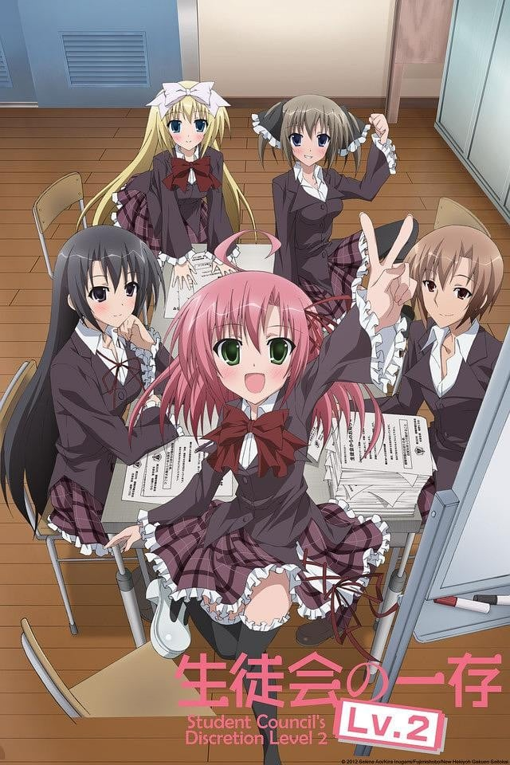
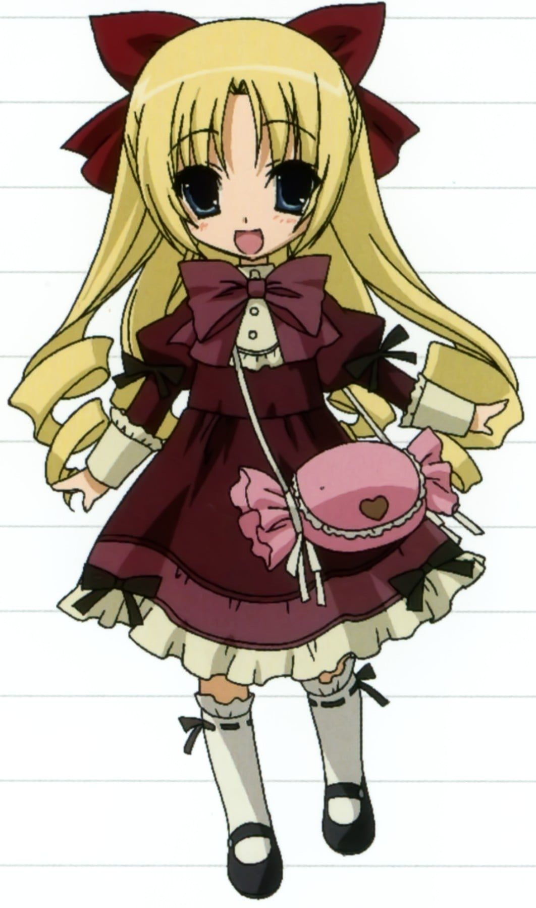

> [!bookinfo|noicon]+ **学生会的一己之见 Lv.2**
> 
>
| 日文名 | 生徒会の一存 Lv.2 |
|:------: |:------------------------------------------: |
| 类型 | 小说改 |
| 新番 | 2013 年 1 月 |
| 集数 | 共10话 |
| 官网 | [http://seitokai-no-ichizon.com/](https://http://seitokai-no-ichizon.com/) |
| 制作 | AIC |
| 导演 | 今泉賢一 |
| 脚本 | 國澤真理子,大知慶一郎,吉田玲子 |
| 评分 | 6.8|
| 制片人 | 田村司 |

> [!abstract]+ **简介**
> 原作小说《碧阳学园学生会议事录》曾在2009年被动画公司Studio DEEN改编成动画《学生会的一己之见（生徒会の一存）》。轻小说杂志《Dragon Magazine》2011年5月号正式宣布了《学生会的一己之见》“动画化企划中!!”的消息，而在6月17日动画官网宣布“《学生会的一己之见》新动画化决定!！”2012年7月13日，新官方网站开启并将新动画的标题暂名为《学生会的一己之见 新动画（暂）（生徒会の一存 新アニメ(仮)）》，在2012年10月15日正式确定并宣布新动画的标题为《学生会的一己之见 Lv.2》。
动画首先从2012年10月13日起开始在“NICONICO生放送”网络播放，2013年1月9日25:00（实际为1月10日凌晨1:00）开始在日本国内的电视台播放。

更换了主角声优。
红叶知弦：斉藤佑圭→美名
椎名真冬：堀中優希→野水伊織

> [!tip]+ **章节列表**
>- [ ] 第0话：杉崎纯爱手札 (2012-10-13)
>- [ ] 第1话：转型的学生会 (2012-10-20)
>- [ ] 第2话：怀疑的学生会 (2012-10-27)
>- [ ] 第3话：就职的学生会 (2012-11-03)
>- [ ] 第4话：回收的学生会 (2012-11-10)
>- [ ] 第5话：圣战 (2012-11-17)
>- [ ] 第6话：欢迎的学生会 (2012-11-24)
>- [ ] 第7话：S码猎人 (2012-12-01)
>- [ ] 第8话：追逐的学生会 (2012-12-08)
>- [ ] 第9话：不会结束的学生会 (2012-12-15)

> [!tip]+ **主要角色**
> 
| 角色 | CV | 简介| 角色图片 |
|:----:|:---:|:---:|:--------:|
| 杉崎鍵 | 近藤隆 | 本作的男主角，也是在故事里写这本小说的人。是私立碧阳学园学生会副会长，高中2年级。在期末考中拿到第一名，靠着要是成绩优秀的人愿意，也能加入学生会的“优良规定”，而当上现在的职位。知弦因其名而称他为“key”。  是个罕见的十八禁游戏、Galgame迷，能不忌讳地公然说自己之外全都是美少女的学生会是“我的后宫”（当然其他成员是没人会承认的）。另一方面，即使只有一点点，为了能让学生会成员聊天的时间多一点而抱着学生会的杂务事全由自己一个人完成的觉悟。有时会说些性骚扰的话而被粗鲁的对待，但栗梦说：“在这所学校里没有一个人是真的讨厌他的”。 |  |
| 桜野くりむ | 本多真梨子 | 学生会长，高中3年级。知弦因其名“くりむ”联想到“真红（クリムゾン）”而称她为“小红（アカちゃん）”。（“小红（アカちゃん）”跟“婴儿（あかちゃん）”的日文是一样的。）  特征是有的让人无法想像到她是高中三年级的年幼外表，言行举止看起来比实际年龄更合乎外貌。此外，很容易就被自己所看见、听见的名句等等给影响，常常指挥其他学生会成员。 |  |
| 紅葉知弦 | 美名 | 　　学生会的书记，栗梦的同学。 　　有著与栗梦刚好相反的大人一般的外貌和沉著冷静的谈吐。虽然是学生会的军师，私底下却是相当毒舌而且是个S，将常以驳倒栗梦和键为乐。喜欢的男性就似乎是像键一样的类型（因为「容易拢络他人、能够表现自己的特色」等理由。）当情绪一变差时就会露出令人害怕的笑容。 |  |
| 椎名深夏 | 富樫美鈴 | 学生会副会长，也是键的同班同学，双马尾女孩。  虽然没有在特定的社团活动，但因为运动神经超群以帮忙的身分出席许多运动性社团。因为个性很男性化，所以在女同学间很受欢迎，她本人也不在在意的样子。键说“她是没有傲的正统派傲娇”。 |  |
| 椎名真冬 | 野水伊織 | 学生会的会计，也是唯一一位一年级，是深夏的妹妹。  如幻般的外表而且有点不擅长和男性接触，用“真冬”自称自己。个性和姐姐刚好相反，柔弱而且温驯。但是她也有创作BL小说（键总是担任“受”的那方）的腐女子一面。 |  |
| 藤堂リリシア | 能登麻美子 | 新闻社社长。对报道十分认真，却也会做出暴露键过去曾经脚踏两条船这种过分的行为。 混血儿，不擅长英文。不知为何，说话的语调就像千金小姐那样子。    从喜欢收集键的新闻以及被妹妹问至脸红可看出她对键有好感。　被爱丽丝吐槽时脸红XD 　　曾为想成为女主角，而听从键的建议改变形象，结果失败了，被键评为：太令人反胃了，指示莉莉西亚学姐的属性……双马尾、青梅竹马、天然呆等都是非常好的属性，但是通过莉莉西亚这个人来实现，那还真是很完美地不和谐呢！ 　　发怒时头发可以反着重力方向朝天上刺过去，从而证明了“怒发冲冠”并不是比喻的表现呢！ |  |
| 真儀瑠紗鳥 |  | 担任学生会顾问的新任国语教师。企图以顾问老师的权力介入学生会运作。在同作者的另一作品《マテリアルゴースト》中也有登场。 |  |
| 藤堂エリス | 清水愛 |  |  |
| 宇宙巡 | 新谷良子 | 　　2年B班的的学生，键与深夏的同班同学。在校外是名偶像，艺名为“星野巡”，但被认为常识与歌唱能力都很缺乏。是名美少女，但性格差劲，在学生会选举上只得一票而未入选，所以愤而跑去演艺圈发展，要大家认同她。一年级时和键的关系极差，但在去年冬天时，自导自演失踪记(其实只是到外地旅馆休息)时，对于键独力三天三夜寻找她，并在事后完全不说出来的事情所感动，而喜欢上键，但键并不知(其它人都知道)。因喜欢键而视深夏为情敌。 |  |
| 水無瀬流南 | 桑島法子 |  |  |
| 杉崎林檎 | 米澤円 | 杉崎键的妹妹，比键小一岁，常和键一起睡 觉（小说第一卷后部分，《杉崎家的一晚》中登 场），其实并没有血缘关系，是LOLI系美少女， 妹属性，对于哥哥有着非一般的好感。 |  |
| 私立碧陽学園 |  |  |  |