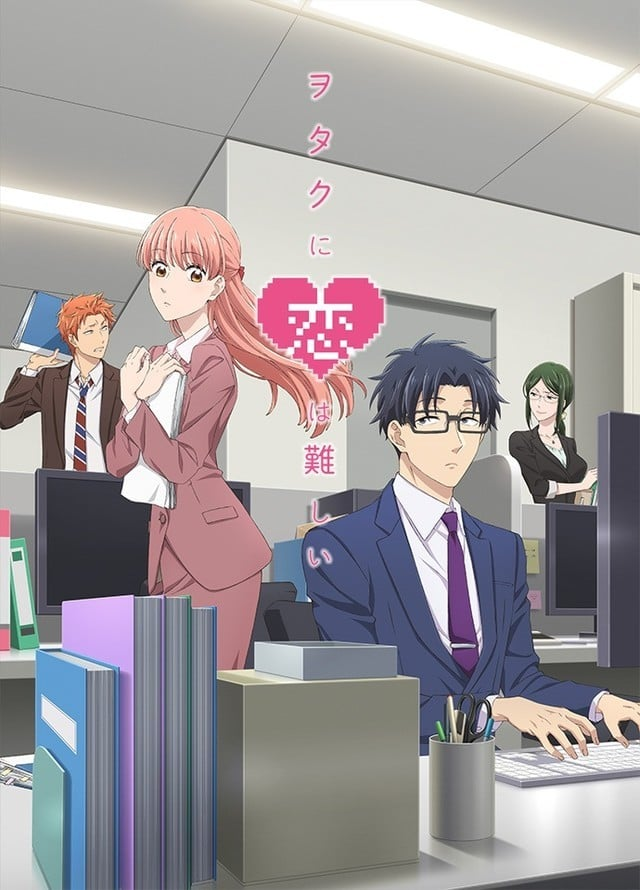

> [!bookinfo|noicon]+ **宅男腐女恋爱真难**
> 
>
| 日文名 | ヲタクに恋は難しい |
|:------: |:------------------------------------------: |
| 类型 | 漫改 |
| 新番 | 2018 年 4 月 |
| 集数 | 共11话 |
| 官网 | [http://wotakoi-anime.com/](https://http://wotakoi-anime.com/) |
| 制作 | A-1 Pictures |
| 导演 | 平池芳正 |
| 脚本 | 平池芳正,高木聖子,篠塚智子 |
| 评分 | 6.6|
| 制片人 | 立石啓介 |

> [!abstract]+ **简介**
> 桃濑成海是一个深藏腐女属性的OL，不过在情场上十分失意。 而二藤宏嵩是桃濑的青梅竹马，虽然是个彻头彻尾的死宅，但是长着一副英俊的面孔带着酷冷的形象。 在桃濑情场失意时作为青梅竹马的二藤迅速拉近了与桃濑的感情距离，一脸淡然的告白之后正式交往……

> [!tip]+ **章节列表**
>- [ ] 第1话：成海和宏嵩的再会。然后… (2018-04-12)
>- [ ] 第2话：恋人？开始了 (2018-04-19)
>- [ ] 第3话：同人展和游戏会 (2018-04-26)
>- [ ] 第4话：大人的恋爱也很难 (2018-05-03)
>- [ ] 第5话：尚哉登场和游戏会PartⅡ (2018-05-10)
>- [ ] 第6话：忧郁的圣诞 (2018-05-17)
>- [ ] 第7话：网游和各自的夜晚 (2018-05-24)
>- [ ] 第8话：害怕打雷和会在意的年龄 (2018-05-31)
>- [ ] 第9话：去约会吧！ (2018-06-07)
>- [ ] 第10话：小光登场和再战网游 (2018-06-14)
>- [ ] 第11话：宅男腐女恋爱真难 (2018-06-21)

> [!tip]+ **主要角色**
> 
| 角色 | CV | 简介| 角色图片 |
|:----:|:---:|:---:|:--------:|
| 加藤恵 |  | 安艺伦也的同班同学，9月23日出生，是个平凡没有存在感的女孩，但仔细看是个可人儿，起初留着鲍伯头，后来留长头发并束成马尾。被就读医学院的堂哥加藤圭一误以为与安艺伦也是男女朋友。受安艺伦也的请求担任同人游戏的女主角。     有位将结婚的姊姊。     对男主角的称呼为安艺。 |  |
| 桃瀬成海 | 伊達朱里紗 | 本作主角，26岁贫乳OL。是个会广泛接触各类作品的御宅族兼重度腐女，并会参加Comiket等同人活动，但平时对身边的人隐藏自己的御宅兴趣。中小学时期与宏嵩是同校的青梅竹马。 |  |
| 二藤宏嵩 | 田村睦心 | 成海的恋人，26岁上班族。是个能兼顾工作与兴趣的重度电玩游戏御宅族。长相俊美，平时面无表情，给人沉着冷静的感觉；但使用通讯软件时会变得激动，而且发出的讯息中常夹杂表情符号。 |  |
| 小柳花子 | 沢城みゆき | 成海的同事，27岁巨乳OL。职场上是精明能干的女强人，私底下则是喜爱扮成男性角色的Cosplayer。 酒量不好，是只喝一口啤酒就会脸红的程度。 和桦仓是学生时代就交往的欢喜冤家。 |  |
| 樺倉太郎 | 杉田智和 | 宏嵩的同事，28岁上班族。外表看起来有点坏，但其实个性温柔、很关心身旁的人。是吐槽役。 和小柳是学生时代就交往的欢喜冤家。 和成海一样对于自己是御宅族感到羞耻，也是会对周遭隐瞒兴趣。 |  |
| 二藤尚哉 | 梶裕貴 | 宏嵩的弟弟，19岁大学生。在吃茶店打工，目前因通学距离考量暂住于宏嵩家。非御宅族，对游戏了解不多，技术也只有初学者等级。 |  |
| 桜城光 | 悠木碧 | 和尚哉同大学的学生。爱打电动。 内向且不擅交流，但表情全写在脸上。 外表常被误认是男生，但其实是女生。 |  |