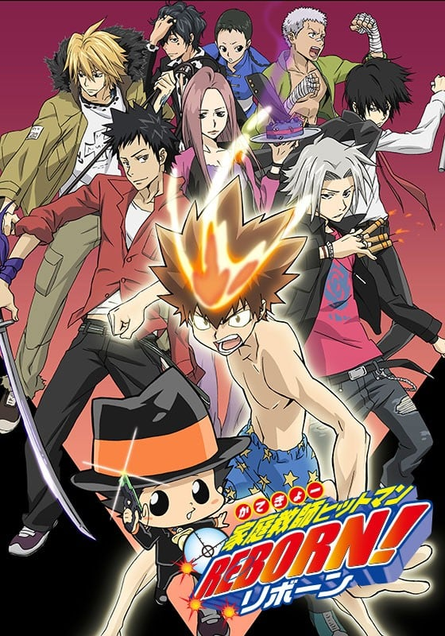
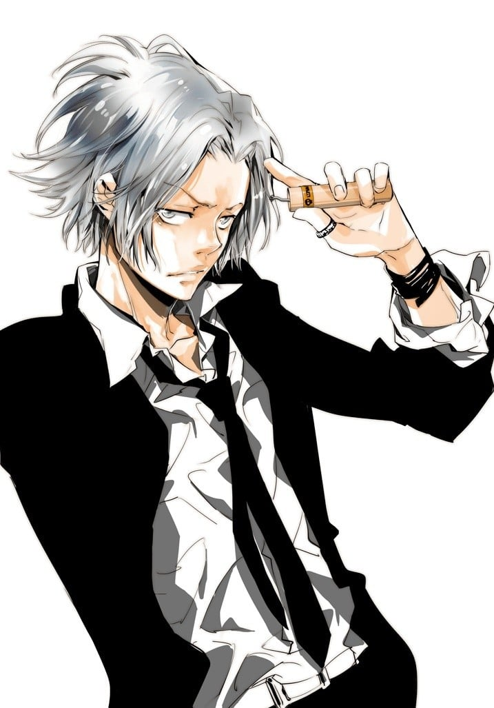
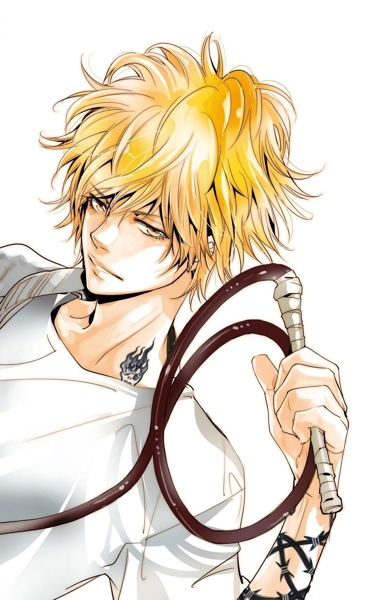
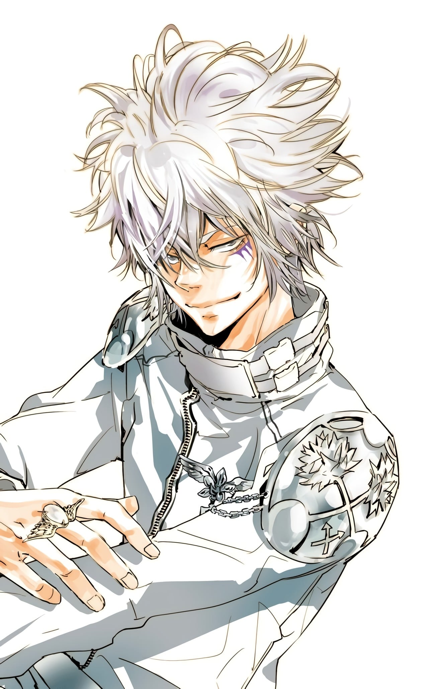
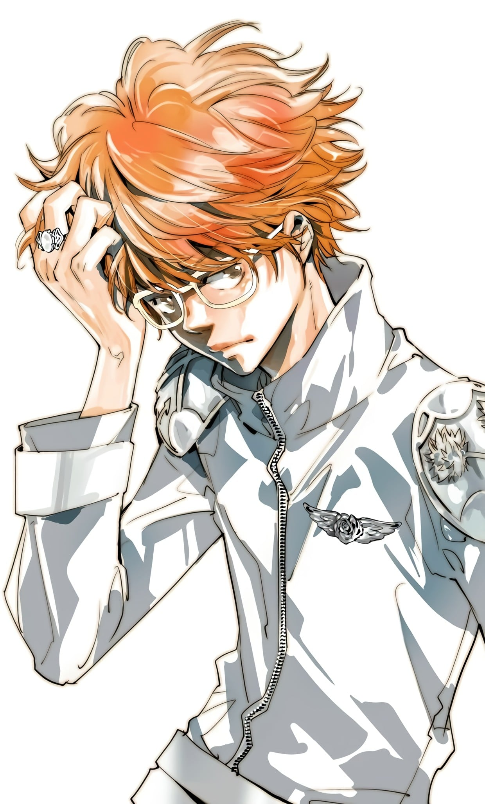

> [!bookinfo|noicon]+ **家庭教师HITMAN REBORN!**
> 
>
| 日文名 | 家庭教師ヒットマンREBORN! |
|:------: |:------------------------------------------: |
| 类型 | 漫改 |
| 新番 | 2006 年 10 月 |
| 集数 | 共203话 |
| 官网 | [https://www.marv.jp/special/reborn/](https://https://www.marv.jp/special/reborn/) |
| 制作 | ARTLAND |
| 导演 | 今泉賢一 |
| 脚本 | 岸間信明,阪口和久,三井秀樹,面出明美,勝呂悠香,鈴木雅詞 |
| 评分 | 7.6|
| 制片人 | 渡辺秀信 |

> [!abstract]+ **简介**
> 《家庭教師HITMAN REBORN!》是一部熱血動漫，故事圍繞彭格列（意大利黑手黨）第十代首領沢田綱吉與其家族成員的成長而展開的一系列故事。彭格列初代後裔沢田綱吉是一個做什麼都不行的“廢柴綱”，但是為了培養成為彭格列家族首領，從意大利來了一名殺手叫做里包恩來教導綱吉。內心善良的他不願意傷害別人，但他為了保護同伴而開始承擔起責任，成長為一名優秀的首領。

日常篇
目標1－19、27－33、38－39、66－73 
不擅長運動與學習、做什麼事沒有恆心、一事無成的少年澤田綱吉（通稱廢材阿綱），在他面前出現了一位自稱里包恩的殺手，是個要作他家庭教師的小嬰兒。里包恩的目的是要培育阿綱成為義大利黑手黨彭哥列家族的第10代首領。里包恩利用被打中後會拚死完成臨終時後悔的事情的彭哥列秘彈「死氣彈」，讓阿綱成為適當首領的「教育」開始了。

VS黑曜篇
目標20－26（2月某日） 
並盛中學的風紀委員被無故襲擊，並且被拔去牙齒（動畫改成在現場留下懷錶）的事件連續發生。一開始從風紀委員的關係來看，認為只是單純的不良學生的爭執，但是受害者擴及到風紀委員以外的學生。里包恩從迪諾那得到的情報、被拔牙齒的數目（動畫改成懷錶的時間）的減少、和以前排名風太所做的排名判斷，敵人是被黑手黨放逐了的越獄逃犯，目標直指彭哥列第10代首領的阿綱。不能拒絕第9代首領指令的阿綱，為了打倒主謀六道骸，和里包恩、獄寺、山本、碧洋琪一同進入敵人的基地。

 VS瓦利亞篇
目標34－37、40－65
與六道骸之戰勝利後的某日，在阿綱面前出現了一位有著死氣的火焰的少年。他的名字是巴吉爾，為了將彭哥列秘藏的半彭哥列戒指交給阿綱，被彭哥列的暗殺部隊「瓦利亞」的一員史佩爾畢·史庫瓦羅追殺。瓦利亞的目的是要讓瓦利亞的首領、第9代首領的兒子XANXUS成為第10代首領。阿綱方的守護者7人和XANXUS方的守護者7人，為了爭奪下一任的彭哥列繼承者，展開1對1的戒指爭奪戰。

未來篇
目標74－141 、154－177（未來選擇篇）、190－203（未來決戰篇）
「十年後火箭筒」是個可以將現在的自己和10年後的自己交換5分鐘的道具，但是被誤射中的里包恩卻行蹤不明，尋找他的阿綱也不小心被射中來到10年後（正確時間為9年又10個月後）。來到10年後世界的阿綱，知道10年後的自己已經死了，並且殺了他的就是由白蘭帶領的米爾菲歐雷家族這個新興黑手黨。5分鐘過去了卻沒有回到10年前，獄寺等朋友也來到了10年後，在這個最糟糕的情況下，為了尋找回到10年前的線索，阿綱們在這個「戒指」和「匣」就是力量的世界展開戰鬥。

阿爾柯巴雷諾篇
目標142－153
未來篇的插曲。在10年後的世界，入江正一告訴阿綱，單靠他的天空之戒並不足以開啓他的匣子，為了要讓彭哥列戒指發揮真正的力量，因此必須取得阿爾柯巴雷諾的七個標記。為了得到標記，眾人需回到10年前的並盛町，進行阿爾柯巴雷諾們的試煉並完成試煉以取得標記。

初代家族篇
目標178－189
未來篇的插曲。里包恩認為在選擇遊戲中敗北的阿綱與守護者還不具備能夠戰勝白蘭的實力，於是和優尼一起決定帶著眾人回到10年前的並盛町，讓阿綱與守護者一同接受彭哥列初代家族成員的試驗取得他們的認同，並以阿爾柯巴雷諾作為家庭教師進行觀察並在試驗中給予建議。

> [!tip]+ **章节列表**
>- [ ] 第1话：咦！我是黑手黨的第十代首領!? (2006-10-07)
>- [ ] 第2话：the end of 學校!? (2006-10-14)
>- [ ] 第3话：電擊！愛與恐怖的料理！ (2006-10-21)
>- [ ] 第4话：啊！少女心具有毀滅性 (2006-10-28)
>- [ ] 第5话：風紀委員長的消遣 (2006-11-04)
>- [ ] 第6话：你好，餃子拳！ (2006-11-11)
>- [ ] 第7话：極限！燃燒的大哥！ (2006-11-18)
>- [ ] 第8话：愛護家族的前輩首領 (2006-11-25)
>- [ ] 第9话：減少壽命的骷髏病 (2006-12-02)
>- [ ] 第10话：嘎哈哈！爆炸的便當盒！ (2006-12-09)
>- [ ] 第11话：愛與死的餃子饅頭!? (2006-12-16)
>- [ ] 第12话：師父的特訓！強化課程 (2006-12-23)
>- [ ] 第13话：新春！一億元的大對決！ (2007-01-06)
>- [ ] 第14话：第一次約會!?地獄的動物園 (2007-01-13)
>- [ ] 第15话：雪仗的生存遊戲 (2007-01-20)
>- [ ] 第16话：逃離死亡之山！ (2007-01-27)
>- [ ] 第17话：病房裡請保持靜音 (2007-02-03)
>- [ ] 第18话：有毒的愛情巧克力 (2007-02-10)
>- [ ] 第19话：百發百中？什麼都能排行 (2007-02-17)
>- [ ] 第20话：突然的襲擊 (2007-02-24)
>- [ ] 第21话：傷痕累累的朋友們 (2007-03-03)
>- [ ] 第22话：預期之外的魔掌 (2007-03-10)
>- [ ] 第23话：最後的死氣彈 (2007-03-17)
>- [ ] 第24话：各自的反擊 (2007-03-24)
>- [ ] 第25话：我想贏！覺醒的瞬間 (2007-03-31)
>- [ ] 第26话：結束以及後續 (2007-04-07)
>- [ ] 第27话：慶祝升級的壽司大餐 (2007-04-14)
>- [ ] 第28话：不會吧！是我殺的？ (2007-04-21)
>- [ ] 第29话：情人是花椰菜？ (2007-04-28)
>- [ ] 第30话：在豪華客船捉迷藏 (2007-05-05)
>- [ ] 第31话：歡迎來到黑手黨之島 (2007-05-12)
>- [ ] 第32话：市民泳池有鯊魚 (2007-05-19)
>- [ ] 第33话：負債累累的暑假？ (2007-05-26)
>- [ ] 第34话：瓦利亞來了！ (2007-06-02)
>- [ ] 第35话：七枚彭哥列戒指 (2007-06-09)
>- [ ] 第36话：家庭教師出動 (2007-06-16)
>- [ ] 第37话：師徒搭檔到齊 (2007-06-23)
>- [ ] 第38话：任性小牛的失蹤 (2007-06-30)
>- [ ] 第39话：隱形敵人的目的 (2007-07-07)
>- [ ] 第40话：戒指爭奪戰開始！ (2007-07-14)
>- [ ] 第41话：晴之守護者的想法 (2007-07-21)
>- [ ] 第42话：扭轉逆境的力量 (2007-07-28)
>- [ ] 第43话：二十年後的雷擊 (2007-08-04)
>- [ ] 第44话：被奪走的天空之戒 (2007-08-11)
>- [ ] 第45话：驚濤駭浪的嵐之戰 (2007-08-18)
>- [ ] 第46话：戰鬥的理由 (2007-08-25)
>- [ ] 第47话：最強無敵的流派 (2007-09-01)
>- [ ] 第48话：勝負的去向 (2007-09-08)
>- [ ] 第49话：鎮魂歌之雨 (2007-09-15)
>- [ ] 第50话：霧之守護者來了!? (2007-09-22)
>- [ ] 第51话：幻術vs幻術 (2007-09-29)
>- [ ] 第52话：霧的真相 (2007-10-06)
>- [ ] 第53话：一絲的不安 (2007-10-13)
>- [ ] 第54话：雲之守護者的失控 (2007-10-20)
>- [ ] 第55话：決意 (2007-10-27)
>- [ ] 第56话：獄寺的回顧 (2007-11-03)
>- [ ] 第57话：天空之戰開始！ (2007-11-10)
>- [ ] 第58话：憤怒之火 (2007-11-17)
>- [ ] 第59话：支援者們 (2007-11-24)
>- [ ] 第60话：死氣的零地點突破 (2007-12-01)
>- [ ] 第61话：零地點突破・改 (2007-12-08)
>- [ ] 第62话：策略 (2007-12-15)
>- [ ] 第63话：凍結的火焰 (2007-12-22)
>- [ ] 第64话：憤怒的真相 (2008-01-05)
>- [ ] 第65话：了結！ (2008-01-12)
>- [ ] 第66话：顫抖的幽靈 (2008-01-19)
>- [ ] 第67话：彭哥列式教學參觀 (2008-01-26)
>- [ ] 第68话：快樂婚禮？ (2008-02-02)
>- [ ] 第69话：可怕的犯罪三兄弟 (2008-02-09)
>- [ ] 第70话：入江正一的災難 (2008-02-16)
>- [ ] 第71话：以氣魄對決！絕對魔拳 (2008-02-23)
>- [ ] 第72话：退學轉捩點 (2008-03-01)
>- [ ] 第73话：母親感恩日 (2008-03-08)
>- [ ] 第74话：10年後的世界 (2008-03-15)
>- [ ] 第75话：基地 (2008-03-22)
>- [ ] 第76话：尋找守護者 (2008-03-29)
>- [ ] 第77话：覺悟的火焰 (2008-04-05)
>- [ ] 第78话：回到過去的線索 (2008-04-12)
>- [ ] 第79话：最初的試練 (2008-04-19)
>- [ ] 第80话：不和諧音符 (2008-04-26)
>- [ ] 第81话：配合 (2008-05-03)
>- [ ] 第82话：最強的守護者 (2008-05-10)
>- [ ] 第83话：被帶來的情報 (2008-05-17)
>- [ ] 第84话：遙遠的歸途 (2008-05-24)
>- [ ] 第85话：基地在哪裏？ (2008-05-31)
>- [ ] 第86话：最恐怖的家庭教師 (2008-06-07)
>- [ ] 第87话：繼承 (2008-06-14)
>- [ ] 第88话：7³ (2008-06-21)
>- [ ] 第89话：悲傷的鋼琴 (2008-06-28)
>- [ ] 第90话：雨梟 (2008-07-05)
>- [ ] 第91话：相信的事物 (2008-07-12)
>- [ ] 第92话：被委託的選擇 (2008-07-19)
>- [ ] 第93话：D級緊急警戒 (2008-07-26)
>- [ ] 第94话：被揭露的真面目 (2008-08-02)
>- [ ] 第95话：決擇 (2008-08-09)
>- [ ] 第96话：X BURNER (2008-08-23)
>- [ ] 第97话：大追蹤 (2008-08-30)
>- [ ] 第98话：宣言 (2008-09-06)
>- [ ] 第99话：最終試驗 (2008-09-13)
>- [ ] 第100话：突襲前夜 (2008-09-20)

> [!tip]+ **主要角色**
> 
| 角色 | CV | 简介| 角色图片 |
|:----:|:---:|:---:|:--------:|
| 沢田綱吉 | 國分優香里 | 並盛中學的學生，也是彭哥列家族的下任首領（第10代首領），通稱「阿綱（ツナ（TSUNA））」（音同日語的鮪魚，阿綱房間的門牌及京子送的護身符上都有魚的圖樣）。父母家光和奈奈是道地的日本人。  因其無論是學習還是運動都不擅長，而被周圍的人稱呼為「廢材阿綱」（ダメツナ）。  義大利黑手黨「彭哥列家族」初代首領的後裔，被選為第10代首領的正統繼承人，為此里包恩作為他的家庭教師被派遣到日本。  繼承彭哥列家族首領不可缺少的「彭哥列的血統」，擁有「超直感」。  武器是與初代首領相同的手套，稱為「X手套」，在彭哥列戒指爭奪戰中取得勝利，正式成為彭哥列的繼承者。波動屬性為「天空」。 |  |
| リボーン | 成田剣 | 殺手兼阿綱的家庭教師。外表是二頭身的嬰兒。對普通人相當友善，但對阿綱非常嚴厲（或說是在整他）。  至少擁有過有4個情人，碧洋琪是第4位女友。  常頭戴黒帽及穿著黑色西裝，帽子上有一隻叫列恩的變色龍。列恩能吐出打中後會拚死完成臨終時後悔的事情的「死氣彈」，身上有使死氣彈無效化的撤銷一噸錘。愛槍是捷克製的Cz75的1ST（動畫版由列恩變成），快速射擊的時間甚至在0.05秒以下。  擁有獨角仙及蜻蜓等分季節的手下。擅長易容，除阿綱外其他人幾乎看不穿。  原本是一位自由殺手，因受第9代彭哥列老大的委託，要訓練阿綱成為彭哥列第10代首領。  面無表情的他看起來思想單純，其實做事深思熟慮。有「不會理會等級比我低的人」及「我的手下由我來處置」[5]等獨自的美學。  他是被稱為被詛咒的嬰兒的七位「阿爾柯巴雷諾」之一，擁有黃色的奶嘴。為晴屬性的阿爾柯巴雷諾。波動屬性為「晴」。  雖然本人說是2歲，但以前曾化名「包林」作為夢幻的天才數學家而為人所熟悉。更在至少8年多前擔任迪諾的家庭教師。 |  |
| 獄寺隼人 | 市瀬秀和 | 被裡包恩從義大利叫來日本，與澤田綱吉同年齡的中學生。義大利3/4、日本1/4的混血兒，抽菸、身上戴著許多飾品的不良少年。  是連老師都害怕的不良少年，沒認真上課過但還是成績優異。在課堂上創造出「G文字」（十年後的他以其書寫出給予阿綱等人回去十年前的提示）。  父親是義大利人，母親是義大利和日本的混血，是義大利大富豪黑手黨的名門子弟。但在知道母親被謀殺的事後對生活在城堡裡感到厭煩，八歲時離家出走。  炸藥和殺人是從以前家裡的專屬醫生夏馬爾那裡學的，就連髮型也是模仿夏馬爾的。  因為從小被毒害到大，一遇到同父異母的姊姊碧洋琪就會肚子劇痛到口吐白沫的昏倒，不過只要不看見碧洋琪整張臉（例如她戴護目鏡）就可以正常行動。  彭哥列家族所屬的現役黑手黨，武器是全身上下藏滿的炸藥，以嘴上叼的香煙點燃（動畫改為自動點燃），別名「smoking bomb」（動畫改為hurricane bomb），擅長在有障礙物的建築物裡戰鬥。  剛轉來時曾找阿綱比試，輸了後稱呼阿綱為「第十代首領」（十代目），自稱彭哥列第10代首領的左右手。 |  |
| 山本武 | 井上優 | 家裡開壽司店的棒球少年，運動神經發達，在學校相當受大家歡迎。  本來只是普通的棒球隊王牌，跟阿綱成為朋友後被裡包恩私自收進彭哥列家族，不過本人似乎認為只是陪小孩玩黑手黨遊戲，是阿綱的雨之守護者。  一開始使用的武器是以300km/h以上揮動就會變成武士刀的「山本的球棒」（山本のバット）。  使用名為時雨蒼燕流（しぐれそうえんりゅう）的殺人劍術，由父親山本剛傳授時雨蒼燕流後繼承了日本刀「時雨金時」（しぐれきんとき）。 |  |
| 雲雀恭弥 | 近藤隆 | 並盛中學的風紀委員長，通稱「雲雀」。生日（5月5日）是兒童節，因為是學校的假期才記下來。  喜歡的刨冰是宇治金時，愛車是鈴木·KATANA。  不僅是學校的不良學生，更是並盛一帶的老大，背景是一個謎。  討厭群體和束縛的一匹狼，也討厭看到別人群聚，當看到別人群聚時，會以「討厭軟弱的草食性動物群聚在一起」為理由而將其咬殺。  是個戰鬥狂熱者，想與更強的對手戰鬥，也是風太的「並盛中學打架強人排行榜」的第1位，擅長使用改造過的枴子作為近距離攻擊武器。  手機鈴聲是並盛中學的校歌，而且時常穿著校服行動，可深深感受到他的愛校心，可是他穿著的不是學校指定的外套，而是披著學校的舊校服，在袖子上掛著風紀委員的臂章。  因說「我可以自由選擇班級」，所以不知道他是不是中學生，也不知道他的年齡。  因為里包恩很輕易地擋住他的攻擊，所以對里包恩很有興趣，常想著和他決鬥。 |  |
| ディーノ | KENN | 通稱「跳馬」，彭哥列家族同盟加百羅涅家族的第10代首領，擁有5000名手下。  金髮褐眼，左半身刺有加百羅涅首領證明的刺青。  少年時被第9代首領的父親送到專收黑手黨候補生的學校就讀，與瓦利亞的史庫瓦羅同期。  里包恩的前一個學生，阿綱的師兄。非常疼愛師弟阿綱。瓦利亞篇擔任雲雀的家庭教師。  武器「跳馬的鞭子」和「安翠歐」是由列恩體內產生。  如果沒有部下在身邊就會變的笨手笨腳，平時走路會跌倒、揮鞭子會打到自己或同夥（Boss體質）。非常愛護部下。 |  |
| 笹川了平 | 木内秀信 | 京子的哥哥，並盛中學的拳擊社主將，是個以「極限」一詞為自己的做事原則及口頭禪的熱血男人。因為平時都以拚死心情（極限）做事，所以就算被死氣彈擊中後也完全沒有變化。  雖然有時會與京子吵架，但也有身為哥哥的一面，馬上擔心京子。因為京子認為拳擊是「戴著拳套身穿一條短褲搏擊的玩意」而煩惱。  自稱的擂台稱號是「極限獅子拳了平」。小學時因幫助受流氓騷擾的京子受傷後所留下的疤痕現在還留在額中。  打架和拳擊一樣很強，在風太的「並盛中學打架強人排行榜」中處於第5位。認為男生處女座很奇怪，所以自稱「拳擊座」。喜歡草莓口味的刨冰。  被裡包恩看中，成為家族的一員，但本人完全不知道。  做事稍為有點逞強，雖然沒有惡意，但每次都要周圍的人貫徹自己理念，因此磨練成一個做任何事都非常積極的熱血漢。  他是個把全部事物都關聯到拳擊的拳擊笨蛋，看到有資質的人就馬上勸他加入拳擊部。因為看到處於死氣彈狀態中阿綱的威力而感動，此後便常常勸阿綱加入拳擊社。 |  |
| ラル・ミルチ | 鈴木真仁 | 阿尔克巴雷诺的半成品，持有混浊颜色的奶嘴（发挥力量时会变成蓝色）。第一人称使用“オレ”等男性用语，实际上是个女性，武器是霰弹枪。 未来篇 10年后以成人样貌登场。在前往彭格列日本基地时遇到从过去来的阿纲和狱寺。持有云属性蜈蚣指环（精致度E）、雾属性指环（精致度C）、雾属性隐密指环（精致度D）；匣子有蜈蚣匣、迷彩花样的匣子和气球匣6个。 |  |
| 笹川京子 | 稲村優奈 | 《家庭教师》的女主角，沢田纲吉暗恋的对象。其哥哥笹川了平为沢田纲吉的晴之守护者。 |  |
| ランボ | 津田健次郎 |  |  |
| 白蘭 | 大山鎬則 | 密鲁菲奥雷家族的年轻首领，原隶属杰索家族，为杰索家族的首领，手中还有一支超强小组──“真6吊花”。称呼入江正一为“小正（正チャン）”、雷欧那鲁德·利比为“雷欧君（レオ君）”。有着一头白发的青年，以“仆”自称，左眼下方有三个爪的记号，脚上装备可飞行的兵器(F鞋子)。 |  |
| 入江正一 | 豊永利行 | 住在阿纲家附近的一位戴眼镜的少年，想把突然飞到他家的蓝波送回阿纲家，结果看到阿纲家混乱的的景象而大受惊吓。动画版中就读一所知名私立中学。 未来篇是密鲁菲奥雷第2队罗萨队队长，梅罗尼基地最高负责人，阶级A级。晴属性的六吊花，波动属性为“晴”。白魔咒部队第二队队长。作为罗萨队的证明胸前别有玫瑰胸章（“罗萨（rosa）”意思是意大利语玫瑰）。是密鲁菲奥雷家族的重要人物之一，身边跟着酷似切尔贝洛机关的两位女性。奉白兰的命令在日本进行关于彭格列的情报搜集，很受白兰信赖。相当神经质，紧张时会肚子痛（过敏性肠症候群）。波动属性为“晴”，拥有自制的匣子“梅罗尼基地”。 |  |