> [!bookinfo|noicon]+ **家庭教师HITMAN REBORN！彭格列式修学旅行、来了！**
> 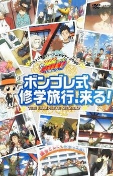
>
| 日文名 | 家庭教師ヒットマンREBORN! ボンゴレファミリー総登場! ボンゴレ式修学旅行、来る!! |
|:------: |:------------------------------------------: |
| 类型 | 漫改 |
| 新番 | 2010 年 7 月 |
| 集数 | 共1话 |
| 官网 |  |
| 制作 | ARTLAND |
| 导演 | 今泉賢一 |
| 脚本 | 岸間信明 |
| 评分 | 6.9|
| 制片人 |  |

> [!abstract]+ **简介**
> 『家庭教師ヒットマンREBORN! ボンゴレファミリー総登場! ボンゴレ式修学旅行、来る!!』は2009年「ジャンプスーパーアニメツアー2009」で上映されたオリジナルエピソード。内容は修学旅行の話。これに後編を追加したコンプリート版DVDが2010年7月に発売された。

リボーンの企み…『ボンゴレ式修学旅行』って一体なんなの～～～～～！

> [!tip]+ **章节列表**
>- [ ] 第1话：

> [!tip]+ **主要角色**
> 
| 角色 | CV | 简介| 角色图片 |
|:----:|:---:|:---:|:--------:|
| 沢田綱吉 |  | 並盛中學的學生，也是彭哥列家族的下任首領（第10代首領），通稱「阿綱（ツナ（TSUNA））」（音同日語的鮪魚，阿綱房間的門牌及京子送的護身符上都有魚的圖樣）。父母家光和奈奈是道地的日本人。  因其無論是學習還是運動都不擅長，而被周圍的人稱呼為「廢材阿綱」（ダメツナ）。  義大利黑手黨「彭哥列家族」初代首領的後裔，被選為第10代首領的正統繼承人，為此里包恩作為他的家庭教師被派遣到日本。  繼承彭哥列家族首領不可缺少的「彭哥列的血統」，擁有「超直感」。  武器是與初代首領相同的手套，稱為「X手套」，在彭哥列戒指爭奪戰中取得勝利，正式成為彭哥列的繼承者。波動屬性為「天空」。 | 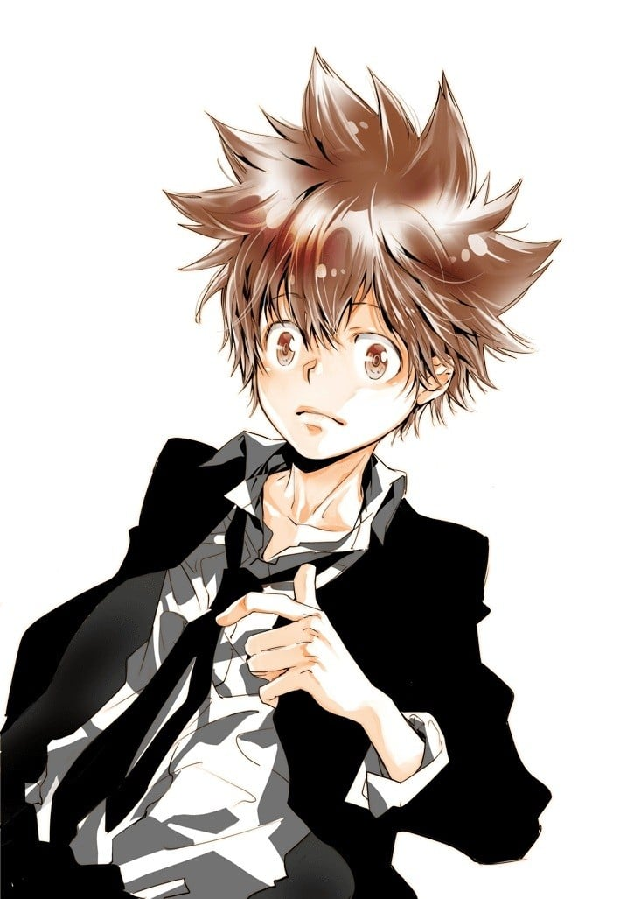 |
| リボーン |  | 殺手兼阿綱的家庭教師。外表是二頭身的嬰兒。對普通人相當友善，但對阿綱非常嚴厲（或說是在整他）。  至少擁有過有4個情人，碧洋琪是第4位女友。  常頭戴黒帽及穿著黑色西裝，帽子上有一隻叫列恩的變色龍。列恩能吐出打中後會拚死完成臨終時後悔的事情的「死氣彈」，身上有使死氣彈無效化的撤銷一噸錘。愛槍是捷克製的Cz75的1ST（動畫版由列恩變成），快速射擊的時間甚至在0.05秒以下。  擁有獨角仙及蜻蜓等分季節的手下。擅長易容，除阿綱外其他人幾乎看不穿。  原本是一位自由殺手，因受第9代彭哥列老大的委託，要訓練阿綱成為彭哥列第10代首領。  面無表情的他看起來思想單純，其實做事深思熟慮。有「不會理會等級比我低的人」及「我的手下由我來處置」[5]等獨自的美學。  他是被稱為被詛咒的嬰兒的七位「阿爾柯巴雷諾」之一，擁有黃色的奶嘴。為晴屬性的阿爾柯巴雷諾。波動屬性為「晴」。  雖然本人說是2歲，但以前曾化名「包林」作為夢幻的天才數學家而為人所熟悉。更在至少8年多前擔任迪諾的家庭教師。 | 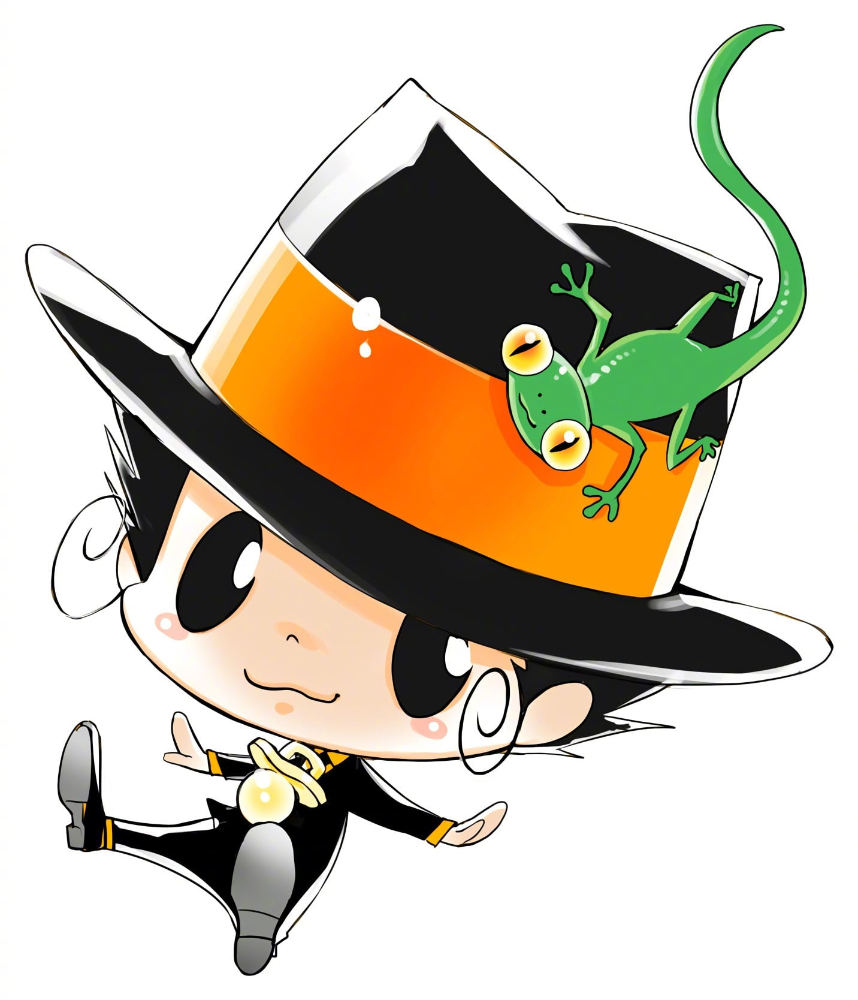 |
| 獄寺隼人 |  | 被裡包恩從義大利叫來日本，與澤田綱吉同年齡的中學生。義大利3/4、日本1/4的混血兒，抽菸、身上戴著許多飾品的不良少年。  是連老師都害怕的不良少年，沒認真上課過但還是成績優異。在課堂上創造出「G文字」（十年後的他以其書寫出給予阿綱等人回去十年前的提示）。  父親是義大利人，母親是義大利和日本的混血，是義大利大富豪黑手黨的名門子弟。但在知道母親被謀殺的事後對生活在城堡裡感到厭煩，八歲時離家出走。  炸藥和殺人是從以前家裡的專屬醫生夏馬爾那裡學的，就連髮型也是模仿夏馬爾的。  因為從小被毒害到大，一遇到同父異母的姊姊碧洋琪就會肚子劇痛到口吐白沫的昏倒，不過只要不看見碧洋琪整張臉（例如她戴護目鏡）就可以正常行動。  彭哥列家族所屬的現役黑手黨，武器是全身上下藏滿的炸藥，以嘴上叼的香煙點燃（動畫改為自動點燃），別名「smoking bomb」（動畫改為hurricane bomb），擅長在有障礙物的建築物裡戰鬥。  剛轉來時曾找阿綱比試，輸了後稱呼阿綱為「第十代首領」（十代目），自稱彭哥列第10代首領的左右手。 |  |
| 山本武 |  | 家裡開壽司店的棒球少年，運動神經發達，在學校相當受大家歡迎。  本來只是普通的棒球隊王牌，跟阿綱成為朋友後被裡包恩私自收進彭哥列家族，不過本人似乎認為只是陪小孩玩黑手黨遊戲，是阿綱的雨之守護者。  一開始使用的武器是以300km/h以上揮動就會變成武士刀的「山本的球棒」（山本のバット）。  使用名為時雨蒼燕流（しぐれそうえんりゅう）的殺人劍術，由父親山本剛傳授時雨蒼燕流後繼承了日本刀「時雨金時」（しぐれきんとき）。 | 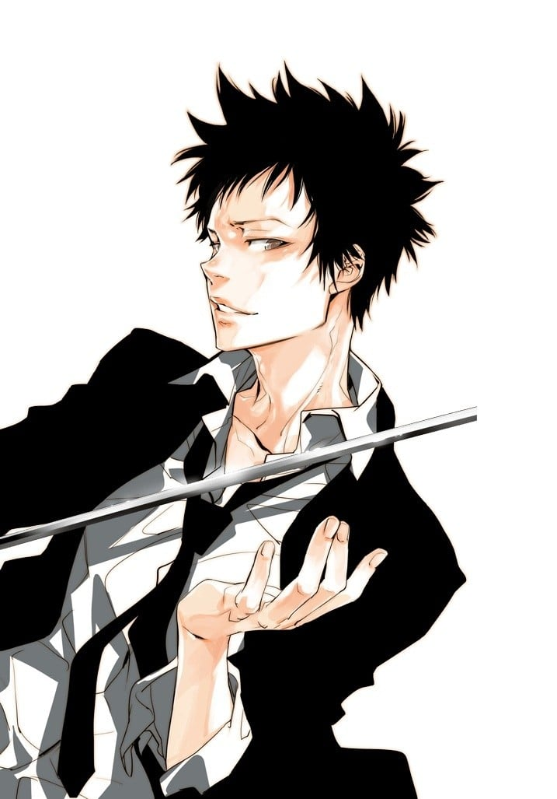 |
| 雲雀恭弥 |  | 並盛中學的風紀委員長，通稱「雲雀」。生日（5月5日）是兒童節，因為是學校的假期才記下來。  喜歡的刨冰是宇治金時，愛車是鈴木·KATANA。  不僅是學校的不良學生，更是並盛一帶的老大，背景是一個謎。  討厭群體和束縛的一匹狼，也討厭看到別人群聚，當看到別人群聚時，會以「討厭軟弱的草食性動物群聚在一起」為理由而將其咬殺。  是個戰鬥狂熱者，想與更強的對手戰鬥，也是風太的「並盛中學打架強人排行榜」的第1位，擅長使用改造過的枴子作為近距離攻擊武器。  手機鈴聲是並盛中學的校歌，而且時常穿著校服行動，可深深感受到他的愛校心，可是他穿著的不是學校指定的外套，而是披著學校的舊校服，在袖子上掛著風紀委員的臂章。  因說「我可以自由選擇班級」，所以不知道他是不是中學生，也不知道他的年齡。  因為里包恩很輕易地擋住他的攻擊，所以對里包恩很有興趣，常想著和他決鬥。 | 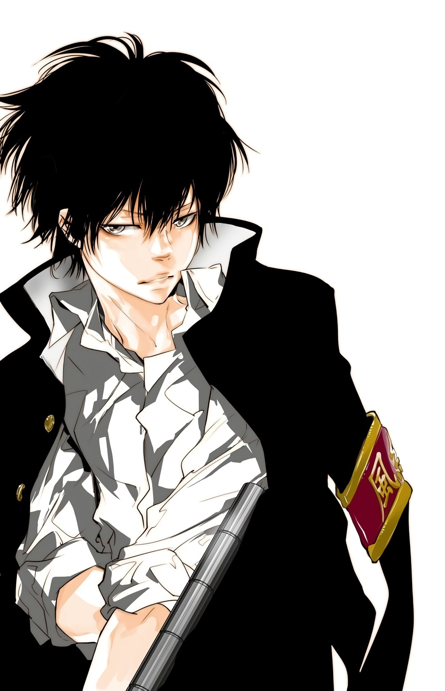 |
| 笹川了平 |  | 京子的哥哥，並盛中學的拳擊社主將，是個以「極限」一詞為自己的做事原則及口頭禪的熱血男人。因為平時都以拚死心情（極限）做事，所以就算被死氣彈擊中後也完全沒有變化。  雖然有時會與京子吵架，但也有身為哥哥的一面，馬上擔心京子。因為京子認為拳擊是「戴著拳套身穿一條短褲搏擊的玩意」而煩惱。  自稱的擂台稱號是「極限獅子拳了平」。小學時因幫助受流氓騷擾的京子受傷後所留下的疤痕現在還留在額中。  打架和拳擊一樣很強，在風太的「並盛中學打架強人排行榜」中處於第5位。認為男生處女座很奇怪，所以自稱「拳擊座」。喜歡草莓口味的刨冰。  被裡包恩看中，成為家族的一員，但本人完全不知道。  做事稍為有點逞強，雖然沒有惡意，但每次都要周圍的人貫徹自己理念，因此磨練成一個做任何事都非常積極的熱血漢。  他是個把全部事物都關聯到拳擊的拳擊笨蛋，看到有資質的人就馬上勸他加入拳擊部。因為看到處於死氣彈狀態中阿綱的威力而感動，此後便常常勸阿綱加入拳擊社。 | 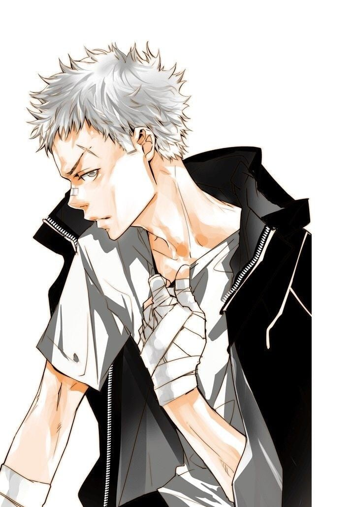 |
| 笹川京子 | 稲村優奈 | 《家庭教师》的女主角，沢田纲吉暗恋的对象。其哥哥笹川了平为沢田纲吉的晴之守护者。 | 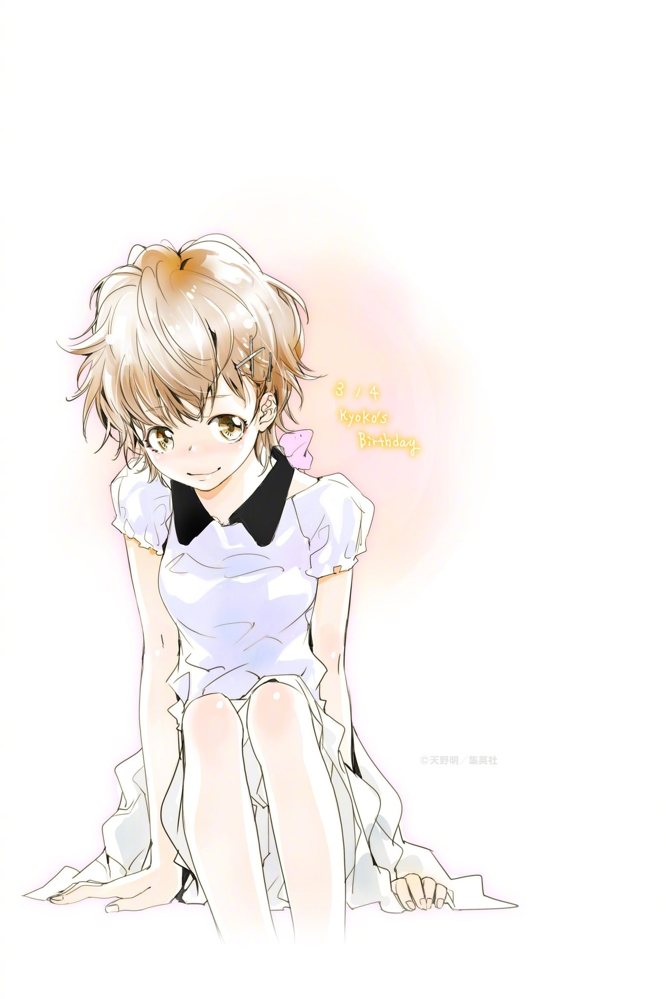 |
| ランボ |  |  | 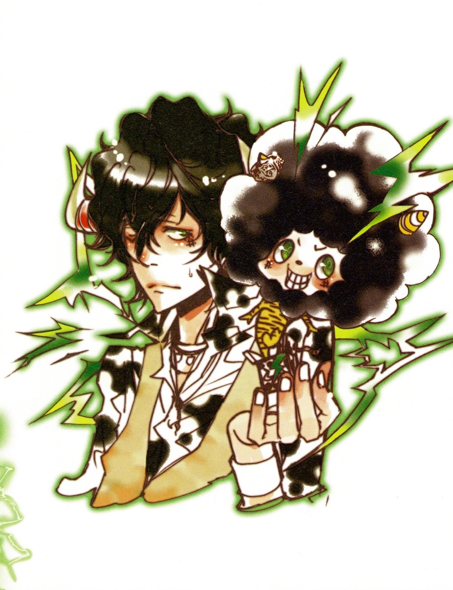 |
| 城島犬 |  | 出身于艾斯托拉涅欧家族，逃狱者三人组之一。说话时习惯在句末加上“～びょん”。有着和柿本相反的性格，暴躁易怒且相当喋喋不休。拥有数个刻有不同动物齿模的卡匣，随着更换卡匣即可发挥各种动物特质或专长。 | 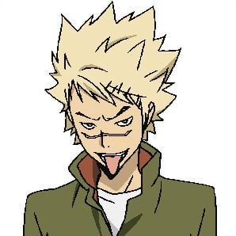 |
| スペルビ・スクアーロ |  | XANXUS的雨之守护者，波动属性为“雨”。通称史夸罗（スクアーロ），留有一头银色长发的剑士，使用填有火药的剑（装在左手的义肢）。是瓦利亞当中最活跃以及主导场面的角色。说话非常大声（发语词为“ゔおおおい―！！”），性格暴躁、冲动且好战，却也是XANXUS的御用出气包，常被他用东西砸头并被他称呼为“垃圾鲛”（カス鲛）。被虐待时是唯一敢直接反抗（实际上也只有大骂）的人，但心里还是惧怕并尊敬着他。面对敌人或与队员吵嘴时，习惯把“把你砍成3段！”或“你想被大卸几块啊？”挂在嘴上。在关键时刻相当冷静、拥有指挥资质，是10年后瓦利亞的作战队长。 | 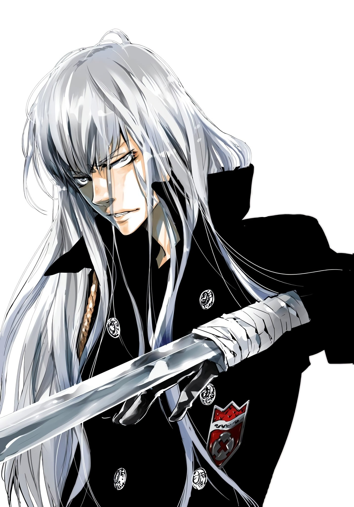 |
| レヴィ・ア・タン |  | 列威雷击队的队长，XANXUS的雷之守护者，波动属性为“雷”。通称列威（レヴィ）。名字的由来是七宗罪中掌管嫉妒的恶魔Leviathan。外表高大粗犷，下巴的胡子与鬓角是闪电的造型。工作热心但性格残酷，确定目标后就算是女人或小孩也不放过。被XANXUS称赞对他而言就是一切，有绝对的忠诚心（在雷之战时，甚至提早了2小时到，可见其严肃以待的心态），但很悲哀地本人完全不放在眼里。 武器是8把电气伞，能全天候使用。凭借绝招“列威·伏特”（Levi Volta）被瓦利亞拔擢。 | 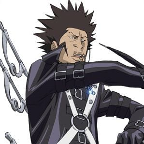 |
| ベルフェゴール |  | XANXUS的岚之守护者，波动属性为“岚”。淡金色中长发，整齐且遮住双眸的刘海以及头顶的王冠，最大的特点是尖利的“嘻嘻嘻”的笑声和洁白整齐的牙齿。就战斗力而言，被认为是巴利安中最有才能且最强力的。因喜好杀戮而自愿加入暗杀部队，杀人手段残忍，被称为“开膛王子（Prince the ripper）。 | 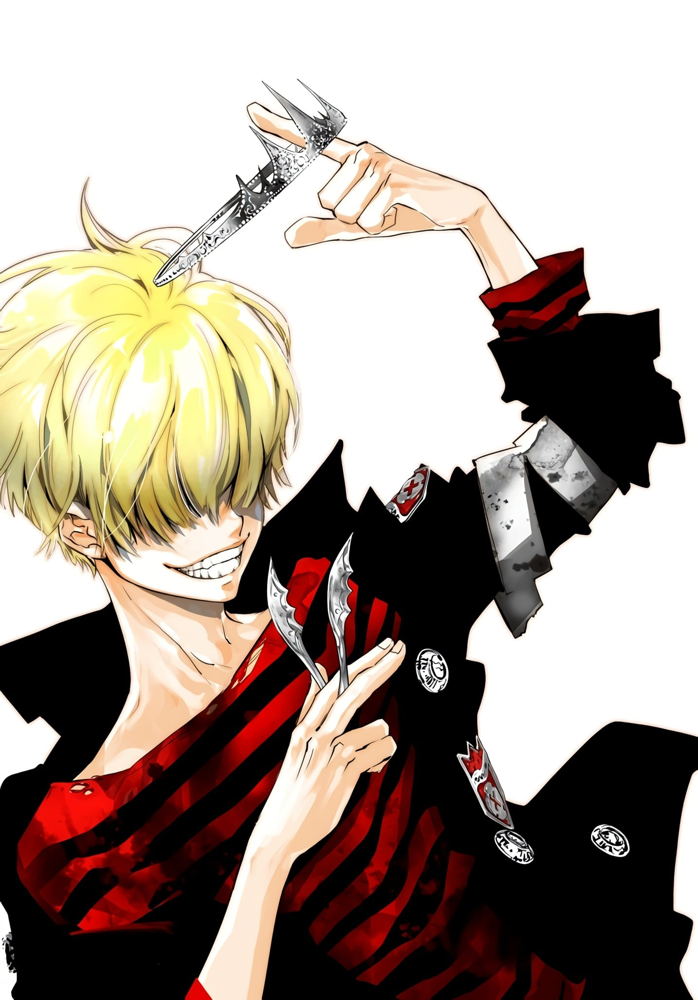 |